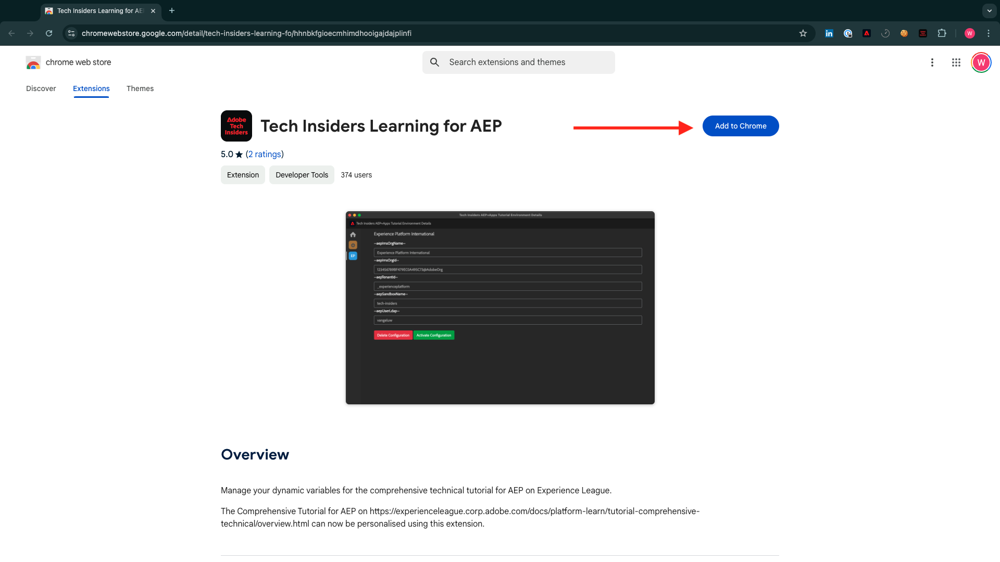

# Experience League 설명서용 Chrome 확장 설치

## Chrome 확장 기본 정보

이 자습서는 Adobe Experience Cloud 인스턴스를 사용하여 누구나 쉽게 재사용할 수 있도록 일반화되었습니다.

설명서를 재사용할 수 있도록 하기 위해 튜토리얼에 **환경 변수**&#x200B;가 도입되었습니다. 이는 설명서에서 아래 **자리 표시자**&#x200B;을 찾을 수 있음을 의미합니다. 모든 자리 표시자는 특정 환경에 대한 특정 변수이며, Chrome 확장은 해당 변수를 변경하여 자습서 페이지에서 코드와 텍스트를 복사하여 자습서의 일부로 사용할 다양한 사용자 인터페이스에 쉽게 붙여넣을 수 있도록 합니다.

이러한 값의 예는 아래에서 찾을 수 있습니다. 현재 이러한 값을 사용할 수 없지만 Chrome 확장을 설치하고 활성화하면 이러한 변수가 복사하여 다시 사용할 수 있는 일반 텍스트로 변경됩니다.

| 이름 | 키 | 예 |
|:-------------:| :---------------:| :---------------:|
| IMS 조직 ID | `--aepImsOrgId--` | `907075E95BF479EC0A495C73@AdobeOrg` |
| IMS 조직 이름 | `--aepImsOrgName--` | `Experience Platform International` |
| AEP 테넌트 ID | `--aepTenantId--` | `_experienceplatform` |
| AEP 샌드박스 이름 | `--aepSandboxName--` | `one-adobe` |
| 학습자 프로필 LDAP | `--aepUserLdap--` | `vangeluw` |

예를 들어 아래 스크린샷에는 `aepSandboxName`에 대한 참조가 표시됩니다.

확장이 설치되면 동일한 텍스트가 인스턴스별 값을 반영하도록 자동으로 변경됩니다.

## Chrome 확장 설치

해당 Chrome 확장을 설치하려면 Chrome 브라우저를 열고 [https://chromewebstore.google.com/detail/tech-insiders-learning-fo/hhnbkfgioecmhimdhooigajdajplinfi](https://chromewebstore.google.com/detail/tech-insiders-learning-fo/hhnbkfgioecmhimdhooigajdajplinfi){target="_blank"}(으)로 이동합니다. 그러면 이걸 보게 될 거야.

**Chrome에 추가**&#x200B;를 클릭합니다.

그러면 이걸 보게 될 거야. **확장 추가**&#x200B;를 클릭합니다.

그러면 확장이 설치되고 유사한 알림이 표시됩니다.

**확장** 메뉴에서 **퍼즐 조각** 아이콘을 클릭하고 **플랫폼 학습 - 구성** 확장을 확장 메뉴에 고정합니다.

## Chrome 확장 구성

[https://experienceleague.adobe.com/ko/docs/platform-learn/tutorial-comprehensive-technical/overview](https://experienceleague.adobe.com/ko/docs/platform-learn/tutorial-comprehensive-technical/overview){target="_blank"}(으)로 이동한 다음 확장 아이콘을 클릭하여 엽니다.

그러면 이 팝업이 표시됩니다. **+** 아이콘을 클릭합니다.

아래에 표시된 대로 Adobe Experience Platform 인스턴스와 관련된 모든 값을 입력합니다.

이러한 필드에 어떤 값을 입력해야 하는지 확실하지 않은 경우 아래 지침을 따르십시오.

**AEP IMS 조직 이름**

[https://platform.adobe.com/](https://platform.adobe.com/){target="_blank"}에서 Adobe Experience Platform 인스턴스에 로그인하면 화면 오른쪽 상단에 인스턴스 이름이 표시됩니다.

**AEP IMS 조직 ID**

IMS 조직 ID는 Adobe Experience Cloud 인스턴스의 고유 식별자이며, 이 자습서 전체에서 여러 위치에서 참조됩니다.

IMS 조직 ID를 찾는 작업은 여러 가지 방법으로 수행할 수 있습니다. 잘 모르겠으면 인스턴스의 시스템 관리자 중 한 명에게 문의하여 ID를 찾습니다.

[Admin Console](https://adminconsole.adobe.com/){target="_blank"}(으)로 이동하여 URL의 일부로 찾을 수 있습니다.

또한 AEP 메뉴의 **데이터 관리 > 쿼리**(으)로 이동하여 **사용자 이름**&#x200B;에서 찾을 수 있습니다.

**@AdobeOrg** 부분을 복사하여 ID와 함께 붙여넣으십시오.

**AEP 테넌트 ID**

테넌트 ID는 조직의 AEP 인스턴스에 대한 고유 식별자입니다. [https://platform.adobe.com/](https://platform.adobe.com/){target="_blank"}에서 Adobe Experience Platform 인스턴스에 로그인하면 URL에서 테넌트 ID를 찾을 수 있습니다.

Chrome 확장에 입력하는 경우 밑줄이 접두사로 추가되었는지 확인해야 하므로 이 예에서 **experienceplatform**&#x200B;은(는) **_experienceplatform**&#x200B;이 됩니다.

**AEP 샌드박스 이름**

샌드박스 이름은 AEP 인스턴스에서 사용할 환경의 이름입니다. [https://platform.adobe.com/](https://platform.adobe.com/){target="_blank"}에서 Adobe Experience Platform 인스턴스에 로그인하면 URL에서 테넌트 ID를 찾을 수 있습니다.

URL에서 샌드박스 이름을 가져오기 전에 이 자습서에 사용해야 하는 샌드박스에 있는지 확인해야 합니다. 화면 오른쪽 상단에 있는 샌드박스 전환기 메뉴를 클릭하여 오른쪽 샌드박스로 전환할 수 있습니다.

이 예에서 AEP 샌드박스 이름은 **one-adobe**&#x200B;입니다.

**내 LDAP**

자습서의 일부로 사용할 사용자 이름입니다. 이 예에서 LDAP는 이 사용자의 이메일 주소를 기반으로 합니다. 전자 메일 주소가 **vangeluw@adobe.com**&#x200B;이므로 LDAP가 **vangeluw**&#x200B;이 됩니다.

LDAP는 수행할 구성이 사용자에게 연결되는지 확인하는 데 사용되며 사용 중인 인스턴스와 샌드박스를 사용하고 있는 다른 사용자와 충돌하지 않습니다.

값은 다음과 유사해야 합니다.
마지막으로 **새로 만들기**&#x200B;를 클릭합니다.

이제 확장 프로그램의 왼쪽 메뉴에 환경의 이니셜과 함께 새 아이콘이 표시됩니다. 클릭합니다. 그러면 **환경 변수**&#x200B;와(과) 특정 Adobe Experience Platform 인스턴스 값 간의 매핑이 표시됩니다. **구성 활성화**&#x200B;를 클릭합니다.

구성을 활성화하면 환경의 이니셜 옆에 녹색 점이 표시됩니다. 즉, 이제 환경이 활성 상태입니다.

## 튜토리얼 콘텐츠 확인

테스트로 [이 페이지](https://experienceleague.adobe.com/ko/docs/platform-learn/tutorial-one-adobe/activation/dc/dc13/ex2){target="_blank"}(으)로 이동하세요.

이제 이 페이지의 모든 **환경 변수**&#x200B;가 chrome 확장에서 활성화된 환경을 기반으로 실제 값으로 대체되었습니다.

이제 아래와 유사한 보기가 제공됩니다. 환경 변수 `aepSandboxName`이(가) 실제 AEP 샌드박스 이름으로 바뀌었습니다. 이 경우에는 **one-adobe**&#x200B;입니다.

## 다음 단계

[데모 시스템 사용 다음으로 이동하여 Adobe Experience Platform 데이터 수집 클라이언트 속성을 설정합니다](./ex2.md){target="_blank"}

[시작하기](./getting-started.md){target="_blank"}(으)로 돌아가기

[모든 모듈](./../../../overview.md){target="_blank"}(으)로 돌아가기
