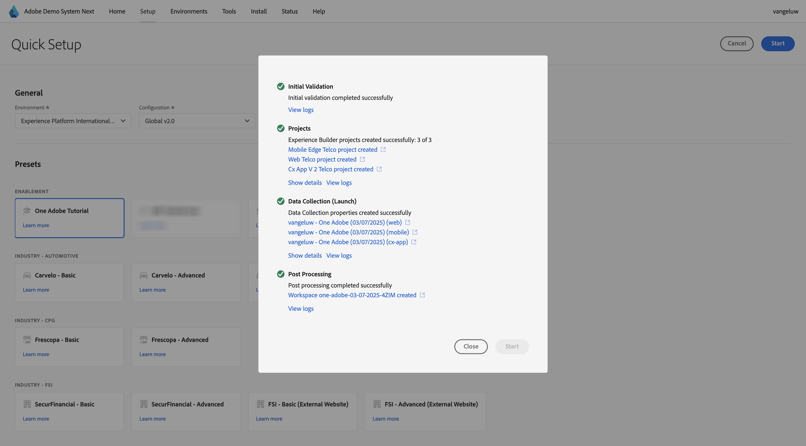

# Adobe Experience Platform 데이터 수집 클라이언트 속성을 설정하려면 옆에 있는 데모 시스템을 사용하십시오.

이 자습서에서 학습을 시각화하고 안전한 환경에서 구성을 테스트할 수 있도록 하기 위해 이 자습서에서는 Adobe의 데모 시스템 다음 도구를 사용합니다. 이 자습서를 최대한 활용하려면 다음 데모 시스템과 통합되도록 AEP 인스턴스를 구성해야 합니다.

다음 데모 시스템에 액세스한 후 아래 단계를 진행하십시오.

[https://dsn.adobe.com/](https://dsn.adobe.com/)(으)로 이동하여 **설치**(으)로 이동합니다.

**환경** 드롭다운에서 AEP 인스턴스 및 샌드박스를 선택합니다.

그런 다음 사전 설정 **AEP 튜토리얼 사용자**&#x200B;를 선택합니다.

**시작**&#x200B;을 클릭합니다.

팝업에 데이터 수집 속성 및 Experience Builder 프로젝트의 이름을 입력합니다. 명명 규칙 **데모 시스템(DD/MM/YYYY)**&#x200B;을 사용하십시오. 참고: LDAP가 자동으로 추가되므로 직접 추가할 필요가 없습니다.

**시작**&#x200B;을 클릭합니다.

그런 다음 웹 사이트 및 모바일 앱 프로젝트와 데이터 수집 속성을 만드는 동안 진행 상황을 표시하는 이 팝업이 표시됩니다.

빠른 설정 프로세스가 완료되면 다음 작업을 수행할 수 있습니다.

- 텔코 데모 브랜드와 함께 데모 웹 사이트를 사용할 수 있는 1 웹 프로젝트
- telco 데모 브랜드와 함께 데모 모바일 앱을 사용할 수 있는 1 모바일 앱 프로젝트
- 1 CX 앱 프로젝트: 통신 데모 브랜드와 함께 콜 센터 앱 사용 가능
- 1 웹 사이트에서 데이터를 수집하는 데 사용할 웹용 데이터 수집 속성
- 1 모바일 앱에서 데이터를 수집하는 데 사용할 모바일용 데이터 수집 속성

다음 단계에서 필요할 때 이 화면을 열어 두십시오.

다음 단계: [데이터 스트림 만들기](./ex3.md)

[시작하기 로 돌아가기](./getting-started.md)

[모든 모듈로 돌아가기](./../../../overview.md)
