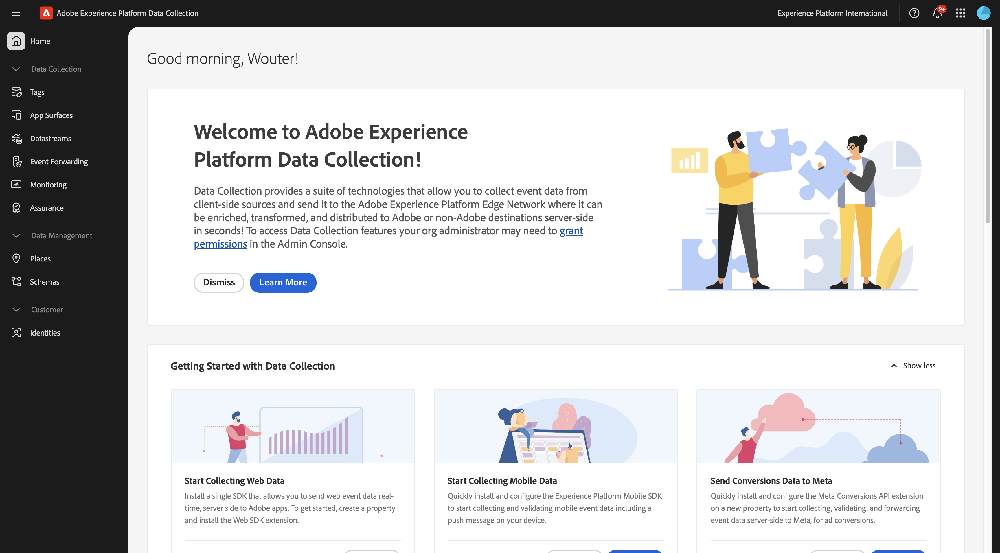
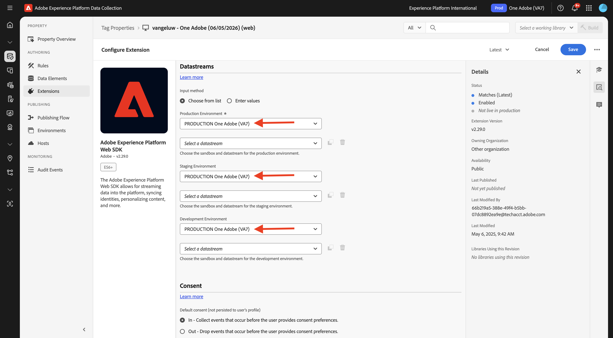
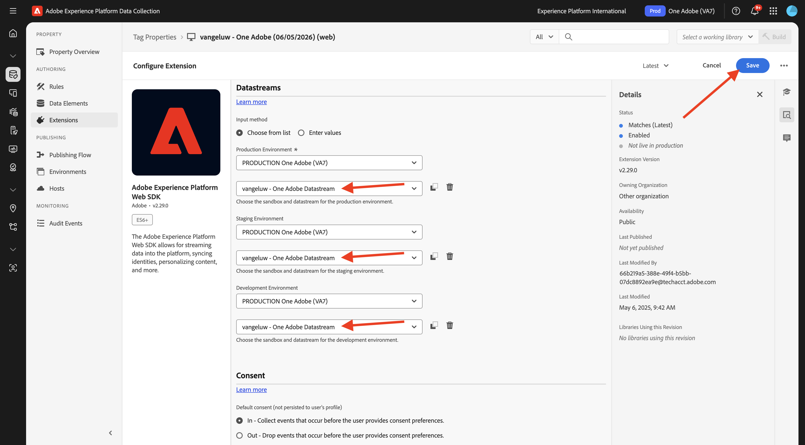
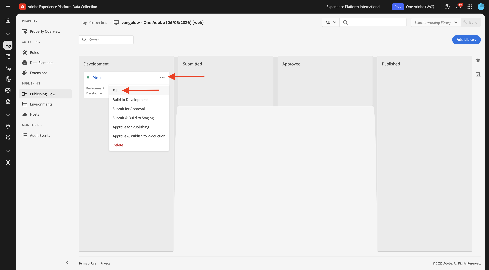
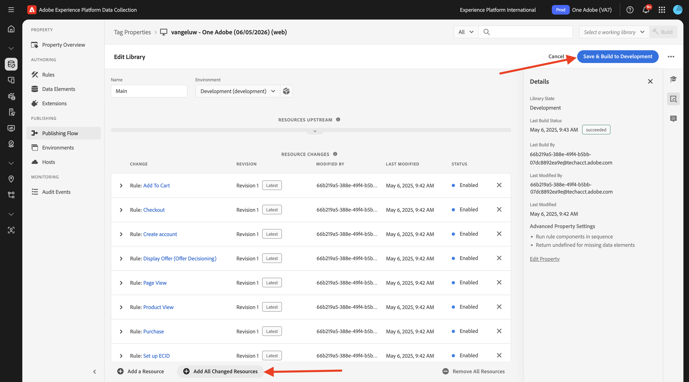
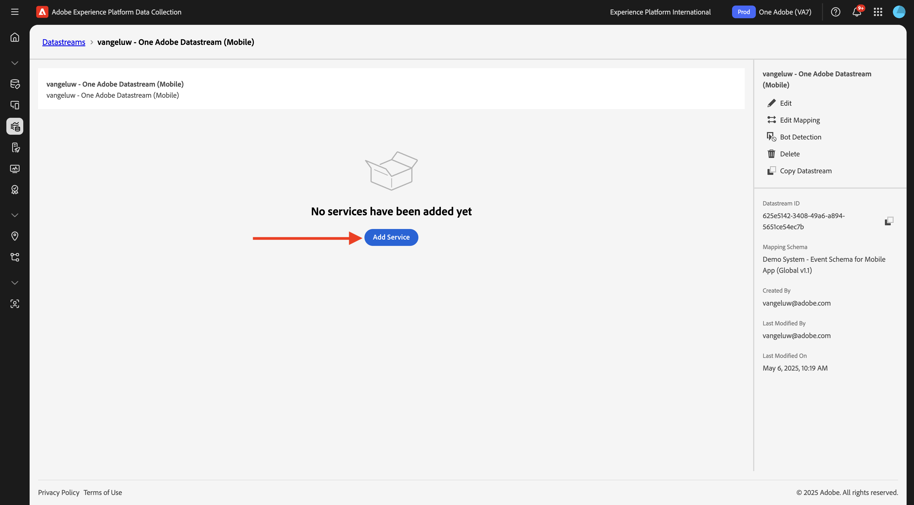
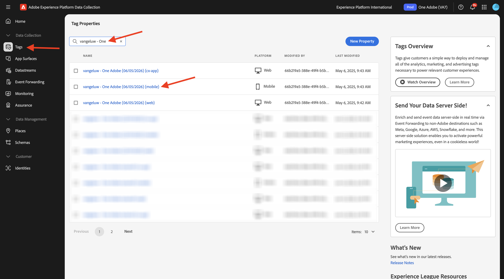

# 데이터 스트림 만들기

[https://experience.adobe.com/#/data-collection/](https://experience.adobe.com/#/data-collection/){target="_blank"}(으)로 이동합니다.

왼쪽 메뉴에서 **[!UICONTROL 태그]**&#x200B;를 클릭합니다. 이전 연습이 끝나면 이제 3개의 데이터 수집 속성이 있습니다. 하나는 웹용, 하나는 모바일용 및 하나는 CX 앱용 입니다.

이러한 속성을 사용할 준비가 거의 되었지만 이러한 속성을 사용하여 데이터 수집을 시작하려면 먼저 데이터 스트림을 설정해야 합니다. 데이터 스트림의 개념과 데이터 수집 모듈의 이후 연습에서 의미하는 바에 대한 자세한 정보를 얻을 수 있습니다.

지금은 다음 단계를 따르십시오.

## 웹용 데이터 스트림 만들기

**[!UICONTROL 데이터스트림]**&#x200B;을 클릭합니다.

화면 오른쪽 상단에서 샌드박스 이름을 선택합니다. 이름은 `--aepSandboxName--`이어야 합니다.

**[!UICONTROL 새 데이터 스트림]**&#x200B;을 클릭합니다.

**[!UICONTROL Name]**&#x200B;에 대해, 선택적 설명에 대해 `--aepUserLdap-- - One Adobe Datastream`을(를) 입력하십시오. **매핑 스키마**&#x200B;에 대해 **데모 시스템 - 웹 사이트에 대한 이벤트 스키마(전역 v1.1)**&#x200B;를 선택하십시오. **저장**&#x200B;을 클릭합니다.

그러면 이걸 보게 될 거야. **서비스 추가**&#x200B;를 클릭합니다.

추가 필드를 표시할 서비스 **[!UICONTROL Adobe Experience Platform]**&#x200B;을(를) 선택하십시오. 그러면 이걸 보게 될 거야.

이벤트 데이터 세트의 경우 **데모 시스템 - 웹 사이트의 이벤트 데이터 세트(전역 v1.1)**&#x200B;를 선택하고 프로필 데이터 세트의 경우 **데모 시스템 - 웹 사이트의 프로필 데이터 세트(전역 v1.1)**&#x200B;를 선택합니다. **저장**&#x200B;을 클릭합니다.

이제 이 항목을 볼 수 있습니다.

왼쪽 메뉴에서 **[!UICONTROL 태그]**&#x200B;를 클릭합니다.

검색 결과를 필터링하여 데이터 수집 속성을 확인합니다. **Web**&#x200B;의 속성을 클릭하여 엽니다.

그러면 이걸 보게 될 거야. **확장**&#x200B;을 클릭합니다.

먼저 Adobe Experience Platform Web SDK 확장을 클릭한 다음 **구성**&#x200B;을 클릭합니다.

그러면 이걸 보게 될 거야. **데이터스트림** 메뉴를 보고 올바른 샌드박스가 선택되어 있는지 확인하십시오. 이 샌드박스는 `--aepSandboxName--`이어야 합니다.

**데이터스트림** 드롭다운을 열고 이전에 만든 데이터스트림을 선택합니다.

세 가지 다른 환경에서 **데이터스트림**&#x200B;을(를) 선택했는지 확인하십시오. 그런 다음 **저장**&#x200B;을 클릭합니다.

**게시 흐름**(으)로 이동합니다.

**Main**&#x200B;의 **..**&#x200B;을(를) 클릭한 다음 **편집**&#x200B;을(를) 클릭합니다.

**변경된 모든 리소스 추가**&#x200B;를 클릭한 다음 **개발을 위한 저장 및 빌드**&#x200B;를 클릭합니다.

변경 사항이 게시되고 있으며 몇 분 후에 준비됩니다. 그 후에는 **기본** 옆에 녹색 점이 표시됩니다.

## 모바일용 데이터스트림 만들기

[https://experience.adobe.com/#/data-collection/](https://experience.adobe.com/#/data-collection/){target="_blank"}(으)로 이동합니다.

**[!UICONTROL 데이터스트림]**&#x200B;을 클릭합니다.

화면 오른쪽 상단에서 샌드박스 이름을 선택합니다. 이름은 `--aepSandboxName--`이어야 합니다.

**[!UICONTROL 새 데이터 스트림]**&#x200B;을 클릭합니다.

**[!UICONTROL 친숙한 이름]**&#x200B;에 대해, 선택적 설명에 대해 `--aepUserLdap-- - One Adobe Datastream (Mobile)`을(를) 입력하십시오. **매핑 스키마**&#x200B;에 대해 **데모 시스템 - 모바일 앱용 이벤트 스키마(전역 v1.1)**&#x200B;를 선택하십시오. **저장**&#x200B;을 클릭합니다.

**[!UICONTROL 저장]**&#x200B;을 클릭합니다.

그러면 이걸 보게 될 거야. **서비스 추가**&#x200B;를 클릭합니다.

추가 필드를 표시할 서비스 **[!UICONTROL Adobe Experience Platform]**&#x200B;을(를) 선택하십시오. 그러면 이걸 보게 될 거야.

이벤트 데이터 세트의 경우 **데모 시스템 - 모바일 앱용 이벤트 데이터 세트(전역 v1.1)**&#x200B;를 선택하고 프로필 데이터 세트의 경우 **데모 시스템 - 모바일 앱용 프로필 데이터 세트(전역 v1.1)**&#x200B;를 선택합니다. **저장**&#x200B;을 클릭합니다.

그러면 이걸 보게 될 거야.

이제 모바일용 Adobe Experience Platform 데이터 수집 클라이언트 속성에서 데이터 스트림을 사용할 준비가 되었습니다.

**태그**(으)로 이동하여 검색 결과를 필터링하여 두 개의 데이터 수집 속성을 확인하세요. **Mobile**&#x200B;의 속성을 클릭하여 엽니다.

그러면 이걸 보게 될 거야. **확장**&#x200B;을 클릭합니다.

**Adobe Experience Platform Edge Network** 확장을 클릭한 다음 **구성**&#x200B;을 클릭합니다.

그러면 이걸 보게 될 거야. 이제 방금 구성한 올바른 샌드박스 및 데이터 스트림을 선택해야 합니다. 사용할 샌드박스는 `--aepSandboxName--`이고 데이터 스트림은 `--aepUserLdap-- - One Adobe Datastream (Mobile)`입니다.

**Edge Network 도메인**&#x200B;의 경우 기본 도메인을 사용하십시오.

변경 내용을 저장하려면 **저장**&#x200B;을 클릭하세요.

**게시 흐름**(으)로 이동합니다.

**Main** 옆에 있는 **..**&#x200B;을 클릭한 다음 **편집**&#x200B;을 클릭합니다.

**변경된 모든 리소스 추가**&#x200B;를 클릭한 다음 **개발을 위한 저장 및 빌드**&#x200B;를 클릭합니다.

변경 사항이 게시되고 있으며 몇 분 후에 준비됩니다. 그 후에는 **기본** 옆에 녹색 점이 표시됩니다.

## 다음 단계

[웹 사이트 사용](./ex4.md){target="_blank"}(으)로 이동

[시작하기](./getting-started.md){target="_blank"}(으)로 돌아가기

[모든 모듈](./../../../overview.md){target="_blank"}(으)로 돌아가기