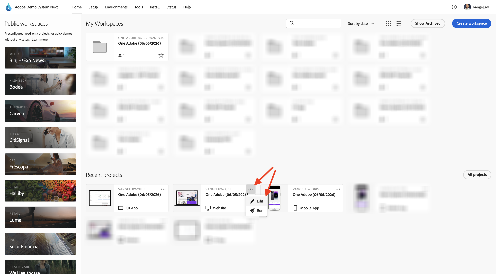

# 웹 사이트 사용

이전 연습 이후에, 당신은 이 결과를 얻었습니다. 자동으로 만든 **웹 통신 프로젝트**&#x200B;을(를) 열려면 클릭하세요.

실수로 브라우저 창을 닫았거나 나중에 세션을 위해 [https://dsn.adobe.com/](https://dsn.adobe.com/){target="_blank"}(으)로 이동하여 웹 사이트 프로젝트에 액세스할 수도 있습니다. Adobe ID으로 로그인하면 이 메시지가 표시됩니다. 웹 사이트 프로젝트에서 세 점 **..**&#x200B;을(를) 클릭한 다음 **편집**&#x200B;을(를) 클릭합니다.

그러면 이걸 보게 될 거야. **통합**&#x200B;을 클릭합니다.

**통합** 페이지에서 이전 연습에서 만든 데이터 수집 속성을 선택해야 합니다. 이렇게 하려면 **환경 선택**&#x200B;을 클릭하세요.

이전 단계에서 만든 데이터 수집 속성(`--aepUserLdap-- - One Adobe (DD/MM/YYYY) (web)`)에서 **선택**&#x200B;을 클릭합니다. **저장**&#x200B;을 클릭합니다.

그러면 이걸 보게 될 거야. 데모 웹 사이트를 열려면 **실행**&#x200B;을 클릭하세요.

그러면 데모 웹 사이트가 열리는 것을 볼 수 있습니다. URL을 선택하고 클립보드에 복사합니다.

새 시크릿 브라우저 창을 엽니다.

이전 단계에서 복사한 데모 웹 사이트의 URL을 붙여 넣습니다. 그런 다음 Adobe ID을 사용하여 로그인하라는 메시지가 표시됩니다.

계정 유형을 선택하고 로그인 프로세스를 완료합니다.

그러면 웹 사이트가 시크릿 브라우저 창에 로드되는 것을 볼 수 있습니다. 모든 데모에 대해 새로운 시크릿 브라우저 창을 사용하여 데모 웹 사이트 URL을 로드해야 합니다.

## 다음 단계

[모바일 앱 사용](./ex5.md){target="_blank"}(으)로 이동

[시작하기](./getting-started.md){target="_blank"}(으)로 돌아가기

[모든 모듈](./../../../overview.md){target="_blank"}(으)로 돌아가기