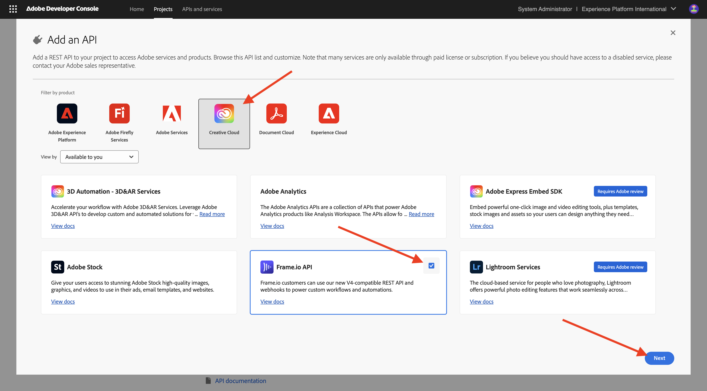
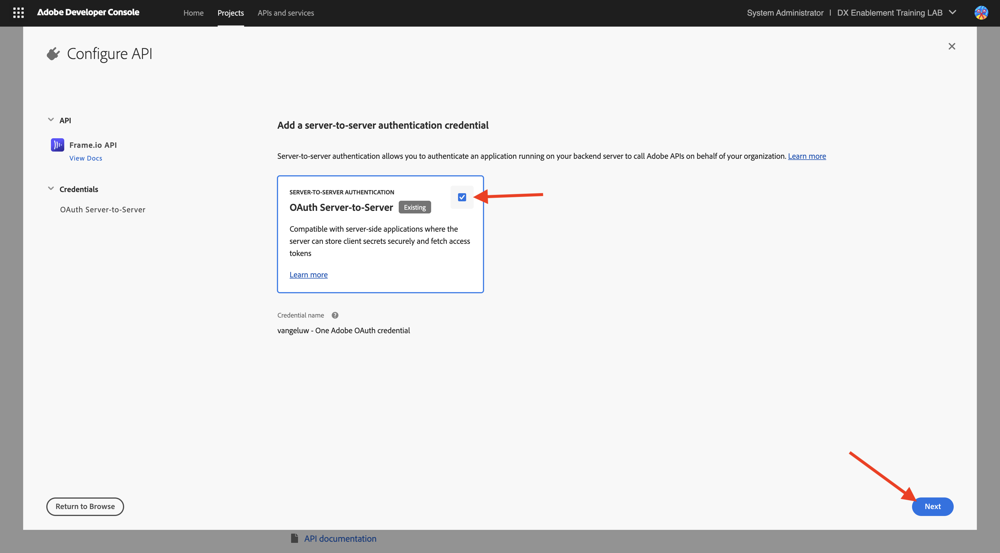
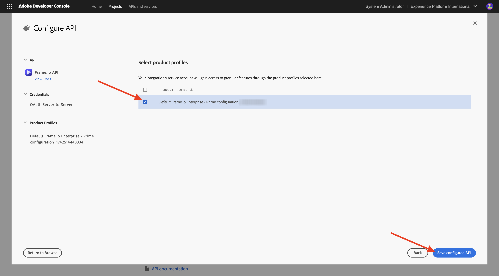

# Adobe I/O 프로젝트 구성

## 비디오

이 비디오에서는 이 연습과 관련된 모든 단계에 대한 설명과 데모를 제공합니다.

>[!VIDEO](https://video.tv.adobe.com/v/3476494?quality=12&learn=on)

## Adobe I/O 프로젝트 만들기

이 연습에서는 Adobe I/O을 사용하여 다양한 Adobe 끝점을 쿼리합니다. Adobe I/O을 설정하려면 다음 단계를 따르십시오.

[https://developer.adobe.com/console/home](https://developer.adobe.com/console/home){target="_blank"}(으)로 이동합니다.

화면 오른쪽 상단 모서리에서 올바른 인스턴스를 선택해야 합니다. 인스턴스는 `--aepImsOrgName--`입니다.

>[!NOTE]
>
> 아래 스크린샷은 선택된 특정 조직을 보여 줍니다. 이 자습서를 수행하는 경우 조직의 이름이 다를 수 있습니다. 이 자습서에 등록하면 사용할 환경 세부 정보가 제공되었으므로 해당 지침을 따르십시오.

**새 프로젝트 만들기**&#x200B;를 선택합니다.

### FIREFLY SERVICES API

>[!IMPORTANT]
>
>선택한 학습 경로에 따라 Firefly Services API에 대한 액세스 권한이 없을 수도 있습니다. 학습 과정(**Firefly Services**, **Workfront Fusion**, **모두**)에 있거나 **실시간 대면 워크숍**&#x200B;에 참석하는 경우에만 Firefly API에 액세스할 수 있습니다. 이 학습 경로 중 하나에 있지 않은 경우 이 단계를 건너뛸 수 있습니다.

그럼 이걸 보셔야죠 **+ 프로젝트에 추가**&#x200B;를 선택하고 **API**&#x200B;를 선택합니다.

**Adobe Firefly Services**&#x200B;을(를) 선택하고 **Firefly - Firefly Services**&#x200B;을(를) 선택한 후 **다음**&#x200B;을(를) 선택합니다.

자격 증명의 이름을 입력하십시오. `--aepUserLdap-- - One Adobe OAuth credential` **다음**.

기본 프로필 **기본 Firefly Services 구성**&#x200B;을 선택하고 **구성된 API 저장**&#x200B;을 선택합니다.

그럼 이걸 보셔야죠

### PHOTOSHOP SERVICES API

>[!IMPORTANT]
>
>선택한 학습 경로에 따라 Photoshop Services API에 대한 액세스 권한이 없을 수도 있습니다. 학습 과정(**Photoshop Services**, **Workfront Fusion**, **모두**)에 있거나 **실시간 대면 워크숍**&#x200B;에 참석하는 경우에만 Firefly API에 액세스할 수 있습니다. 이 학습 경로 중 하나에 있지 않은 경우 이 단계를 건너뛸 수 있습니다.
>
>**+ 프로젝트에 추가**&#x200B;를 선택한 다음 **API**&#x200B;를 선택합니다.

**Adobe Firefly Services**&#x200B;을(를) 선택하고 **Photoshop - Firefly Services**&#x200B;을(를) 선택합니다. **다음**&#x200B;을 선택합니다.

**다음**&#x200B;을 선택합니다.

그런 다음 이 통합에 사용할 수 있는 권한을 정의하는 제품 프로필을 선택해야 합니다.

**기본 Firefly Services 구성** 및 **기본 Creative Cloud 자동화 서비스 구성**&#x200B;을 선택합니다.

**구성된 API 저장**&#x200B;을 선택합니다.

그럼 이걸 보셔야죠

### ADOBE EXPERIENCE PLATFORM API

>[!IMPORTANT]
>
>선택한 학습 경로에 따라 Adobe Experience Platform API에 대한 액세스 권한이 없을 수도 있습니다. 학습 과정(**AEP + 앱**, **모두**)에 있거나 **실시간 대면 워크숍**&#x200B;에 참석하는 경우에만 Adobe Experience Platform API에 액세스할 수 있습니다. 이 학습 경로 중 하나에 있지 않은 경우 이 단계를 건너뛸 수 있습니다.

**+ 프로젝트에 추가**&#x200B;를 선택한 다음 **API**&#x200B;를 선택합니다.

**Adobe Experience Platform**&#x200B;을 선택하고 **Experience Platform API**&#x200B;를 선택합니다. **다음**&#x200B;을 선택합니다.

**다음**&#x200B;을 선택합니다.

그런 다음 이 통합에 사용할 수 있는 권한을 정의하는 제품 프로필을 선택해야 합니다.

**Adobe Experience Platform - 모든 사용자 - PROD**&#x200B;를 선택합니다.

>[!NOTE]
>
>AEP에 대한 제품 프로필 이름은 환경 구성 방식에 따라 다릅니다. 위에서 언급한 제품 프로필이 표시되지 않으면 **기본 프로덕션 모든 액세스**&#x200B;라는 제품 프로필이 있을 수 있습니다. 어떤 것을 선택할지 확실하지 않은 경우 AEP 시스템 관리자에게 문의하십시오.

**구성된 API 저장**&#x200B;을 선택합니다.

그럼 이걸 보셔야죠

### Frame.io API

>[!IMPORTANT]
>
>선택한 학습 경로에 따라 Frame.io API에 대한 액세스 권한이 없을 수 있습니다. 학습 과정(**Workfront Fusion**, **모두**)에 있거나 **실습 워크숍**&#x200B;에 참석하는 경우에만 Frame.io API에 액세스할 수 있습니다. 이 학습 경로 중 하나에 있지 않은 경우 이 단계를 건너뛸 수 있습니다.

**+ 프로젝트에 추가**&#x200B;를 선택한 다음 **API**&#x200B;를 선택합니다.

**Creative Cloud**&#x200B;을(를) 선택하고 **Frame.io API**&#x200B;을(를) 선택하십시오. **다음**&#x200B;을 선택합니다.

**서버 간 인증**&#x200B;을 선택한 후 **다음**&#x200B;을 클릭합니다.

**OAuth 서버 간**&#x200B;을 선택한 후 **다음**&#x200B;을 클릭하세요.

그런 다음 이 통합에 사용할 수 있는 권한을 정의하는 제품 프로필을 선택해야 합니다.

**기본 Frame.io Enterprise - Prime 구성**&#x200B;을 선택하고 **구성된 API 저장**&#x200B;을 클릭합니다.

그럼 이걸 보셔야죠

### 프로젝트 이름

프로젝트 이름을 클릭합니다.

{zoomable="yes"}

**프로젝트 편집**&#x200B;을 선택합니다.

{zoomable="yes"}

통합 이름 `--aepUserLdap-- One Adobe tutorial`을(를) 입력하고 **저장**&#x200B;을(를) 선택하십시오.

{zoomable="yes"}

Adobe I/O 프로젝트 설정이 완료되었습니다.

{zoomable="yes"}

## 다음 단계

[옵션 1: Postman 설치](./ex7.md){target="_blank"}(으)로 이동

[옵션 2: PostBuster 설정](./ex8.md){target="_blank"}(으)로 이동

[시작하기](./getting-started.md){target="_blank"}(으)로 돌아가기

[모든 모듈](./../../../overview.md){target="_blank"}(으)로 돌아가기
