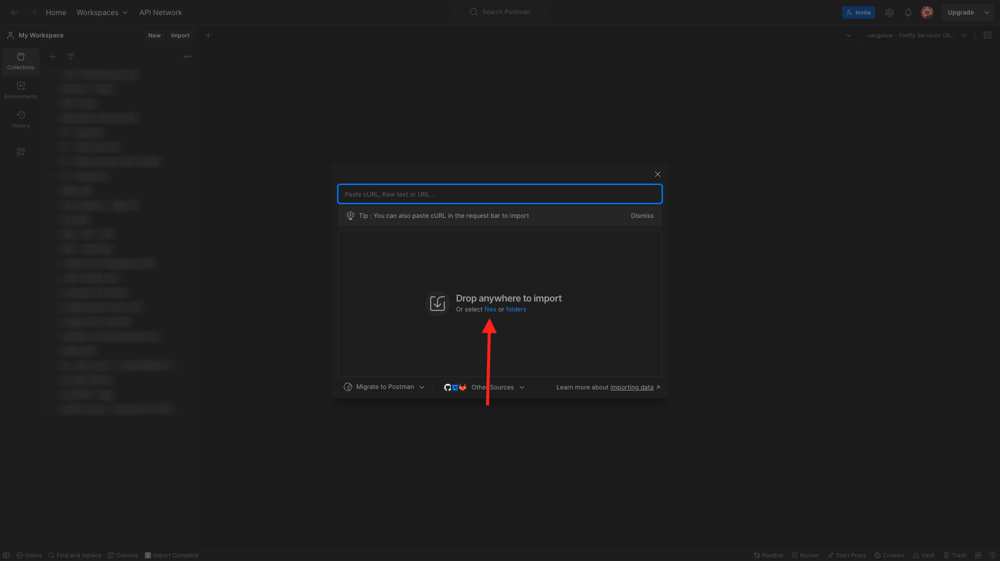

# 옵션 1: Postman 사용

>[!IMPORTANT]
>
>Adobe 직원인 경우 지침을 따라 [PostBuster 설치](./ex8.md)하세요!

## Postman 환경 다운로드

[https://developer.adobe.com/console/home](https://developer.adobe.com/console/home){target="_blank"}(으)로 이동하여 프로젝트를 엽니다.

{zoomable="yes"}

**Firefly - Firefly 서비스** API를 클릭합니다. 그런 다음 **Postman용 다운로드**&#x200B;를 클릭하고 **OAuth Server-to-Server**&#x200B;을(를) 선택하여 Postman 환경을 다운로드합니다.

{zoomable="yes"}

## Adobe I/O에 대한 Postman 인증

[Postman 다운로드](https://www.postman.com/downloads/){target="_blank"}에서 OS용 Postman의 관련 버전을 다운로드하여 설치하십시오.

{zoomable="yes"}

응용 프로그램을 시작합니다.

Postman에는 환경과 컬렉션의 두 가지 개념이 있습니다.

환경 파일에는 거의 일관되지 않은 모든 환경 변수가 포함되어 있습니다. 환경에서는 클라이언트 ID 등과 같은 보안 자격 증명과 함께 Adobe 환경의 IMSOrg와 같은 항목을 찾을 수 있습니다. 이전에 Adobe I/O 설정 중에 환경 파일을 다운로드했으며 이름이 **`oauth_server_to_server.postman_environment.json`**&#x200B;입니다.

컬렉션에는 사용할 수 있는 여러 API 요청이 포함되어 있습니다. 2개의 컬렉션을 사용합니다.

- Adobe I/O 인증을 위한 1개 컬렉션
- 이 단원의 연습에 대한 컬렉션 1개

로컬 데스크톱에 [postman-ff.zip](./../../../assets/postman/postman-ff.zip)을(를) 다운로드합니다.

{zoomable="yes"}

**postman-ff.zip** 파일에 다음 파일이 있습니다.

- `Adobe IO - OAuth.postman_collection.json`
- `FF - Firefly Services Tech Insiders.postman_collection.json`

**postman-ff.zip**&#x200B;의 압축을 풀고 다음 2개의 파일을 바탕 화면의 폴더에 저장합니다.

- `Adobe IO - OAuth.postman_collection.json`
- `FF - Firefly Services Tech Insiders.postman_collection.json`
- `oauth_server_to_server.postman_environment.json`

{zoomable="yes"}

Postman에서 **가져오기**&#x200B;를 선택합니다.

{zoomable="yes"}

**파일**&#x200B;을 선택하세요.

{zoomable="yes"}

폴더에서 세 개의 파일을 선택한 다음 **열기** 및 **가져오기**&#x200B;를 선택합니다.

{zoomable="yes"}

{zoomable="yes"}

이제 Postman에서 API를 통해 Firefly 서비스와 상호 작용하기 시작하는 데 필요한 모든 기능을 사용할 수 있습니다.

## 액세스 토큰 요청

그런 다음 올바르게 인증되었는지 확인하려면 액세스 토큰을 요청해야 합니다.

오른쪽 상단의 환경 드롭다운 목록을 확인하여 요청을 실행하기 전에 올바른 환경을 선택했는지 확인하십시오. 선택한 환경의 이름은 이 `--aepUserLdap-- One Adobe OAuth Credential`과(와) 유사해야 합니다.

{zoomable="yes"}

선택한 환경의 이름은 이 `--aepUserLdap-- One Adobe OAuth Credential`과(와) 유사해야 합니다.

{zoomable="yes"}

Postman 환경 및 컬렉션이 구성되고 작동하므로 이제 Postman에서 Adobe I/O으로 인증할 수 있습니다.

**Adobe IO - OAuth** 컬렉션에서 이름이 **POST - 액세스 토큰 가져오기**&#x200B;인 요청을 선택하고 **전송**&#x200B;을 선택합니다.

**쿼리 매개 변수** 아래에 두 개의 변수 `API_KEY` 및 `CLIENT_SECRET`이(가) 참조되었습니다. 이 변수는 선택한 환경 `--aepUserLdap-- One Adobe OAuth Credential`에서 가져온 것입니다.

{zoomable="yes"}

성공하면 전달자 토큰, 액세스 토큰 및 만료 창이 포함된 응답이 Postman의 **Body** 섹션에 표시됩니다.

{zoomable="yes"}

다음 정보가 포함된 유사한 응답이 표시됩니다.

| 키 | 값 |
|:-------------:| :---------------:| 
| token_type | **전달자** |
| access_token | **eyJhbGciOiJSUz...** |
| expires_in | **86399** |

Adobe I/O **전달자 토큰**&#x200B;에 특정 값(매우 긴 access_token)과 만료 창이 있으며, 이제 24시간 동안 유효합니다. 즉, 24시간 후 Postman을 사용하여 Adobe API와 상호 작용하려면 이 요청을 다시 실행하여 새 토큰을 생성해야 합니다.

이제 Postman 환경이 설정되고 작동합니다.

## 다음 단계

[설치할 응용 프로그램](./ex9.md){target="_blank"}(으)로 이동

[시작하기](./getting-started.md){target="_blank"}(으)로 돌아가기

[모든 모듈](./../../../overview.md){target="_blank"}(으)로 돌아가기
