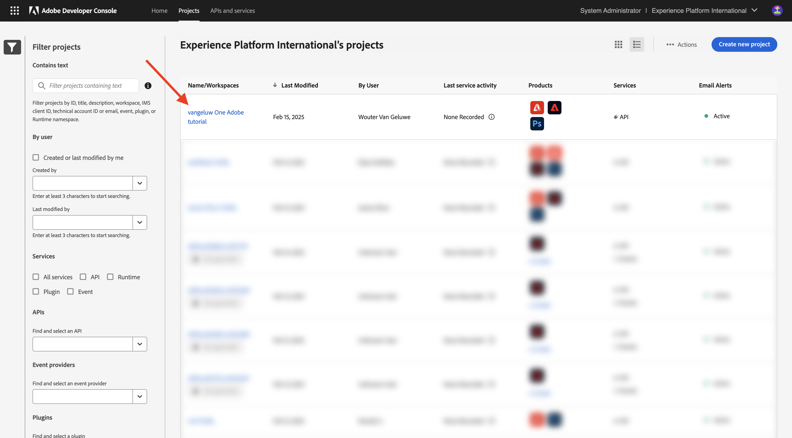

# 옵션 2: PostBuster 설정

>[!IMPORTANT]
>
>Adobe 직원이 아닌 경우 지침을 따라 [Postman 설치](./ex7.md){target="_blank"}하십시오. 아래 지침은 Adobe 직원만을 대상으로 합니다.

## PostBuster 설치

[https://adobe.service-now.com/esc?id=adb_esc_kb_article&sysparm_article=KB0020542](https://adobe.service-now.com/esc?id=adb_esc_kb_article&sysparm_article=KB0020542){target="_blank"}(으)로 이동합니다.

**PostBuster**&#x200B;의 최신 릴리스를 다운로드하려면 클릭하세요.


OS에 맞는 버전을 다운로드하십시오.


다운로드가 완료되고 설치되면 PostBuster를 엽니다. 그럼 이걸 보셔야죠 **가져오기**&#x200B;를 클릭합니다.


[postbuster.json.zip](./../../../assets/postman/postbuster.json.zip){target="_blank"}을(를) 다운로드하고 데스크톱에서 추출하십시오.


**파일 선택**&#x200B;을 클릭합니다.


**postbuster.json** 파일을 선택하십시오. **열기를 클릭합니다**.


그럼 이걸 보셔야죠 **검사**&#x200B;를 클릭합니다.


**가져오기**&#x200B;를 클릭합니다.


그럼 이걸 보셔야죠 을(를) 클릭하여 가져온 컬렉션을 엽니다.


이제 컬렉션을 볼 수 있습니다. 일부 환경 변수를 포함하도록 환경을 구성해야 합니다.


**기본 환경**&#x200B;을 클릭한 다음 **편집** 아이콘을 클릭합니다.


그럼 이걸 보셔야죠


아래 환경 자리 표시자를 복사하여 **기본 환경**&#x200B;에 붙여 넣습니다.

```json
{
	"CLIENT_SECRET": "",
	"API_KEY": "",
	"ACCESS_TOKEN": "",
	"SCOPES": [
		"openid",
		"AdobeID",
		"read_organizations", 
		"additional_info.projectedProductContext", 
		"session",
		"ff_apis",
		"firefly_api",
		"frame.s2s.all"
	],
	"TECHNICAL_ACCOUNT_ID": "",
	"IMS": "ims-na1.adobelogin.com",
	"IMS_ORG": "",
	"access_token": "",
	"IMS_TOKEN": "",
	"AZURE_STORAGE_URL": "",
	"AZURE_STORAGE_CONTAINER": "",
	"AZURE_STORAGE_SAS_READ": "",
	"AZURE_STORAGE_SAS_WRITE": "",
	"FRAME_IO_BASE_URL": "https://api.frame.io",
	"FRAME_IO_ACCOUNT_ID": "",
	"FRAME_IO_WORKSPACE_ID": ""
}
```

그럼 이걸 드셔보세요


## Adobe I/O 변수 입력

[https://developer.adobe.com/console/home](https://developer.adobe.com/console/home){target="_blank"}(으)로 이동하여 프로젝트를 엽니다.



**OAuth 서버 간**(으)로 이동합니다.


이제 Adobe I/O 프로젝트에서 다음 값을 복사하여 PostBuster 기본 환경에 붙여넣어야 합니다.

- 클라이언트 ID
- 클라이언트 암호(**클라이언트 암호 검색** 클릭)
- 기술 계정 ID
- 조직 ID(아래로 스크롤하여 조직 ID 찾기)


위의 변수를 하나씩 복사하여 PostBuster의 **기본 환경**&#x200B;에 붙여 넣으십시오.

| Adobe I/O의 변수 이름 | PostBuster 기본 환경의 변수 이름 |
|:-------------:| :---------------:| 
| 클라이언트 ID | `API_KEY` |
| 클라이언트 암호 | `CLIENT_SECRET` |
| 기술 계정 ID | `TECHNICAL_ACCOUNT_ID` |
| 조직 ID | `IMS_ORG` |

이러한 변수를 하나씩 복사하면 PostBuster 기본 환경이 다음과 같이 표시됩니다.

Click **Close**.


**Adobe IO - OAuth** 컬렉션에서 이름이 **POST - 액세스 토큰 가져오기**&#x200B;인 요청을 선택하고 **전송**&#x200B;을 선택합니다.


다음 정보가 포함된 유사한 응답이 표시됩니다.

| 키 | 값 |
|:-------------:| :---------------:| 
| token_type | **전달자** |
| access_token | **eyJhbGciOiJS...** |
| expires_in | **86399** |

Adobe I/O **전달자 토큰**&#x200B;에 특정 값(매우 긴 access_token)과 만료 창이 있으며, 이제 24시간 동안 유효합니다. 즉, 24시간 후 Postman을 사용하여 Adobe API와 상호 작용하려면 이 요청을 다시 실행하여 새 토큰을 생성해야 합니다.


이제 PostBuster 환경이 구성되어 작동합니다. 이제 이 연습을 완료했습니다.

## 다음 단계

[설치할 응용 프로그램](./ex9.md){target="_blank"}(으)로 이동

[시작하기](./getting-started.md){target="_blank"}(으)로 돌아가기

[모든 모듈](./../../../overview.md){target="_blank"}(으)로 돌아가기
