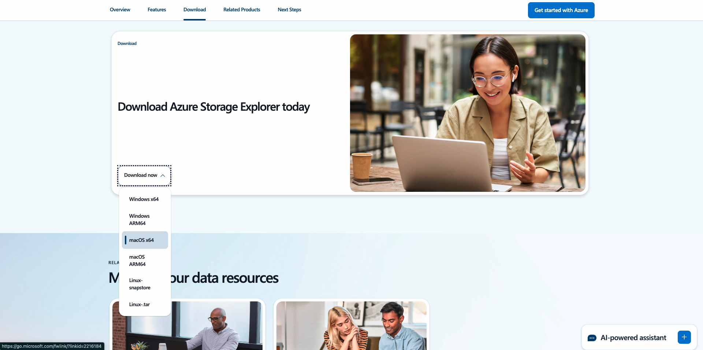

# 설치할 애플리케이션

다음은 라이브 워크샵에 참여하기 전에 필요한 사전 작업에 대한 개요입니다.

## Adobe Creative Cloud

[https://creativecloud.adobe.com/apps/download/creative-cloud](https://creativecloud.adobe.com/apps/download/creative-cloud){target="_blank"}(으)로 이동합니다.

## Photoshop

**Adobe Creative Cloud** 앱을 열고 **앱**(으)로 이동합니다. 컴퓨터에 Photoshop을 설치합니다.

## Visual Studio 코드

[https://code.visualstudio.com/](https://code.visualstudio.com/){target="_blank"}(으)로 이동하여 **Visual Studio Code**&#x200B;을(를) 다운로드하여 설치하십시오.

## 텍스트 편집기

텍스트 편집기 앱이 없는 경우 [https://www.sublimetext.com/](https://www.sublimetext.com/){target="_blank"}(으)로 이동하여 이 텍스트 편집기를 다운로드하여 설치할 수 있습니다.

## GitHub 계정

아직 GitHub 계정이 없는 경우 [https://github.com/](https://github.com/){target="_blank"}(으)로 이동하여 **등록**&#x200B;을 클릭하세요. 개인 이메일 주소를 사용하고 계정을 만드십시오.

## GitHub Desktop

[https://desktop.github.com/download/](https://desktop.github.com/download/){target="_blank"}(으)로 이동하여 **Github Desktop**&#x200B;을 다운로드하여 설치하십시오.

## Azure 스토리지 탐색기

[파일을 관리하려면 Microsoft Azure 저장소 탐색기를 다운로드하세요](https://azure.microsoft.com/en-us/products/storage/storage-explorer#Download-4){target="_blank"}. 특정 OS에 맞는 버전을 선택하고 다운로드하여 설치합니다.

{zoomable="yes"}

이제 시작 모듈을 완료했습니다.

## 다음 단계

[시작하기](./getting-started.md){target="_blank"}(으)로 돌아가기

[모든 모듈](./../../../overview.md){target="_blank"}(으)로 돌아갑니다./images
