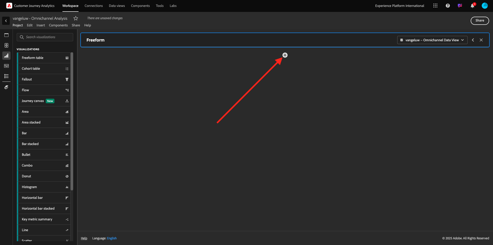
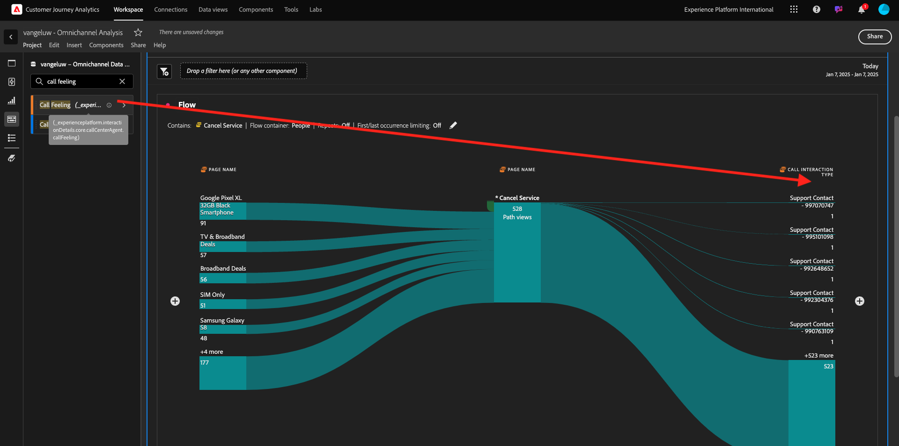

# Customer Journey Analytics을 사용한 1.1.5 시각화

## 목표

- Analysis Workspace UI 이해
- Analysis Workspace을 매우 다르게 만드는 몇 가지 기능에 대해 알아봅니다.
- Analysis Workspace을 사용하여 CJA에서 분석하는 방법 알아보기

## 컨텍스트

이 연습에서는 CJA 내의 Analysis Workspace을 사용하여 제품 보기, 제품 단계, 이탈 등을 분석합니다.

모듈 7 - 쿼리 서비스에서 수행한 쿼리 중 일부를 다루므로 SQL을 사용하지 않고 Analysis Workspace의 끌어서 놓기 철학에만 의존하면서 동일한 쿼리를 얼마나 쉽게 실행할 수 있는지 확인할 수 있습니다.

Analysis Workspace의 [1.1.4 데이터 준비에서 만든 프로젝트를 사용하겠습니다](./ex4.md). [https://analytics.adobe.com](https://analytics.adobe.com)(으)로 이동하십시오.

`--aepUserLdap-- - Omnichannel Analysis` 프로젝트를 열려면 클릭하세요.

프로젝트를 열고 데이터 보기 `--aepUserLdap-- - Omnichannel Analysis`을(를) 선택하면 첫 번째 시각화 빌드를 시작할 수 있습니다.

## 하루에 몇 개의 제품 보기가 있습니까

우선 데이터를 분석하기에 적합한 날짜를 선택해야 합니다. 캔버스 오른쪽에 있는 달력 드롭다운으로 이동합니다. 해당 날짜 범위를 클릭하고 선택합니다.

왼쪽 메뉴(구성 요소 영역)에서 계산된 지표 **제품 보기**&#x200B;를 찾습니다. 선택하고 자유 형식 테이블 내의 오른쪽 상단에 있는 캔버스로 드래그하여 놓습니다.

자동으로 **일** 차원이 추가되어 첫 번째 테이블을 만듭니다. 이제 즉석에서 질문에 대한 답변을 볼 수 있습니다.

그런 다음 지표 요약을 마우스 오른쪽 버튼으로 클릭합니다. **시각화**&#x200B;를 클릭합니다.

**줄**&#x200B;을 클릭하세요.

시간별로 제품 보기를 볼 수 있습니다.

시각화 내에서 **설정**&#x200B;을 클릭하여 시간 범위를 일로 변경할 수 있습니다.

**데이터 Source 관리**&#x200B;에 대한 **줄** 옆의 점을 클릭합니다.

그런 다음 **선택 잠금**&#x200B;을 클릭하고 **선택한 항목**&#x200B;을 선택하여 이 시각화가 항상 제품 보기 타임라인을 표시하도록 잠급니다.

## 상위 5개 제품 조회함

가장 많이 본 5개 제품은 무엇입니까?

가끔씩 프로젝트를 저장하는 것을 잊지 마십시오.

| OS | 지름길 |
| ----------------- |-------------| 
| Windows | Control + S |
| Mac | Command+S |

가장 많이 본 5개 제품을 살펴보겠습니다. 왼쪽 메뉴에서 **제품 이름** - Dimension을 찾습니다.

이제 **제품 이름**&#x200B;을(를) 끌어서 놓아 **일** 차원을 바꿉니다.

이것이 그 결과일 것이다. 4개의 제품 이름을 선택하면 시각화 업데이트가 표시됩니다.

그런 다음 제품 중 하나를 브랜드 이름으로 분류해 보십시오. **brandName**&#x200B;을(를) 검색하고 첫 번째 제품 이름으로 끕니다.

그런 다음 사용자 에이전트를 사용하여 분류를 수행합니다. **사용자 에이전트**&#x200B;을(를) 검색하고 브랜드 이름으로 끌어 옵니다.

그러면 다음과 같은 결과가 표시됩니다.

마지막으로 더 많은 시각화를 추가할 수 있습니다. 왼쪽의 시각화 아래에서 `Donut`을(를) 검색합니다. `Donut`을(를) 가져와서 **선** 시각화 아래의 캔버스에 끌어서 놓습니다.

그런 다음 표에서 **Google Pixel XL 32GB Black Smartphone** > **Citi Signal**&#x200B;에서 수행한 분류에서 처음 5개의 **사용자 에이전트** 행을 선택합니다. 3개의 행을 선택하는 동안 **CTRL** 단추(Windows의 경우) 또는 **Command** 단추(Mac의 경우)를 누릅니다. 도넛 차트가 업데이트되는 것을 볼 수 있습니다.

**Line** 그래프와 **Donut** 그래프를 약간 작게 만들어 디자인을 보다 읽기 쉽게 조정할 수도 있으므로 서로 맞춰질 수 있습니다.

**데이터 Source 관리**&#x200B;를 수행하려면 **도넛** 옆에 있는 점을 클릭하십시오.
그런 다음 **선택 잠금**&#x200B;을 클릭하여 이 시각화가 항상 제품 보기 타임라인을 표시하도록 잠급니다.

Analysis Workspace을 사용한 시각화에 대해 자세히 알아보려면 여기를 클릭하십시오.

- [https://experienceleague.adobe.com/docs/analytics/analyze/analysis-workspace/visualizations/freeform-analysis-visualizations.html?lang=ko](https://experienceleague.adobe.com/docs/analytics/analyze/analysis-workspace/visualizations/freeform-analysis-visualizations.html?lang=ko)
- [https://experienceleague.adobe.com/docs/analytics/analyze/analysis-workspace/visualizations/t-sync-visualization.html?lang=ko](https://experienceleague.adobe.com/docs/analytics/analyze/analysis-workspace/visualizations/t-sync-visualization.html?lang=ko)

## 제품 상호 작용 단계, 보기에서 구매에 이르기까지

이 문제를 해결하는 방법에는 여러 가지가 있습니다. 그중 하나는 제품 상호 작용 유형을 사용하여 자유 형식 테이블에서 사용하는 것입니다. 다른 방법은 **폴아웃 시각화**&#x200B;를 사용하는 것입니다. 마지막 하나를 시각화와 분석을 동시에 하고자 하는 데 활용하자.

여기를 클릭하여 현재 패널을 닫습니다.

이제 **+ 빈 패널 추가**&#x200B;를 클릭하여 새 빈 패널을 추가합니다.

시각화 **폴아웃**&#x200B;을 클릭합니다.

이전 연습과 동일한 날짜 범위를 선택합니다.

그러면 이걸 보게 될 거야.

왼쪽의 구성 요소에서 차원 **이벤트 유형**&#x200B;을(를) 찾습니다. 화살표를 클릭하여 차원을 엽니다.

사용 가능한 모든 이벤트 유형이 표시됩니다.

**commerce.productViews** 항목을 선택하고 **폴아웃 시각화** 내의 **터치포인트 추가** 필드로 끌어다 놓습니다.

**commerce.productListAdds** 및 **commerce.purchases**&#x200B;와(과) 동일한 작업을 수행한 다음 **폴아웃 시각화** 내의 **터치포인트 추가** 필드에 드롭하십시오. 이제 시각화는 다음과 같이 표시됩니다.

이곳에서 많은 일을 할 수 있습니다. 일부 예: 시간 경과에 따른 비교, 디바이스별 각 단계 비교 또는 충성도별 비교. 그러나 고객이 장바구니에 품목을 추가한 후 구입하지 않는 이유와 같은 흥미로운 사항을 분석하려는 경우, CJA에서 최고의 도구인 마우스 오른쪽 버튼을 클릭할 수 있습니다.

터치포인트 **commerce.productListAdds**&#x200B;을(를) 마우스 오른쪽 단추로 클릭합니다. 그런 다음 이 터치포인트에서 **분류 폴아웃**&#x200B;을 클릭합니다.

사용자가 구매하지 않은 경우 수행한 작업을 분석하는 새 자유 형식 테이블이 만들어집니다.

새 자유 형식 테이블에서 **이벤트 유형**&#x200B;을(를) **페이지 이름**(으)로 변경하여 구매 확인 페이지 대신 진행 중인 페이지를 확인합니다.

## 서비스 취소 페이지에 도달하기 전에 사이트에서 사람들이 수행하는 작업

이 분석을 수행하는 방법에는 여러 가지가 있다. 흐름 분석을 이용하여 탐색 부분을 시작해보자.

여기를 클릭하여 현재 패널을 닫은 다음 **+ 빈 패널 추가**&#x200B;를 클릭하여 새 빈 패널을 추가하십시오.

시각화 **흐름**&#x200B;을 클릭합니다.

그러면 이걸 보게 될 거야. 이전 연습과 동일한 날짜 범위를 선택합니다. **적용**&#x200B;을 클릭합니다.

왼쪽의 구성 요소에서 **페이지 이름** 차원을 찾은 다음 화살표를 클릭하여 차원을 엽니다.

모든 페이지가 보입니다. 페이지 이름을 찾습니다. **서비스 취소**.
**서비스 취소**&#x200B;를 가운데 필드의 흐름 시각화로 끌어서 놓습니다. **빌드**&#x200B;를 클릭합니다.

그러면 다음과 같은 결과가 표시됩니다.

이제 웹 사이트의 **서비스 취소** 페이지를 방문한 고객이 콜센터로도 전화했는지, 결과가 무엇인지 분석해 보겠습니다.

차원에서 돌아가서 **통화 상호 작용 유형**&#x200B;을 찾으십시오.
**통화 상호 작용 유형**&#x200B;을(를) 끌어다 놓아 **흐름 시각화** 내에서 오른쪽에 있는 첫 번째 상호 작용을 바꾸십시오.

**서비스 취소** 페이지를 방문한 후 콜센터에 전화한 고객의 지원 티켓이 표시됩니다.

다음으로 차원에서 **통화 느낌**&#x200B;을 검색합니다.  **플로우 시각화** 내에서 오른쪽의 첫 번째 상호 작용을 대체하려면 드래그 앤 드롭하십시오.

그러면 다음과 같은 결과가 표시됩니다.

보시다시피 플로우 시각화를 사용하여 옴니채널 분석을 실행했습니다. 덕분에 서비스 취소를 고민하던 일부 고객들이 콜센터에 전화해 긍정적인 느낌을 받은 것으로 보인다. 우리가 승진으로 그들의 마음을 바꿨을까?

## 긍정적 콜센터 연락처가 있는 고객이 기본 KPI에 대해 어떤 성과를 보이고 있습니까?

먼저 **긍정적** 호출을 가진 사용자만 가져올 수 있도록 데이터를 세그먼트화하겠습니다. CJA에서 세그먼트를 필터라고 합니다. 구성 요소 영역 내의 필터(왼쪽)로 이동하여 **+**&#x200B;을(를) 클릭합니다.

필터 빌더 내에서 필터에 이름을 지정합니다.

| 이름 | 설명 |
| ----------------- |-------------| 
| 통화 느낌 - 긍정적 | 통화 느낌 - 긍정적 |

구성 요소(필터 빌더 내부)에서 **호출 느낌**&#x200B;을 찾아 필터 빌더 정의로 끌어서 놓습니다.

이제 필터의 값으로 **양수**&#x200B;을(를) 선택하십시오.

범위를 **개인** 수준으로 변경하십시오. **저장**&#x200B;을 클릭합니다.

그럼 다시 여기로 오십시오. 아직 완료하지 않은 경우 **+ 빈 패널 추가**&#x200B;를 클릭하여 이전 패널을 닫고 새 빈 패널을 추가하십시오.

이전 연습과 동일한 날짜 범위를 선택합니다. **적용**&#x200B;을 클릭합니다.

**자유 형식 테이블**&#x200B;을 클릭합니다.

이제 방금 만든 필터를 드래그 앤 드롭합니다.

일부 지표를 추가할 시간입니다. **제품 보기**(으)로 시작합니다. 자유 형식 테이블로 끌어서 놓습니다. **이벤트** 지표를 삭제할 수도 있습니다.

**사람**, **장바구니에 추가** 및 **구매**&#x200B;에서도 동일한 작업을 수행합니다. 이런 식탁 하나가 생기게 될 겁니다.

첫 번째 흐름 분석 덕분에 새로운 질문이 떠올랐다. 따라서 이 테이블을 만들고 세그먼트에 대한 일부 KPI를 확인하여 해당 질문에 답변하기로 했습니다. 보시는 것처럼 SQL이나 다른 BI 솔루션을 사용하는 것보다 통찰력에 걸리는 시간이 훨씬 빠릅니다.

## Customer Journey Analytics 및 Analysis Workspace 요약

이 실습에서 배웠듯이, Analysis Workspace은 모든 채널의 데이터를 함께 결합하여 전체 고객 여정을 분석합니다. 또한 여정에 연결되지 않은 동일한 작업 영역으로 데이터를 가져올 수 있습니다.
이렇게 하면 연결이 끊어진 데이터를 분석에 가져와 여정에 컨텍스트를 제공하는 데 매우 유용할 수 있습니다. 일부 예에는 NPS 데이터, 설문 조사, Facebook 광고 이벤트 또는 오프라인 상호 작용(식별되지 않음)과 같은 것들이 포함됩니다.

## 다음 단계

[요약 및 혜택](./summary.md){target="_blank"}(으)로 이동

[Customer Journey Analytics](./customer-journey-analytics-build-a-dashboard.md){target="_blank"}로 돌아가기

[모든 모듈](./../../../../overview.md){target="_blank"}(으)로 돌아가기
