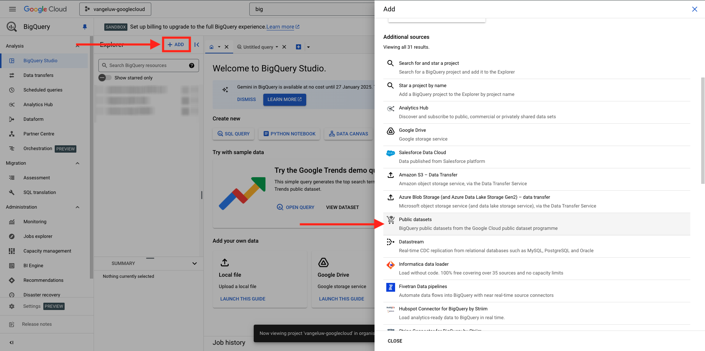
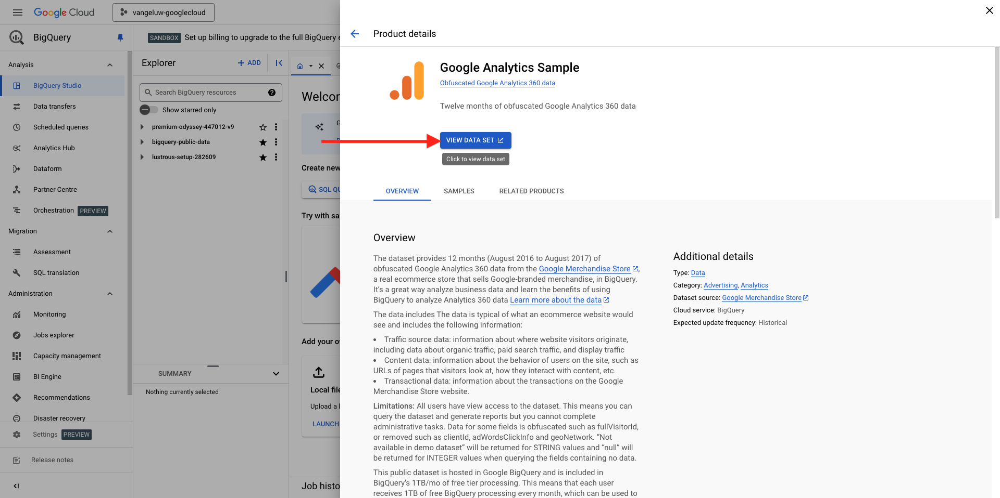
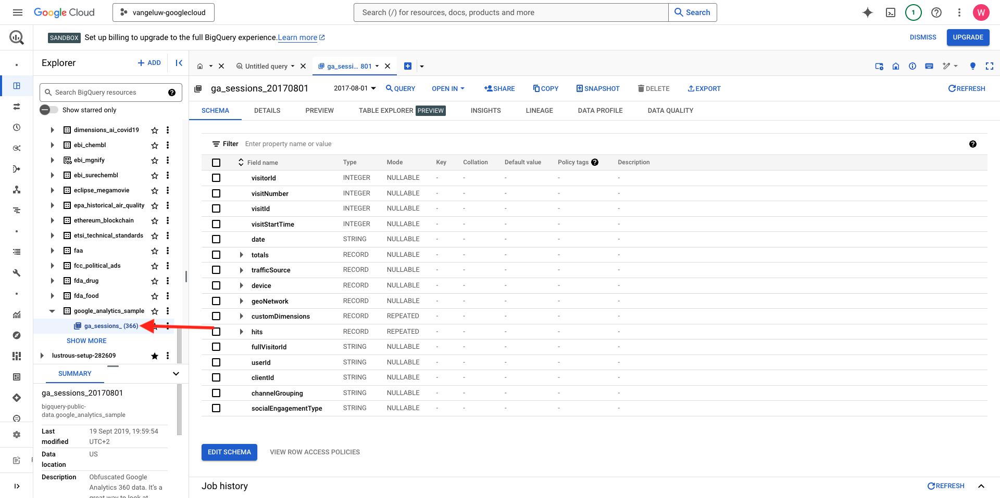

# 1.2.1 Google Cloud Platform 사용 시작

>[!NOTE]
>
>이 연습을 수행하려면 Google 클라우드 플랫폼 환경에 액세스해야 합니다. 아직 GCP에 액세스할 수 없는 경우 개인 이메일 주소를 사용하여 새 계정을 만드십시오.

## 1.2.1.1 Google BigQuery를 Adobe Experience Platform에 연결하여 Google Analytics 데이터를 가져오는 이유

GCP(Google Cloud Platform)는 Google에서 제공하는 퍼블릭 클라우드 컴퓨팅 서비스 세트입니다. Google 클라우드 플랫폼에는 Google 하드웨어에서 실행되는 컴퓨팅, 스토리지 및 애플리케이션 개발을 위한 다양한 호스팅 서비스가 포함되어 있습니다.

BigQuery는 이러한 서비스 중 하나이며 항상 Google Analytics 360에 포함되어 있습니다. Google Analytics 데이터는 데이터에서 직접 데이터를 가져오려고 할 때 자주 샘플링됩니다(예: API). Google에 BigQuery가 포함되어 있어 샘플링되지 않은 데이터를 가져올 수 있으므로 브랜드는 SQL을 사용하여 고급 분석을 수행하고 GCP의 강력한 기능을 활용할 수 있습니다.

Google Analytics 데이터는 매일 일괄 처리 메커니즘을 사용하여 BigQuery에 로드됩니다. 따라서 실시간 개인화 및 활성화 사용 사례에 이 GCP/BigQuery 통합을 사용하는 것은 적절하지 않습니다.

브랜드가 Google Analytics 데이터를 기반으로 실시간 개인화 사용 사례를 전달하려는 경우 Google Tag Manager를 사용하여 웹 사이트에서 해당 데이터를 수집한 다음 Adobe Experience Platform으로 실시간으로 스트리밍할 수 있습니다.

다음 작업을 수행하려면 GCP/BigQuery Source 커넥터를 사용해야 합니다.

- 웹 사이트에서 모든 고객 행동을 추적하고 실시간 활성화가 필요 없는 분석, 데이터 과학 및 개인화 사용 사례를 위해 Adobe Experience Platform에 해당 데이터를 로드합니다.
- 분석 및 데이터 과학 사용 사례를 위해 Google Analytics 내역 데이터를 Adobe Experience Platform에 다시 로드

## 1.2.1.2 Google 계정

>[!NOTE]
>
>이 연습을 수행하려면 Google 클라우드 플랫폼 환경에 액세스해야 합니다. 아직 GCP에 액세스할 수 없는 경우 개인 이메일 주소를 사용하여 새 계정을 만드십시오.

## 1.2.1.3 프로젝트 선택 또는 생성

[https://console.cloud.google.com/](https://console.cloud.google.com/)(으)로 이동합니다.

**프로젝트 선택**&#x200B;을 클릭하거나 기존 프로젝트를 클릭합니다.

아직 프로젝트가 없는 경우 **새 프로젝트**&#x200B;를 클릭하세요. 이미 프로젝트가 있는 경우 해당 프로젝트를 선택하고 다음 단계로 계속 진행하도록 선택할 수 있습니다.

이 명명 규칙에 따라 프로젝트 이름을 지정합니다. **만들기**&#x200B;를 클릭합니다.

| 컨벤션 |
| ----------------- |
| `--aepUserLdap---googlecloud` |

화면 오른쪽 상단의 알림에 생성이 완료되었다는 메시지가 표시될 때까지 기다립니다. 그런 다음 **프로젝트 선택**&#x200B;을 클릭합니다.

그런 다음 화면 상단의 검색 창으로 이동하여 **BigQuery**&#x200B;을 입력합니다. 첫 번째 결과를 선택합니다.

이 모듈의 목표는 Google Analytics 데이터를 Adobe Experience Platform으로 가져오는 것입니다. 이렇게 하려면 먼저 Google Analytics 데이터 세트에 더미 데이터가 필요합니다.

**+ 추가**&#x200B;를 클릭한 다음 오른쪽 메뉴에서 **공용 데이터 세트**&#x200B;를 클릭합니다.

그러면 이 창이 표시됩니다.

검색 창에서 검색어 **Google Analytics 샘플**&#x200B;을(를) 입력하고 첫 번째 검색 결과를 클릭합니다.

데이터 세트에 대한 설명과 함께 다음 화면이 표시됩니다. **데이터 집합 보기**&#x200B;를 클릭합니다.

그러면 BigQuery로 리디렉션되어 **탐색기**&#x200B;에서 이 **bigquery-public-data** 데이터 집합을 볼 수 있습니다.

이제 **탐색기**&#x200B;에 여러 개의 테이블이 표시됩니다. 자유롭게 살펴보십시오. `google_analytics_sample`(으)로 이동합니다.

`ga_sessions` 테이블을 열려면 클릭하세요.

다음 연습을 계속하기 전에 컴퓨터에 있는 별도의 텍스트 파일에 다음 사항을 기록하십시오.

| 자격 증명 | 이름 지정 | 예 |
| ----------------- |-------------| -------------|
| 프로젝트 이름 | `--aepUserLdap---googlecloud` | 반겔루-구글클라우드 |
| 프로젝트 ID | random | possible-bee-447102-h3 |

상단 메뉴 모음에서 **프로젝트 이름**&#x200B;을 클릭하여 프로젝트 이름과 프로젝트 ID를 찾을 수 있습니다.

그러면 오른쪽에 프로젝트 ID가 표시됩니다.

이제 Google Analytics 데이터를 쿼리하여 손을 더럽힐 다음 연습으로 이동할 수 있습니다.

## 다음 단계

[1.2.2(으)로 이동 BigQuery에서 첫 번째 쿼리 만들기](./ex2.md){target="_blank"}

BigQuery Google Analytics 커넥터를 사용하여 Adobe Experience Platform에서 [Source 데이터 수집 및 분석](./customer-journey-analytics-bigquery-gcp.md){target="_blank"}(으)로 돌아가기

[모든 모듈](./../../../../overview.md){target="_blank"}(으)로 돌아가기
