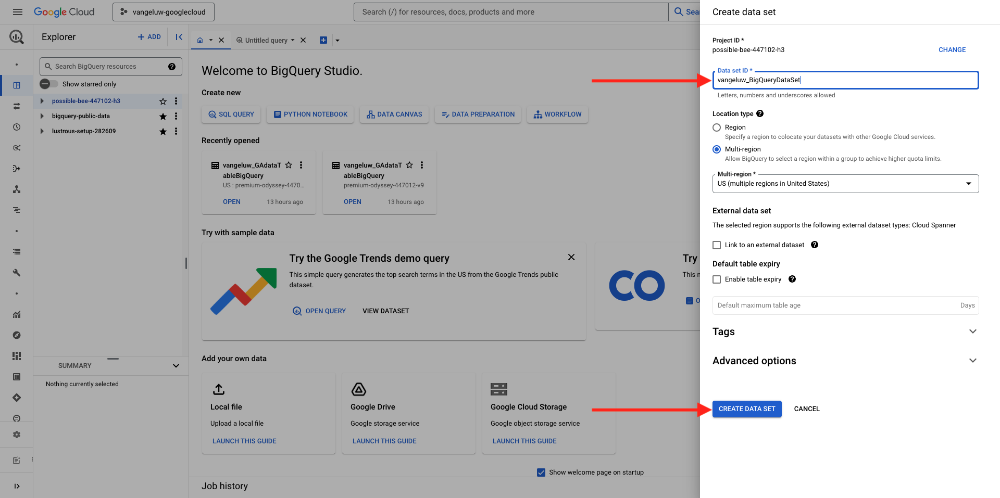

# 1.2.2 BigQuery에서 첫 번째 쿼리 만들기

## 목표

- BigQuery UI 살펴보기
- BigQuery 내에서 SQL 쿼리 만들기
- BigQuery 내의 데이터 세트에 SQL 쿼리 결과 저장

## 컨텍스트

Google Analytics 데이터가 BigQuery에 있으면 차원, 지표 및 기타 변수가 모두 중첩됩니다. 또한 Google Analytics 데이터는 매일 다른 테이블에 로드됩니다. 즉, BigQuery 내의 Google Analytics 테이블을 Adobe Experience Platform에 직접 연결하는 것은 매우 어렵고 좋지 않습니다.

이 문제에 대한 해결 방법은 Google Analytics 데이터를 읽을 수 있는 형식으로 변환하여 Adobe Experience Platform으로 수집하기 쉽도록 하는 것입니다.

## 1.2.2.1 새 BigQuery 테이블을 저장할 데이터 세트를 만듭니다.

[BigQuery 콘솔](https://console.cloud.google.com/bigquery)로 이동합니다.


**탐색기**&#x200B;에서 프로젝트 ID를 볼 수 있습니다. 프로젝트 ID를 클릭합니다(**bigquery-public-data** 데이터 세트를 클릭하지 마십시오).


아직 데이터 세트가 없는 것을 볼 수 있으므로 지금 데이터 세트를 만들어 보겠습니다.
3개의 **..**&#x200B;을 클릭한 다음 **데이터 집합 만들기**&#x200B;를 클릭합니다.


화면 오른쪽에는 **데이터 집합 만들기** 메뉴가 표시됩니다.


**데이터 집합 ID**&#x200B;에 대해 아래 명명 규칙을 사용하십시오. 다른 필드의 경우 기본 설정을 그대로 두십시오.

| 이름 지정 | 예 |
| ----------------- | ------------- | 
| `--aepUserLdap--_BigQueryDataSet` | vangeluw_BigQueryDataSet |

**데이터 집합 만들기**&#x200B;를 클릭합니다.



그런 다음 데이터 세트를 만든 상태로 BigQuery 콘솔로 돌아갑니다.


## 1.2.2.2 첫 번째 SQL BigQuery 만들기

그런 다음 BigQuery에서 첫 번째 쿼리를 만듭니다. 이 쿼리의 목표는 Google Analytics 샘플 데이터를 가져와 Adobe Experience Platform에서 수집할 수 있도록 변환하는 것입니다. **제목 없는 쿼리** 탭으로 이동합니다.


다음 SQL 쿼리를 복사하여 해당 쿼리 편집기에 붙여넣습니다. 언제든지 쿼리를 읽고 Google Analytics BigQuery 구문을 이해할 수 있습니다.


```sql
SELECT
  CONCAT(fullVisitorId, CAST(hitTime AS String), '-', hitNumber) AS _id,
  TIMESTAMP(DATETIME(Year_Current, Month_Current, Day_Current, Hour, Minutes, Seconds)) AS timeStamp,
  fullVisitorId as GA_ID,
  -- Fake CUSTOMER ID
  CONCAT('3E-D4-',fullVisitorId, '-1W-93F' ) as customerID,
  Page,
  Landing_Page,
  Exit_Page,
  Device,
  Browser,
  MarketingChannel,
  TrafficSource,
  TrafficMedium,
  -- Enhanced Ecommerce
  TransactionID,
  CASE
      WHEN EcommerceActionType = '2' THEN 'Product_Detail_Views'
      WHEN EcommerceActionType = '3' THEN 'Adds_To_Cart'
      WHEN EcommerceActionType = '4' THEN 'Product_Removes_From_Cart'
      WHEN EcommerceActionType = '5' THEN 'Product_Checkouts'
      WHEN EcommerceActionType = '6' THEN 'Product_Refunds'
    ELSE
    NULL
  END
     AS Ecommerce_Action_Type,
  -- Entrances (metric)
  SUM(CASE
      WHEN isEntrance = TRUE THEN 1
    ELSE
    0
  END
    ) AS Entries,
    
--Pageviews (metric)
    COUNT(*) AS Pageviews,
    
 -- Exits 
    SUM(
    IF
      (isExit IS NOT NULL,
        1,
        0)) AS Exits,
        
 --Bounces
   SUM(CASE
      WHEN isExit = TRUE AND isEntrance = TRUE THEN 1
    ELSE
    0
  END
    ) AS Bounces,
        
  -- Unique Purchases (metric)
  COUNT(DISTINCT TransactionID) AS Unique_Purchases,
  -- Product Detail Views (metric)
  COUNT(CASE
      WHEN EcommerceActionType = '2' THEN fullVisitorId
    ELSE
    NULL
  END
    ) AS Product_Detail_Views,
  -- Product Adds To Cart (metric)
  COUNT(CASE
      WHEN EcommerceActionType = '3' THEN fullVisitorId
    ELSE
    NULL
  END
    ) AS Adds_To_Cart,
  -- Product Removes From Cart (metric)
  COUNT(CASE
      WHEN EcommerceActionType = '4' THEN fullVisitorId
    ELSE
    NULL
  END
    ) AS Product_Removes_From_Cart,
  -- Product Checkouts (metric)
  COUNT(CASE
      WHEN EcommerceActionType = '5' THEN fullVisitorId
    ELSE
    NULL
  END
    ) AS Product_Checkouts,
  -- Product Refunds (metric)
  COUNT(CASE
      WHEN EcommerceActionType = '7' THEN fullVisitorId
    ELSE
    NULL
  END
    ) AS Product_Refunds
  FROM (
  SELECT
    -- Landing Page (dimension)
    CASE
      WHEN hits.isEntrance = TRUE THEN hits.page.pageTitle
    ELSE NULL
  END
    AS Landing_page,
    
        -- Exit Page (dimension)
    CASE
      WHEN hits.isExit = TRUE THEN hits.page.pageTitle
    ELSE
    NULL
  END
    AS Exit_page,
    
    hits.page.pageTitle AS Page,
    hits.isEntrance,
    hits.isExit,
    hits.hitNumber as hitNumber,
    hits.time as hitTime,
    date as Fecha,
    fullVisitorId,
    visitStartTime,
    device.deviceCategory AS Device,
    device.browser AS Browser,
    channelGrouping AS MarketingChannel,
    trafficSource.source AS TrafficSource,
    trafficSource.medium AS TrafficMedium,
    hits.transaction.transactionId AS TransactionID,
    CAST(EXTRACT(YEAR FROM CURRENT_DATE()) AS INT64) AS Year_Current,
    CAST(EXTRACT(MONTH FROM CURRENT_DATE()) AS INT64) AS Month_Current,
     CAST(EXTRACT(DAY FROM CURRENT_DATE()) AS INT64) AS Day_Current,
    CAST(EXTRACT(DAY FROM DATE_SUB(CURRENT_DATE(),INTERVAL 1 DAY)) AS INT64) AS Day_Current_Before,
    CAST(FORMAT_DATE('%Y', PARSE_DATE("%Y%m%d", date)) AS INT64) AS Year,
  CAST(FORMAT_DATE('%m', PARSE_DATE("%Y%m%d",date)) AS INT64) AS Month,
  CAST(FORMAT_DATE('%d', PARSE_DATE("%Y%m%d",date)) AS INT64) AS Day,
    CAST(EXTRACT (hour FROM TIMESTAMP_SECONDS(hits.time)) AS INT64) AS Hour,
  CAST(EXTRACT (minute FROM TIMESTAMP_SECONDS(hits.time)) AS INT64) AS Minutes,
  CAST(EXTRACT (second FROM TIMESTAMP_SECONDS(hits.time)) AS INT64) AS SecondS,
    hits.eCommerceAction.action_type AS EcommerceActionType
  
  FROM
    `bigquery-public-data.google_analytics_sample.ga_sessions_*`,
     UNNEST(hits) AS hits
  WHERE
    _table_suffix BETWEEN '20170101'
    AND '20170331'
    AND totals.visits = 1
    AND hits.type = 'PAGE'
    )
    
GROUP BY
  1,
  2,
  3,
  4,
  5,
  6,
  7,
  8,
  9,
  10,
  11,
  12,
  13,
  14
    
  ORDER BY 2 DESC
```

준비가 되면 **실행**&#x200B;을 클릭하여 쿼리를 실행합니다.


쿼리를 실행하는 데 몇 분 정도 걸릴 수 있습니다.

쿼리 실행이 완료되면 **쿼리 결과**&#x200B;에 아래 출력이 표시됩니다.


## 1.2.2.3 BigQuery SQL 쿼리 결과를 저장합니다.

다음 단계는 **결과 저장** 단추를 클릭하여 쿼리의 출력을 저장하는 것입니다.


출력의 위치로 **BigQuery 테이블**&#x200B;을 선택합니다.


그러면 **프로젝트 이름** 및 **데이터 세트 이름**&#x200B;이 미리 채워진 새 팝업이 표시됩니다. 데이터 세트 이름은 이 명명 규칙을 사용하여 이 연습을 시작할 때 만든 데이터 세트여야 합니다.

| 이름 지정 | 예 |
| ----------------- | ------------- | 
| `--aepUserLdap--_BigQueryDataSet` | `vangeluw_BigQueryDataSet` |

이제 테이블 이름을 입력해야 합니다. 이 명명 규칙을 사용하십시오.

| 이름 지정 | 예 |
| ----------------- |------------- | 
| `--aepUserLdap--_GAdataTableBigQuery` | `vangeluw_GAdataTableBigQuery` |

**저장**&#x200B;을 클릭합니다.


생성한 테이블에서 데이터가 준비되기까지 시간이 걸릴 수 있습니다. 몇 분 후에 브라우저를 새로 고칩니다. 그러면 데이터 세트 내에서 BigQuery 프로젝트 내의 **탐색기** 아래에 `--aepUserLdap--_GAdataTableBigquery` 테이블이 표시됩니다.


이제 이 테이블을 Adobe Experience Platform에 연결하는 다음 연습을 계속할 수 있습니다.

## 다음 단계

[1.2.3(으)로 이동: GCP 및 BigQuery를 Adobe Experience Platform에 연결](./ex3.md){target="_blank"}

BigQuery Google Analytics 커넥터를 사용하여 Adobe Experience Platform에서 [Source 데이터 수집 및 분석](./customer-journey-analytics-bigquery-gcp.md){target="_blank"}(으)로 돌아가기

[모든 모듈](./../../../../overview.md){target="_blank"}(으)로 돌아가기
