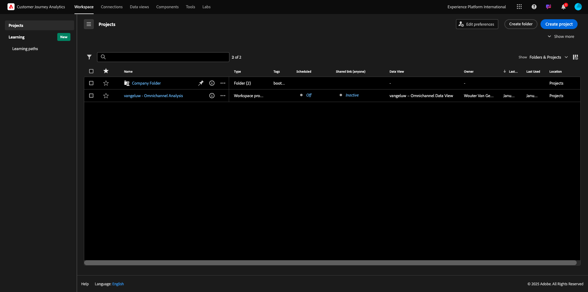
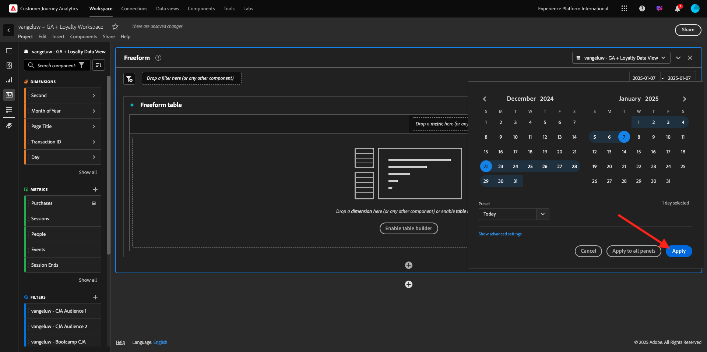
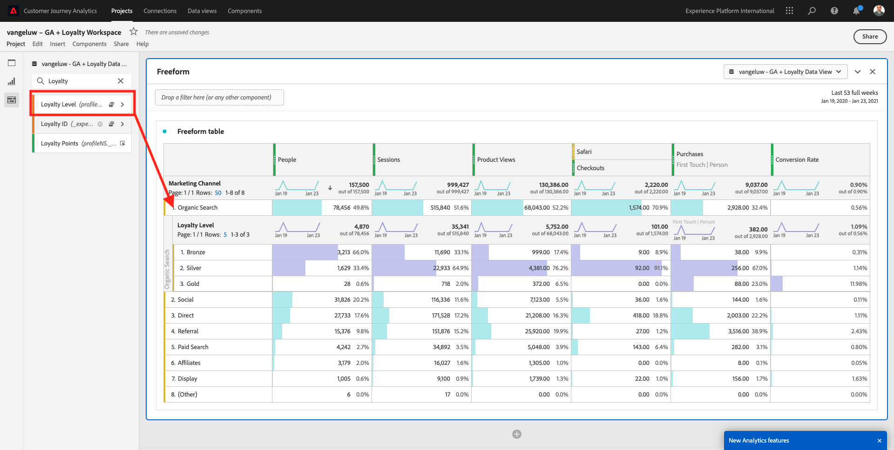
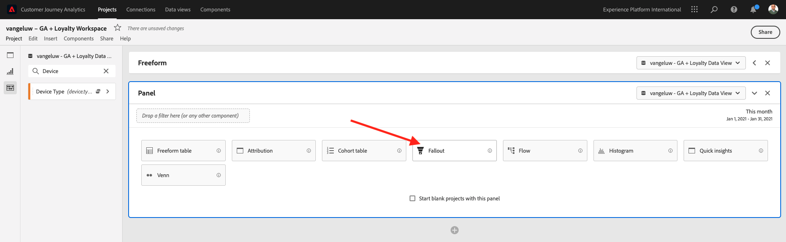
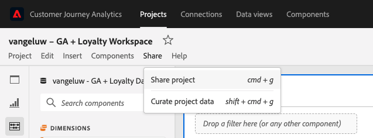

# 1.2.5 Customer Journey Analytics을 사용하여 Google Analytics 데이터 분석

## 목표

- BigQuery 데이터 세트를 Customer Journey Analytics(CJA)에 연결
- 충성도 데이터를 사용하여 Google Analytics을 연결하고 결합합니다.
- CJA UI 이해하기

## 1.2.5.1 연결 만들기

Customer Journey Analytics에 액세스하려면 [analytics.adobe.com](https://analytics.adobe.com)(으)로 이동하십시오.

Customer Journey Analytics 홈페이지에서 **연결**(으)로 이동합니다.

여기에서 CJA와 Platform 간에 이루어진 다양한 연결을 모두 볼 수 있습니다. 이러한 연결은 Adobe Analytics의 보고서 세트와 동일한 목표를 가집니다. 그러나 데이터 수집은 완전히 다릅니다. 모든 데이터는 Adobe Experience Platform 데이터 세트에서 가져옵니다.

**새 연결 만들기**&#x200B;를 클릭합니다.

그러면 **연결 만들기** UI가 표시됩니다.

이름은 `--aepUserLdap-- - GA + Loyalty Data Connection`을(를) 사용합니다.

사용할 올바른 샌드박스를 선택해야 합니다. 샌드박스 메뉴에서 샌드박스를 선택합니다. 샌드박스는 `--aepSandboxName--`이어야 합니다. 이 예제에서 사용할 샌드박스는 **기술 내부자**&#x200B;입니다.

**일일 평균 이벤트 수**&#x200B;를 **백만 개 미만**&#x200B;으로 설정하십시오.

이제 데이터 세트 메뉴에서 데이터 세트를 추가할 수 있습니다. **데이터 세트 추가**&#x200B;를 클릭합니다.

추가할 데이터 세트는 다음과 같습니다.
- `Demo System - Profile Dataset for CRM (Global v1.1)`
- `Demo System - Event Dataset for BigQuery (Global v1.1)`

두 데이터 세트를 모두 검색하고 해당 확인란을 선택한 다음 **다음**&#x200B;을 클릭합니다.

그러면 다음과 같은 결과가 표시됩니다.

데이터 집합 `Demo System - Event Dataset for BigQuery (Global v1.1)`의 경우 **개인 ID**&#x200B;을(를) **loyaltyId**(으)로 변경하고 **데이터 원본 유형**&#x200B;을(를) **웹 데이터**(으)로 설정하십시오. **새 데이터 모두 가져오기**&#x200B;와 **기존 데이터 모두 채우기**&#x200B;에 대해 두 옵션을 모두 사용하도록 설정하십시오.

데이터 집합 `Demo System - Event Dataset for BigQuery (Global v1.1)`의 경우 **개인 ID**&#x200B;이(가) **crmId**(으)로 설정되어 있는지 확인하고 **데이터 원본 유형**&#x200B;을(를) **웹 데이터**(으)로 설정하십시오. **새 데이터 모두 가져오기**&#x200B;와 **기존 데이터 모두 채우기**&#x200B;에 대해 두 옵션을 모두 사용하도록 설정하십시오. **데이터 세트 추가**&#x200B;를 클릭합니다.

그럼 넌 여기 있을 거야 **저장**&#x200B;을 클릭합니다.

**연결**&#x200B;을 만든 후 CJA에서 데이터를 사용하려면 몇 시간이 걸릴 수 있습니다.

그러면 사용 가능한 연결 목록에 연결이 표시됩니다.

## 1.2.5.2 데이터 보기 만들기

이제 연결이 완료되면 시각화에 영향을 주는 단계로 진행할 수 있습니다. Adobe Analytics과 CJA의 차이점은 CJA가 시각화 전에 데이터를 정리하고 준비하려면 데이터 보기가 필요하다는 것입니다.

데이터 보기는 컨텍스트 인식 방문 정의, 필터링 및 구성 요소 호출 방법을 정의하는 Adobe Analytics의 가상 보고서 세트 개념과 유사합니다.

연결당 최소 하나의 데이터 보기가 필요합니다. 그러나 일부 사용 사례의 경우 서로 다른 팀에 다양한 통찰력을 제공한다는 목표를 가지고 동일한 연결에 대해 여러 데이터 보기를 사용하는 것이 좋습니다.

회사가 데이터 중심이 되도록 하려면 각 팀에서 데이터를 보는 방식을 조정해야 합니다. 몇 가지 예:

- UX 디자인 팀에만 사용되는 UX 지표
- 디지털 분석 팀이 1개 언어만 사용할 수 있도록 KPI에 대해 동일한 이름을 사용하고 Google Analytics에 대해 동일한 지표를 Customer Journey Analytics에 대해 동일한 이름을 사용합니다.
- 예를 들어, 한 개의 시장만, 한 개의 브랜드 또는 모바일 장치에 대한 데이터만 표시하도록 필터링된 데이터 보기.

**연결** 화면에서 방금 만든 연결 앞의 확인란을 선택합니다. **데이터 보기 만들기**&#x200B;를 클릭합니다.

**데이터 보기 만들기** 워크플로우로 리디렉션됩니다.

이제 데이터 보기에 대한 기본 정의를 구성할 수 있습니다. 시간대, 세션 시간 초과 또는 데이터 보기 필터링(Adobe Analytics의 가상 보고서 세트와 유사한 세분화 부분)과 같은 항목.

이전 연습에서 만든 **연결**&#x200B;이 이미 선택되었습니다. 연결 이름이 `--aepUserLdap-- - GA + Loyalty Data Connection`입니다.

그런 다음 이 명명 규칙에 따라 데이터 보기에 이름을 지정하십시오. `--aepUserLdap-- - GA + Loyalty Data View`.

설명에 동일한 값을 입력하십시오. `--aepUserLdap-- - GA + Loyalty Data View`.

분석이나 시각화를 수행하기 전에 모든 필드, 차원 및 지표와 그 속성 설정이 있는 데이터 보기를 만들어야 합니다.

| 필드 | 명명 규칙 |
| ----------------- |-------------|  
| 이름 연결 | `--aepUserLdap-- - GA + Loyalty Data View` | vangeluw - GA + 충성도 데이터 보기 |
| 설명 | `--aepUserLdap-- - GA + Loyalty Data View` |
| 외부 ID | `--aepUserLdap--GA` |

**저장 후 계속**&#x200B;을 클릭합니다.

**저장**&#x200B;을 클릭합니다.

이제 데이터 보기에 구성 요소를 추가할 수 있습니다. 알 수 있듯이 일부 지표와 차원이 자동으로 추가됩니다.

데이터 보기에 아래 구성 요소를 추가합니다. 또한 필드 이름을 친숙한 이름으로 업데이트해야 합니다. 이렇게 하려면 지표 또는 차원을 선택하고 오른쪽 메뉴에서 **구성 요소 이름** 필드를 업데이트합니다.

| 구성 요소 유형 | 구성 요소 원래 이름 | 표시 이름 | 구성 요소 경로 |
| -----------------| -----------------|-----------------|-----------------|
| 지표 | commerce.checkouts.value | 체크아웃 | `commerce.checkouts.value` |
| 지표 | commerce.productListRemovals.value | 장바구니 제거 | `commerce.productListRemovals.value` |
| 지표 | commerce.productListAdds | 장바구니 추가 | `commerce.productListAdds` |
| 지표 | commerce.productViews.value | 제품 보기 | `commerce.productViews.value` |
| 지표 | commerce.purchases.value | 구매 | `commerce.purchases.value` |
| 지표 | web.webPageDetails.pageViews | 페이지 보기 횟수 | `web.webPageDetails.pageViews` |
| 지표 | 포인트 | 충성도 포인트 | `_experienceplatform.loyaltyDetails.points` |
| 차원 | 수준 | 충성도 수준 | `_experienceplatform.loyaltyDetails.level` |
| 차원 | channel.mediaType | 트래픽 Medium | `channel.mediaType` |
| 차원 | channel.typeAtSource | 트래픽 소스 | `channel.typeAtSource` |
| 차원 | 추적 코드 | 마케팅 채널 | `marketing.trackingCode` |
| 차원 | gaid | GOOGLE ANALYTICS ID | `_experienceplatform.identification.core.gaid` |
| 차원 | web.webPageDetails.name | 페이지 제목 | `web.webPageDetails.name` |
| 차원 | 공급업체 | 브라우저 | `environment.browserDetails.vendor` |
| 차원 | 유형 | 장치 유형 | `device.type` |
| 차원 | 고객 충성도 ID | 고객 충성도 ID | `_experienceplatform.identification.core.loyaltyId` |
| 차원 | commerce.order.payments.transactionID | 거래 ID | `commerce.order.payments.transactionID` |
| 차원 | eventType | 이벤트 유형 | `eventType` |
| 차원 | 타임스탬프 | 타임스탬프 | `timestamp` |
| 차원 | `_id` | 식별자 | `_id` |

그러면 다음과 같은 것이 제공됩니다.

다음으로 **속성 또는 지속성 설정**&#x200B;을 변경하여 이러한 구성 요소 중 일부에 대한 개인 및 세션 컨텍스트를 일부 변경해야 합니다.

아래 구성 요소에 대한 **속성 설정**&#x200B;을 변경하십시오.

| 구성 요소 |
| -----------------|
| 트래픽 소스 |
| 마케팅 채널 |
| 브라우저 |
| 트래픽 Medium |
| 장치 유형 |
| GOOGLE ANALYTICS ID |

이렇게 하려면 구성 요소를 선택하고 **사용자 지정 속성 모델 사용**&#x200B;을 클릭한 다음 **모델**&#x200B;을(를) **가장 최근**(으)로 설정하고 **만료**&#x200B;을(를) **개인 보고 기간**(으)로 설정합니다. 위에서 언급한 모든 구성 요소에 대해 이 작업을 반복합니다.

위에 언급된 모든 구성 요소에 대해 속성 설정을 변경한 후에는 이 보기가 있어야 합니다. **저장 후 계속**&#x200B;을 클릭합니다.

**설정** 화면에서 변경할 필요가 없습니다. **저장 후 마침**&#x200B;을 클릭합니다.

이제 Adobe Analytics Analysis Workspace 내에서 Google Analytics 데이터를 분석할 준비가 되었습니다. 다음 연습으로 넘어갑시다.

## 1.2.5.3 프로젝트 만들기

Customer Journey Analytics에서 **Workspace**(으)로 이동합니다. **프로젝트 만들기** 클릭

**빈 Workspace 프로젝트**&#x200B;를 선택하고 **만들기**&#x200B;를 클릭합니다.

이제 빈 프로젝트가 있습니다.

먼저 프로젝트를 저장하고 이름을 지정합니다. 다음 명령을 사용하여 저장할 수 있습니다.

| OS | 지름길 |
| ----------------- |-------------| 
| Windows | Control + S |
| Mac | Command+S |

이 팝업이 표시됩니다. 이 명명 규칙을 사용하십시오.

| 이름 | 설명 |
| ----------------- |-------------| 
| `--aepUserLdap-- – GA + Loyalty Workspace` | `--aepUserLdap-- – GA + Loyalty Workspace` |

그런 다음 **저장**&#x200B;을 클릭합니다.

그런 다음 화면 오른쪽 상단에서 올바른 데이터 보기를 선택해야 합니다. 명명 규칙 `--aepUserLdap-- - GA + Loyalty Data View`을(를) 사용하여 이전 연습에서 만든 데이터 보기입니다.

### 1.2.5.3.1 자유 형식 테이블

자유 형식 테이블은 Excel에서 피벗 테이블로 거의 작동합니다. 왼쪽 막대에서 항목을 선택하고 자유 형식으로 끌어서 놓으면 테이블 보고서가 표시됩니다.

자유 형식 테이블은 거의 제한이 없습니다. 거의 모든 작업을 수행할 수 있으며 Google Analytics과 비교할 때 매우 유용합니다(이 도구에는 몇 가지 분석 제한 사항이 있으므로). 이 때문에 Google Analytics 데이터를 다른 분석 도구에 로드할 수 있습니다.

SQL, BigQuery 및 시간을 사용하여 Google Analytics UI 또는 Google Data Studio에서 수행할 수 없는 간단한 질문에 답변해야 하는 두 가지 예를 살펴보겠습니다.

- 마케팅 채널별로 분할된 Safari 브라우저에서 체크아웃에 도착하는 사람은 몇 명입니까? 체크아웃 지표가 Safari 브라우저로 필터링되고 있는지 확인하십시오. 변수 Browser = Safari를 체크아웃 열 맨 위에 끌어서 놓았습니다.

- 분석가로서 소셜 마케팅 채널의 전환율이 낮은 것을 알 수 있습니다. 마지막 터치 속성을 기본값으로 사용 중이지만 첫 번째 터치는 어떻게 됩니까? 모든 지표를 마우스로 가리키면 지표 설정이 표시됩니다. 여기서 원하는 속성 모델을 선택할 수 있습니다. GA(Data Studio가 아님)에서 독립형 활동으로 기여도 분석을 수행할 수 있지만 동일한 테이블 내에 기여도 분석과 관련이 없는 다른 지표 또는 차원을 가질 수는 없습니다.

CJA의 Analysis Workspace을 통해 이 질문과 그 이상의 답변에 답변해 보겠습니다.

먼저 패널 오른쪽에서 올바른 날짜 범위(**오늘**)를 선택합니다. **적용**&#x200B;을 클릭합니다.

>[!NOTE]
>
>**데이터 연결** 및 **데이터 보기**&#x200B;을(를) 방금 만든 경우 두 시간 정도 기다려야 할 수 있습니다. CJA는 대량의 데이터 레코드가 있을 때 내역 데이터를 채우는 데 시간이 필요합니다.

마케팅 채널을 분석하기 위해 일부 차원과 지표를 드래그 앤 드롭해 보겠습니다. 먼저 **마케팅 채널** 차원을 사용하여 **자유 형식 테이블**&#x200B;의 캔버스로 끌어서 놓습니다. (지표 메뉴에 지표가 바로 표시되지 않는 경우 **모두 표시**&#x200B;를 클릭하십시오.)

그러면 다음과 같은 결과가 표시됩니다.

그런 다음 지표를 자유 형식 테이블에 추가해야 합니다. 다음 지표를 추가해야 합니다. **사람**, **세션**, **제품 보기**, **체크아웃**, **구매**, **전환율**(계산된 지표).

이렇게 하려면 먼저 계산된 지표 **전환율**&#x200B;을(를) 만들어야 합니다. 이렇게 하려면 지표 옆에 있는 **+** 아이콘을 클릭합니다.

계산된 지표의 이름으로 **전환율**&#x200B;을 사용하고 **외부 ID**&#x200B;에 **전환율**&#x200B;을 사용하십시오. 그런 다음 지표 **구매** 및 **세션**&#x200B;을 캔버스로 드래그합니다. **Format**&#x200B;을(를) **Percent**(으)로 설정하고 **소수점 이하 자리 수**&#x200B;을(를) **2**(으)로 설정합니다. 마지막으로 **저장**&#x200B;을 클릭합니다.

**저장**&#x200B;을 클릭합니다.

그런 다음 **자유 형식 테이블**&#x200B;에서 이러한 모든 지표를 사용하려면 해당 지표를 하나씩 **자유 형식 테이블**(으)로 끌어다 놓습니다. 아래 예를 참조하십시오.

다음과 같은 테이블이 만들어집니다.

위에서 언급했듯이 **자유 형식 테이블**&#x200B;은 심도 있는 분석을 수행하는 데 필요한 자유를 제공합니다. 예를 들어 다른 Dimension을 선택하여 테이블 내의 특정 지표를 분류할 수 있습니다.

예를 들어 차원으로 이동하여 **Browser** 변수를 검색합니다.

그러면 이 Dimension에 사용 가능한 값의 개요를 볼 수 있습니다.

Dimension **Safari**&#x200B;를 선택하고 지표 위로 끌어서 놓습니다(예: **체크아웃**). 그러면 다음과 같은 결과가 표시됩니다.

이 작업을 수행하는 동안 잠재적인 질문에 답변했습니다. 마케팅 채널별로 분할한 Safari를 사용하여 체크아웃 페이지에 도착하는 사람이 몇 명입니까?

이제 기여도 분석 질문에 답해 보겠습니다.

표에서 **구매** 지표를 찾습니다.

지표 위로 마우스를 가져가면 **설정** 아이콘이 나타납니다. 클릭합니다.

상황별 메뉴가 나타납니다. **기본이 아닌 속성 모델**&#x200B;에 대한 확인란을 선택하십시오.

표시되는 팝업에서 속성 모델 및 전환 확인 기간(SQL로 달성하려면 매우 복잡함)을 쉽게 변경할 수 있습니다.

**첫 번째 터치**&#x200B;를 속성 모델로 선택합니다.

전환 확인 기간의 **사용자**&#x200B;을(를) 선택하십시오.

이제 **적용**&#x200B;을 클릭하세요.

이제 해당 특정 지표에 대한 속성 모델이 첫 번째 터치임을 확인할 수 있습니다.

변수, 세그먼트, 차원 또는 날짜 범위 유형에 제한을 두지 않고 원하는 만큼 분류를 수행할 수 있습니다.

더욱 특별한 것은 Adobe Experience Platform의 데이터 세트에 연결하여 Google Analytics의 디지털 동작 데이터를 보강하는 기능입니다. 예: 오프라인, 콜 센터, 충성도 또는 CRM 데이터.

이러한 기능을 표시하기 위해 오프라인 데이터를 온라인 데이터와 결합하는 첫 번째 분류를 구성해 보겠습니다. **충성도 수준** 차원을 선택하여 **마케팅 채널**(예: **유기 검색**)로 끌어서 놓습니다.

다음으로, **Bronze**&#x200B;인 **충성도 수준**&#x200B;을(를) 사용하여 **Organic Search**&#x200B;을(를) 사용하여 사이트를 방문한 고객이 사용하는 **장치 유형**&#x200B;을(를) 분석해 보겠습니다. Dimension **장치 유형**&#x200B;을(를) 가져와서 **Bronze**(으)로 끌어서 놓습니다. 그러면 다음과 같은 결과가 표시됩니다.

첫 번째 분류에서 충성도 수준이 사용됨을 알 수 있습니다. 이 차원은 BigQuery 커넥터에 사용한 것과 다른 데이터 세트 및 스키마에서 가져옵니다. 개인 ID **loyaltyID**(데모 시스템 - BigQuery에 대한 이벤트 스키마(전역 v1.1))와 **loyaltyID**(데모 시스템 - 로열티(전역 v1.1)에 대한 프로필 스키마)가 서로 일치합니다. 따라서 Google Analytics의 경험 이벤트를 충성도 스키마의 프로필 데이터와 결합할 수 있습니다.

세그먼트 또는 특정 날짜 범위가 있는 행을 계속 분할하여(특정 TV 캠페인을 반영할 수 있음) Customer Journey Analytics에 질문을 하고 이동 중에 답변을 얻을 수 있습니다.

SQL과 타사 시각화 도구를 사용하여 동일한 최종 결과를 달성하는 것은 매우 어려운 일입니다. 특히 질문을 하고 즉석에서 답을 얻으려고 할 때 더 그렇습니다. Customer Journey Analytics에는 이러한 문제가 없으며 데이터 분석가가 데이터를 유연하고 실시간으로 쿼리할 수 있습니다.

## 1.2.5.3.2 단계 또는 폴아웃 분석

단계 는 고객 여정의 주요 단계를 이해하는 훌륭한 메커니즘입니다. 이러한 단계는 오프라인 상호 작용(예: 콜 센터)에서도 발생할 수 있으며, 동일한 단계에서 디지털 터치포인트와 결합할 수 있습니다.

Customer Journey Analytics을 사용하면 이러한 작업 및 훨씬 더 많은 작업을 수행할 수 있습니다. 모듈 13을 기억한다면 마우스 오른쪽 버튼으로 클릭하여 다음과 같은 작업을 수행할 수 있습니다.

- 폴아웃 단계 후 사용자가 어디로 이동하는지 분석
- 단계 임의의 지점에서 세그먼트 만들기
- 선 그래프 시각화의 모든 단계에서 트렌드를 확인합니다

다른 할 수 있는 작업을 살펴보겠습니다. 이번 달 내 고객 여정 단계는 이전 달과 비교하여 어떻습니까? 모바일과 데스크탑은 어떻습니까?

아래에 두 개의 패널을 만듭니다.

- 단계 분석 (1월)
- 단계 분석(2월)

디바이스 유형별로 구분된 서로 다른 기간(1월과 2월) 동안의 단계를 비교하고 있습니다.

Google Analytics UI 내에서는 이러한 유형의 분석을 수행할 수 없거나 매우 제한적입니다. 따라서 CJA는 Google Analytics에서 캡처한 데이터에 다시 많은 가치를 더합니다.

첫 번째 폴아웃 시각화를 만들려면. 새 패널로 시작하려면 현재 패널을 닫으십시오.

패널의 오른쪽을 보고 화살표를 클릭하여 닫습니다.

**+**&#x200B;을(를) 클릭하여 새 패널을 만듭니다.

이제 **폴아웃** 시각화를 선택하십시오.

분석가의 경우, 홈 > 내부 검색 > 제품 세부 정보 > 체크아웃 > 구매 등 주요 전자 상거래 단계에서 발생하는 일을 이해하려고 한다고 가정해 보십시오.

단계에 몇 가지 새로운 단계를 추가해 보겠습니다. 이렇게 하려면 **페이지 이름** 차원을 엽니다.

그러면 방문한 모든 사용 가능한 페이지가 표시됩니다.

**Home**&#x200B;을(를) 첫 번째 단계로 끌어다 놓습니다.

두 번째 단계로 **검색 결과 저장**&#x200B;을 사용합니다.

이제 전자 상거래 작업을 추가해야 합니다. 차원에서 Dimension **이벤트 유형** 차원을 검색합니다. 을 클릭하여 차원을 엽니다.

**Product_Detail_Views**&#x200B;을(를) 선택하고 다음 단계로 끌어서 놓습니다.

**Product_Checkouts**&#x200B;을(를) 선택하고 다음 단계로 끌어서 놓습니다.

폴아웃 시각화의 크기를 조정합니다.

이제 폴아웃 시각화가 준비되었습니다.

인사이트를 분석하고 문서화하려면 **텍스트** 시각화를 사용하는 것이 좋습니다. **텍스트** 시각화를 추가하려면 왼쪽 메뉴에서 **그래프** 아이콘을 클릭하여 사용 가능한 모든 시각화를 확인하십시오. 그런 다음 **텍스트** 시각화를 캔버스로 끌어서 놓습니다. 아래 이미지처럼 보이도록 크기를 조정하고 이동합니다.

다시 한 번 대시보드에 맞게 크기를 조정합니다.

폴아웃 시각화는 분류도 허용합니다. **장치 유형** 차원을 열고 일부 값을 시각화로 하나씩 끌어다 놓아 사용합니다.

그러면 보다 고급 시각화가 표시됩니다.

Customer Journey Analytics을 사용하면 이러한 작업 및 훨씬 더 많은 작업을 수행할 수 있습니다. 폴아웃의 아무 곳이나 마우스 오른쪽 버튼으로 클릭하면 다음 작업을 수행할 수 있습니다.

- 폴아웃 단계에서 사용자가 어디로 이동하는지 분석합니다
- 단계 임의의 지점에서 세그먼트 만들기
- 선 시각화의 모든 단계 트렌드 표시
- 모든 단계를 다양한 기간에 시각적으로 비교합니다.

예를 들어 폴아웃의 아무 단계에서나 마우스 오른쪽 버튼을 클릭하여 이러한 분석 옵션 중 일부를 표시합니다.

## 1.2.5.3.3 흐름 분석 및 시각화

Google Analytics을 사용하여 고급 흐름 분석을 수행하려면 SQL을 사용하여 데이터를 추출한 다음 시각화 부분에 대한 타사 솔루션을 사용해야 합니다. Customer Journey Analytics이 도와드릴 것입니다.

이 단계에서는 특정 랜딩 페이지 전에 주요 기여 채널이 무엇이냐는 질문에 답하도록 흐름 분석을 구성합니다.  분석가는 두 번의 드래그 앤 드롭과 한 번의 클릭으로 마케팅 채널의 두 번의 마지막 터치로 랜딩 페이지를 향하는 사용자의 흐름을 발견할 수 있습니다.

Customer Journey Analytics이 답변에 도움이 되는 기타 질문:

- 특정 랜딩 페이지 이전의 주요 채널 조합은 무엇입니까?
- 사용자가 Product_Checkout에 도착했을 때 세션을 종료하는 원인은 무엇입니까? 이전 단계는 무엇입니까?

이러한 질문에 대한 답변을 위해 빈 패널로 다시 시작하겠습니다. 현재 패널을 닫고 **+**&#x200B;을(를) 클릭합니다.

이제 **흐름** 시각화를 선택하십시오.

이제 다중 경로 마케팅 채널 흐름 분석을 설정해 보겠습니다. **마케팅 채널** 차원을 **시작 차원** 영역으로 끌어서 놓습니다.

이제 첫 번째 시작 경로를 볼 수 있습니다.

드릴다운할 첫 번째 경로를 누릅니다.

이제 다음 경로(마케팅 채널)를 볼 수 있습니다.

세 번째 드릴다운을 해보죠. 새 경로 **참조**&#x200B;에서 첫 번째 옵션을 클릭합니다.

이제 다음과 같은 시각화가 표시됩니다.

일을 복잡하게 만들자. 두 개의 마케팅 경로 후에 랜딩 페이지가 무엇이었는지 분석하려고 한다고 상상해 보십시오. 이렇게 하려면 보조 차원을 사용하여 마지막 경로를 변경할 수 있습니다. **페이지 이름** 차원을 찾아 다음과 같이 끌어서 놓습니다.

이제 다음이 표시됩니다.

다른 흐름 분석을 해보겠습니다. 이번에는 특정 종료 지점 이후에 발생한 사항을 분석합니다. 다른 Analytics 솔루션에서도 동일한 작업을 수행하려면 SQL/ETL과 타사 시각화 도구인 ETL을 사용해야 합니다.

패널에 새 **흐름 시각화**&#x200B;를 가져옵니다.

그러면 다음 항목이 제공됩니다.

Dimension **이벤트 유형**&#x200B;을(를) 찾아 **종료 차원** 영역으로 끌어서 놓습니다.

이제 고객을 종료로 유도한 **이벤트 유형** 경로를 확인할 수 있습니다.

체크아웃 작업을 종료하기 전에 발생한 사항을 조사하겠습니다. **Product_Checkouts** 경로를 클릭합니다.

통찰력이 없는 일부 데이터가 포함된 새 작업 경로가 표시됩니다.

더 자세히 분석해 보겠습니다! Dimension **페이지 이름**&#x200B;을(를) 검색하여 새로 생성된 경로로 끌어다 놓습니다.

이제 몇 분 내에 고급 흐름 분석이 완료되었습니다. 다른 경로를 클릭하여 종료에서 이전 단계로 연결되는 방법을 확인할 수 있습니다.

이제 단계를 분석하고 디지털 뿐 아니라 오프라인 터치 포인트 전반에서 고객 행동의 경로를 탐색할 수 있는 강력한 키트가 제공됩니다.

변경 사항을 저장하는 것을 잊지 마십시오!

## 1.2.5.4 프로젝트 공유

>[!IMPORTANT]
>
>아래 콘텐츠는 FYI를 위한 것입니다. **NOT**&#x200B;은(는) 프로젝트를 다른 사람과 공유할 필요가 없습니다.

FYI - 이 프로젝트를 동료와 공유하여 공동 작업하거나 비즈니스 질문을 함께 분석할 수 있습니다.

## 다음 단계

[요약 및 혜택](./summary.md){target="_blank"}(으)로 이동

BigQuery Google Analytics 커넥터를 사용하여 Adobe Experience Platform에서 [Source 데이터 수집 및 분석](./customer-journey-analytics-bigquery-gcp.md){target="_blank"}(으)로 돌아가기

[모든 모듈](./../../../../overview.md){target="_blank"}(으)로 돌아가기
