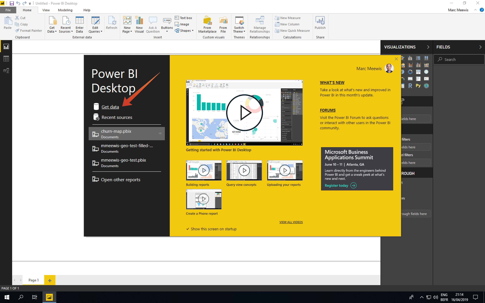

# 2.1.6 쿼리 서비스 및 Power BI

Microsoft Power BI Desktop을 엽니다.

**데이터 가져오기**&#x200B;를 클릭합니다.

**postgres**(1)을(를) 검색하고 목록에서 **Postgres**(2)을(를) 선택한 다음 **연결**(3)을(를) 선택합니다.

Adobe Experience Platform, **쿼리** 및 **자격 증명**(으)로 이동합니다.

Adobe Experience Platform의 **자격 증명** 페이지에서 **호스트**&#x200B;를 복사하여 **서버** 필드에 붙여 넣고, **데이터베이스**&#x200B;를 복사하여 PowerBI의 **데이터베이스** 필드에 붙여 넣은 다음 확인(2)을 클릭합니다.

>[!IMPORTANT]
>
>쿼리 서비스가 현재 5432의 기본 PostgreSQL 포트를 사용하지 않으므로 서버 값의 끝에 **:80** 포트를 포함해야 합니다.

다음 대화 상자에서 사용자 이름과 암호를 Adobe Experience Platform 쿼리의 **자격 증명**&#x200B;에 있는 사용자 이름과 암호로 채웁니다.

네비게이터 대화 상자에서 검색 필드(1)에 **LDAP**&#x200B;을 입력하여 CTAS 데이터 세트를 찾고 각 (2) 옆의 확인란을 선택합니다. 그런 다음 로드(3)를 클릭합니다.

**보고서** 탭(1)을 선택했는지 확인하십시오.

맵 (1)을 선택하고 보고 캔버스에 추가한 후 맵 (2)를 확대합니다.

다음으로 측정값 및 차원을 정의해야 합니다. 이렇게 하려면 **필드** 섹션에서 아래 표시된 대로 해당 자리 표시자(**시각화** 아래에 있음)로 필드를 끌어옵니다.

측정으로 **customerId**&#x200B;의 개수를 사용합니다. **필드** 섹션의 **crmid** 필드를 **크기** 자리 표시자로 드래그합니다.

마지막으로, **callTopic** 분석을 수행하려면 **callTopic** 필드를 **페이지 수준 필터** 자리 표시자로 드래그해 보겠습니다(**시각화** 섹션에서 스크롤해야 할 수 있음).

조사할 **callTopics** 선택/선택 취소:

이제 이 연습을 완료했습니다.

## 다음 단계

[2.1.8 쿼리 서비스 API로 이동](./ex8.md){target="_blank"}

[쿼리 서비스](./query-service.md){target="_blank"}(으)로 돌아가기

[모든 모듈](./../../../../overview.md){target="_blank"}(으)로 돌아가기
