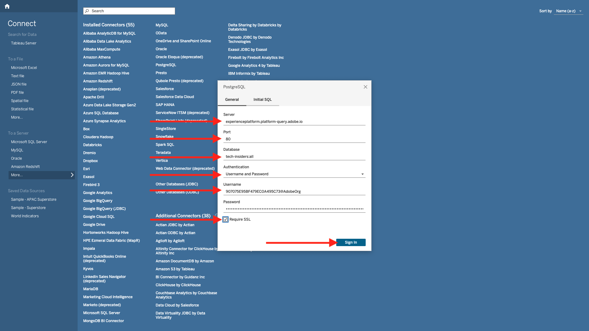
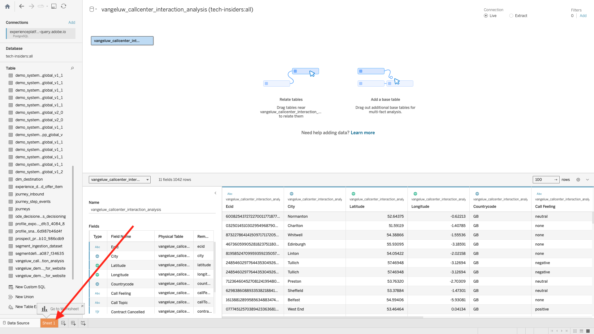

# 2.1.7 쿼리 서비스 및 타블로

타블로를 엽니다.

**서버에 연결**&#x200B;에서 **자세히**&#x200B;를 클릭한 다음 **PostgreSQL**&#x200B;을 클릭합니다.

아직 Tableau와 함께 PostgeSQL을 사용하지 않았다면, 다음과 같은 결과가 나타날 수 있습니다. **드라이버 다운로드**&#x200B;를 클릭합니다.

지침에 따라 PostgreSQL 드라이버를 다운로드하고 설치합니다.

드라이버 설치를 마치면 Tableau Desktop을 종료했다가 다시 시작합니다. 다시 시작한 후 **서버에 연결**(으)로 다시 이동하고 **자세히**&#x200B;를 클릭한 다음 **PostgreSQL**&#x200B;을 다시 클릭합니다.

그러면 이걸 보게 될 거야.

Adobe Experience Platform, **쿼리** 및 **자격 증명**(으)로 이동합니다.

Adobe Experience Platform의 **자격 증명** 페이지에서 **호스트**&#x200B;를 복사하여 **서버** 필드에 붙여 넣고, **데이터베이스**&#x200B;를 복사하여 Tableau의 **데이터베이스** 필드에 붙여 넣고, **포트**&#x200B;를 복사하여 Tableau의 **포트**&#x200B;필드에 붙여 넣고, **사용자 이름** 및 **암호**&#x200B;에 대해서도 동일하게 수행합니다. **로그인**&#x200B;을 클릭합니다.

사용 가능한 테이블 목록에서 이전 연습에서 만든 테이블(`--aepUserLdap--_callcenter_interaction_analysis`)을 찾습니다. 캔버스로 드래그합니다.

그러면 이걸 보게 될 거야. **지금 업데이트**&#x200B;를 클릭합니다.

그러면 Tableau에서 AEP의 데이터를 사용할 수 있게 됩니다. 데이터 작업을 시작하려면 **시트 1**&#x200B;을 클릭하세요.

지도에서 데이터를 시각화하려면 경도 및 위도를 차원으로 변환해야 합니다. **측정값**&#x200B;에서 **위도**&#x200B;를 마우스 오른쪽 단추로 클릭하고 메뉴에서 **Dimension으로 전환**&#x200B;을 선택합니다. **경도** 측정값에 대해서도 동일한 작업을 수행합니다.

**경도** 측정값을 **열**, **위도** 측정값을 **행**(으)로 드래그합니다. 자동으로 **벨기에**&#x200B;의 지도가 표시되며, 데이터 집합의 도시를 나타내는 작은 점이 표시됩니다.

**측정값 이름**&#x200B;을 선택하고 **시트에 추가**&#x200B;를 클릭합니다.

이제 다양한 크기의 점이 있는 지도가 제공됩니다. 크기는 해당 도시에 대한 콜센터 상호 작용 수를 나타냅니다. 점의 크기를 변경하려면 오른쪽 패널로 이동하여 **측정값**&#x200B;을 엽니다(드롭다운 아이콘 사용). 드롭다운 목록에서 **크기 편집**&#x200B;을 선택합니다. 다양한 크기로 놀아보세요.

**통화 주제**&#x200B;별 데이터를 더 표시하려면 **통화 주제** 차원을 **페이지**(으)로 끌어옵니다. 화면 오른쪽의 **통화 주제**&#x200B;를 사용하여 다른 **통화 주제**&#x200B;를 탐색합니다.

이제 이 연습을 완료했습니다.

## 다음 단계

[2.1.8 쿼리 서비스 API로 이동](./ex8.md){target="_blank"}

[쿼리 서비스](./query-service.md){target="_blank"}(으)로 돌아가기

[모든 모듈](./../../../../overview.md){target="_blank"}(으)로 돌아가기
