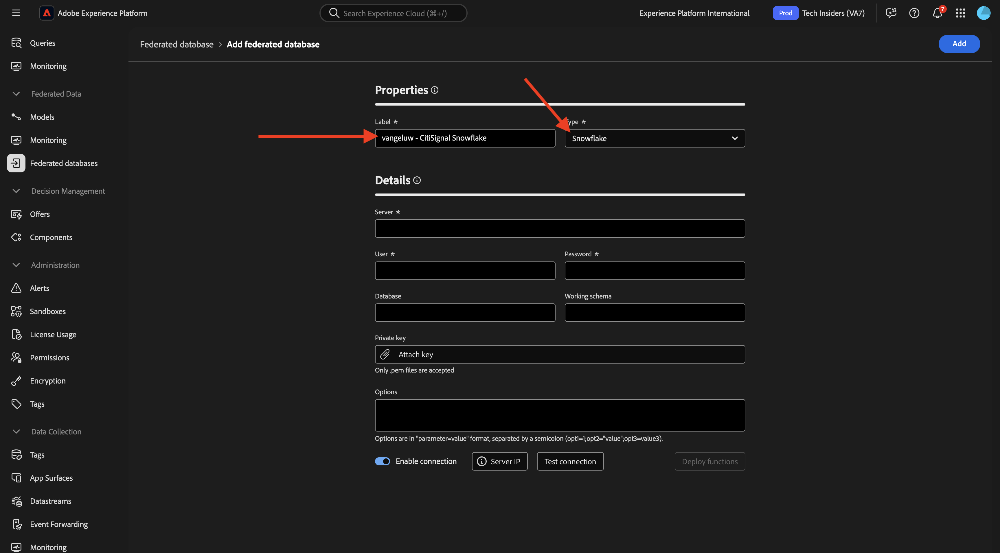
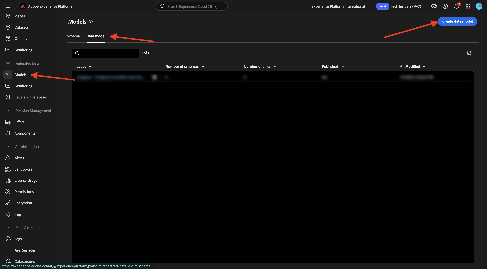
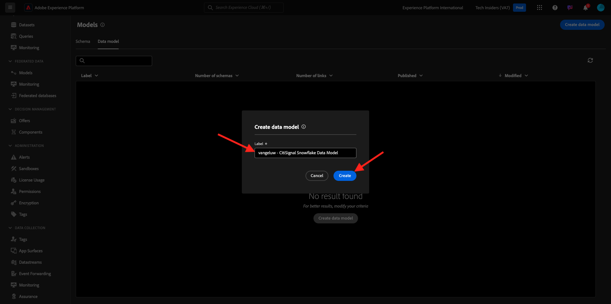

# 3.1.2 스키마, 데이터 모델 및 링크 만들기

이제 AEP에서 통합 데이터베이스를 구성할 수 있습니다.

URL [https://experience.adobe.com/platform](https://experience.adobe.com/platform)로 이동하여 Adobe Experience Platform에 로그인합니다.

로그인하면 Adobe Experience Platform 홈페이지에 접속하게 됩니다.

계속하려면 **샌드박스**&#x200B;를 선택해야 합니다. 선택할 샌드박스 이름이 ``--aepSandboxName--``입니다. 적절한 샌드박스를 선택하면 화면이 변경되고 이제 전용 샌드박스에 있습니다.

## 3.1.2.1 AEP에서 Federated 데이터베이스 설정

왼쪽 메뉴에서 **통합 데이터베이스**&#x200B;을(를) 클릭합니다. 그런 다음 **통합 데이터베이스 추가**&#x200B;를 클릭합니다.

**레이블**&#x200B;로서 `--aepUserLdap-- - CitiSignal Snowflake`을(를) 사용하고 형식에 대해 **Snowflake**&#x200B;을(를) 선택하십시오.

세부 정보에서 다음과 같이 표시되는 자격 증명을 작성해야 합니다.

**서버**:

Snowflake에서 **관리자 > 계정**(으)로 이동합니다. 계정 옆에 있는 3개의 **..**&#x200B;을 클릭하고 **URL 관리**&#x200B;를 클릭합니다.

그러면 이걸 보게 될 거야. **현재 URL**&#x200B;을(를) 복사하여 AEP의 **서버** 필드에 붙여넣으십시오.

**사용자**: 연습 1.3.1.1에서 이전에 만든 사용자 이름
**암호**: 연습 1.3.1.1에서 이전에 만든 암호
**데이터베이스**: **CITISIGNAL** 사용

마지막으로, 이걸 가지셔야 합니다. **연결 테스트**&#x200B;를 클릭합니다. 테스트가 성공하면 **함수 배포**&#x200B;를 클릭하여 Snowflake에 워크플로 엔진에 필요한 함수를 만듭니다.

연결을 성공적으로 테스트하고 기능을 배포하면 구성이 저장됩니다.

**통합 데이터베이스** 메뉴로 돌아가면 연결이 표시됩니다.

## 3.1.2.2 AEP에서 스키마 만들기

왼쪽 메뉴에서 **모델**&#x200B;을 클릭한 다음 **스키마**(으)로 이동합니다. **스키마 만들기**&#x200B;를 클릭합니다.

페더레이션 데이터베이스를 선택하고 **+ 테이블 추가**&#x200B;를 클릭합니다.

그러면 이걸 보게 될 거야. 이전에 Snowflake에서 만든 5개의 테이블을 선택합니다.

- `CK_HOUSEHOLDS`
- `CK_MOBILE_DATA_USAGE`
- `CK_MONTHLY_DATA_USAGE`
- `CK_PERSONS`
- `CK_USERS`

**추가를 클릭합니다**.

그러면 AEP에서 각 테이블의 정보를 로드하여 UI에 표시합니다.

각 테이블에 대해 다음 작업을 수행할 수 있습니다.

- 스키마 레이블 변경
- 설명 추가
- 모든 필드의 이름을 바꾸고 가시성을 설정합니다.
- 스키마에 대한 기본 키 선택

이 연습에서는 변경할 필요가 없습니다.

**만들기**&#x200B;를 클릭합니다.

그러면 이걸 보게 될 거야. 스키마를 클릭하고 정보를 검토할 수 있습니다. 예를들어 **CK_PERSONS**&#x200B;을(를) 클릭합니다.

그러면 구성을 편집할 수 있는 기능과 함께 표시됩니다. Snowflake 데이터베이스에 있는 데이터 샘플을 보려면 **데이터**&#x200B;를 클릭하십시오.

그러면 데이터 샘플이 표시됩니다.

## 3.1.2.3 AEP에서 모델 만들기

왼쪽 메뉴에서 **모델**(으)로 이동한 다음 **데이터 모델**(으)로 이동합니다. **데이터 모델 만들기**&#x200B;를 클릭합니다.

레이블은 `--aepUserLdap-- - CitiSignal Snowflake Data Model`을(를) 사용합니다. **만들기**&#x200B;를 클릭합니다.

**스키마 추가**&#x200B;를 클릭합니다.

스키마를 선택하고 **추가**&#x200B;를 클릭합니다.

그러면 이걸 보게 될 거야. **저장**&#x200B;을 클릭합니다.

이제 스키마 간의 링크 정의를 시작할 수 있습니다. 링크 정의를 시작하려면 **링크 만들기**&#x200B;를 클릭하세요.

먼저 테이블 `CK_USERS`과(와) `CK_PERSONS` 사이의 연결을 정의하겠습니다.

**추가를 클릭합니다**.

그럼 다시 여기로 오십시오. 다른 링크를 만들려면 **링크 만들기**&#x200B;를 클릭하십시오.

이제 테이블 `CK_HOUSEHOLDS`과(와) `CK_PERSONS` 사이의 연결을 정의하겠습니다.

그럼 다시 여기로 오십시오. 다른 링크를 만들려면 **링크 만들기**&#x200B;를 클릭하십시오.

이제 테이블 `CK_MONTHLY_DATA_USAGE`과(와) `CK_USERS` 사이의 연결을 정의하겠습니다.

그럼 다시 여기로 오십시오. 다른 링크를 만들려면 **링크 만들기**&#x200B;를 클릭하십시오.

이제 테이블 `CK_USERS`과(와) `CK_HOUSEHOLDS` 사이의 연결을 정의하겠습니다.

그럼 다시 여기로 오십시오. **저장**을 클릭합니다.

이제 AEP에서의 설정이 완료되었습니다. 이제 연합 대상 구성에서 연합 데이터를 사용할 수 있습니다.

다음 단계: [3.1.3 통합 컴포지션 만들기](./ex3.md)

[모듈 3.1로 돌아가기](./fac.md)

[모든 모듈로 돌아가기](../../../overview.md)
