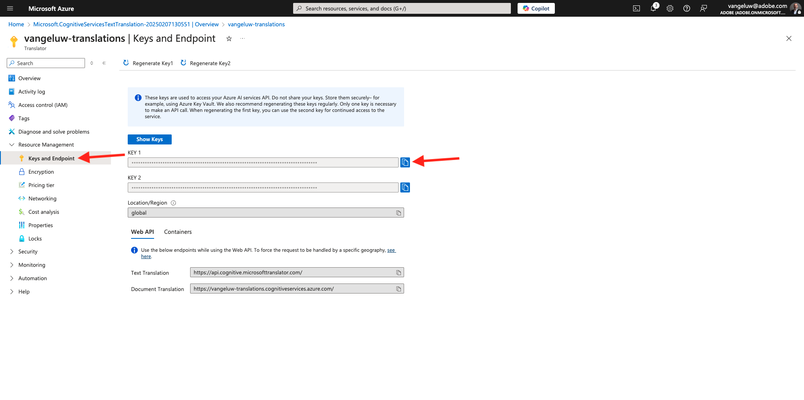

# 3.2.1 번역 제공자

## 3.2.1.1 Microsoft Azure Translator 구성

[https://portal.azure.com/#home](https://portal.azure.com/#home)(으)로 이동합니다.

검색 창에서 `translators`을(를) 입력합니다. 그런 다음 **+ 만들기**&#x200B;를 클릭합니다.

**번역기 만들기**&#x200B;를 선택하십시오.

**구독 ID** 및 **리소스 그룹**을 선택하세요.
**지역**&#x200B;을(를) **전역**(으)로 설정합니다.
**가격 책정 계층**&#x200B;을(를) **무료 F0**(으)로 설정합니다.

**검토 + 만들기**&#x200B;를 선택합니다.

**만들기**&#x200B;를 선택합니다.

**리소스로 이동**&#x200B;을 선택합니다.

왼쪽 메뉴에서 **리소스 관리** > **키 및 끝점**&#x200B;으로 이동합니다. 키를 복사하려면 를 클릭합니다.

## 3.2.1.2 로케일 사전

[https://experience.adobe.com/](https://experience.adobe.com/)(으)로 이동합니다. **Journey Optimizer**&#x200B;을(를) 클릭합니다.

왼쪽 메뉴에서 **번역**(으)로 이동한 다음 **로케일 사전**(으)로 이동합니다. 이 메시지가 표시되면 **기본 로케일 추가**&#x200B;를 클릭하세요.

그럼 이걸 보셔야죠

## 3.2.1.3 AJO에서 번역 제공자 구성

[https://experience.adobe.com/](https://experience.adobe.com/)(으)로 이동합니다. **Journey Optimizer**&#x200B;을(를) 클릭합니다.

왼쪽 메뉴에서 **번역**(으)로 이동한 다음 **공급자**(으)로 이동합니다. **공급자 추가**&#x200B;를 클릭합니다.

**공급자**&#x200B;에서 **Microsoft Translator**&#x200B;를 선택하세요. 번역 공급업체의 사용을 활성화하려면 확인란을 선택하십시오. Microsoft Azure 번역기에서 복사한 키를 붙여넣습니다. 그런 다음 **자격 증명 유효성 검사**&#x200B;를 클릭합니다.

그러면 자격 증명의 유효성을 성공적으로 검사해야 합니다. 있는 경우 아래로 스크롤하여 번역할 언어를 선택합니다.

`[en-US] English`, `[es] Spanish`, `[fr] French`, `[nl] Dutch`을(를) 선택하십시오.

위로 스크롤하여 **저장**&#x200B;을 클릭합니다.

**번역 공급자**&#x200B;를 사용할 준비가 되었습니다.

## 3.2.1.4 번역 프로젝트 구성

[https://experience.adobe.com/](https://experience.adobe.com/)(으)로 이동합니다. **Journey Optimizer**&#x200B;을(를) 클릭합니다.

왼쪽 메뉴에서 **번역**(으)로 이동한 다음 **로케일 사전**(으)로 이동합니다. 이 메시지가 표시되면 **프로젝트 만들기**&#x200B;를 클릭하세요.

이름 `--aepUserLdap-- - Translations`을(를) 입력하고 **Source 로케일**&#x200B;을(를) `[en-US] English - United States`(으)로 설정하고 확인란을 선택하여 **승인된 번역 자동 게시**&#x200B;를 사용하도록 설정합니다. **+ 로케일 추가**&#x200B;를 클릭합니다.

`fr`을(를) 검색하고 `[fr] French`에 대한 확인란을 활성화한 다음 **Microsoft Translator**&#x200B;에 대한 확인란을 활성화하십시오. **+ 로케일 추가**&#x200B;를 클릭합니다.

`es`을(를) 검색하고 `[es] Spanish`에 대한 확인란을 활성화한 다음 **Microsoft Translator**&#x200B;에 대한 확인란을 활성화하십시오. **+ 로케일 추가**&#x200B;를 클릭합니다.

`nl`을(를) 검색하고 `[nl] Spanish`에 대한 확인란을 활성화한 다음 **Microsoft Translator**&#x200B;에 대한 확인란을 활성화하십시오. **+ 로케일 추가**&#x200B;를 클릭합니다.

**저장**&#x200B;을 클릭합니다.

**번역** 프로젝트를 사용할 준비가 되었습니다.

이 연습을 완료했습니다.

## 다음 단계

[3.2.2 캠페인으로 이동](./ex2.md)

[모듈 3.2](./ajotranslationsvcs.md){target="_blank"}(으)로 돌아가기

[모든 모듈](./../../../overview.md){target="_blank"}(으)로 돌아가기