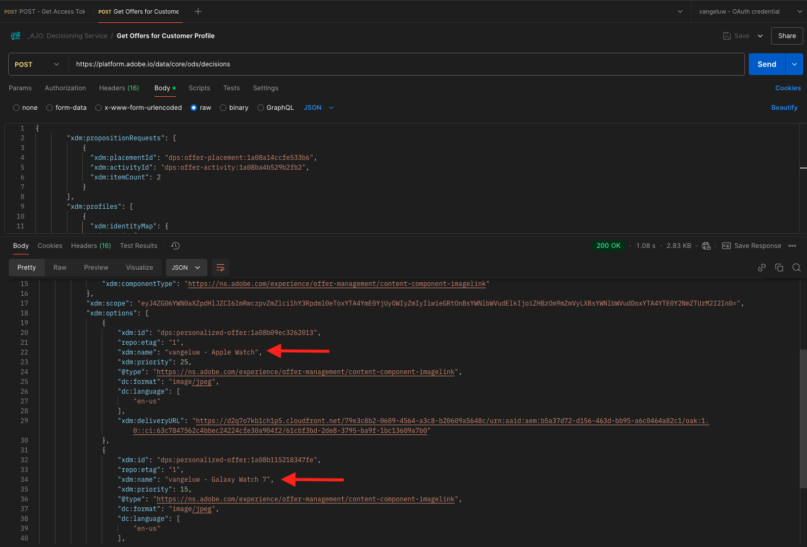

# 3.3.6 API를 사용하여 의사 결정 테스트

## 3.3.6.1 Postman을 사용하여 Offer decisioning API 작업

데스크톱에 [Offer decisioning에 대한 이 Postman 컬렉션](./../../../assets/postman/postman_offer-decisioning.zip)을 다운로드하고 압축을 풉니다. 그러면 다음 항목이 제공됩니다.

이제 바탕 화면에 이 파일이 있습니다.

- `_AJO- Decisioning Service.postman_collection.json`

이 연습에서는 Postman을 다시 사용해야 합니다.

Postman을 열고 `_AJO- Decisioning Service.postman_collection.json` 파일을 가져옵니다. 그런 다음 Postman에서 이 컬렉션을 사용할 수 있습니다.

이제 Postman에서 API를 통해 Adobe Experience Platform과 상호 작용하기 시작하는 데 필요한 모든 것을 갖추고 있습니다.

아래 API를 사용하려면 먼저 연습 2.1.3에서 구성한 컬렉션 **Adobe IO - OAuth**&#x200B;을(를) 사용하여 다시 인증해야 합니다.

### 3.3.6.2 고객 프로필에 대한 오퍼 가져오기

**POST - 고객 프로필에 대한 오퍼 가져오기** 요청을 열려면 클릭하세요. 가장 먼저 업데이트할 항목은 **x-sandbox-name**&#x200B;의 **Header** 변수입니다. `--aepSandboxName--`(으)로 설정해야 합니다.

이 요청의 경우 업데이트해야 하는 여러 필드가 있습니다. **본문**(으)로 이동합니다.

- **xdm:placementId**
- **xdm:activityId**
- **xdm:id**
- **xdm:itemCount**(선택 값으로 변경)

필드 **xdm:activityId**&#x200B;을(를) 입력해야 합니다. 아래 표시된 대로 Adobe Experience Platform UI에서 검색할 수 있습니다.

필드 **[!UICONTROL xdm:placementId]**&#x200B;을(를) 입력해야 합니다. 아래 표시된 대로 Adobe Experience Platform UI에서 검색할 수 있습니다. 아래 예제에서는 배치 **[!UICONTROL 웹 - 이미지]**&#x200B;에 대한 placementId를 볼 수 있습니다.

필드 **xdm:id**&#x200B;에 오퍼를 요청할 고객 프로필의 이메일 주소를 입력합니다. 모든 값이 원하는 대로 설정되면 **[!UICONTROL 보내기]**&#x200B;를 클릭합니다.

마지막으로, 어떤 종류의 개인화된 오퍼와 이 고객에게 표시해야 하는 자산에 대한 결과를 볼 수 있습니다. 이 예에서는 2개의 항목이 요청되었으며, 보시다시피 2개의 개인화된 오퍼가 반환되었습니다. Apple Watch에 대한 1가지 오퍼와 Galaxy Watch 7에 대한 또 다른 오퍼입니다.

이제 이 연습을 완료했습니다.

다음 단계: [요약 및 이점](./summary.md)

[모듈 3.3으로 돌아가기](./offer-decisioning.md)

[모든 모듈로 돌아가기](./../../../overview.md)
