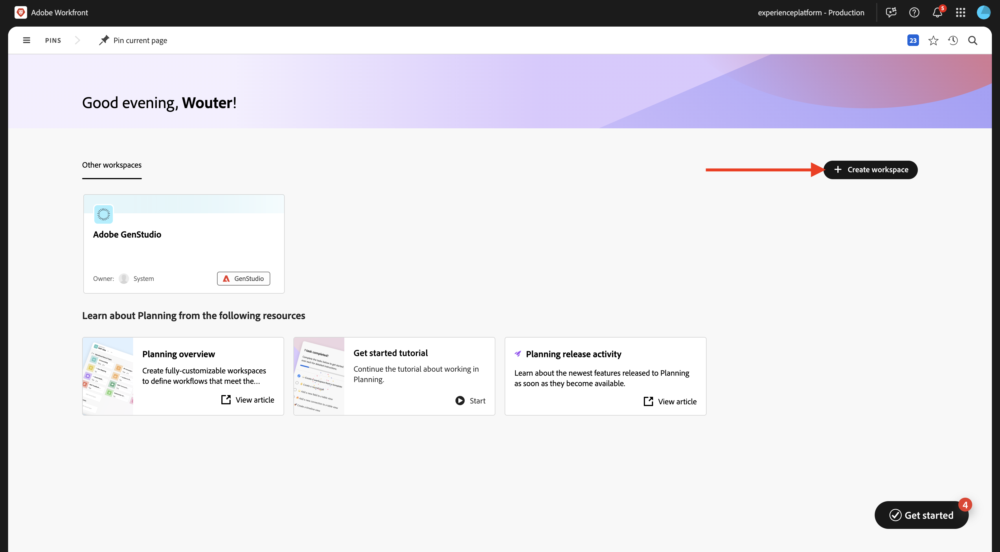
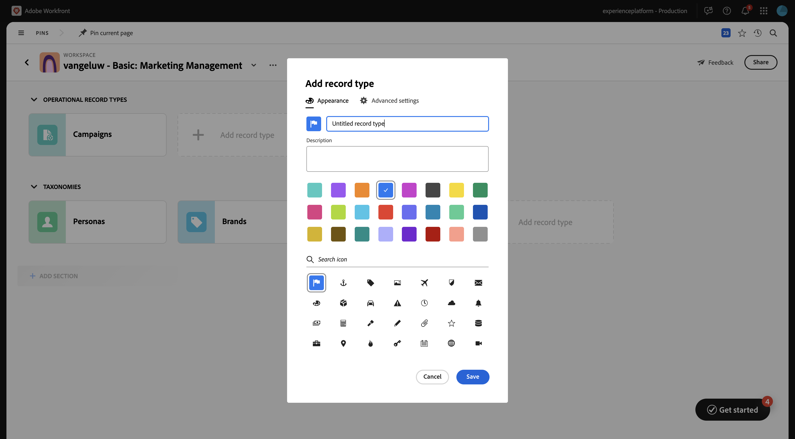
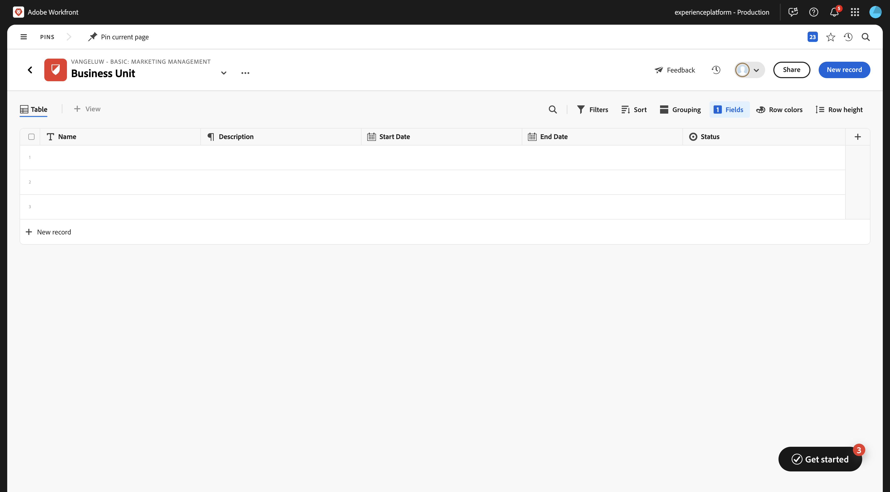
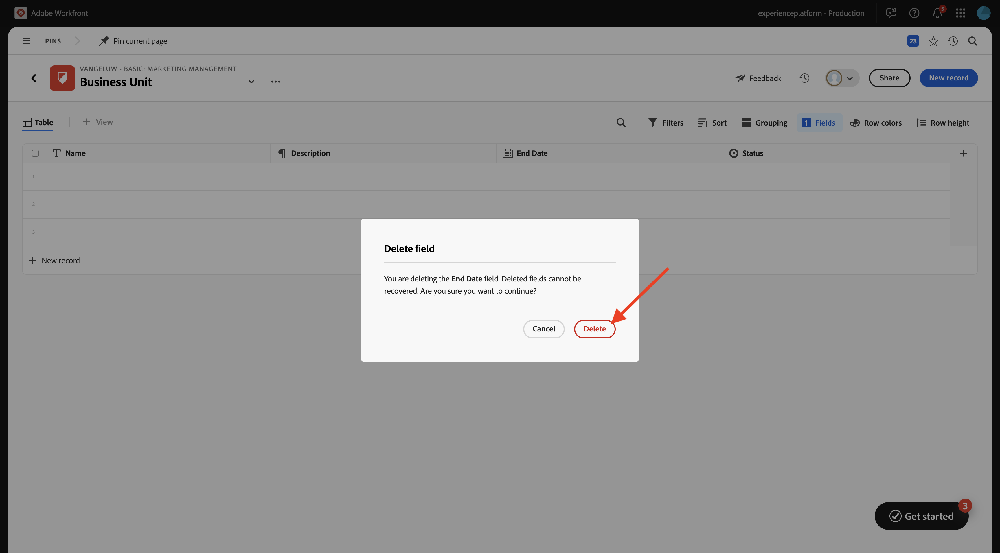
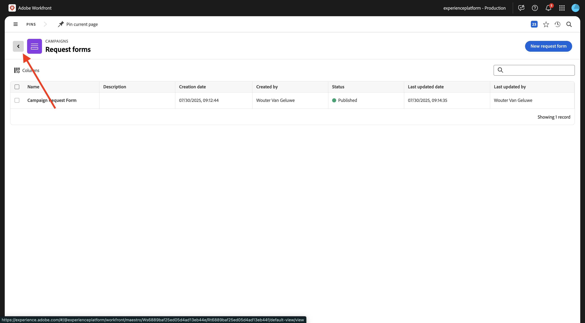
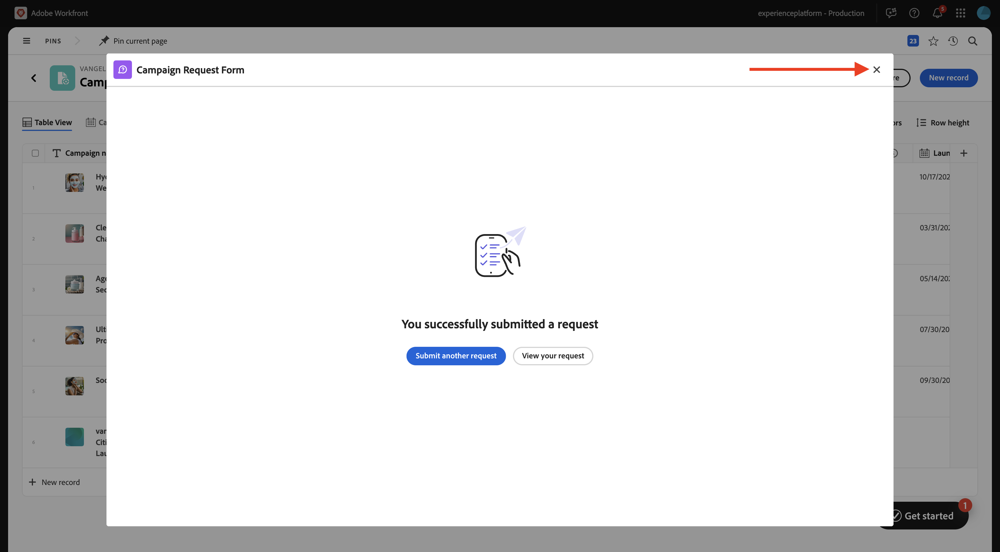
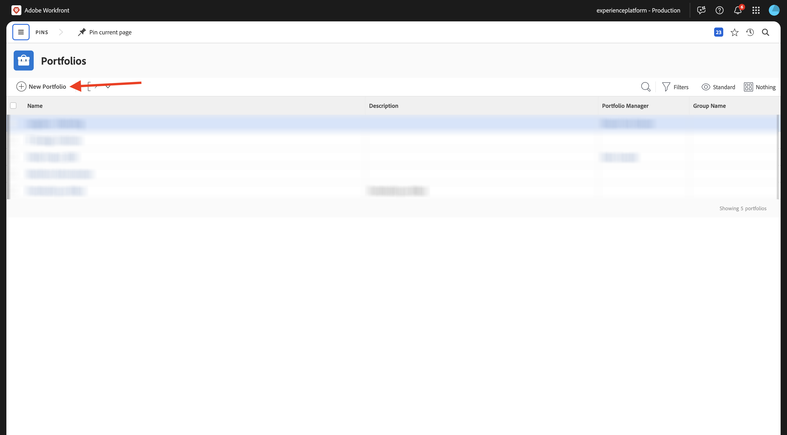
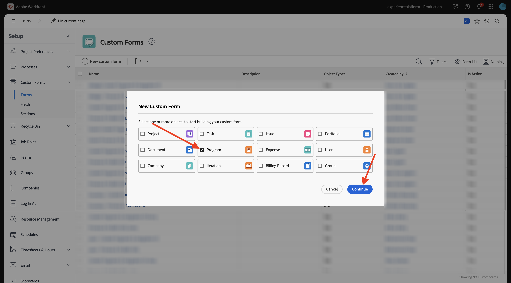

# 1.1.1 Workfront Planning 시작하기

## 1.1.1.1 Workfront 계획 용어

다음은 주요 Workfront Planning 개체 및 개념입니다.

| 용어 | 설명 |
| --- | ---|
| **Workspace** | 특정 조직의 운영 라이프사이클을 정의하는 레코드 유형의 컬렉션입니다. 작업 공간은 조직 단위의 작업 프레임입니다. |
| **레코드 종류** | Workfront Planning의 객체 유형 이름입니다. 레코드 종류가 작업 공간을 채웁니다. 객체 유형이 사전 정의된 Workfront Workflow와 달리 Workfront Planning에서는 고유한 객체 유형을 만들 수 있습니다. |
| **레코드** | 레코드 유형의 인스턴스입니다. |
| **Workspace 템플릿** | 미리 정의된 템플릿을 사용하여 작업 공간을 만들 수 있습니다. 템플릿에 있는 미리 정의된 레코드 종류 및 필드를 사용하거나 사용자 고유의 레코드 종류를 추가할 수 있습니다. |
| **필드** | 필드는 레코드 유형에 추가할 수 있는 속성입니다. 필드에는 레코드 유형에 대한 정보가 포함됩니다. |

>[!NOTE]
>
>만들 수 있는 Workfront Planning 개체 수에 대한 제한이 있습니다. 자세한 내용은 Adobe Workfront Planning 개체 제한 사항 개요를 참조하십시오.

이제 실습으로 이동하여 이러한 개체 중 일부를 직접 만들기 시작합니다.

## 1.1.1.2 Workspace, 레코드 유형, 필드

[https://experience.adobe.com/](https://experience.adobe.com/){target="_blank"}(으)로 이동합니다. **Workfront**&#x200B;을(를) 열려면 클릭하세요.


Workfront에서 클릭하여 메뉴를 연 다음 **계획**&#x200B;을 선택합니다.


그럼 이걸 보셔야죠 **Workspace 만들기**&#x200B;를 클릭합니다.



**기본 마케팅 관리** 템플릿에 대해 **템플릿 사용**&#x200B;을 클릭합니다.


이제 새 작업 영역이 만들어집니다. 계속하기 전에 작업 공간의 이름을 변경해야 합니다. 세 점 **..**&#x200B;을(를) 클릭한 다음 **편집**&#x200B;을(를) 선택합니다.


이름을 `--aepUserLdap-- - Basic: Marketing Management`(으)로 변경합니다. **저장**&#x200B;을 클릭합니다.


그럼 이걸 드셔보세요


## 1.1.1.3 분류: 레코드 종류 및 필드

**분류**&#x200B;에서 **+ 레코드 종류 추가**&#x200B;를 클릭한 다음 **수동으로 추가**&#x200B;를 선택하십시오.


그러면 **레코드 종류 추가** 팝업이 표시됩니다.



**모양** 탭에서 다음 정보를 업데이트합니다.

- **제목 없는 레코드 형식**&#x200B;을(를) `Business Unit`(으)로 바꾸십시오.
- 설명: `Defines which BU is leading campaign planning.`.
- 선택한 아이콘의 색상과 모양을 선택합니다

**저장**&#x200B;을 클릭합니다.


새로 만든 **사업부** 레코드 종류를 열려면 클릭하세요.


새로 만든 레코드 유형에 아직 정의된 필드가 없으므로 이제 빈 테이블 보기가 표시됩니다.



필드 **시작 날짜**&#x200B;에서 드롭다운 단추를 클릭한 다음 **삭제**&#x200B;를 선택합니다.


**삭제**&#x200B;를 선택합니다.


필드 **종료 날짜**&#x200B;에서 드롭다운 단추를 클릭한 다음 **삭제**&#x200B;를 선택합니다.


**삭제**&#x200B;를 선택합니다.



**+** 아이콘을 클릭하여 새 필드를 추가합니다. 사용 가능한 필드 형식 목록에서 아래로 스크롤하고 **사람**&#x200B;을(를) 선택합니다.


필드의 **Name**&#x200B;을(를) `Business Unit Lead`(으)로 설정하고 필드의 설명을 `Business Unit Lead responsible for budget and resources (VP, Head).`(으)로 설정합니다.

**저장**&#x200B;을 클릭합니다.


이제 새 레코드 유형을 만들었고 필드를 삭제하고 만들었습니다. 왼쪽 상단 모서리에 있는 화살표를 클릭하여 Workspace 개요 화면으로 돌아갑니다.


그럼 이걸 보셔야죠


## 1.1.1.4 작업 레코드 종류: 필드

**캠페인**&#x200B;을 열려면 클릭하세요.


새 필드를 만들려면 **+** 아이콘을 클릭하십시오. **새 연결**&#x200B;을 선택한 다음 **가상 사용자**&#x200B;을 선택합니다.


기본 설정을 그대로 둡니다. **만들기**&#x200B;를 클릭합니다.


**건너뛰기**&#x200B;를 선택합니다.


그러면 새 필드가 표 보기에 표시됩니다.


## 1.1.1.5 요청 양식 만들기

캠페인 개요 화면에서 세 점 **..**&#x200B;을(를) 클릭한 다음 **요청 양식 만들기**&#x200B;를 선택합니다.


이름을 `Campaign Request Form`(으)로 변경합니다. **저장**&#x200B;을 클릭합니다.


지금은 양식을 변경할 필요가 없습니다. 변경하지 않고 사용할 수 있습니다. 먼저 **저장**&#x200B;을 클릭한 다음 **게시**&#x200B;을 클릭합니다.


왼쪽 상단 모서리의 화살표를 클릭하여 Forms 요청 개요 화면으로 돌아갑니다.


왼쪽 상단 모서리의 화살표를 클릭하여 캠페인 개요 화면으로 돌아갑니다.



## 1.1.1.6 요청 양식을 사용하여 새 레코드 제출

캠페인 개요 화면에서 **+ 새 레코드**&#x200B;을(를) 클릭합니다.


**요청 제출**&#x200B;을 선택하고 **계속**&#x200B;을 클릭합니다.


`vangeluw - New Campaign Creation Request`

`vangeluw - CitiSignal Fiber Launch`

```
The CitiSignal Fiber Launch campaign introduces CitiSignal’s flagship fiber internet service—CitiSignal Fiber Max—to key residential markets. This campaign is designed to build awareness, drive sign-ups, and establish CitiSignal as the go-to provider for ultra-fast, reliable, and future-ready internet. The campaign will highlight the product’s benefits for remote professionals, online gamers, and smart home families, using persona-driven messaging across digital and physical channels.
```

**요청 제출**&#x200B;을 클릭합니다.


팝업을 닫으려면 **X**&#x200B;을(를) 클릭합니다.



그러면 개요에 새로 만든 캠페인이 표시됩니다.


## 1.1.1.7 자동화 만들기

다음 단계에서는 Workfront Planning에서 만든 캠페인에서 정보를 가져오고 Workfront에서 해당 정보를 사용하여 프로그램을 만드는 자동화를 만듭니다. 자동화를 만들려면 먼저 Workfront에서 포트폴리오와 사용자 정의 양식의 두 가지 사항을 구성해야 합니다.

포트폴리오를 만들려면 메뉴를 열고 **포트폴리오**&#x200B;를 클릭합니다.


**+ 새 Portfolio**&#x200B;을(를) 클릭합니다.



포트폴리오의 이름을 `--aepUserLdap-- - Marketing`(으)로 설정합니다.


그런 다음 메뉴를 열고 **설정**&#x200B;을 클릭하여 사용자 지정 양식을 만듭니다.


왼쪽 메뉴에서 **사용자 지정 Forms**, **Forms**(으)로 이동한 다음 **+ 새 사용자 지정 양식**&#x200B;을 클릭합니다.


**프로그램**&#x200B;을 선택하고 **계속**&#x200B;을 클릭합니다.



양식 이름을 `--aepUserLdap-- Program Information`(으)로 변경합니다.


그런 다음 **필드 라이브러리**(으)로 이동하여 `budget`을(를) 검색합니다. 기존 필드 **예산**&#x200B;을(를) 양식으로 끌어서 놓습니다.

**적용**&#x200B;을 클릭합니다.


이제 사용자 정의 양식 구성이 저장되었습니다.


## 1.1.1.8 자동화 만들기

이제 포트폴리오와 사용자 정의 양식을 만들어 자동화를 만들 수 있습니다.

클릭하여 메뉴를 연 다음 **계획**&#x200B;을 선택합니다.


이전에 만든 작업 영역(`--aepUserLdap-- - Basic: Marketing Management`)을 열려면 클릭하세요.


**캠페인**&#x200B;을 열려면 클릭하세요.


캠페인 개요 화면에서 세 점 **..**&#x200B;을(를) 클릭한 다음 **자동화 관리**&#x200B;를 선택합니다.


**새 자동화**&#x200B;를 클릭합니다.


자동화의 이름을 `Campaign to Program`(으)로 설정합니다.

설명을 `This automation will convert a Planning Campaign record to a Workfront Program.`(으)로 설정

**저장**&#x200B;을 클릭합니다.


**Action**&#x200B;을(를) **프로그램 만들기**(으)로 설정합니다. **+ 연결된 필드 추가**&#x200B;를 클릭합니다.


**프로그램 포트폴리오**: `--aepUserLdap-- - Marketing`을(를) 선택하십시오.

이 **사용자 정의 양식**: `--aepUserLdap-- Program information`을(를) 선택하십시오.

**저장**&#x200B;을 클릭합니다.


그럼 이걸 보셔야죠 화살표를 클릭하여 캠페인 개요 화면으로 돌아갑니다.


이전에 만든 캠페인 앞의 확인란을 선택합니다. 그런 다음 **Campaign to Program** 자동화를 클릭합니다.


몇 초 후에 자동화가 성공적으로 완료되었다는 확인이 표시됩니다. 즉, Workfront Planning의 Campaign 객체를 기반으로 Workfront에 프로그램이 생성되었습니다.


Workfront에서 프로그램을 확인하려면 메뉴를 열고 **포트폴리오**&#x200B;를 클릭합니다.


`--aepUserLdap-- - Marketing`(으)로 지정해야 하는 포트폴리오를 엽니다.


**프로그램**(으)로 이동한 다음 구성한 자동화에 의해 방금 만든 프로그램을 볼 수 있습니다.


다음 단계: [1.2.2 TBD](./ex1.md){target="_blank"}

[Workfront 계획 소개](./wfplanning.md){target="_blank"}(으)로 돌아가기

[모든 모듈로 돌아가기](./../../../overview.md){target="_blank"}
