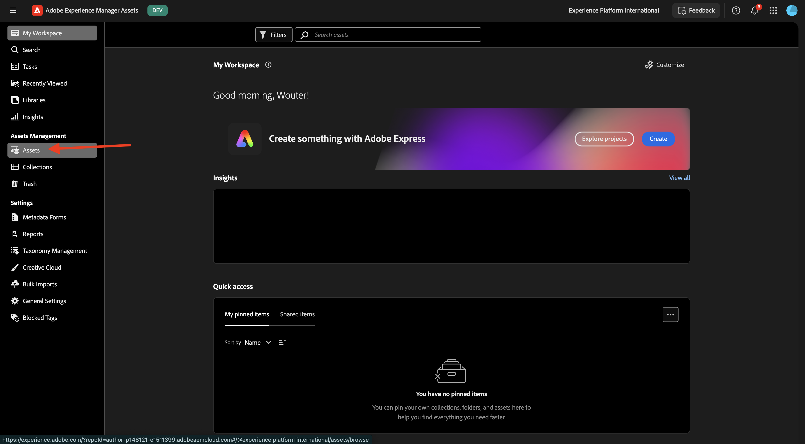
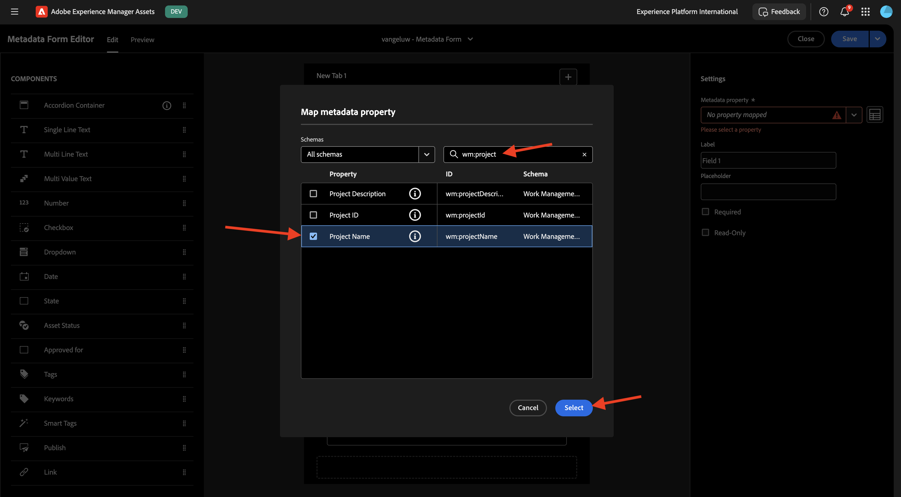
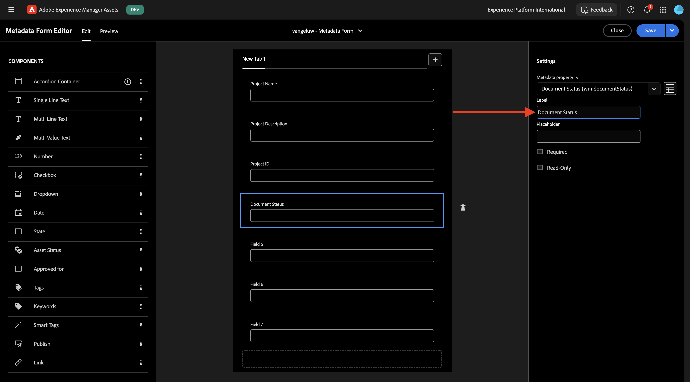
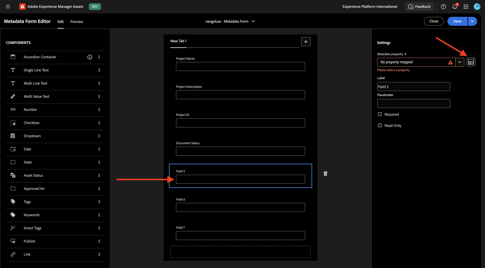
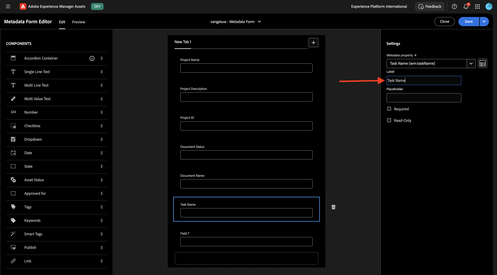
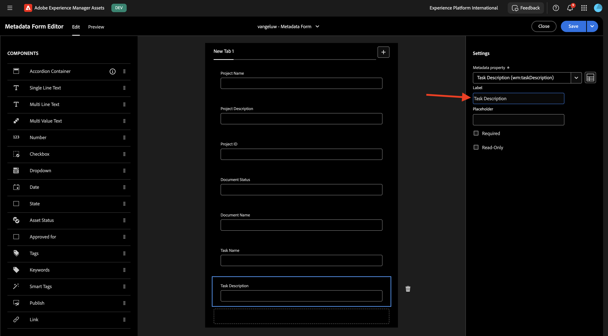

# 1.2.1 Workfront + AEM Assets CS 메타데이터 통합

>[!IMPORTANT]
>
>이 연습을 완료하려면 작업 중인 AEM Assets CS Author 환경에 액세스할 수 있어야 합니다.
>
>다음 두 가지 옵션을 고려할 수 있습니다.
>
>- GenStudio for CSC Technical Enablement 워크샵에 참석하는 경우 강사가 AEM Assets CS 작성 환경을 마련했습니다. 그들에게 이름이 무엇인지, 어떻게 진행해야 하는지 확인해 주세요.
>
>- 전체 원 Adobe 자습서 경로를 따르는 경우 연습 [Adobe Experience Manager Cloud Service 및 Edge Delivery Services](./../../../modules/asset-mgmt/module2.1/aemcs.md){target="_blank"}로 이동합니다. 거기에 있는 지침을 따르십시오, 그러면 당신은 이러한 환경에 액세스 할 수 있습니다.

>[!IMPORTANT]
>
>이전에 AEM Assets CS 환경에서 AEM CS 프로그램을 구성한 경우 AEM CS 샌드박스가 최대 절전 모드일 수 있습니다. 이러한 샌드박스의 최대 절전 모드 해제 시간이 10~15분 정도 걸리는 점을 감안할 때, 나중에 최대 절전 모드 해제 프로세스를 기다릴 필요가 없도록 지금 시작하는 것이 좋습니다.

## 1.2.1.1 Workfront 워크플로 용어

다음은 주요 Workfront 개체 및 개념입니다.

| 이름 | 마지막 업데이트 |
| ---------------------- | ------------ | 
| 포트폴리오 | 통합 특성이 있는 프로젝트 모음입니다. 이러한 프로젝트는 일반적으로 동일한 리소스, 예산 또는 시간대에 대해 경쟁합니다. |
| 프로그램 | 잘 정의된 이점을 얻기 위해 유사한 프로젝트를 함께 그룹화할 수 있는 포트폴리오 내의 하위 집합입니다. |
| 프로젝트 | 특정 일정 내에 완료해야 하며 특정 예산과 리소스 수를 사용해야 하는 많은 양의 작업입니다. 관리하기 쉽도록 하려면 프로젝트를 일련의 작업으로 나눕니다. 모든 작업을 완료하면 프로젝트가 완료됩니다. |
| 프로젝트 템플릿 | 프로젝트 템플릿을 사용하여 조직의 프로젝트와 관련된 대부분의 반복 가능한 프로세스, 정보 및 설정을 캡처할 수 있습니다. 템플릿을 만든 후 기존 프로젝트에 첨부하거나 이를 사용하여 새 프로젝트를 빌드할 수 있습니다. |
| 작업 | 최종 목표 달성(프로젝트 완료)을 위한 단계로 수행해야 하는 활동. 작업은 독립적으로 존재할 수 없습니다. 항상 프로젝트의 일부입니다. |
| 할당 | 문제 또는 작업에 할당된 사용자, 작업 역할 또는 팀입니다. 프로젝트, 포트폴리오 또는 프로그램에는 할당이 있을 수 없습니다. |
| 문서/버전 | Workfront 내의 개체에 첨부된 모든 파일입니다. 동일한 문서가 동일한 오브젝트에 업로드될 때마다 버전 번호가 지정됩니다. 사용자는 이전 버전의 문서에 대한 몇 가지 옵션을 보고 변경할 수 있습니다. |
| 승인 | 작업, 문서 또는 타임시트와 같은 특정 작업 항목에서는 감독자 또는 다른 사용자가 해당 작업 항목을 승인해야 할 수 있습니다. 이러한 승인 프로세스를 승인이라고 합니다. |

[https://experience.adobe.com/](https://experience.adobe.com/){target="_blank"}(으)로 이동합니다. **Workfront**&#x200B;을(를) 열려면 클릭하세요.

그러면 이걸 보게 될 거야.

## 1.2.1.1 AEM Assets 통합 구성

**메뉴** 아이콘을 클릭한 다음 **설정**&#x200B;을 선택합니다.

왼쪽 메뉴에서 **문서**(으)로 스크롤한 다음 **Experience Manager Assets**&#x200B;을 클릭합니다. **+ Experience Manager 통합 추가**&#x200B;를 클릭합니다.

통합 이름은 `--aepUserLdap-- - CitiSignal AEM`을(를) 사용합니다.

**Experience Manager 저장소** 드롭다운을 열고 `--aepUserLdap-- - CitiSignal`(으)로 지정해야 하는 AEM CS 인스턴스를 선택합니다.

**메타데이터**&#x200B;에서 다음 매핑을 구성합니다.

| Workfront 필드 | Experience Manager Assets 필드 |
| --------------- | ------------------------------ | 
| **문서** > **이름** | **wm:documentName** |
| **프로젝트** > **이름** | **wm:projectName** |
| **프로젝트** > **설명** | **wm:projectDescription** |
| **문서 요청** > **상태** | **wm:wm:documentStatus** |
| **작업** > **이름** | **wm:taskName** |
| **작업** > **설명** | **wm:taskDescription** |
| **프로젝트** > **ID** | **wm:projectId** |

**개체 메타데이터 동기화**&#x200B;에 대해 스위치를 사용하도록 설정하십시오.

**저장**&#x200B;을 클릭합니다.

이제 Workfront에서 AEM Assets CS로의 통합이 구성되었습니다.

## 1.2.1.2 AEM Assets과의 메타데이터 통합 구성

다음으로, AEM Assets CS에 있는 에셋의 메타데이터 필드를 AEM Assets CS와 공유하도록 Workfront CS를 구성해야 합니다.

이렇게 하려면 [https://experience.adobe.com/](https://experience.adobe.com/)&#x200B;(으)로 이동하십시오. **Experience Manager Assets**&#x200B;을(를) 클릭합니다.

`--aepUserLdap-- - CitiSignal dev`(이)라는 이름을 지정해야 하는 AEM Assets 환경을 선택하려면 클릭하십시오.

그럼 이걸 보셔야죠 왼쪽 메뉴에서 **Assets**(으)로 이동합니다.

**폴더 만들기**&#x200B;를 클릭합니다.

폴더 이름을 `--aepUserLdap-- - CitiSignal Fiber Campaign`로 지정하고 **만들기**&#x200B;를 클릭합니다.

그런 다음 왼쪽 메뉴에서 **메타데이터 Forms**(으)로 이동한 다음 **만들기**&#x200B;를 클릭합니다.

이름 `--aepUserLdap-- - Metadata Form`을(를) 사용하고 **만들기**&#x200B;를 클릭합니다.

7개의 새 **한 줄 텍스트** 필드를 양식에 추가하고 첫 번째 필드를 선택합니다. 그런 다음 첫 번째 필드의 **메타데이터 속성** 필드 옆에 있는 **스키마** 아이콘을 클릭합니다.

그러면 이 팝업이 표시됩니다. 검색 필드에 `wm:project`을(를) 입력한 다음 **프로젝트 이름** 필드를 선택합니다. **선택**&#x200B;을 클릭합니다.

필드의 레이블을 `Project Name`(으)로 변경합니다. **저장**&#x200B;을 클릭합니다.

두 번째 필드로 이동하여 **메타데이터 속성** 필드 옆에 있는 **스키마** 아이콘을 클릭합니다.

검색 필드에 `wm:project`을(를) 입력한 다음 **프로젝트 설명** 필드를 선택합니다. **선택**&#x200B;을 클릭합니다.

필드의 레이블을 `Project Description`(으)로 변경합니다.

그런 다음 세 번째 필드를 선택하고 **메타데이터 속성** 필드 옆에 있는 **스키마** 아이콘을 다시 클릭합니다.

그러면 이 팝업이 다시 표시됩니다. 검색 필드에 `wm:project`을(를) 입력한 다음 **프로젝트 ID** 필드를 선택합니다. **선택**&#x200B;을 클릭합니다.

필드의 레이블을 `Project ID`(으)로 변경합니다.

그런 다음 네 번째 필드를 선택하고 **메타데이터 속성** 필드 옆에 있는 **스키마** 아이콘을 다시 클릭합니다.

그러면 이 팝업이 다시 표시됩니다. 검색 필드에 `wm:document`을(를) 입력한 다음 **문서 상태** 필드를 선택합니다. **선택**&#x200B;을 클릭합니다.

필드의 레이블을 `Document Status`(으)로 변경합니다.

그런 다음 다섯 번째 필드를 선택하고 **메타데이터 속성** 필드 옆에 있는 **스키마** 아이콘을 다시 클릭합니다.

그러면 이 팝업이 다시 표시됩니다. 검색 필드에 `wm:document`을(를) 입력한 다음 **문서 이름** 필드를 선택합니다. **선택**&#x200B;을 클릭합니다.

필드의 레이블을 `Document Name`(으)로 변경합니다.

그런 다음 여섯 번째 필드를 선택하고 **메타데이터 속성** 필드 옆에 있는 **스키마** 아이콘을 다시 클릭합니다.

그러면 이 팝업이 다시 표시됩니다. 검색 필드에 `wm:task`을(를) 입력한 다음 **작업 이름** 필드를 선택합니다. **선택**&#x200B;을 클릭합니다.

필드의 레이블을 `Task Name`(으)로 변경합니다.

그런 다음 7번째 필드를 선택하고 **메타데이터 속성** 필드 옆에 있는 **스키마** 아이콘을 다시 클릭합니다.

그러면 이 팝업이 다시 표시됩니다. 검색 필드에 `wm:task`을(를) 입력한 다음 **작업 설명** 필드를 선택합니다. **선택**&#x200B;을 클릭합니다.

필드의 레이블을 `Task Description`(으)로 변경합니다.

양식의 **Tab 이름**&#x200B;을(를) `--aepUserLdap-- - Workfront Metadata`(으)로 변경합니다.

**저장** 및 **닫기**&#x200B;를 클릭합니다.

**메타데이터 양식**&#x200B;이(가) 구성되었습니다.

그런 다음 이전에 만든 폴더에 메타데이터 양식을 할당해야 합니다. 메타데이터 양식에 대한 확인란을 선택하고 **폴더에 할당**&#x200B;을 클릭합니다.

폴더 이름을 `--aepUserLdap-- - CitiSignal Fiber Campaign`(으)로 지정합니다. **할당**&#x200B;을 클릭합니다.

이제 메타데이터 양식이 폴더에 할당되었습니다.

다음 단계: [1.2.2 Workfront 증명](./ex2.md){target="_blank"}

[Adobe Workfront을 사용한 워크플로우 관리로 돌아가기](./workfront.md){target="_blank"}

[모든 모듈로 돌아가기](./../../../overview.md){target="_blank"}
