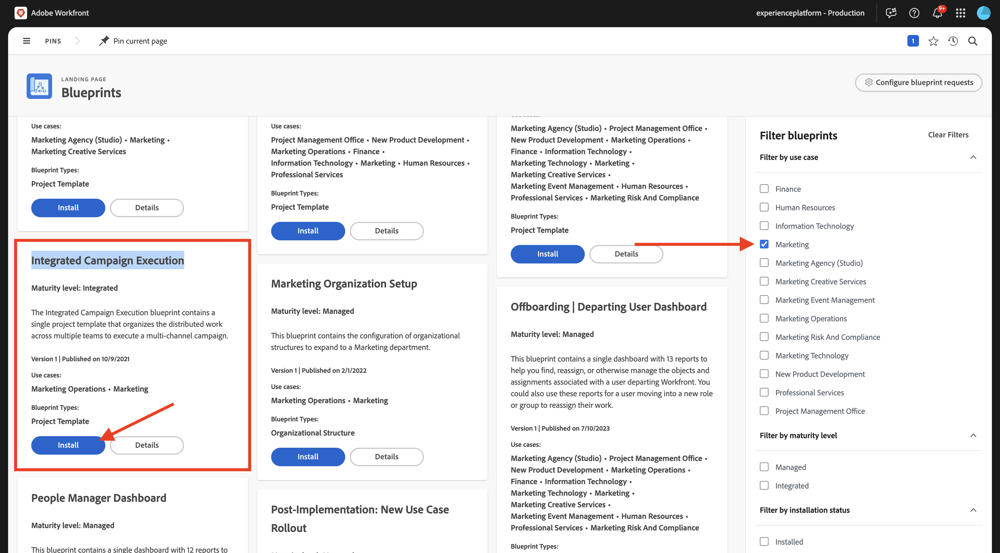
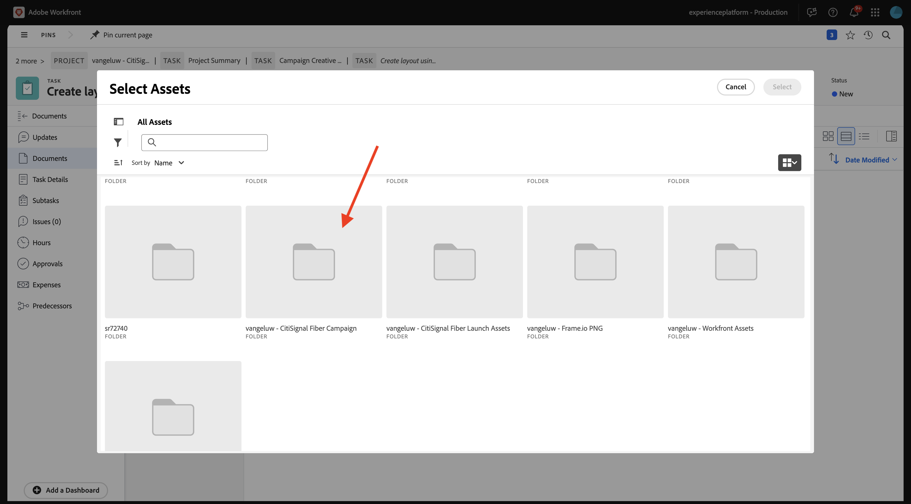
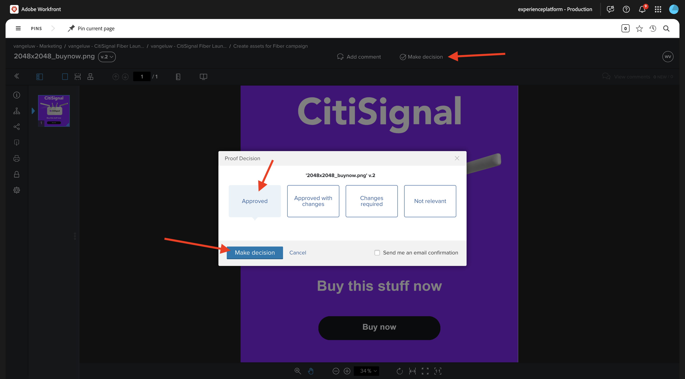

# 1.2.2 Workfront을 사용한 증명

>[!IMPORTANT]
>
>이전에 AEM Assets CS 환경에서 AEM CS 프로그램을 구성한 경우 AEM CS 샌드박스가 최대 절전 모드일 수 있습니다. 이러한 샌드박스의 최대 절전 모드 해제 시간이 10~15분 정도 걸리는 점을 감안할 때, 나중에 최대 절전 모드 해제 프로세스를 기다릴 필요가 없도록 지금 시작하는 것이 좋습니다.

## 1.2.2.1 새 승인 흐름 만들기

**Adobe Workfront**(으)로 돌아갑니다. **메뉴** 아이콘을 클릭하고 **증명**&#x200B;을 선택합니다.

**워크플로**(으)로 이동하여 **+ 신규**&#x200B;를 클릭한 다음 **새 템플릿**&#x200B;을(를) 선택하십시오.

**템플릿 이름**&#x200B;을(를) `--aepUserLdap-- - Approval Workflow`(으)로 설정하고 **템플릿 소유자**&#x200B;를 직접 설정합니다.

아래로 스크롤하여 **단계** > **단계 1**&#x200B;에서 **증명 작성자** 역할을 **검토자 및 승인자**(으)로 변경합니다. 다른 사용자를 추가할 수도 있습니다. 예를 들어, 사용자를 선택하여 자신을 추가하고 **검토자 및 승인자**&#x200B;의 **역할**&#x200B;을(를) 설정할 수 있습니다.

**만들기**&#x200B;를 클릭합니다.

이제 기본 승인 워크플로를 사용할 준비가 되었습니다.

## 1.2.2.2 Workfront 블루프린트 사용

다음 단계에서는 템플릿을 사용하여 새 프로젝트를 만듭니다. Adobe Workfront에서는 활성화하기만 하면 되는 사용 가능한 여러 블루프린트를 제공합니다.

CitiSignal의 사용 사례의 경우 **통합 캠페인 실행** 블루프린트를 사용해야 합니다.

해당 블루프린트를 설치하려면 메뉴를 열고 **블루프린트**&#x200B;를 선택합니다.

**마케팅** 필터를 선택한 다음 아래로 스크롤하여 블루프린트 **통합 캠페인 실행**&#x200B;을 찾습니다. **설치**&#x200B;를 클릭합니다.

**계속**&#x200B;을 클릭합니다.

**다음으로 설치...**&#x200B;를 클릭합니다.

그럼 이걸 보셔야죠 설치하는 데 2분 정도 걸릴 수 있습니다.

몇 분 후에 블루프린트가 설치됩니다.

## 1.2.2.3 새 프로젝트 만들기

**메뉴**&#x200B;를 열고 **프로그램**(으)로 이동합니다.

이전에 만든 `--aepUserLdap-- CitiSignal Fiber Launch` 프로그램을 클릭합니다.

>[!NOTE]
>
>만들고 실행한 자동화를 사용하여 [Workfront 계획](./../module1.1/ex1.md)에서 연습의 일부로 프로그램을 만들었습니다. 아직 안하셨으면 거기서 안내를 찾으실 수 있습니다

프로그램에서 **프로젝트**(으)로 이동합니다. **+ 새 프로젝트**&#x200B;를 클릭한 다음 **템플릿의 새 프로젝트**&#x200B;를 선택하십시오.

**통합 캠페인 실행** 템플릿을 선택하고 **템플릿 사용**&#x200B;을 클릭합니다.

그럼 이걸 보셔야죠 이름을 `--aepUserLdap-- - CitiSignal Fiber Launch Winter 2026`(으)로 변경하고 **프로젝트 만들기**&#x200B;를 클릭합니다.

이제 프로젝트가 생성되었습니다. **프로젝트 세부 정보**(으)로 이동합니다.

**프로젝트 세부 정보**(으)로 이동합니다. **설명**&#x200B;에서 현재 텍스트를 선택하려면 클릭하세요.

설명을 `The CitiSignal Fiber Launch project is used to plan the upcoming launch of CitiSignal Fiber.`(으)로 설정

**변경 내용 저장**&#x200B;을 클릭합니다.

이제 프로젝트를 사용할 준비가 되었습니다.

프로젝트의 작업 및 종속성은 선택한 템플릿을 기반으로 생성되었으며 사용자로 설정되었습니다. 프로젝트 소유자. 프로젝트의 상태가 **계획**(으)로 설정되었습니다. 목록에서 다른 값을 선택하여 프로젝트의 상태를 변경할 수 있습니다.

## 1.2.2.4 새 작업 만들기

**디자인 템플릿 만들기 시작** 작업 위로 마우스를 가져간 후 세 점 **...**&#x200B;을(를) 클릭합니다.

**아래에 작업 삽입** 옵션을 선택하십시오.

작업 이름 `Create layout using approved assets and copy`을(를) 입력하십시오.

**할당** 필드를 **Designer** 역할로 설정합니다.
필드 **기간**&#x200B;을(를) **5일**(으)로 설정합니다.
필드 전임 작업을 **9**(으)로 설정합니다.
필드 **시작 일자** 및 **기한**&#x200B;을 입력하십시오.

화면에서 다른 위치를 클릭하여 새 작업을 저장합니다.

그럼 이걸 보셔야죠 작업을 클릭하여 엽니다.

**작업 세부 정보**(으)로 이동하여 **설명** 필드를 `This task is used to track the progress of the creation of the assets for the CitiSignal Fiber Launch Campaign.`(으)로 설정합니다.

**변경 내용 저장**&#x200B;을 클릭합니다.

그럼 이걸 보셔야죠 프로젝트로 돌아가려면 **프로젝트** 필드를 클릭하십시오.

**프로젝트** 보기에서 **업무 균형자**(으)로 이동합니다.

**일괄 할당**&#x200B;을 클릭합니다.

**Designer**&#x200B;의 **역할 할당**&#x200B;을 선택한 다음 필드 **할당할 사용자**&#x200B;를 클릭합니다. Workfront 인스턴스에 **Designer** 역할이 있는 모든 사용자가 표시됩니다. 이 경우 가상 사용자 **Melissa Jenkins**&#x200B;을(를) 선택하십시오.

**할당**&#x200B;을 클릭합니다. 선택한 사용자는 이제 **Designer** 역할에 연결된 프로젝트의 작업에 할당됩니다.

이제 작업이 할당되었습니다. **작업** 개요 페이지로 돌아가려면 **작업**&#x200B;을 클릭하세요.

만든 작업(이름: ) 클릭
**승인된 자산을 사용하여 레이아웃을 만들고**.

이제 이 연습의 일부로 이 작업에 대한 작업을 시작합니다. 멜리사 젠킨스가 현재 이 작업에 할당되어 있음을 알 수 있습니다. 직접 변경하려면 **할당** 필드를 클릭하고 **나에게 할당**&#x200B;을 선택하세요.

**저장**&#x200B;을 클릭합니다.

**작업**&#x200B;을 클릭하세요.

그럼 이걸 보셔야죠

이 작업의 일부로, 새 이미지를 만든 다음 Workfront에서 문서로 업로드해야 합니다. 이제 Adobe Express을 사용하여 해당 에셋을 직접 만듭니다.

## 1.2.2.5 프로젝트에 새 문서를 추가하고 승인 흐름을 시작합니다.

이 연습에서는 다음 자산을 다운로드하여 사용해야 합니다. [timetravelnow.png](./images/timetravelnow.png)

**프로젝트 세부 정보** 화면으로 돌아갑니다. **문서**(으)로 이동합니다. **+ 새로 추가**&#x200B;를 클릭한 다음 **문서**&#x200B;을(를) 선택합니다.

`timetravelnow.png` 파일을 선택하려면 클릭하세요. **열기를 클릭합니다**.

그럼 이걸 드셔보세요

업로드된 문서 위로 마우스를 가져갑니다. **증명 만들기**&#x200B;를 클릭한 다음 **고급 증명**&#x200B;을 선택합니다.

**새 증명** 창에서 **자동화**&#x200B;를 선택한 다음 이전에 만든 워크플로 템플릿을 선택합니다. 워크플로 템플릿의 이름은 `--aepUserLdap-- - Approval Workflow`이어야 합니다. **증명 만들기**&#x200B;를 클릭합니다.

**증명 열기** 클릭

이제 증명을 검토할 수 있습니다. 문서를 변경해야 하는 설명을 추가하려면 **설명 추가**&#x200B;를 선택하십시오.

댓글을 입력하고 **게시물**&#x200B;을 클릭하세요. 그런 다음 **결정**&#x200B;을 클릭합니다.

**변경 필요**&#x200B;를 선택하고 **결정**&#x200B;을 클릭합니다.

**작업** 및 **문서**(으)로 돌아갑니다. **변경 필요** 텍스트도 표시됩니다.

이제 디자인을 변경해야 합니다. 이 작업은 Adobe Express에서 수행합니다.

## 1.2.2.6 작업에 새 버전의 문서를 추가합니다.

이 연습에서는 다음 자산을 다운로드하여 사용해야 합니다. [getonboard.png](./images/getonboard.png)

Adobe Workfront의 작업 보기에서 승인되지 않은 이전 이미지 파일을 선택합니다. 그런 다음 **+ 새로 추가**&#x200B;를 클릭하고 **버전**&#x200B;을 선택한 다음 AEM Assets CS 저장소를 선택합니다. 해당 저장소의 이름은 `--aepUserLdap-- - CitiSignal`입니다.

`--aepUserLdap-- CitiSignal Fiber Campaign` 폴더로 이동하고 `CitiSignal - Neon Rabit - Get On Board Now!.png` 파일을 선택합니다. **선택**&#x200B;을 클릭합니다.

그럼 이걸 드셔보세요 **증명 만들기**&#x200B;를 클릭한 다음 **고급 증명**&#x200B;을 다시 선택하십시오.

그러면 이걸 보게 될 거야. Workfront에서 이전 승인 워크플로가 여전히 유효하다고 가정함에 따라 **워크플로 템플릿**&#x200B;이(가) 미리 선택됩니다. **증명 만들기**&#x200B;를 클릭합니다.

**증명 열기**&#x200B;를 선택합니다.

이제 두 버전의 파일이 나란히 표시됩니다. **증명 비교** 단추를 클릭합니다.

그런 다음 두 버전의 이미지가 서로 옆에 표시됩니다. **결정**&#x200B;을 클릭합니다.

**승인됨**&#x200B;을(를) 선택하고 **결정**&#x200B;을 다시 클릭합니다.

이미지의 왼쪽 버전을 닫아 **증명 비교** 보기를 닫습니다. 작업 개요로 돌아가려면 **작업 이름**&#x200B;을 클릭하세요.

그런 다음 승인된 자산을 사용하여 작업 보기로 돌아갑니다. 이제 이 자산을 AEM Assets에 공유해야 합니다.

승인된 문서를 선택합니다. **공유 화살표** 아이콘을 클릭하고 `--aepUserLdap-- - CitiSignal AEM`(이)라는 AEM Assets 통합을 선택합니다.

이전에 만든 폴더(`--aepUserLdap-- - CitiSignal Fiber Launch Assets`)를 두 번 클릭합니다.

**폴더 선택**&#x200B;을 클릭합니다.

1~2분 후 문서가 이제 AEM Assets에 게시됩니다. 문서 이름 옆에 AEM 아이콘이 표시됩니다.

이 작업을 완료하려면 **완료로 표시**&#x200B;를 클릭하십시오.

그럼 이걸 보셔야죠

## 1.2.2.7 AEM Assets에서 내 파일 보기

이름이 `--aepUserLdap-- - CitiSignal Fiber Launch Assets`인 AEM Assets CS의 폴더로 이동합니다.

이미지를 선택한 다음 **세부 정보**&#x200B;를 선택합니다.

그러면 이전에 만든 Workfront과 AEM Assets 간의 통합에 의해 자동으로 채워진 값과 함께 메타데이터 양식이 표시됩니다.

[Adobe Workfront을 사용한 워크플로우 관리로 돌아가기](./workfront.md){target="_blank"}

[모든 모듈로 돌아가기](./../../../overview.md){target="_blank"}
