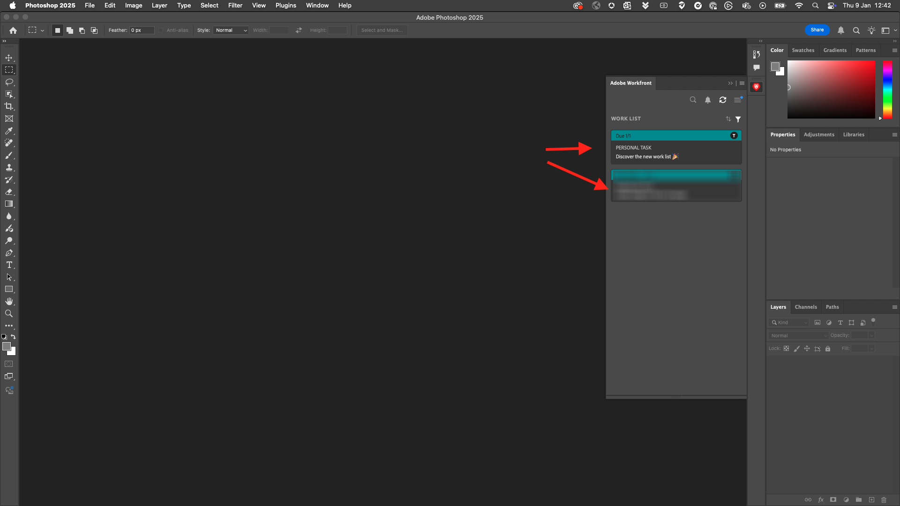

# 1.2.5 Photoshop + Workfront 플러그인 설정

## 1.2.5.1 Photoshop 플러그인용 Workfront 설치

Workfront과 Photoshop 간의 통합을 설정하려면 컴퓨터에 Creative Cloud 애플리케이션을 설치하십시오. Adobe ID을 사용하여 로그인합니다.

**회사 또는 학교 계정**&#x200B;을 선택하고 인증합니다.

로그인할 프로필을 선택하십시오.

그럼 넌 여기 있을 거야 **Stock 및 Marketplace**(으)로 이동합니다.

**플러그인**&#x200B;을 클릭한 다음 **플러그인 관리**&#x200B;를 클릭합니다. **Photoshop용 Adobe Workfront** 카드에서 **설치**&#x200B;를 클릭합니다.

**확인**&#x200B;을 클릭합니다.

그러면 이걸 보게 될 거야.

## 1.2.5.2 Photoshop에서 플러그인 구성

Photoshop을 엽니다. 작업 표시줄에서 **Plugins** > **Adobe Photoshop용 Workfront** > **Adobe Workfront**&#x200B;을(를) 클릭합니다.

그러면 이걸 보게 될 거야.

Adobe Workfront 인스턴스의 도메인을 입력합니다. **로그인**&#x200B;을 클릭합니다.

**허용**&#x200B;을 클릭합니다.

**Adobe ID**(으)로 로그인합니다.

**회사 또는 학교 계정**&#x200B;을 선택하세요.

**액세스 허용**&#x200B;을 클릭합니다.

그러면 이 확인이 표시됩니다.

Photoshop으로 돌아가면 이제 플러그인을 사용할 준비가 되었으며 활성 작업을 표시 중인지 확인할 수 있습니다.

[Adobe Workfront을 사용한 워크플로우 관리로 돌아가기](./workfront.md){target="_blank"}

[모든 모듈로 돌아가기](./../../../overview.md){target="_blank"}
