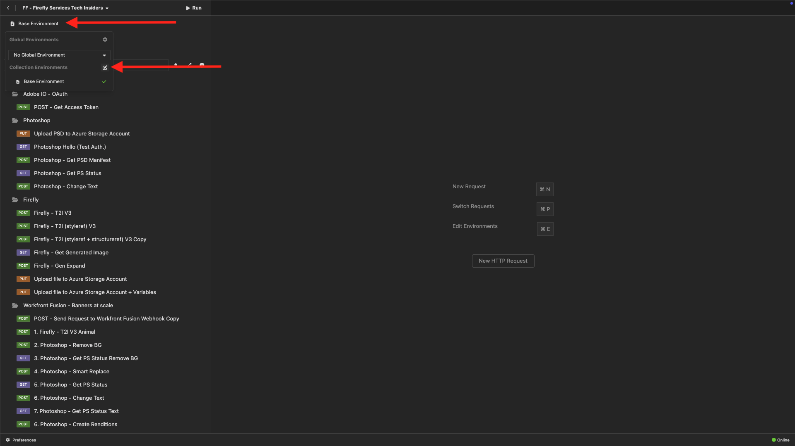
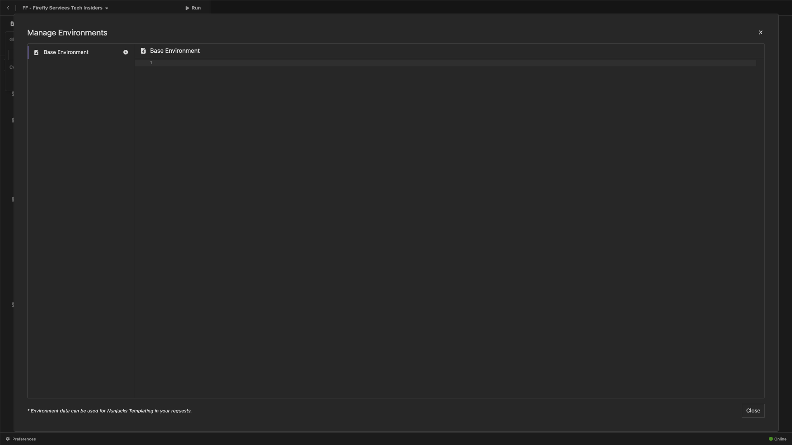

# PostBuster

>[!IMPORTANT]
>
>아래 지침은 Adobe 직원만을 대상으로 합니다.

## PostBuster 설치

[https://adobe.service-now.com/esc?id=adb_esc_kb_article&amp;sysparm_article=KB0020542](https://adobe.service-now.com/esc?id=adb_esc_kb_article&amp;sysparm_article=KB0020542)(으)로 이동합니다.

**PostBuster**&#x200B;의 최신 릴리스를 다운로드하려면 클릭하세요.


OS에 맞는 버전을 다운로드하십시오.


다운로드가 완료되고 설치되면 PostBuster를 엽니다. 그럼 이걸 보셔야죠 **가져오기**&#x200B;를 클릭합니다.


[postbuster.json.zip](./assets/postman/postbuster.json.zip)을(를) 다운로드하고 데스크톱에서 추출하십시오.


**파일 선택**&#x200B;을 클릭합니다.


**postbuster.json** 파일을 선택하십시오. **열기를 클릭합니다**.


그럼 이걸 보셔야죠 **검사**&#x200B;를 클릭합니다.


**가져오기**&#x200B;를 클릭합니다.


그럼 이걸 보셔야죠 을(를) 클릭하여 가져온 컬렉션을 엽니다.


이제 컬렉션을 볼 수 있습니다. 일부 환경 변수를 포함하도록 환경을 구성해야 합니다.


**기본 환경**&#x200B;을 클릭한 다음 **편집** 아이콘을 클릭합니다.



그럼 이걸 보셔야죠



아래 환경 자리 표시자를 복사하여 **기본 환경**&#x200B;에 붙여넣습니다.

```json
{
	"CLIENT_SECRET": "",
	"API_KEY": "",
	"ACCESS_TOKEN": "",
	"SCOPES": [
		"openid",
		"AdobeID",
		"ff_apis",
		"firefly_api"
	],
	"TECHNICAL_ACCOUNT_ID": "",
	"IMS": "ims-na1.adobelogin.com",
	"IMS_ORG": "",
	"access_token": "",
	"IMS_TOKEN": "",
	"AZURE_STORAGE_URL": "",
	"AZURE_STORAGE_CONTAINER": "",
	"AZURE_STORAGE_SAS_READ": "",
	"AZURE_STORAGE_SAS_WRITE": ""
}
```

그럼 이걸 드셔보세요


**Firefly 서비스** 모듈을 통과하면 환경은 다음과 같이 표시됩니다. 지금은 이 작업을 수행할 필요가 없습니다. 이 문제는 나중에 해결될 예정입니다.


>[!NOTE]
>
>{width="50px" align="left"}
>
>질문이 있는 경우 향후 콘텐츠에 대한 제안 사항에 대한 일반적인 피드백을 공유하려면 기술 인사이더에게 **techinsiders@adobe.com**&#x200B;로 전자 메일을 보내 직접 문의하십시오.

[모든 모듈로 돌아가기](./overview.md)
