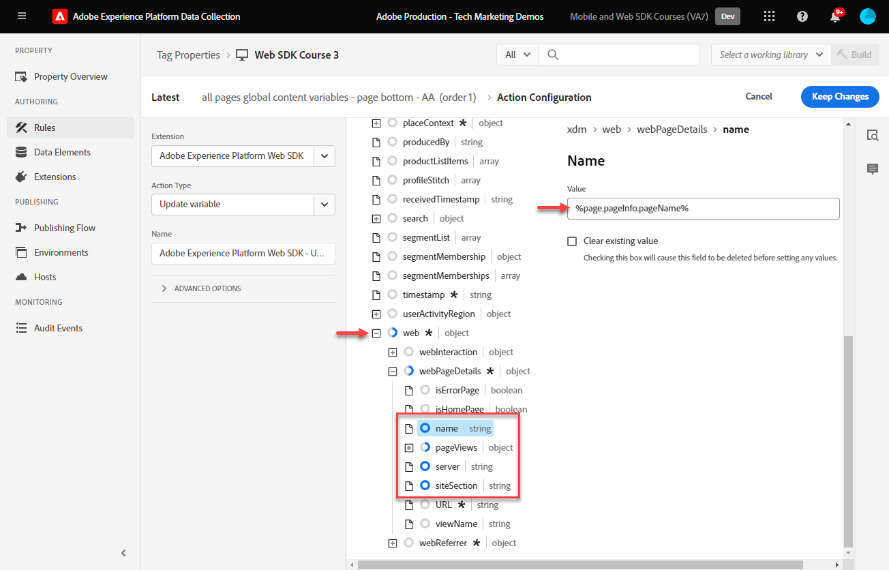

# 태그 규칙 만들기

태그 규칙을 사용하여 XDM 개체와 함께 Platform Edge Network에 이벤트를 전송하는 방법에 대해 알아봅니다. 태그 규칙은 태그 속성에 작업을 수행하도록 지시하는 이벤트, 조건 및 작업의 조합입니다.

>[!NOTE]
>
> 데모 목적으로 이 단원의 연습은 다음 기간 동안 사용한 예를 기반으로 합니다. [ID 만들기](create-identities.md) 단계; XDM 이벤트 작업을 전송하여 의 사용자로부터 콘텐츠 및 ID 캡처 [Luma 데모 사이트](https://luma.enablementadobe.com/content/luma/us/en.html).

## 학습 목표

이 단원을 마치면 다음을 수행할 수 있습니다.

* 태그 내 규칙 관리에 명명 규칙 사용
* 태그 규칙에서 변수 업데이트 및 이벤트 보내기 작업 유형을 사용하여 XDM 이벤트 보내기
* 개발 라이브러리에 태그 규칙 게시

## 전제 조건

데이터 수집 태그 및 [Luma 데모 사이트](https://luma.enablementadobe.com/content/luma/us/en.html), 그리고 자습서에서 다음 이전 단원을 완료해야 합니다.

* [XDM 스키마 구성](configure-schemas.md)
* [ID 네임스페이스 구성](configure-identities.md)
* [데이터스트림 구성](configure-datastream.md)
* [태그 속성에 설치된 Web SDK 확장](install-web-sdk.md)
* [데이터 요소 만들기](create-data-elements.md)
* [ID 만들기](create-identities.md)

## 이름 지정 규칙

태그의 규칙을 더 잘 관리하려면 표준 명명 규칙을 따르는 것이 좋습니다. 이 튜토리얼에서는 세 부분으로 구성된 명명 규칙을 사용합니다.

* [**위치**] - [**이벤트**] - [**도구**] (**시퀀스**)

다음의 경우

1. **위치** 는 규칙이 실행되는 사이트의 페이지입니다
1. **이벤트** 는 규칙의 트리거입니다.
1. **도구** 은 해당 규칙의 작업 단계에서 사용되는 특정 응용 프로그램입니다
1. **시퀀스** 은 다른 규칙과 관련하여 규칙이 실행되는 순서입니다
<!-- minor update -->

## 태그 규칙 만들기

태그에서 규칙은 다양한 조건에서 작업(호출 실행)을 실행하는 데 사용됩니다. Platform Web SDK 태그 확장에는 이 단원에서 사용할 두 가지 작업이 포함되어 있습니다.

* **[!UICONTROL 변수 업데이트]** 데이터 요소를 XDM 필드에 매핑
* **[!UICONTROL 이벤트 보내기]** Experience Platform 에지 네트워크에 XDM 개체 전송

먼저 다음을 사용하여 규칙을 정의합니다. **[!UICONTROL 변수 업데이트]** 작업은 사이트의 모든 페이지(예: 페이지 이름)에서 전송하려는 XDM 필드의 &quot;전역 구성&quot;을 정의합니다.

그런 다음 를 사용하여 추가 규칙을 정의할 수 있습니다. **[!UICONTROL 변수 업데이트]** 전역 XDM 필드를 특정 조건(예: 제품 페이지에 제품 세부 사항 추가)에서만 사용할 수 있는 추가 필드로 보완하는 작업입니다.

마지막으로 와 함께 다른 규칙을 사용합니다. **[!UICONTROL 이벤트 보내기]** 전체 XDM 개체를 Adobe Experience Platform Edge Network로 보내는 작업.

### 변수 규칙 업데이트

#### 전역 필드

글로벌 XDM 필드에 대한 태그 규칙을 만들려면 다음을 수행하십시오.

1. 이 자습서에서 사용하는 태그 속성을 엽니다

1. 다음으로 이동 **[!UICONTROL 규칙]** 왼쪽 탐색

1. 다음 항목 선택 **[!UICONTROL 새 규칙 만들기]** 단추

   

1. 규칙 이름을 지정합니다 `all pages global content variables - library loaded - AA (order 1)`

1. 다음에서 **[!UICONTROL 이벤트]** 섹션, 선택 **[!UICONTROL 추가]**

   

1. 사용 **[!UICONTROL 코어 확장]** 및 선택 `Page Bottom` (으)로 **[!UICONTROL 이벤트 유형]**

1. 아래 **[!UICONTROL 이름]** 필드, 이름 지정 `Core - Page Bottom - order 1`. 이렇게 하면 의미 있는 이름으로 트리거를 설명하는 데 도움이 됩니다.

1. 선택 **[!UICONTROL 고급]** 드롭다운 및 enter `1` 위치: **[!UICONTROL 주문]**

   >[!NOTE]
   >
   > 입력하는 숫자가 높을수록 트리거되는 전체 작업 순서가 늦어집니다.

1. 선택 **[!UICONTROL 변경 내용 유지]** 기본 규칙 화면으로 돌아가기
   

1. 다음에서 **[!UICONTROL 작업]** 섹션, 선택 **[!UICONTROL 추가]**

1. 다음으로: **[!UICONTROL 확장]**, 선택 **[!UICONTROL Adobe Experience Platform 웹 SDK]**

1. 다음으로: **[!UICONTROL 작업 유형]**, 선택 **[!UICONTROL 변수 업데이트]**

1. 다음으로: **[!UICONTROL 데이터 요소]**&#x200B;를 선택하고 `xdm.variable.content` 다음 작업에서 을(를) 만들었습니다. [데이터 요소 만들기](create-data-elements.md) 단원

   

이제 내 매핑 [!UICONTROL 데이터 요소] (으)로 [!UICONTROL 스키마] xdm 개체에서 사용됩니다.

>[!NOTE]
> 
> 개별 속성 또는 전체 객체에 매핑할 수 있습니다. 이 예제에서는 개별 속성에 매핑합니다.

1. 에 도달할 때까지 아래로 스크롤합니다. **`web`** 오브젝트

1. 열려면 선택하십시오.

1. 다음 데이터 요소를 해당 항목에 매핑 `web` XDM 변수

   * **`web.webPageDetials.name`** 끝 `%page.pageInfo.pageName%`
   * **`web.webPageDetials.server`** 끝 `%page.pageInfo.server%`
   * **`web.webPageDetials.siteSection`** 끝 `%page.pageInfo.hierarchie1%`

1. `web.webPageDetials.pageViews.value`을 `1`로 설정합니다.

   

1. 그런 다음 `identityMap` 스키마의 객체를 선택하고

1. 에 매핑 `identityMap.loginID` 데이터 요소

   

1. 그런 다음 eventType 필드를 찾아 선택합니다.

1. 값 입력 `web.webpagedetails.pageViews`

   >[!WARNING]
   >
   > 이 드롭다운은 **`xdm.eventType`** 변수를 채우는 방법에 따라 페이지를 순서대로 표시합니다. 이 필드에는 자유 형식 레이블을 입력할 수도 있지만, 반드시 입력하는 것이 좋습니다 **금지** 플랫폼에 부정적인 영향을 미치기 때문입니다.

   >[!TIP]
   >
   > 에서 채울 값을 이해하려면 `eventType` 필드: 스키마 페이지로 이동하여 `eventType` 오른쪽 레일에서 제안된 값을 보기 위한 필드입니다.

   >[!TIP]
   >
   > While nothing `web.webPageDetials.pageViews.value` nor `eventType` 을 로 설정 `web.webpagedetails.pageViews` Adobe Analytics에서 비콘을 페이지 보기로 처리하는 데 필요한 경우, 다른 다운스트림 애플리케이션에 대한 페이지 보기를 표시하는 표준 방법을 사용하는 것이 유용합니다.

   

1. 선택 **[!UICONTROL 변경 내용 유지]** 그런 다음 **[!UICONTROL 저장]** 다음 화면의 규칙 을 클릭하여 규칙 만들기를 완료합니다

#### 변수 업데이트 작업으로 추가 규칙을 사용하여 XDM 개체 강화

다음을 사용할 수 있습니다. **[!UICONTROL 변수 업데이트]**  다수의 순차적 규칙은에 보내기 전에 XDM 개체를 보완하는 것입니다. [!UICONTROL 플랫폼 에지 네트워크].

>[!TIP]
>
>규칙 순서는 이벤트가 트리거될 때 먼저 실행되는 규칙을 결정합니다. 두 규칙의 이벤트 유형이 동일한 경우 숫자가 가장 낮은 규칙이 먼저 실행됩니다.
> 
>

##### 제품 페이지 필드

Luma의 제품 세부 사항 페이지에서 제품 보기를 추적하여 시작합니다.

1. 선택 **[!UICONTROL 규칙 추가]**
1. 이름 지정  [!UICONTROL `ecommerce - pdp library loaded - AA (order 20)`]
1. 다음 항목 선택  새 트리거를 추가할 이벤트
1. 아래 **[!UICONTROL 확장]**, 선택 **[!UICONTROL 코어]**
1. 아래 **[!UICONTROL 이벤트 유형]**, 선택 **[!UICONTROL 페이지 하단]**
1. 이름 지정 `Core - Page Bottom - order 20`
1. 열려면 선택하십시오. **[!UICONTROL 고급 옵션]**, 입력 `20`. 이렇게 하면 규칙 다음에 실행됩니다 `all pages global content variables - library loaded - AA (order 1)` 전역 콘텐츠 변수를 설정하는 데 사용됩니다. `all pages send event - library loaded - AA (order 50)` xdm 이벤트를 전송합니다.

   

1. 아래 **[!UICONTROL 조건]**&#x200B;을(를) 선택합니다 **[!UICONTROL 추가]**
1. 나가기 **[!UICONTROL 논리 유형]** 다음으로: **[!UICONTROL 보통]**
1. 나가기 **[!UICONTROL 확장]** 다음으로: **[!UICONTROL 코어]**
1. 선택 **[!UICONTROL 조건 유형]** 다음으로: **[!UICONTROL 쿼리 문자열이 없는 경로]**
1. 오른쪽에서 **[!UICONTROL 정규 표현식]** 전환
1. 아래 **[!UICONTROL 경로가 다음과 같음]** set `/products/`. Luma 데모 사이트의 경우 규칙이 제품 페이지에서만 트리거되도록 합니다
1. 선택 **[!UICONTROL 변경 내용 유지]**

   

1. 아래 **[!UICONTROL 작업]** 선택 **[!UICONTROL 추가]**
1. 선택 **[!UICONTROL Adobe Experience Platform 웹 SDK]** 확장
1. 선택 **[!UICONTROL 작업 유형]** 다음으로: **[!UICONTROL 변수 업데이트]**
1. 아래로 스크롤하여 `commerce` 을(를) 개체하고 을(를) 선택하여 엽니다.
1. 를 엽니다. **[!UICONTROL 제품 보기]** 오브젝트 및 세트 **[!UICONTROL 값]** 끝 `1`

   

   >[!TIP]
   >
   >XDM에서 commerce.productViews.value=1 을 설정하면 `prodView` analytics의 이벤트

1. 아래로 스크롤하여 선택 `productListItems` 배열
1. 선택 **[!UICONTROL 개별 항목 제공]**
1. 선택 **[!UICONTROL 항목 추가]**

   

   >[!CAUTION]
   >
   >다음 **`productListItems`** 은(는) `array` 데이터가 요소의 컬렉션으로 들어올 것을 예상하도록 데이터 유형입니다. Luma 데모 사이트의 데이터 레이어 구조와 Luma 사이트에서 한 번에 하나의 제품만 볼 수 있으므로 항목을 개별적으로 추가합니다. 자체 웹 사이트에서 를 구현할 때 데이터 레이어 구조에 따라 전체 어레이를 제공할 수 있습니다.

1. 열려면 선택하십시오. **[!UICONTROL 항목 1]**
1. **`productListItems.item1.SKU`**&#x200B;를 `%product.productInfo.sku%`에 매핑

   

1. 찾기 `eventType` 및 설정 `commerce.productViews`

1. 선택 **[!UICONTROL 변경 내용 유지]**

1. 선택 **[!UICONTROL 저장]** 규칙을 저장하려면

### 장바구니 필드

배열이 XDM 스키마의 형식과 일치하는 경우 전체 배열을 XDM 개체에 매핑할 수 있습니다. 사용자 지정 코드 데이터 요소 `cart.productInfo` 다음을 통해 이전 루프를 만들었습니다. `digitalData.cart.cartEntries` luma의 데이터 레이어 개체를 필요한 형식의 `productListItems` XDM 스키마 오브젝트.

이를 설명하기 위해서는 아래 Luma 사이트 데이터 레이어(왼쪽)와 번역된 데이터 요소(오른쪽)의 비교를 참조하십시오.

데이터 요소를 `productListItems` 구조(힌트, 일치해야 함).

>[!IMPORTANT]
>
>숫자 변수가 데이터 레이어의 문자열 값과 함께 변환되는 방식을 확인합니다. `price` 및 `qty` 데이터 요소의 숫자로 형식이 변경되었습니다. 이러한 형식 요구 사항은 플랫폼의 데이터 무결성에 중요하며 다음 기간 동안 결정됩니다. [스키마 구성](configure-schemas.md) 단계. 이 예에서는 **[!UICONTROL 수량]** 를 사용합니다. **[!UICONTROL 정수]** 데이터 유형.
> 

이제 배열을 XDM 개체에 매핑해 보겠습니다.&quot;

1. (이)라는 이름의 새 규칙 만들기 `ecommerce - cart library loaded - AA (order 20)`
1. 다음 항목 선택  새 트리거를 추가할 이벤트
1. 아래 **[!UICONTROL 확장]**, 선택 **[!UICONTROL 코어]**
1. 아래 **[!UICONTROL 이벤트 유형]**, 선택 **[!UICONTROL 페이지 하단]**
1. 이름 지정 `Core - Page Bottom - order 20`
1. 열려면 선택하십시오. **[!UICONTROL 고급 옵션]**, 입력 `20`
1. 선택 **[!UICONTROL 변경 내용 유지]**

   

1. 아래 **[!UICONTROL 조건]**&#x200B;을(를) 선택합니다 **[!UICONTROL 추가]**
1. 나가기 **[!UICONTROL 논리 유형]** 다음으로: **[!UICONTROL 보통]**
1. 나가기 **[!UICONTROL 확장]** 다음으로: **[!UICONTROL 코어]**
1. 선택 **[!UICONTROL 조건 유형]** 다음으로: **[!UICONTROL 쿼리 문자열이 없는 경로]**
1. 오른쪽이요 **금지** 활성화 **[!UICONTROL 정규 표현식]** 전환
1. 아래 **[!UICONTROL 경로가 다음과 같음]** set `/content/luma/us/en/user/cart.html`. Luma 데모 사이트의 경우 규칙이 장바구니 페이지에서 트리거만 하는지 확인합니다
1. 선택 **[!UICONTROL 변경 내용 유지]**

   

1. 아래 **[!UICONTROL 작업]** 선택 **[!UICONTROL 추가]**
1. 선택 **[!UICONTROL Adobe Experience Platform 웹 SDK]** 확장
1. 선택 **[!UICONTROL 작업 유형]** 다음으로: **[!UICONTROL 변수 업데이트]**
1. 아래로 스크롤하여 `commerce` 을(를) 개체하고 을(를) 선택하여 엽니다.
1. 를 엽니다. **[!UICONTROL 제품 목록 보기 수]** 오브젝트 및 세트 **[!UICONTROL 값]** 끝 `1`

   

   >[!TIP]
   >
   >XDM에서 commerce.productListViews.value=1 을 설정하면 `scView` analytics의 이벤트

1. 아래로 스크롤하여 선택 **[!UICONTROL productListItem]** 배열

1. 선택 **[!UICONTROL 전체 스토리지 제공]**

1. 다음에 매핑 **`cart.productInfo`** 데이터 요소

1. 선택 `eventType` 및 을 (으)로 설정 `commerce.productListViews`

1. 선택 **[!UICONTROL 변경 내용 유지]**

1. 선택 **[!UICONTROL 저장]** 규칙을 저장하려면

아래 차이점을 사용하여 동일한 패턴에 따라 체크아웃 및 구매를 위한 다른 두 규칙을 만듭니다.

**규칙 이름**: `ecommerce - checkout library loaded - AA (order 20)`

* **[!UICONTROL 조건]**: /content/luma/us/en/user/checkout.html
* `eventType`을 `commerce.checkouts`로 설정합니다.
* 설정 **XDM 상거래 이벤트**: commerce.checkout.value 종료 `1`

  >[!TIP]
  >
  >이는 설정에 해당합니다. `scCheckout` analytics의 이벤트

**규칙 이름**: `ecommerce - purchase library loaded - AA (order 20)`

* **[!UICONTROL 조건]**: /content/luma/us/en/user/checkout/order/thank-you.html
* `eventType`을 `commerce.purchases`로 설정합니다.
* 설정 **XDM 상거래 이벤트**: commerce.purchases.value 종료 `1`

  >[!TIP]
  >
  >이는 설정에 해당합니다. `purchase` analytics의 이벤트

필요한 모든 항목을 캡처하는 추가 단계가 있습니다 `purchase` 이벤트 변수:

1. 열기 **[!UICONTROL commerce]** 오브젝트
1. 를 엽니다. **[!UICONTROL 주문]** 오브젝트
1. 맵 **[!UICONTROL purchaseID]** (으)로 `cart.orderId` 데이터 요소
1. 설정 **[!UICONTROL currencyCode]** 하드코딩된 값에 `USD`

   

   >[!TIP]
   >
   >이는 설정에 해당합니다. `s.purchaseID` 및 `s.currencyCode` analytics의 변수

1. 아래로 스크롤하여 선택 **[!UICONTROL productListItem]** 배열
1. 선택 **[!UICONTROL 전체 스토리지 제공]**
1. 다음에 매핑 **`cart.productInfo.purchase`** 데이터 요소
1. 선택 **[!UICONTROL 저장]**

완료되면 다음 규칙이 생성됩니다.

### 이벤트 보내기

변수를 설정했으므로 이제 를 사용하여 XDM 개체를 Platform Edge Network로 전송하는 두 번째 규칙을 만들 수 있습니다. **[!UICONTROL 이벤트 보내기]** 작업 유형.

1. 오른쪽에서 다음을 선택합니다. **[!UICONTROL 규칙 추가]** 다른 규칙을 만들려면

1. 규칙 이름을 지정합니다 `all pages send event - library loaded - AA (order 50)`

1. 다음에서 **[!UICONTROL 이벤트]** 섹션, 선택 **[!UICONTROL 추가]**

1. 사용 **[!UICONTROL 코어 확장]** 및 선택 `Page Bottom` (으)로 **[!UICONTROL 이벤트 유형]**

1. 아래 **[!UICONTROL 이름]** 필드, 이름 지정 `Core - Page Bottom - order 50`. 이렇게 하면 의미 있는 이름으로 트리거를 설명하는 데 도움이 됩니다.

1. 선택 **[!UICONTROL 고급]** 드롭다운 및 enter `50` 위치: **[!UICONTROL 주문]**. 이렇게 하면 로 트리거하도록 설정한 첫 번째 규칙 이후에 두 번째 규칙이 트리거됩니다. `1`.

1. 선택 **[!UICONTROL 변경 내용 유지]** 기본 규칙 화면으로 돌아가기
   

1. 다음에서 **[!UICONTROL 작업]** 섹션, 선택 **[!UICONTROL 추가]**

1. 다음으로: **[!UICONTROL 확장]**, 선택  **[!UICONTROL Adobe Experience Platform 웹 SDK]**

1. 다음으로:  **[!UICONTROL 작업 유형]**, 선택  **[!UICONTROL 이벤트 보내기]**

1. 다음으로: **[!UICONTROL XDM]**&#x200B;를 선택하고 `xdm.variable.content` 이전 단원에서 만든 데이터 요소

1. 선택 **[!UICONTROL 변경 내용 유지]** 기본 규칙 화면으로 돌아가기

   
1. 선택 **[!UICONTROL 저장]** 규칙을 저장하려면

   

## 라이브러리에 규칙 게시

그런 다음 규칙이 작동하는지 확인할 수 있도록 개발 환경에 규칙을 게시합니다.

라이브러리를 만들려면 다음 작업을 수행하십시오.

1. 다음으로 이동 **[!UICONTROL 게시 플로우]** 왼쪽 탐색

1. 선택 **[!UICONTROL 라이브러리 추가]**

   
1. 의 경우 **[!UICONTROL 이름]**, 입력 `Luma Web SDK Tutorial`
1. 의 경우 **[!UICONTROL 환경]**, 선택 `Development`
1. 선택  **[!UICONTROL 변경된 모든 리소스 추가]**

   >[!NOTE]
   >
   >    Adobe Experience Platform 웹 SDK 확장 및 `all pages global content variables - library loaded - AA (order 50)` 규칙에서는 이전 단원에서 만든 태그 구성 요소를 볼 수 있습니다. 코어 확장에는 모든 웹 태그 속성에 필요한 기본 JavaScript가 포함되어 있습니다.

1. 선택 **[!UICONTROL 개발을 위한 저장 및 구축]**

   

라이브러리를 빌드하는 데 몇 분 정도 소요될 수 있으며 완료되면 라이브러리 이름 왼쪽에 녹색 점이 표시됩니다.

에서 볼 수 있듯이 [!UICONTROL 게시 플로우] 화면, 게시 프로세스에는 이 자습서의 범위를 벗어나는 많은 내용이 있습니다. 이 자습서에서는 개발 환경의 단일 라이브러리를 사용합니다.

이제 Adobe Experience Platform Debugger을 사용하여 요청에 있는 데이터의 유효성을 검사할 준비가 되었습니다.

[다음 ](validate-with-debugger.md)

>[!NOTE]
>
>Adobe Experience Platform Web SDK에 대해 학습하는 데 시간을 투자해 주셔서 감사합니다. 질문이 있거나, 일반적인 피드백을 공유하거나, 향후 콘텐츠에 대한 제안이 있는 경우 이에 대해 공유하십시오. [Experience League 커뮤니티 토론 게시물](https://experienceleaguecommunities.adobe.com/t5/adobe-experience-platform-launch/tutorial-discussion-implement-adobe-experience-cloud-with-web/td-p/444996)
