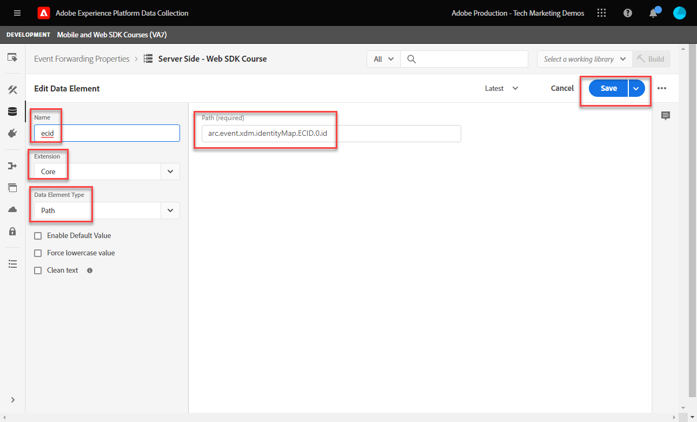
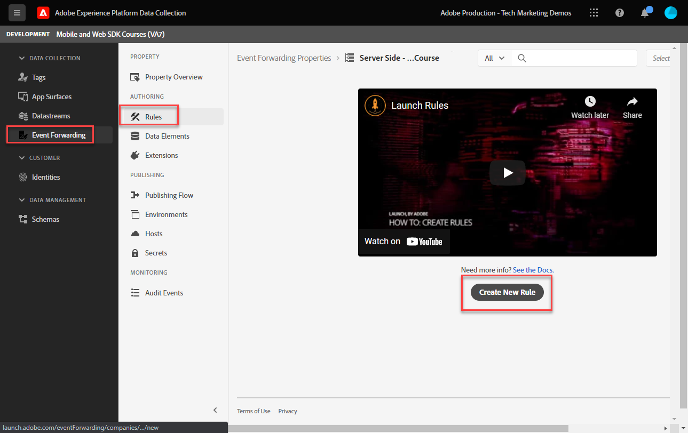

# 이벤트 전달 속성 설정

Experience Platform 웹 SDK 데이터를 사용하여 이벤트 전달 속성을 사용하는 방법에 대해 알아봅니다.

이벤트 전달은 데이터 수집에서 사용할 수 있는 새로운 유형의 속성입니다. 이벤트 전달을 사용하면 기존의 클라이언트측 브라우저 대신 Adobe Experience Platform Edge Network에서 직접 타사, Adobe 이외의 공급업체에 데이터를 보낼 수 있습니다. 에서 이벤트 전달의 장점에 대해 자세히 알아보십시오. [이벤트 전달 개요](https://experienceleague.adobe.com/docs/experience-platform/tags/event-forwarding/overview.html?lang=en).

Adobe Experience Platform에서 이벤트 전달을 사용하려면 먼저 다음 세 가지 옵션 중 하나 이상을 사용하여 Adobe Experience Platform Edge Network로 데이터를 보내야 합니다.

* [Adobe Experience Platform 웹 SDK](overview.md)
* [Adobe Experience Platform Mobile SDK](https://developer.adobe.com/client-sdks/documentation/)
  <!--* [Server-to-Server API](https://experienceleague.adobe.com/docs/audience-manager/user-guide/api-and-sdk-code/dcs/dcs-apis/dcs-s2s.html?lang=en)-->

>[!NOTE]
>Platform 웹 SDK 및 Platform Mobile SDK는 태그를 통해 배포할 필요가 없지만 태그를 사용하여 이러한 SDK를 배포하는 것이 좋습니다.

이 자습서의 이전 단원을 완료한 후에는 웹 SDK를 사용하여 Platform Edge Network에 데이터를 전송해야 합니다. 데이터가 Platform Edge Network에 있으면 Adobe 전달을 활성화하고 이벤트 전달 속성을 사용하여 데이터를 이벤트가 아닌 솔루션으로 보낼 수 있습니다.

## 학습 목표

이 단원을 마치면 다음을 수행할 수 있습니다.

* 이벤트 전달 속성 만들기
* Platform Web SDK 데이터스트림에 이벤트 전달 속성 연결
* 태그 속성 데이터 요소와 규칙의 차이점과 이벤트 전달 속성 데이터 요소와 규칙의 차이점을 이해합니다
* 이벤트 전달 데이터 요소 만들기
* 이벤트 전달 규칙 구성
* 이벤트 전달 속성이 데이터를 성공적으로 보내고 있는지 확인합니다.

## 전제 조건

* 이벤트 전달이 포함된 소프트웨어 라이센스. 이벤트 전달은 데이터 수집의 유료 기능입니다. 자세한 내용은 Adobe 계정 팀에 문의하십시오.
* Experience Cloud 조직에서 이벤트 전달이 활성화되었습니다.
* 이벤트 전달에 대한 사용자 권한. (위치 [Admin Console](https://adminconsole.adobe.com/), Adobe Experience Platform Launch 제품에서 다음에 대한 권한 항목[!UICONTROL 플랫폼] > [!UICONTROL Edge] 및 모두 [!UICONTROL 속성 권한]). 권한이 부여되면 다음이 표시됩니다. [!UICONTROL 이벤트 전달] 데이터 수집 인터페이스의 왼쪽 탐색에서 다음을 수행합니다.
  

* Edge Network로 데이터를 전송하도록 구성된 Adobe Experience Platform 웹 또는 Mobile SDK입니다. 이 자습서의 다음 단원을 완료해야 합니다.

   * 초기 구성

      * [권한 구성](configure-permissions.md)
      * [XDM 스키마 구성](configure-schemas.md)
      * [ID 네임스페이스 구성](configure-identities.md)
      * [데이터스트림 구성](configure-datastream.md)

   * 태그 구성

      * [웹 SDK 확장 기능 설치](install-web-sdk.md)
      * [데이터 요소 만들기](create-data-elements.md)
      * [ID 만들기](create-identities.md)
      * [태그 규칙 만들기](create-tag-rule.md)
      * [Adobe Experience Platform Debugger로 유효성 검사](validate-with-debugger.md)

## 이벤트 전달 속성 만들기

먼저 이벤트 전달 속성을 만듭니다.

1. 를 엽니다. [데이터 수집 인터페이스](https://experience.adobe.com/#/data-collection)
1. 선택 **[!UICONTROL 이벤트 전달]** 왼쪽 탐색에서
1. **[!UICONTROL 새 속성]**을 선택합니다.
   

1. 속성 이름을 지정합니다. 이 경우 `Server-Side - Web SDK Course`

1. **[!UICONTROL 저장]**을 선택합니다.
   

## 데이터 스트림 구성

이벤트 전달에서 Edge 네트워크로 전송하는 데이터를 사용하려면 새로 만든 이벤트 전달 속성을 Adobe 솔루션으로 데이터를 전송하는 데 사용되는 데이터 스트림과 연결해야 합니다.

데이터 스트림에서 Target을 구성하려면 다음 작업을 수행하십시오.

1. 다음으로 이동 [데이터 수집](https://experience.adobe.com/#/data-collection){target="blank"} 인터페이스
1. 왼쪽 탐색에서 을 선택합니다. **[!UICONTROL 데이터스트림]**
1. 이전에 만든 항목 선택 `Luma Web SDK` 데이터스트림

   

1. 선택 **[!UICONTROL 서비스 추가]**
   
1. 선택 **[!UICONTROL 이벤트 전달]** (으)로 **[!UICONTROL 서비스]**

1. 아래 **[!UICONTROL 속성 ID]** 드롭다운에서 이벤트 전달 속성에 지정한 이름을 선택합니다. 이 경우 `Server-Side - Web SDK Course`

1. 아래 **[!UICONTROL 환경 ID]** 드롭다운에서 이벤트 전달 환경을 연결할 태그 환경(이 경우 )을 선택합니다 `Development`

   >[!TIP]
   >
   >    Adobe 조직 외부의 이벤트 전달 환경에 데이터를 보내려면 **[!UICONTROL ID 수동 입력]** ID에 붙여 넣습니다. 이벤트 전달 속성을 만들 때 ID가 제공됩니다.

1. **[!UICONTROL 저장]**&#x200B;을 선택합니다.

   

게시 플로우를 통해 변경 사항을 승격할 준비가 되면 스테이징 및 프로덕션 데이터스트림에 대해 이 단계를 반복합니다.

## Platform Edge Network에서 Adobe이 아닌 솔루션으로 데이터 전달

이 연습에서는 이벤트 전달 데이터 요소를 설정하고, 이벤트 전달 규칙을 구성하고, 이라는 세 번째 부분 도구를 사용하여 유효성을 검사하는 방법을 알아봅니다 [Webhook.site](https://webhook.site/).

>[!NOTE]
>
>웹후크는 서로 다른 시스템을 반실시간으로 통합하는 방법입니다. [Webhook.site](https://webhook.site/) 는 수신되는 HTTP 요청 또는 이메일을 쉽게 검사, 테스트 및 자동화할 수 있는 서드파티 도구입니다(시각적 사용자 지정 작업 빌더 또는 WebhookScript 사용).

>[!IMPORTANT]
>
>계속 진행하려면 이미 데이터 요소를 만들어 XDM 개체에 매핑하고, 구성된 태그 규칙과 라이브러리 내에서 이러한 변경 사항을 태그 환경에 빌드했어야 합니다. 없는 경우 다음을 참조하십시오. **태그 구성** 의 단계 [전제 조건](setup-event-forwarding.md#prerequisites) 섹션. 이러한 단계에서는 데이터가 Platform Edge Network로 전송되고, 여기에서 Adobe 전달 속성을 구성하여 데이터를 비 이벤트 솔루션으로 전달할 수 있습니다.

### 이벤트 전달 데이터 요소 만들기

Platform Web SDK 태그 확장을 사용하여 이전에 구성한 XDM 개체는 이벤트 전달 속성에서 데이터 요소의 데이터 소스가 됩니다. 태그 속성에 이미 구성한 것과 동일한 데이터를 이벤트 전달을 위한 데이터 소스로 사용합니다.

>[!IMPORTANT]
>
>이벤트 전달에서 XDM 필드를 참조할 때 다른 컨텍스트와 키 구문 차이가 있습니다. 이벤트 전달 속성에서 데이터를 참조하려면 데이터 요소 경로에 `arc.event` 접두사:
>
> * `arc`는 Adobe 응답 컨텍스트를 나타냅니다.
> * 예: `arc.event.xdm.web.webPageDetails.URL`
>
>이 경로를 잘못 지정하면 데이터가 수집되지 않습니다.

이 연습에서는 브라우저 뷰포트 높이와 Experience Cloud ID를 XDM 개체에서 웹후크로 전달합니다. XDM 필드 경로는 다음 작업 중에 생성된 XDM 스키마에 의해 결정됩니다 [XDM 스키마 구성](configure-schemas.md) 레슨.

>[!TIP]
>
>또한 웹 브라우저 네트워크 도구에서에 대한 필터링을 사용하여 XDM 개체 경로를 찾을 수도 있습니다 `/ee` 요청, 비콘 열기 [!UICONTROL **페이로드**] 원하는 변수로 드릴다운할 수 있습니다. 그런 다음 마우스로 마우스 오른쪽 단추를 클릭하고 &quot;속성 경로 복사&quot;를 선택합니다. 다음은 브라우저 뷰포트 높이에 대한 예입니다.
> 

1. 로 이동 **[!UICONTROL 이벤트 전달]** 최근에 생성한 속성

1. 왼쪽 탐색에서 을 선택합니다. **[!UICONTROL 데이터 요소]**

1. 다음을 선택: **[!UICONTROL 새 데이터 요소 만들기]**

   

1. **[!UICONTROL 이름]** 데이터 요소 `environment.browserDetails.viewportHeight`

1. 아래 **[!UICONTROL 확장]**, 나가기 `CORE`

1. 아래 **[!UICONTROL 데이터 요소 유형]**, 선택 `Path`

1. 브라우저 뷰포트 높이가 포함된 XDM 개체 경로를 입력합니다. `arc.event.xdm.environment.browserDetails.viewportHeight`

1. 선택 **[!UICONTROL 저장]**

   

1. 다른 데이터 요소 만들기

1. **[!UICONTROL 이름]** it `ecid`

1. 아래 **[!UICONTROL 확장]**, 나가기 `CORE`

1. 아래 **[!UICONTROL 데이터 요소 유형]**, 선택 `Path`

1. Experience Cloud ID가 포함된 XDM 개체 경로를 입력합니다 `arc.event.xdm.identityMap.ECID.0.id`

1. 선택 **[!UICONTROL 저장]**

   

   >[!CAUTION]
   >
   > 다음을 포함해야 합니다. `arc.event.` 를 경로에 접두사로 추가합니다. 또한 XDM 개체 필드 이름과 정확히 일치하는 대/소문자를 따라야 합니다. 즉, ECID 네임스페이스는 모두 대문자로 표시되어야 합니다.

   >[!TIP]
   >
   자체 웹 사이트로 작업할 때 웹 브라우저 네트워크 도구를 사용하여 XDM 개체 경로를 찾을 수 있습니다. `/ee` 요청, 비콘 열기 [!UICONTROL **페이로드**] 원하는 변수로 드릴다운할 수 있습니다. 그런 다음 마우스로 마우스 오른쪽 단추를 클릭하고 &quot;속성 경로 복사&quot;를 선택합니다. 다음은 브라우저 뷰포트 높이에 대한 예입니다.
   

### Adobe Cloud Connector 확장 설치

데이터를 서드파티 위치로 보내려면 먼저 [!UICONTROL Adobe 클라우드 커넥터] 확장명.

1. 선택 **[!UICONTROL 확장]** 왼쪽 탐색

1. 다음 항목 선택 **[!UICONTROL 카탈로그]** 탭

1. 검색 **[!UICONTROL Adobe 클라우드 커넥터]**, 선택 **[!UICONTROL 설치]**

   

확장 구성이 필요하지 않습니다. 이제 이 확장을 사용하여 데이터를 Adobe이 아닌 솔루션으로 전달할 수 있습니다!

### 이벤트 전달 규칙 만들기

태그 속성의 규칙 구성과 이벤트 전달 속성의 규칙 간에는 몇 가지 주요 차이점이 있습니다.

* **[!UICONTROL 이벤트] 및 [!UICONTROL 조건]**:

   * **태그**: 모든 규칙은 규칙에 지정해야 하는 이벤트(예: )에 의해 트리거됩니다. `Library Loaded - Page Top`. 조건은 선택 사항입니다.
   * **이벤트 전달**: Platform Edge Network로 전송된 모든 이벤트가 데이터를 전달하는 트리거라고 가정합니다. 따라서 [!UICONTROL 이벤트] 이벤트 전달 규칙에서 선택해야 합니다. 이벤트 전달 규칙을 트리거하는 이벤트를 관리하려면 조건을 구성해야 합니다.

* **데이터 요소 토큰화**:

   * **태그**: 데이터 요소 이름은 `%` 규칙에 사용할 때 데이터 요소 이름의 시작 및 끝 예: `%viewportHeight%`.

   * **이벤트 전달**: 데이터 요소 이름을 로 토큰화합니다. `{{` 의 시작과 `}}` 규칙에 사용될 때 데이터 요소 이름의 끝 예: `{{viewportHeight}}`.

* **규칙 작업 순서**:

   * 이벤트 전달 규칙의 작업 섹션은 항상 순차적으로 실행됩니다. 규칙을 저장할 때 작업 순서가 올바른지 확인합니다. 이 실행 시퀀스는 태그를 사용할 때처럼 비동기식으로 실행할 수 없습니다.

<!--
  * **Tags**: Rule actions can easily be reordered using drag-and-drop functionality.
  * **Event forwarding**: Rule actions are always executed sequentially. Make sure the order of actions is correct when you save a rule.
-->

데이터를 웹후크에 전달하는 규칙을 구성하려면 먼저 개인 웹후크를 얻어야 합니다.

1. 다음으로 이동 [Webhook.site](https://webhook.site)

1. 찾기 **고유 URL**, 이벤트 전달 규칙에서 URL 요청으로 사용됩니다.

1. 선택 **[!UICONTROL 클립보드에 복사]**

1. Webhook에 의해 캡처되는 이벤트 전달 데이터를 실시간으로 확인할 수 있으므로 이 창을 열어 두십시오

   

1. 돌아가기 **[!UICONTROL 데이터 수집]** > **[!UICONTROL 이벤트 전달]** > **[!UICONTROL 규칙]** 왼쪽 탐색에서

1. 선택 **[!UICONTROL 새 규칙 만들기]**

   

1. 이름 지정 `all events - ad cloud connector - webhook`

1. 작업 추가

1. 아래 **[!UICONTROL 확장]**, 선택 **[!UICONTROL Adobe 클라우드 커넥터]**

1. 아래 **[!UICONTROL 작업 유형]**, 선택 **[!UICONTROL 가져오기 호출 만들기]**

1. Webhook URL을 **[!UICONTROL URL]** 필드

   

1. 아래 **[쿼리 매개 변수]**, 이전에 만든 두 데이터 요소를 모두 추가합니다.

1. 다음에서 **[!UICONTROL 키]** 의 열 유형 `viewPortHeight`. 다음에서 **[!UICONTROL 값]** 열에서 `{{environment.browserDetails.viewportHeight}}` 데이터 요소를 입력하거나 데이터 요소 선택기 아이콘에서 선택하여 데이터 요소를 생성합니다.

1. 선택 [!UICONTROL **+ 다른 항목 추가**] 다른 쿼리 매개 변수를 추가하려면

1. 다음에서 **[!UICONTROL 키]** 의 열 유형 `ecid`. 값 열에서 `{{ecid}}` 데이터 요소

1. 선택 **[!UICONTROL 변경 내용 유지]**

   

1. 규칙은 다음과 같아야 합니다.

1. 선택 **[!UICONTROL 저장]**

   

### 라이브러리 만들기 및 빌드

라이브러리를 만들고 일반적인 태그 속성에서와 마찬가지로 이벤트 전달 개발 환경에 대한 모든 변경 사항을 빌드합니다.

>[!NOTE]
>
스테이징 및 프로덕션 이벤트 전달 속성을 데이터 스트림에 연결하지 않은 경우 개발 환경이 라이브러리를 빌드할 수 있는 유일한 옵션으로 표시됩니다.

## 이벤트 전달 규칙 확인

이제 Platform Debugger 및 Webhook.site를 사용하여 이벤트 전달 속성을 확인할 수 있습니다.

1. 다음 단계를 수행합니다. [태그 라이브러리 전환](validate-with-debugger.md#use-the-experience-platform-debugger-to-map-to-your-tag-property) 다음에 있음 [Luma 데모 사이트](https://luma.enablementadobe.com/content/luma/us/en/men.html) 데이터 스트림에서 이벤트 전달 속성을 매핑한 Web SDK 태그 속성에 매핑됩니다.

1. 페이지를 다시 로드하기 전에 Experience Platform 디버거에서 를 엽니다. **[!UICONTROL 로그]** 왼쪽 탐색에서

1. 다음 항목 선택 **[!UICONTROL Edge]** 탭을 선택한 다음 를 선택합니다 **[!UICONTROL 연결]** platform Edge Network 요청을 보려면

   

1. 페이지 다시 로드

1. Platform Edge Network에서 WebHook으로 전송되는 서버측 요청을 확인할 수 있는 추가 요청이 표시됩니다

1. 포커스 유효성 검사 요청은 Edge 네트워크에서 전송하는 완전히 구성된 URL을 표시하는 요청입니다

   

1. viewPortHeight 및 ecid 쿼리 문자열 매개 변수를 확인합니다.

   

1. XDM 개체에 표시되는 데이터와 일치합니다

   

1. 마지막으로, 데이터가 다음 위치에서 일치하는지 확인합니다. [Webhook.site](https://webhook.site) 또한 열려 있는 Webhook 창을 보면

   

축하합니다! 이벤트 전달을 구성했습니다!

[다음: ](conclusion.md)

>[!NOTE]
>
Adobe Experience Platform Web SDK에 대해 학습하는 데 시간을 투자해 주셔서 감사합니다. 질문이 있거나, 일반적인 피드백을 공유하거나, 향후 콘텐츠에 대한 제안이 있는 경우 이에 대해 공유하십시오. [Experience League 커뮤니티 토론 게시물](https://experienceleaguecommunities.adobe.com/t5/adobe-experience-platform-launch/tutorial-discussion-implement-adobe-experience-cloud-with-web/td-p/444996)