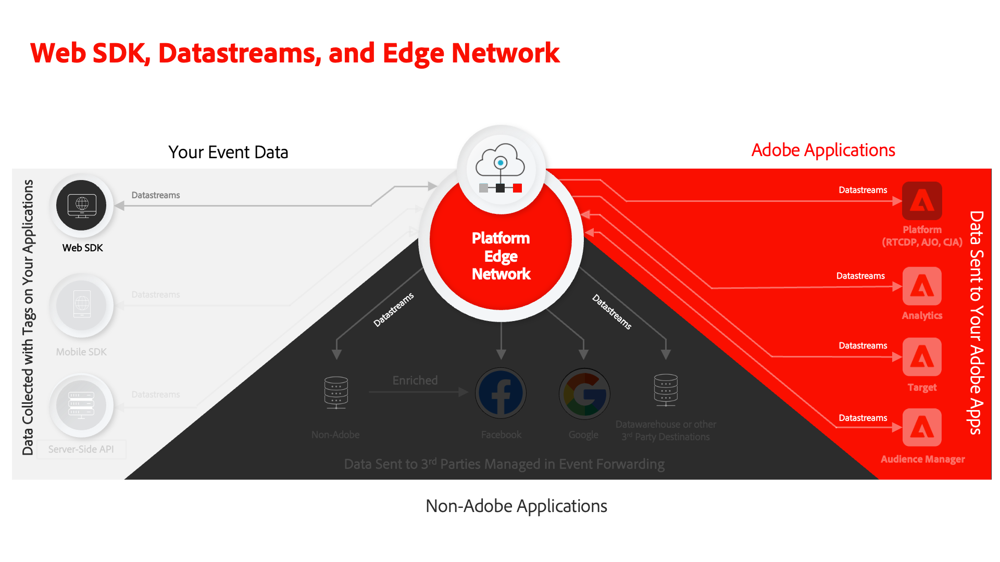

# 데이터스트림 구성

Adobe Experience Platform Web SDK의 데이터스트림을 구성하는 방법을 알아봅니다.

[데이터스트림](https://experienceleague.adobe.com/en/docs/experience-platform/datastreams/overview)은(는) Platform Web SDK에서 수집한 데이터를 보낼 위치를 Adobe Experience Platform Edge Network에 알려줍니다. 데이터스트림 구성에서 Experience Cloud 애플리케이션, Experience Platform 계정 및 이벤트 전달을 활성화합니다.

## 학습 목표

이 단원을 마치면 다음을 수행할 수 있습니다.

* 데이터 스트림 만들기
* 데이터 스트림 무시 시작

## 전제 조건

데이터 스트림을 구성하기 전에 다음 단원을 이미 완료해야 합니다.

* [스키마 구성](configure-schemas.md)
* [ID 네임스페이스 구성](configure-identities.md)

## 데이터 스트림 만들기

이제 데이터 스트림을 만들어 Platform Edge Network에 Web SDK에서 수집한 데이터를 보낼 위치를 지정할 수 있습니다.

**데이터 스트림을 만들려면:**

1. [데이터 수집 인터페이스](https://experience.adobe.com/data-collection/){target="_blank"} 열기
1. 올바른 샌드박스에 있는지 확인하십시오

   >[!NOTE]
   >
   >Real-Time CDP 또는 Journey Optimizer과 같은 플랫폼 기반 애플리케이션의 고객인 경우 이 자습서에서는 개발 샌드박스를 사용하는 것이 좋습니다. 그렇지 않은 경우 **[!UICONTROL Prod]** 샌드박스를 사용하십시오.

1. 왼쪽 탐색 영역에서 **[!UICONTROL 데이터스트림]**(으)로 이동
1. **[!UICONTROL 새 데이터 스트림]** 선택
1. `Luma Web SDK: Development Environment`을(를) **[!UICONTROL 이름]**(으)로 입력하십시오. 이 이름은 나중에 태그 속성에서 웹 SDK 확장을 구성할 때 참조됩니다.
1. **[!UICONTROL 저장]** 선택

   

   >[!NOTE]
   >
   >스키마를 선택할 필요는 없습니다. 스키마 선택은 [데이터 수집을 위한 데이터 준비](/help/data-collection/edge/data-prep.md) 기능을 사용하는 경우에만 필요합니다.

다음 화면에서는 데이터 스트림에 Adobe 애플리케이션과 같은 서비스를 추가할 수 있지만, 이 시점에서는 서비스를 추가하지 않습니다. 나중에 [Experience Platform 설정](setup-experience-platform.md), [Analytics 설정](setup-analytics.md), [Audience Manager 설정](setup-audience-manager.md), [Target 설정](setup-target.md) 또는 [이벤트 전달](setup-event-forwarding.md) 단원에서 수행합니다.

>[!NOTE]
>
>자체 웹 사이트에서 Platform Web SDK을 구현할 때에는 세 개의 태그 환경(개발, 스테이지 및 프로덕션)에 매핑할 세 개의 데이터스트림을 만들어야 합니다. Adobe Real-Time Customer Data Platform 또는 Adobe Journey Optimizer과 같은 플랫폼 기반 애플리케이션과 함께 Platform Web SDK을 사용하는 경우 적절한 Platform 샌드박스에서 이러한 데이터스트림을 만들어야 합니다.

## 데이터 스트림 재정의

[데이터 스트림 재정의](https://experienceleague.adobe.com/en/docs/experience-platform/datastreams/overrides)를 사용하면 데이터 스트림에 대한 추가 구성을 정의한 다음 특정 조건에서 기본 구성을 재정의할 수 있습니다.

데이터 스트림 구성 재정의는 2단계 프로세스입니다.

1. 먼저 데이터 스트림 서비스 구성에서 데이터 스트림 재정의를 정의합니다. 예를 들어 재정의로 사용할 대체 Analytics 보고서 세트, Target 작업 공간 또는 Platform 데이터 세트를 정의할 수 있습니다.
1. 그런 다음 웹 Edge Network 전송 이벤트 작업을 사용하거나 웹 SDK 태그 확장의 구성을 통해 SDK에 재정의를 전송합니다.

[Adobe Analytics 설정](setup-analytics.md) 단원에서 Platform Web SDK 이벤트 보내기 작업을 사용하여 페이지에 대한 보고서 세트를 재정의합니다.

이제 태그 속성에 Platform Web SDK 확장을 설치할 준비가 되었습니다!

[다음: ](install-web-sdk.md)

>[!NOTE]
>
>Adobe Experience Platform 웹 SDK에 대해 학습하는 데 시간을 투자해 주셔서 감사합니다. 질문이 있거나 일반적인 피드백을 공유하고 싶거나 향후 콘텐츠에 대한 제안이 있는 경우 이 [Experience League 커뮤니티 토론 게시물](https://experienceleaguecommunities.adobe.com/t5/adobe-experience-platform-data/tutorial-discussion-implement-adobe-experience-cloud-with-web/td-p/444996)에서 공유하십시오.
