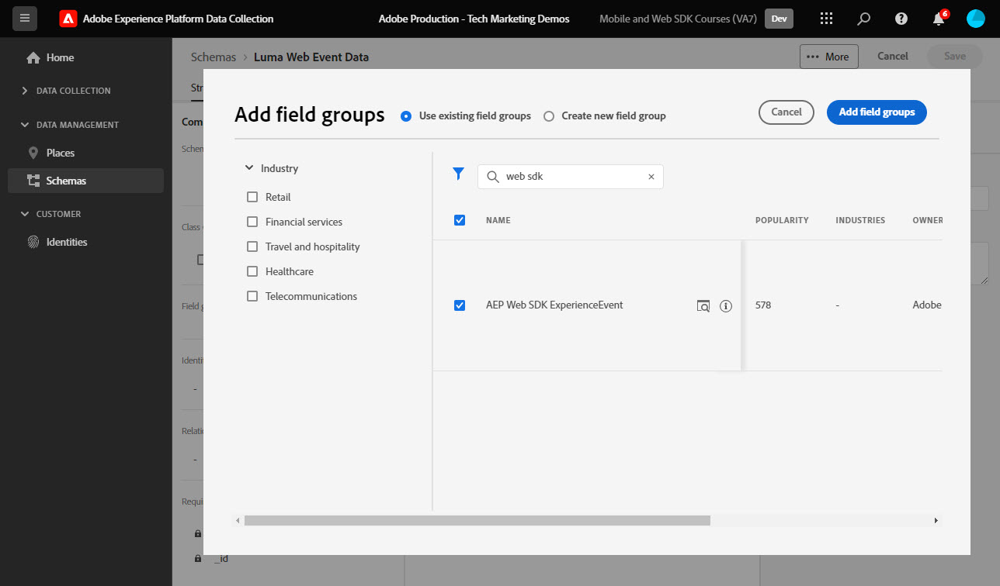
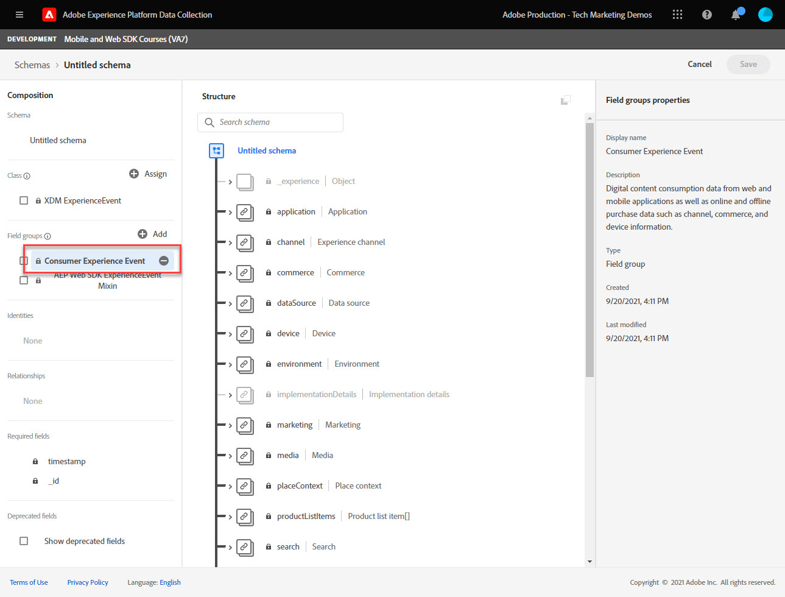

# 웹 데이터를 위한 XDM 스키마 만들기

데이터 수집 인터페이스에서 웹 데이터에 대한 XDM 스키마를 만드는 방법을 알아봅니다.

XDM(Experience Data Model) 스키마는 Adobe Experience Platform에서 스키마를 구성하기 위한 빌딩 블록, 원칙 및 우수 사례입니다.

Platform Web SDK는 스키마를 사용하여 웹 이벤트 데이터를 표준화하고, Platform Edge 네트워크에 전송하며, 궁극적으로 데이터를 데이터 스트림에 구성된 모든 Experience Cloud 애플리케이션에 전달합니다. 이 단계는 고객 경험 데이터를 Experience Platform에 수집하는 데 필요한 표준 데이터 모델을 정의하고 이러한 표준을 기반으로 구축된 다운스트림 서비스 및 애플리케이션을 구현하기 때문에 중요합니다.

>[!NOTE]
>
> 데모 목적으로 이 단원의 연습에서는 [Luma 데모 사이트](https://luma.enablementadobe.com/content/luma/us/en.html). 이러한 단계를 사용하여 고유한 목적으로 다른 스키마를 생성할 수 있지만 먼저 예제 스키마 만들기 와 함께 수행하여 스키마 편집기의 기능을 학습하는 것이 좋습니다.

XDM 스키마에 대한 자세한 내용은 &quot; 과정을 따르십시오.[XDM을 사용하여 고객 경험 데이터 모델링](https://experienceleague.adobe.com/?recommended=ExperiencePlatform-D-1-2021.1.xdm)또는 [XDM 시스템 개요](https://experienceleague.adobe.com/docs/experience-platform/xdm/home.html?lang=ko).

## 학습 목표

이 단원을 마치면 다음을 수행할 수 있습니다.

* 데이터 수집 인터페이스 내에서 XDM 스키마 만들기
* XDM 스키마에 필드 그룹 추가
* 우수 사례를 사용하여 웹 이벤트 데이터에 대한 XDM 스키마 만들기

## 전제 조건

다음에 설명된 데이터 수집 및 Adobe Experience Platform에 필요한 모든 프로비저닝 및 사용자 권한 [권한 구성](configure-permissions.md) 단원.

## XDM 스키마 만들기

XDM 스키마는 Experience Platform에서 데이터를 설명하는 표준 방법으로서, 스키마를 준수하는 모든 데이터를 충돌 없이 조직 간에 재사용하거나 여러 조직 간에 공유하도록 허용합니다. 자세한 내용은 [스키마 구성 기본 사항](https://experienceleague.adobe.com/docs/experience-platform/xdm/schema/composition.html?lang=ko-KR).

이 연습에서는 의 웹 이벤트 데이터를 캡처하기 위해 권장 기준 필드 그룹을 사용하여 XDM 스키마를 만듭니다 [Luma 데모 사이트](https://luma.enablementadobe.com/content/luma/us/en.html){target=&quot;_blank&quot;}:

1. 를 엽니다. [데이터 수집 인터페이스](https://launch.adobe.com/){target=&quot;_blank&quot;}
1. 올바른 샌드박스에 있는지 확인합니다

   >[!NOTE]
   >
   >실시간 CDP와 같은 플랫폼 기반 애플리케이션을 사용하는 경우에는 이 자습서에 개발 샌드박스를 사용하는 것이 좋습니다.

1. 이동 **[!UICONTROL 스키마]** 왼쪽 탐색
1. 을(를) 선택합니다 **[!UICONTROL 스키마 만들기]** 오른쪽 상단의 단추
1. 드롭다운 메뉴에서 을(를) 선택합니다 **[!UICONTROL XDM ExperienceEvent]**

## 필드 그룹 추가

앞에서 언급한 바와 같이 XDM은 다운스트림 Adobe Experience Platform 서비스에서 사용할 일반적인 구조 및 정의를 제공하여 고객 경험 데이터를 표준화하는 핵심 프레임워크입니다. XDM 표준을 준수함으로써 _모든 고객 경험 데이터_ 를 공통 표현으로 통합할 수 있습니다. 이 접근 방식을 사용하면 고객 작업을 통해 중요한 통찰력을 얻을 수 있고 세그먼트를 통해 고객 대상을 정의할 수 있으며 여러 소스의 데이터를 사용하여 개인화를 위한 고객 속성을 표현할 수 있습니다. 자세한 내용은 [데이터 모델링 우수 사례](https://experienceleague.adobe.com/docs/experience-platform/xdm/schema/best-practices.html?lang=en) 추가 정보.

가능하면 기존 필드 그룹을 사용하고 제품에 영향을 받지 않는 모델 및 이름 지정 규칙을 준수하는 것이 좋습니다. 위의 사전 정의된 필드 그룹에 맞지 않는 조직 고유의 데이터에 대해 사용자 지정 필드 그룹을 만들 수 있습니다. 자세한 내용은 [스키마 편집기를 사용하여 스키마 만들기](https://experienceleague.adobe.com/docs/experience-platform/xdm/tutorials/create-schema-ui.html?lang=en#create) 를 참조하십시오.

>[!TIP]
> 
>이 연습에서는 웹 데이터 수집을 위해 권장되는 사전 정의된 필드 그룹을 추가합니다. _**[!UICONTROL AEP 웹 SDK ExperienceEvent Mixin]**_, 및 _**[!UICONTROL 소비자 경험 이벤트]**_.

1. 유지 **[!UICONTROL 기존 필드 그룹 사용]** 라디오 단추 선택
1. 검색 대상 [!UICONTROL `AEP Web SDK ExperienceEvent Mixin`]
1. 상자를 선택합니다.
1. 검색 대상 [!UICONTROL `Consumer Experience Event`]
1. 상자를 선택합니다.
1. 선택 **[!UICONTROL 필드 그룹 추가]**

   

필드 그룹을 선택하면 스키마의 이름을 지정할 수 있습니다. XDM 스키마에 대한 일반적인 이름 지정 규칙은 데이터 소스 뒤에 스키마의 이름을 지정합니다.

1. **[!UICONTROL 컴포지션**] 패널에서 을 선택합니다 `Untitled schema name`
1. 에서 **[!UICONTROL 스키마 속성]** 패널에서 다음을 입력합니다 **[!UICONTROL 표시 이름]** `Luma Web Event Data`
1. 의 바깥쪽을 선택합니다 **[!UICONTROL 표시 이름]** 활성화할 필드 **[!UICONTROL 저장]** 옵션
1. **[!UICONTROL 저장]**&#x200B;을 선택합니다

두 필드 그룹을 모두 사용하면 웹에서 데이터 수집을 위해 필요한 가장 일반적으로 사용되는 키-값 쌍에 액세스할 수 있습니다. 필드 그룹 이름 중 하나를 클릭하면 인터페이스에 속하는 키-값 쌍 그룹이 강조 표시됩니다. 아래 예에는 어떤 그룹이 속하는지 알 수 있습니다 **[!UICONTROL 소비자 경험 이벤트]**.

이 단원은 단지 시작점이다. 웹 이벤트 스키마를 구축할 때는 비즈니스 요구 사항을 탐색하고 문서화해야 합니다. 이 프로세스는 [비즈니스 요구 사항 문서](https://experienceleague.adobe.com/docs/analytics-learn/tutorials/implementation/implementation-basics/creating-a-business-requirements-document.html) 및 [솔루션 디자인 참조](https://experienceleague.adobe.com/docs/analytics-learn/tutorials/implementation/implementation-basics/creating-and-maintaining-an-sdr.html) Adobe Analytics 구현의 경우, _모든 다운스트림 데이터 수신자_ 플랫폼, Target 및 이벤트 전달 대상과 같은 .

### identityMap 개체

다음과 같은 웹 사용자를 식별하는 데 필요한 특별한 데이터 세트가 있습니다. `[!UICONTROL identityMap]`.

이 개체는 웹에서 사용자를 식별하는 데 필요한 Experience Cloud ID를 수용하므로 모든 웹 관련 데이터 수집을 위한 필수 개체입니다. 인증된 사용자에 대한 내부 고객 ID를 설정하는 키이기도 합니다. `[!UICONTROL identityMap]` 에서는 [ID 구성](configure-identities.md) 단원. 이 변수는 **[!UICONTROL XDM ExperienceEvent]** 클래스 이름을 지정합니다.

>[!IMPORTANT]
>
> 다음을 활성화할 수 있습니다 **[!UICONTROL 프로필]** 스키마 저장 전 스키마. **금지** 이 시점에서 활성화하십시오. 프로필에 대해 스키마를 활성화하면 비활성화하거나 삭제할 수 없습니다. 또한 이 시점 후에는 스키마에서 필드를 제거할 수 없습니다. 이러한 의미는 나중에 프로덕션 환경에서 자체 데이터를 사용할 때 기억해야 합니다.
>
>이 설정은 [설정 Experience Platform](setup-experience-platform.md) 단원.
>

이제 웹 SDK 확장을 태그 속성에 추가할 때 이 스키마를 참조할 수 있습니다.

[다음: ](configure-identities.md)

>[!NOTE]
>
>Adobe Experience Platform Web SDK에 대한 학습에 시간을 내주셔서 감사합니다. 질문이 있거나 일반 피드백을 공유하거나 향후 컨텐츠에 대한 제안 사항이 있는 경우 해당 정보를 공유하십시오 [Experience League 커뮤니티 토론 게시물](https://experienceleaguecommunities.adobe.com/t5/adobe-experience-platform-launch/tutorial-discussion-implement-adobe-experience-cloud-with-web/td-p/444996)
