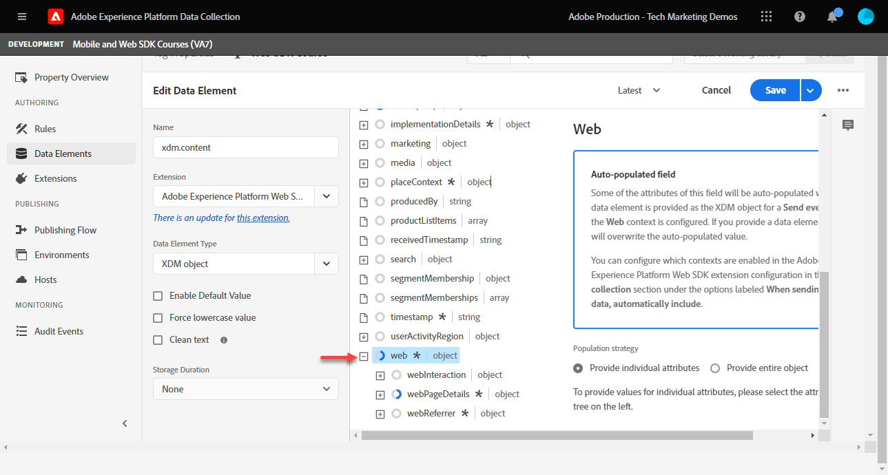
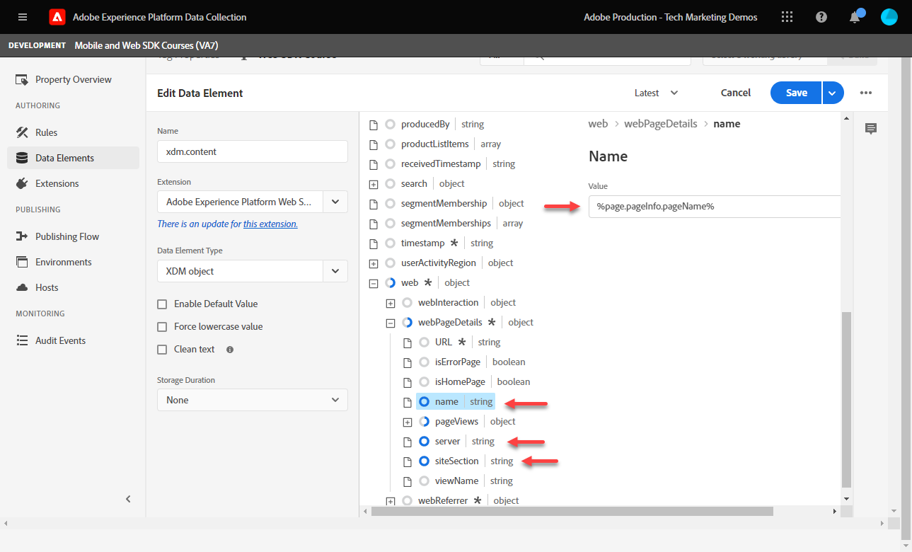

# 데이터 요소 만들기

Experience Platform 웹 SDK를 사용하여 데이터를 캡처하는 데 필요한 필수 데이터 요소를 만드는 방법을 알아봅니다. 에서 콘텐츠와 ID 데이터를 모두 캡처합니다. [Luma 데모 사이트](https://luma.enablementadobe.com/content/luma/us/en.html). XDM 객체라는 새로운 데이터 요소 유형을 통해 Platform Web SDK를 사용하여 데이터를 수집하기 위해 이전에 만든 XDM 스키마를 사용하는 방법을 알아보십시오.

>[!NOTE]
>
> 데모 목적으로 이 단원의 연습은 [스키마 구성](configure-schemas.md) 단계; 에서 본 컨텐츠와 사용자의 ID를 캡처하는 XDM 개체 예제 만들기 [Luma 데모 사이트](https://luma.enablementadobe.com/content/luma/us/en.html).

>[!IMPORTANT]
>
>이 단원의 데이터는 `[!UICONTROL digitalData]` Luma 사이트의 데이터 레이어입니다. 데이터 레이어를 보려면 개발자 콘솔을 열고 를 입력합니다. `[!UICONTROL digitalData]` 사용 가능한 전체 데이터 계층을 보려면 다음을 수행하십시오.


Platform Web SDK와 관계없이, 데이터 레이어, HTML 속성 등과 같이 웹 사이트의 데이터 수집 변수에 매핑되는 태그 속성 내에 데이터 요소를 계속 만들어야 합니다. 이러한 데이터 요소를 만든 후에는 XDM 스키마에 매핑해야 합니다 [스키마 구성](configure-schemas.md) 단원. 이를 위해 Platform Web SDK 확장은 XDM 개체라는 새 데이터 요소 유형을 사용할 수 있도록 합니다. 따라서 데이터 요소를 만드는 작업은 두 가지 작업으로 구성됩니다.

1. 웹 사이트 변수를 데이터 요소에 매핑 및
1. 이러한 데이터 요소를 XDM 개체에 매핑

1단계의 경우 Core 태그 확장의 데이터 요소 유형을 사용하여 데이터 레이어를 현재 방식으로 데이터 요소에 계속 매핑합니다. 2단계의 경우 Platform Web SDK 확장은 이전에 사용할 수 없었던 새로운 데이터 요소 유형 세트를 만듭니다.

* 이벤트 병합 ID
* ID 맵
* XDM 개체

이 단원에서는 XDM 개체 및 ID 맵 데이터 요소 유형에 중점을 둡니다. Luma 방문자의 활동 및 인증 상태를 캡처할 XDM 개체를 만듭니다.

## 학습 목표

이 단원을 마치면 다음을 수행할 수 있습니다.

* 컨텐츠 및 사용자 로그인 ID 데이터를 캡처할 데이터 요소 만들기
* ID 맵 데이터 요소 만들기
* XDM 개체 데이터 요소에 데이터 요소 매핑


## 전제 조건

데이터 계층이 무엇이고 [Luma 데모 사이트](https://luma.enablementadobe.com/content/luma/us/en.html){target=&quot;_blank&quot;} 데이터 계층 및 태그의 데이터 요소를 참조하는 방법을 알아봅니다. 자습서에서 다음 이전 단계를 완료했어야 합니다

* [권한 구성](configure-permissions.md)
* [XDM 스키마 구성](configure-schemas.md)
* [ID 네임스페이스 구성](configure-identities.md)
* [데이터 스트림 구성](configure-datastream.md)
* [태그 속성에 설치된 웹 SDK 확장](install-web-sdk.md)

>[!IMPORTANT]
>
>다음 [Experience Cloud ID 서비스 확장](https://exchange.adobe.com/experiencecloud.details.100160.adobe-experience-cloud-id-launch-extension.html) ID 서비스 기능이 Platform Web SDK에 내장되어 있으므로 Adobe Experience Platform 웹 SDK를 구현할 때에는 필요하지 않습니다.

## 데이터 요소를 만들어 데이터 레이어 캡처

XDM 개체를 만들기 전에 다음에 매핑되는 다음 데이터 요소 집합을 만드십시오 [Luma 데모 사이트](https://luma.enablementadobe.com/content/luma/us/en.html){target=&quot;_blank&quot;} 데이터 계층:

1. 이동 **[!UICONTROL 데이터 요소]** 을(를) 선택합니다. **[!UICONTROL 데이터 요소 추가]** 또는 **[!UICONTROL 새 데이터 요소 만들기]** 태그 속성에 기존 데이터 요소가 없는 경우)

   

1. 데이터 요소에 이름을 지정합니다 `page.pageInfo.pageName`
1. 를 사용하십시오 **[!UICONTROL JavaScript 변수]** **[!UICONTROL 데이터 요소 유형]** Luma의 데이터 레이어에 있는 값을 가리키려면 다음을 수행하십시오. `digitalData.page.pageInfo.pageName`

1. **[!UICONTROL Force lowercase value]** 및 **[!UICONTROL Clean text]** 상자를 체크하여 케이스를 표준화하고 외부 공백을 제거합니다

1. Leave `None` 로서의 **[!UICONTROL 저장 기간]** 이 값은 모든 페이지에서 다르므로 설정

1. **[!UICONTROL 저장]**&#x200B;을 선택합니다

   

동일한 단계에 따라 다음 4개의 추가 데이터 요소를 만듭니다.

* **`page.pageInfo.server`**  매핑된 대상
   `digitalData.page.pageInfo.server`

* **`page.pageInfo.hierarchie1`**  매핑된 대상
   `digitalData.page.pageInfo.hierarchie1`

* **`user.profile.attributes.username`**  매핑된 대상
   `digitalData.user.0.profile.0.attributes.username`

* **`user.profile.attributes.loggedIn`** 매핑된 대상
   `digitalData.user.0.profile.0.attributes.loggedIn`

* **`cart.orderId`** 매핑된 대상 `digitalData.cart.orderId` (다음 기간 동안 [Analytics 설정](setup-analytics.md) 단원)


>[!CAUTION]
>
>다음 [!UICONTROL JavaScript 변수] 데이터 요소 유형은 배열 참조를 대괄호 대신 점으로 취급하므로 사용자 이름 데이터 요소를 로 참조합니다 `digitalData.user[0].profile[0].attributes.username` **작동하지 않음**.

## ID 맵 데이터 요소 만들기

다음으로 ID 맵 데이터 요소를 만들 수 있습니다.

1. 이동 **[!UICONTROL 데이터 요소]** 을(를) 선택합니다. **[!UICONTROL 데이터 요소 추가]**

1. **[!UICONTROL 이름]** 데이터 요소 `identityMap.loginID`

1. 로서의 **[!UICONTROL 확장]**, 선택 `Adobe Experience Platform Web SDK`

1. 로서의 **[!UICONTROL 데이터 요소 유형]**, 선택 `Identity map`

1. 이렇게 하면 화면 영역이 화면 내 오른쪽에 표시됩니다 **[!UICONTROL 데이터 수집 인터페이스]** id를 구성하려면:

   

1. 로서의  **[!UICONTROL 네임스페이스]**&#x200B;에서 을(를) 선택합니다. `Luma CRM Id` 이전에 만든 네임스페이스 [ID 구성](configure-identities.md) 단원.

   >[!NOTE]
   >
   >    만약 `Luma CRM Id` 네임스페이스에서 기본 프로덕션 샌드박스에서 만들었는지 확인합니다. 기본 프로덕션 샌드박스에서 생성된 네임스페이스만 현재 네임스페이스 드롭다운에 표시됩니다.

1. 다음 이후 **[!UICONTROL 네임스페이스]** 을(를) 선택한 경우 ID를 설정해야 합니다. 을(를) 선택합니다 `user.profile.attributes.username` 사용자가 Luma 사이트에 로그인할 때 ID를 캡처하는 이 단원에서 이전에 만든 데이터 요소입니다.

<!--  >[!TIP]
   >
   >You can verify the **[!UICONTROL Luma CRM ID]** is collected in a data element on the web property by going to the [Luma Demo site](https://luma.enablementadobe.com/content/luma/us/en.html), logging in, [switching the tag environment](validate-with-debugger.md#use-the-experience-platform-debugger-to-map-to-your-tag-property) to your own, and typing `_satellite.getVar("user.profile.attributes.username")` in the web browser developer console.
   >
   >   
-->

1. 로서의 **[!UICONTROL 인증됨 상태]**, 선택 **[!UICONTROL 인증됨]**

1. **[!UICONTROL 저장]**&#x200B;을 선택합니다

   

>[!WARNING]
>
>Adobe Experience Platform에 전송된 모든 레코드에서는 기본 ID가 필요합니다. 기본적으로 Experience Cloud ID(ECID)는 Platform Web SDK의 기본 ID로 사용됩니다. 다음과 같은 기능을 사용하지 않을 수 있습니다 `Luma CRM ID` 는 사용자가 인증을 받은 후에만 존재하므로 모든 레코드에서 사용할 수 없습니다.

<!--
1. Once the data element is configured in **[!UICONTROL Data Collection interface]**, it can be tested on the Luma web property like any other Data Element. Enter the following script in the browser developer console
   
   
   ```
   _satellite.getVar('identityMap.loginID')
   ```  

   
   
   >[!NOTE]
   >
   >ECID identifier will NOT populate in the Data Element, as this is configured already with Platform Web SDK.   
-->

## XDM 개체에 데이터 요소 매핑

만드는 모든 데이터 요소는 XDM 개체에 매핑해야 합니다. 이 개체는 [스키마 구성](configure-schemas.md) 단원.

데이터 요소를 XDM 개체 필드에 매핑하는 방법은 여러 가지가 있습니다. 데이터 요소가 XDM 개체에 있는 정확한 키-값 쌍 스키마와 일치하는 경우 개별 데이터 요소를 개별 XDM 필드에 매핑하거나 데이터 요소를 전체 XDM 개체에 매핑할 수 있습니다. 이 단원에서는 개별 필드에 매핑하여 컨텐츠 데이터를 캡처합니다. 다음 방법을 배울 수 있습니다 [전체 XDM 개체에 데이터 요소 매핑](setup-analytics.md#Map-an-entire-array-to-an-XDM-Object) 에서 [Analytics 설정](setup-analytics.md) 단원.

컨텐츠 데이터를 캡처할 XDM 개체 만들기:

1. 왼쪽 탐색에서 를 선택합니다 **[!UICONTROL 데이터 요소]**
1. **[!UICONTROL 데이터 요소 추가]**&#x200B;를 선택합니다
1. ****&#x200B;데이터 요소에 이름을 지정합니다 **`xdm.content`**
1. 로서의 **[!UICONTROL 확장]** 선택 `Adobe Experience Platform Web SDK`
1. 로서의 **[!UICONTROL 데이터 요소 유형]** 선택 `XDM object`
1. 플랫폼 선택 **[!UICONTROL 샌드박스]** 에서 XDM 스키마를 만든 [XDM 스키마 구성](configure-schemas.md) 이 예에서 단원 `DEVELOPMENT Mobile and Web SDK Courses`
1. 로서의 **[!UICONTROL 스키마]**, 을(를) 선택합니다. `Luma Web Event Data` 스키마:

   

   >[!NOTE]
   >
   >샌드박스는 스키마를 만든 Experience Platform 샌드박스에 해당합니다. Experience Platform 인스턴스에 여러 샌드박스를 사용할 수 있으므로 올바른 샌드박스를 선택해야 합니다. 항상 먼저 개발 상태에서 작업한 다음 프로덕션에서 작업합니다.

1. 에 도달할 때까지 아래로 스크롤합니다. **`web`** 개체
1. 을(를) 선택하여 엽니다

   


1. 다음 웹 XDM 변수를 데이터 요소에 매핑

   * **`web.webPageDetials.name`** to `%page.pageInfo.pageName%`
   * **`web.webPageDetials.server`** to `%page.pageInfo.server%`
   * **`web.webPageDetials.siteSection`** to `%page.pageInfo.hierarchie1%`

   

1. 다음으로, `identityMap` 스키마에서 개체를 선택하고 선택합니다

1. 에 매핑 `identityMap.loginID` 데이터 요소

1. **[!UICONTROL 저장]**&#x200B;을 선택합니다

   


이 단계를 마치면 다음 데이터 요소를 만들어야 합니다.

| 코어 확장 데이터 요소 | Platform 웹 SDK 데이터 요소 |
-----------------------------|-------------------------------
| `cart.orderId` | `identityMap.loginID` |
| `page.pageInfo.hierarchie1` | `xdm.content` |
| `page.pageInfo.pageName` |  |
| `page.pageInfo.server` |  |
| `user.profile.attributes.loggedIn` |  |
| `user.profile.attributes.username` |  |

이러한 데이터 요소가 준비되면 태그에서 규칙을 만들어 XDM 개체를 통해 Platform Edge Network에 데이터 전송을 시작할 수 있습니다.

[다음: ](create-tag-rule.md)

>[!NOTE]
>
>Adobe Experience Platform Web SDK에 대한 학습에 시간을 내주셔서 감사합니다. 질문이 있거나 일반 피드백을 공유하거나 향후 컨텐츠에 대한 제안 사항이 있는 경우 해당 정보를 공유하십시오 [Experience League 커뮤니티 토론 게시물](https://experienceleaguecommunities.adobe.com/t5/adobe-experience-platform-launch/tutorial-discussion-implement-adobe-experience-cloud-with-web/td-p/444996)
