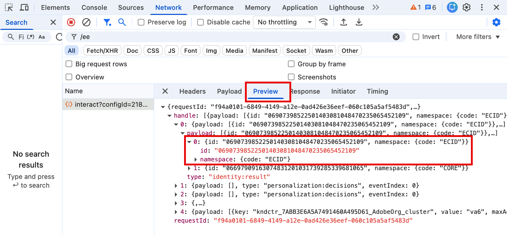

# ID 캡처

Adobe Experience Platform Web SDK를 사용하여 ID를 캡처하는 방법을 알아봅니다. [Luma 데모 웹 사이트](https://luma.enablementadobe.com)에서 인증되지 않은 ID 데이터와 인증된 ID 데이터를 모두 캡처합니다. ID 맵이라는 Platform 웹 SDK 데이터 요소 유형을 사용하여 인증된 데이터를 수집하기 위해 이전에 만든 데이터 요소를 사용하는 방법에 대해 알아봅니다.

이 단원에서는 Adobe Experience Platform Web SDK 태그 확장에서 사용할 수 있는 ID 맵 데이터 요소에 중점을 둡니다. 인증된 사용자 ID 및 인증 상태가 포함된 데이터 요소를 XDM에 매핑합니다.

## 학습 목표

이 단원을 마치면 다음을 수행할 수 있습니다.

* Experience Cloud ID(ECID)와 자사 디바이스 ID(FPID) 간의 관계 이해
* 인증되지 않은 ID와 인증된 ID의 차이점 이해
* ID 맵 데이터 요소 만들기

## 전제 조건

데이터 레이어가 무엇인지 이해하고, [Luma 데모 웹 사이트](https://luma.enablementadobe.com){target="_blank"} 데이터 레이어에 대해 잘 이해하며, 태그의 데이터 요소를 참조하는 방법을 알아봅니다. 자습서의 이전 단원을 완료했어야 합니다.

* [XDM 스키마 구성](configure-schemas.md)
* [ID 네임스페이스 구성](configure-identities.md)
* [데이터스트림 구성](configure-datastream.md)
* [태그 속성에 설치된 웹 SDK 확장](install-web-sdk.md)
* [데이터 요소 만들기](create-data-elements.md)

## Experience Cloud ID

[Experience Cloud ID(ECID)](https://experienceleague.adobe.com/ko/docs/experience-platform/identity/features/ecid)은(는) Adobe Experience Platform 및 Adobe Experience Cloud 응용 프로그램에서 사용되는 공유 ID 네임스페이스입니다. ECID는 고객 ID의 기반을 제공하며 디지털 속성의 기본 ID입니다. ECID는 항상 존재하므로 인증되지 않은 사용자 행동을 추적하는 데 이상적인 식별자입니다.

<!-- 
FYI I commented this out because it was breaking the build - Jack
>[!TIP]
>
> When you use the Experience Platform Web SDK to set up Adobe applications on your digital properties, the ECID is generated at the Adobe Edge server level. As such, ECID is not viewable on the client-side network request payload. You can view the ECID by seeing the Preview tab of the network request, or by using the [Adobe Experience Platform Debugger Edge Trace](set-up-analytics.md#experience-cloud-id-validation).
>
-->

Platform Web SDK[를 사용하여 &#x200B;](https://experienceleague.adobe.com/ko/docs/experience-platform/edge/identity/overview)ECID를 추적하는 방법에 대해 자세히 알아보십시오.

ECID는 자사 쿠키와 Platform Edge Network의 조합을 사용하여 설정됩니다. 기본적으로 자사 ID 쿠키는 웹 SDK에 의해 클라이언트측에서 설정됩니다. 쿠키 수명에 대한 브라우저 제한 사항을 고려하려면 대신 고유한 자사 ID 쿠키 서버측을 설정하도록 선택할 수 있습니다. 이러한 ID 쿠키를 자사 디바이스 ID(FPID)라고 합니다.

>[!IMPORTANT]
>
>ID 서비스 기능이 Platform Web SDK에 내장되어 있으므로 Adobe Experience Platform Web SDK을 구현할 때는 [Experience Cloud ID 서비스 확장](https://exchange.adobe.com/apps/ec/100160/adobe-experience-cloud-id-launch-extension)이 필요하지 않습니다.

## 자사 디바이스 ID(FPID)

FPID는 자사 쿠키 _Adobe에서 웹 SDK에 의해 설정된 자사 쿠키를 사용하는 대신 고유한 웹 서버를 사용하여 설정_&#x200B;한 다음 ECID를 만드는 데 사용합니다. 브라우저 지원은 다를 수 있지만 DNS CNAME 또는 JavaScript 코드로 설정할 때와 달리 DNS A 레코드(IPv4의 경우) 또는 AAAA 레코드(IPv6의 경우)를 활용하는 서버에서 설정할 때 자사 쿠키의 내구성이 더 뛰어난 경향이 있습니다.

FPID 쿠키가 설정되면 해당 값을 가져와 이벤트 데이터가 수집될 때 Adobe으로 전송할 수 있습니다. 수집된 FPID는 Platform Edge Network에서 ECID를 생성하는 시드로 사용되며 Adobe Experience Cloud 애플리케이션에서 계속 기본 식별자입니다.

이 자습서에서는 FPID를 사용하지 않지만 자체 웹 SDK 구현에서는 FPID를 사용하는 것이 좋습니다. Platform Web SDK의 [자사 장치 ID에 대해 자세히 알아보세요](https://experienceleague.adobe.com/ko/docs/experience-platform/edge/identity/first-party-device-ids)

>[!CAUTION]
>
> FPID는 웹 서버에서 설정한 쿠키를 사용하여 ECID를 생성하는 대체 방법입니다. 인증된 사용자를 식별하는 데 사용되지 않습니다.

## 인증된 Id

위에서 언급했듯이 Platform Web SDK을 사용할 때 Adobe에서 디지털 속성에 대한 모든 방문자에게 ECID를 할당합니다. ECID는 인증되지 않은 디지털 동작을 추적하기 위한 기본 ID입니다.

또한 인증된 사용자 ID를 전송하여 플랫폼에서 [ID 그래프](https://experienceleague.adobe.com/ko/docs/platform-learn/tutorials/identities/understanding-identity-and-identity-graphs)를 만들 수 있고 Target에서 [타사 ID](https://experienceleague.adobe.com/ko/docs/target/using/audiences/visitor-profiles/3rd-party-id)를 설정할 수 있습니다. 인증된 ID를 설정하는 작업은 [!UICONTROL ID 맵] 데이터 요소 유형을 사용하여 수행됩니다.

[!UICONTROL ID 맵] 데이터 요소를 만들려면:

1. **[!UICONTROL 데이터 요소]**(으)로 이동하여 **[!UICONTROL 데이터 요소 추가]**&#x200B;를 선택합니다.

1. 데이터 요소 **[!UICONTROL 의]**&#x200B;이름`Identity Map`

1. **[!UICONTROL 확장]**(으)로 `Adobe Experience Platform Web SDK`을(를) 선택합니다.

1. **[!UICONTROL 데이터 요소 형식]**(으)로 `Identity map`을(를) 선택합니다.

1. **[!UICONTROL 네임스페이스]**(으)로 `lumaCrmId`ID 구성[&#x200B; 단원에서 만든 &#x200B;](configure-identities.md) 네임스페이스를 선택합니다. 드롭다운에 표시되지 않으면 을 입력합니다.

1. **[!UICONTROL ID]**(으)로 `User Id`데이터 요소 만들기[&#x200B; 단원에서 만든 &#x200B;](create-data-elements.md#create-data-elements-to-capture-the-data-layer) 데이터 요소를 선택합니다.

1. **[!UICONTROL 인증됨 상태]**(으)로 **[!UICONTROL 인증됨]**&#x200B;을(를) 선택합니다.
1. **[!UICONTROL 기본]** 선택

1. **[!UICONTROL 저장]** 선택

   

>[!IMPORTANT]
>
> Adobe에서는 `Luma CRM Id`과(와) 같은 사용자를 나타내는 ID를 [!UICONTROL 기본] ID로 보낼 것을 권장합니다.
>
> ID 맵에 사용자 식별자가 포함된 경우(예: `Luma CRM Id`) 사용자 식별자는 [!UICONTROL 기본] ID가 됩니다. 그렇지 않으면 `ECID`이(가) [!UICONTROL primary] ID가 됩니다.
>
> 또한 Platform 응용 프로그램 고객의 경우 그래프 축소를 방지하기 위해 [ID 그래프 연결 규칙](https://experienceleague.adobe.com/ko/docs/platform-learn/tutorials/identities/graph-linking-rules/overview)을 구현하는 것이 좋습니다.

>[!NOTE]
>
> 웹 SDK 구현에서 ECID를 캡처하기 위해 아무 작업도 수행할 필요가 없습니다. 자동으로 캡처됩니다.

이러한 단계를 마치면 다음 데이터 요소를 만들어야 합니다.

| 코어 확장 데이터 요소 | Platform 웹 SDK 확장 데이터 요소 |
|-----------------------------|-------------------------------|
| `Ecommerce Cart Products` | `Data Variable` |
| `Ecommerce Product Category` | `Identity Map` |
| `Ecommerce Product Id` | `XDM Variable` |
| `Ecommerce Product Name` | |
| `Ecommerce Purchase Id` | |
| `Ecommerce Purchase Products` |  |
| `Page Name` | |
| `User Id` | |
| `User Logged In` | |

이러한 데이터 요소가 준비되면 태그에 규칙을 만들어 Platform Edge Network에 데이터를 전송할 준비가 되었습니다.

>[!NOTE]
>
>Adobe Experience Platform 웹 SDK에 대해 학습하는 데 시간을 투자해 주셔서 감사합니다. 질문이 있거나 일반적인 피드백을 공유하고 싶거나 향후 콘텐츠에 대한 제안이 있는 경우 이 [Experience League 커뮤니티 토론 게시물](https://experienceleaguecommunities.adobe.com/adobe-experience-platform-18/tutorial-discussion-implement-adobe-experience-cloud-with-web-sdk-tutorial-248848?profile.language=ko)에서 공유하십시오.
