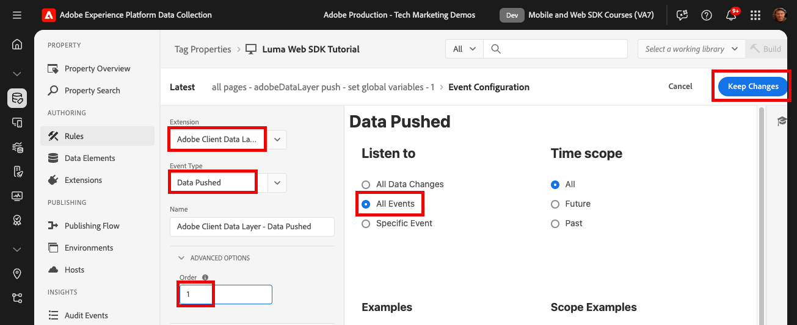
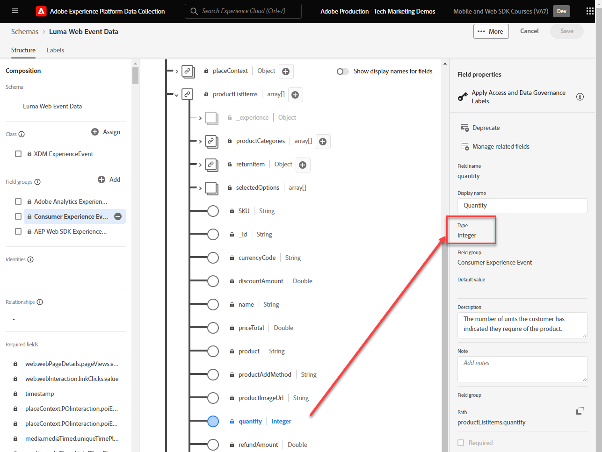

# 태그 규칙 만들기

태그 규칙을 사용하여 Adobe Experience Platform Edge Network에 이벤트를 보내는 방법을 알아봅니다. 태그 규칙은 태그 속성에 작업을 수행하도록 지시하는 이벤트, 조건 및 작업의 조합입니다. Platform Web SDK을 사용하면 규칙을 사용하여 적합한 데이터로 이벤트를 Platform Edge Network에 전송합니다.

## 학습 목표

이 단원을 마치면 다음을 수행할 수 있습니다.

* 태그 내 규칙 관리에 명명 규칙 사용
* 변수 업데이트 및 이벤트 보내기 작업을 사용하여 XDM 필드로 이벤트 보내기
* 여러 규칙에 대해 여러 XDM 필드 세트 스택
* 개별 또는 전체 배열 데이터 요소를 XDM 개체에 매핑
* 개발 라이브러리에 태그 규칙 게시

## 전제 조건

데이터 수집 태그 및 [Luma 데모 웹 사이트](https://luma.enablementadobe.com)에 익숙하고 자습서의 이전 단원을 완료했습니다.

* [XDM 스키마 구성](configure-schemas.md)
* [ID 네임스페이스 구성](configure-identities.md)
* [데이터스트림 구성](configure-datastream.md)
* [웹 SDK 확장 기능 설치](install-web-sdk.md)
* [데이터 요소 만들기](create-data-elements.md)
* [ID 캡처](create-identities.md)

## 이름 지정 규칙

태그에서 규칙을 관리하려면 표준 명명 규칙을 따르는 것이 좋습니다. 이 자습서에서는 네 부분으로 구성된 명명 규칙을 사용합니다.

* [**위치**] - [**이벤트**] - [**목적**] - [**순서**]

다음의 경우

1. **location**&#x200B;은(는) 규칙이 실행되는 사이트의 페이지입니다.
1. **event**&#x200B;은(는) 규칙의 트리거입니다.
1. **목적**&#x200B;은(는) 규칙에서 수행하는 기본 작업입니다.
1. **order**&#x200B;은(는) 동일한 이벤트를 공유하는 다른 규칙과 관련하여 규칙이 실행되는 순서입니다.
<!-- minor update -->

## Adobe 클라이언트 데이터 레이어 확장 추가

Luma 웹 사이트에서는 Adobe 클라이언트 데이터 레이어(ACDL)라는 이벤트 기반 데이터 레이어를 사용합니다. 데이터 계층 이벤트가 발생할 때마다 `adobeDataLayer` 배열로 푸시됩니다. 이 자습서에서는 Adobe 클라이언트 데이터 레이어라는 태그 확장을 사용하여 이러한 이벤트를 편리하게 탭하여 규칙을 구성합니다.

확장을 추가하려면:

1. **[!UICONTROL 확장]**(으)로 이동
1. **[!UICONTROL Adobe 클라이언트 데이터 레이어]**(으)로 필터링
1. **[!UICONTROL 설치]** 선택

   

1. 기본 설정 그대로 유지
1. **[!UICONTROL 저장]** 선택

>[!NOTE]
>
> Experience Platform Web SDK을 구현하기 위해 Adobe 클라이언트 데이터 레이어 를 사용할 필요는 없습니다. 다른 많은 유형의 이벤트는 일반적으로 규칙을 실행하기 위해 태그 구현(Library Loaded, DOM Ready, Window Loaded 등)에서 사용됩니다.

## 태그 규칙 만들기

태그에서는 다양한 조건에서 변수 설정 및 네트워크 호출 실행과 같은 작업을 실행하는 데 규칙이 사용됩니다. Experience Platform Web SDK 태그 확장에는 규칙에 사용되는 두 가지 작업이 포함되어 있습니다.

* **[!UICONTROL 변수 업데이트]** 데이터 요소를 XDM 또는 데이터 변수에 매핑합니다.
* **[!UICONTROL 이벤트 보내기]**&#x200B;에서 네트워크 호출을 수행하여 Experience Platform Edge Network으로 데이터를 보냅니다.

이 단원의 나머지 부분에서

1. **[!UICONTROL 변수 업데이트]** 작업을 사용하여 XDM 필드의 &quot;전역 구성&quot;을 정의합니다.

1. **[!UICONTROL 변수 업데이트]** 작업을 다시 사용하여 &quot;전역 구성&quot;을 재정의하고 특정 조건(예: 제품 페이지에 제품 세부 정보 추가)에서 추가 XDM 필드를 제공할 수 있습니다.

1. **[!UICONTROL 이벤트 보내기]** 작업을 사용하여 Adobe Experience Platform Edge Network으로 데이터를 보냅니다.

이러한 모든 규칙은 &quot;[!UICONTROL order]&quot; 옵션을 사용하여 올바르게 순서가 지정됩니다.

이 비디오에서는 프로세스에 대한 개요를 제공합니다.

>[!VIDEO](https://video.tv.adobe.com/v/3427710/?learn=on&enablevpops)

### 전역 구성 필드

글로벌 XDM 필드에 대한 태그 규칙을 만들려면 다음을 수행하십시오.

1. 이 자습서에서 사용하는 태그 속성을 엽니다

1. 왼쪽 탐색에서 **[!UICONTROL 규칙]**(으)로 이동

1. **[!UICONTROL 새 규칙 만들기]** 단추 선택

   

1. 규칙 이름을 지정합니다 `all pages - adobeDataLayer push - set global variables - 1`

1. **[!UICONTROL 이벤트]** 섹션에서 **[!UICONTROL 추가]**&#x200B;를 선택합니다.

   

1. **[!UICONTROL Adobe 클라이언트 데이터 레이어]** 확장을 사용하고 **[!UICONTROL 이벤트 유형]**(으)로 **[!UICONTROL 데이터 푸시됨]**&#x200B;을(를) 선택합니다.

1. **[!UICONTROL 고급]** 드롭다운을 선택하고 `1`순서&#x200B;**[!UICONTROL (으)로]**&#x200B;을(를) 입력하십시오.

   >[!NOTE]
   >
   > 주문 번호가 낮을수록 더 빨리 실행됩니다. 따라서 &quot;글로벌 구성&quot;에 낮은 주문 번호를 제공합니다.

1. **[!UICONTROL 모든 이벤트]** 수신
1. 기본 규칙 화면으로 돌아가려면 **[!UICONTROL 변경 내용 유지]**&#x200B;를 선택하십시오.
   

1. **[!UICONTROL 작업]** 섹션에서 **[!UICONTROL 추가]**&#x200B;를 선택합니다.

1. **[!UICONTROL 확장]**(으)로 **[!UICONTROL Adobe Experience Platform Web SDK]**&#x200B;을(를) 선택합니다.

1. **[!UICONTROL 작업 유형]**(으)로 **[!UICONTROL 변수 업데이트]**&#x200B;를 선택합니다.

1. **[!UICONTROL 데이터 요소]**(으)로 `XDM Variable`데이터 요소 만들기[&#x200B; 단원에서 만든 &#x200B;](create-data-elements.md)을(를) 선택합니다.

   

1. 이제 XDM 필드를 적절한 값에 매핑하여 지정합니다.

   | XDM 필드 | 다음에 매핑 |
   |---|---|
   | `eventType` | `Web Webpagedetails Page Views`(제안된 값을 보려면 입력을 시작하십시오.) |
   | `identityMap` | `Identity Map` 데이터 요소 |
   | `web.webPageDetails.name` | `Page Name` 데이터 요소 |
   | `web.webPageDetails.pageViews.value` | `1` |

   >[!TIP]
   >
   > 데이터 요소가 null인 경우 XDM 필드는 네트워크 요청에 포함되지 않습니다. 따라서 사용자가 인증되지 않았고 `Identity Map` 데이터 요소가 null이면 `identityMap` 개체가 전송되지 않습니다. 이것이 &quot;전역 구성&quot;에서 안전하게 정의할 수 있는 이유입니다.

   >[!TIP]
   >
   > `web.webPageDetails.pageViews.value`을(를) 설정하면 다른 다운스트림 응용 프로그램에 대한 페이지 보기를 표시하는 표준 방법을 제공합니다. Adobe Analytics에서 네트워크 호출을 페이지 보기로 처리할 필요는 없습니다.

1. 완료되면 `XDM Variable`이(가) 다음과 같이 표시됩니다. 채워진 필드와 부분적으로 채워진 필드가 파란색 원으로 표시되는 방법에 주의하십시오.
   
1. **[!UICONTROL 변경 내용 유지]**&#x200B;를 선택한 다음 **[!UICONTROL 저장]**&#x200B;을 선택합니다.

### 제품 페이지 필드

이제 **[!UICONTROL Platform Edge Network]**&#x200B;로 보내기 전에 XDM 개체를 보강하기 위해 순서가 지정된 추가 규칙에서 [!UICONTROL 변수 업데이트]를 사용하십시오.

>[!TIP]
>
>규칙 순서는 이벤트가 트리거될 때 먼저 실행되는 규칙을 결정합니다. 두 규칙의 이벤트 유형이 동일한 경우 주문 번호가 가장 낮은 규칙이 먼저 실행됩니다.
> 

Luma의 제품 세부 사항 페이지에서 제품 보기를 추적하여 시작합니다.

1. **[!UICONTROL 규칙 추가]** 선택
1. 이름을 [!UICONTROL `product detail pages - adobeDataLayer push - set product details variables - 20`]로 지정합니다.
1. 새 트리거를 추가하려면 이벤트 아래에서 을(를) 선택하십시오.
1. **[!UICONTROL 확장]**&#x200B;에서 **[!UICONTROL Adobe 클라이언트 데이터 레이어]**&#x200B;를 선택합니다.
1. **[!UICONTROL 이벤트 유형]**&#x200B;에서 **[!UICONTROL 데이터 푸시됨]**&#x200B;을(를) 선택합니다.
1. **[!UICONTROL 고급 옵션]**&#x200B;을(를) 열려면 선택하고 `20`을(를) 입력하십시오. 이 순서 값을 사용하면 전역 변수 규칙이 _after_&#x200B;에 실행됩니다.
1. **[!UICONTROL 특정 이벤트]** 수신
1. `productView`을(를) 등록할 **[!UICONTROL 이벤트/키로 입력]**
1. **[!UICONTROL 변경 내용 유지]** 선택

   

1. **[!UICONTROL 작업]**&#x200B;에서 **[!UICONTROL 추가]**&#x200B;를 선택합니다.
1. **[!UICONTROL Adobe Experience Platform Web SDK]** 확장 선택
1. **[!UICONTROL 작업 유형]**&#x200B;을(를) **[!UICONTROL 변수 업데이트]**(으)로 선택
1. `XDM Variable`을(를) **[!UICONTROL 데이터 요소]**(으)로 선택
1. 이러한 XDM 필드를 적절한 값에 매핑:

   | XDM 필드 | 다음에 매핑 |
   |---|---|
   | `eventType` | `Commerce Product Views`(제안된 값을 보려면 입력을 시작하십시오.) |
   | `commerce.productViews.value` | `1` |
   | `productListItems.name` | `Ecommerce Product Name` 데이터 요소(**[!UICONTROL 개별 항목 제공]** 및 **[!UICONTROL 항목 추가]**&#x200B;를 먼저 선택) |
   | `productListItems.sku` | `Ecommerce Product Id` 데이터 요소 |

1. **[!UICONTROL 변경 내용 유지]** 선택

1. 규칙을 저장하려면 **[!UICONTROL 저장]**&#x200B;을 선택하십시오.

   >[!NOTE]
   >
   >이 규칙의 순서가 높으므로 &quot;전역 구성&quot; 규칙에 설정된 `eventType`을(를) 덮어씁니다. `eventType`에는 하나의 값만 포함될 수 있으며 가장 중요한 이벤트로 설정하는 것이 좋습니다.

   >[!TIP]
   >
   >XDM에서 commerce.productViews.value=1을(를) 설정하면 Analytics의 `prodView` 이벤트에 자동으로 매핑됩니다

### 장바구니 필드

배열이 XDM 스키마의 형식과 일치하는 경우 전체 배열을 XDM 개체에 매핑할 수 있습니다. 이전에 만든 사용자 지정 코드 데이터 요소 `Ecommerce Cart Products`은(는) Luma 웹 사이트의 `adobeDataLayer.ecommerce.cart.items` 데이터 레이어 개체를 통해 반복되며 XDM 스키마의 `productListItems` 개체의 필수 형식으로 변환됩니다.

이를 설명하기 위해서는 아래 Luma 사이트 데이터 레이어(왼쪽)와 번역된 데이터 요소(오른쪽)의 비교를 참조하십시오.

데이터 요소를 `productListItems` 구조와 비교합니다(힌트, 일치해야 함).

>[!NOTE]
>
> 자습서에서는 이 시점에서 `_satellite.getVar('Ecommerce Cart Products')`을(를) 실행할 수 없습니다.

>[!IMPORTANT]
>
>데이터 레이어의 필드를 XDM에 매핑할 때 필드가 XDM 필드의 데이터 유형과 일치하는지 확인합니다. 위의 예에서 `quantity` 및 `priceTotal`은(는) 정수여야 합니다. 그렇지 않으면 레코드가 플랫폼으로 수집되지 않습니다.
> 

이제 배열을 XDM 개체에 매핑하겠습니다.

1. 이름이 `cart page - adobeDataLayer push - set cart variables - 20`인 새 규칙 만들기
1. 새 트리거를 추가하려면 이벤트 아래에서 을(를) 선택하십시오.
1. **[!UICONTROL 확장]**&#x200B;에서 **[!UICONTROL Adobe 클라이언트 데이터 레이어]**&#x200B;를 선택합니다.
1. **[!UICONTROL 이벤트 유형]**&#x200B;에서 **[!UICONTROL 데이터 푸시됨]**&#x200B;을(를) 선택합니다.
1. **[!UICONTROL 고급 옵션]**&#x200B;을(를) 열려면 선택하고 `20`을(를) 입력하십시오. 이 순서 값을 사용하면 전역 변수 규칙이 _after_&#x200B;에 실행됩니다.
1. **[!UICONTROL 특정 이벤트]** 수신
1. `cartView`을(를) 등록할 **[!UICONTROL 이벤트/키로 입력]**
1. **[!UICONTROL 변경 내용 유지]** 선택

   장바구니 규칙에 대한 

1. **[!UICONTROL 작업]**&#x200B;에서 **[!UICONTROL 추가]**&#x200B;를 선택합니다.
1. **[!UICONTROL Adobe Experience Platform Web SDK]** 확장 선택
1. **[!UICONTROL 작업 유형]**&#x200B;을(를) **[!UICONTROL 변수 업데이트]**(으)로 선택
1. `XDM Variable`을(를) **[!UICONTROL 데이터 요소]**(으)로 선택
1. 이러한 XDM 필드를 적절한 값에 매핑:

   | XDM 필드 | 다음에 매핑 |
   |---|---|
   | `eventType` | `Commerce Product List (Cart) Views`(제안된 값을 보려면 입력을 시작하십시오.) |
   | `commerce.productListViews.value` | `1` |
   | `productListItems` | `Ecommerce Cart Products` 데이터 요소(**[!UICONTROL 전체 배열 제공]** 먼저 선택) |

   >[!TIP]
   >
   >XDM에서 commerce.productListViews.value=1을(를) 설정하면 Analytics의 `scView` 이벤트에 자동으로 매핑됩니다

1. **[!UICONTROL 변경 내용 유지]** 선택

1. 규칙을 저장하려면 **[!UICONTROL 저장]**&#x200B;을 선택하십시오.

### 주문 확인 필드

구매 이벤트에 대한 다른 규칙을 만듭니다.

1. 이름이 `order confirmation - adobeDataLayer push - set purchase variables -  20`인 새 규칙 만들기
1. 새 트리거를 추가하려면 이벤트 아래에서 을(를) 선택하십시오.
1. **[!UICONTROL 확장]**&#x200B;에서 **[!UICONTROL Adobe 클라이언트 데이터 레이어]**&#x200B;를 선택합니다.
1. **[!UICONTROL 이벤트 유형]**&#x200B;에서 **[!UICONTROL 데이터 푸시됨]**&#x200B;을(를) 선택합니다.
1. **[!UICONTROL 고급 옵션]**&#x200B;을(를) 열려면 선택하고 `20`을(를) 입력하십시오. 이 순서 값을 사용하면 전역 변수 규칙이 _after_&#x200B;에 실행됩니다.
1. **[!UICONTROL 특정 이벤트]** 수신
1. `purchase`을(를) 등록할 **[!UICONTROL 이벤트/키로 입력]**
1. **[!UICONTROL 변경 내용 유지]** 선택
1. **[!UICONTROL 작업]**&#x200B;에서 **[!UICONTROL 추가]**&#x200B;를 선택합니다.
1. **[!UICONTROL Adobe Experience Platform Web SDK]** 확장 선택
1. **[!UICONTROL 작업 유형]**&#x200B;을(를) **[!UICONTROL 변수 업데이트]**(으)로 선택
1. `XDM Variable`을(를) **[!UICONTROL 데이터 요소]**(으)로 선택
1. 이러한 XDM 필드를 적절한 값에 매핑:

   | XDM 필드 | 다음에 매핑 |
   |---|---|
   | `eventType` | `Commerce Purchases`(제안된 값을 보려면 입력을 시작하십시오.) |
   | `commerce.productListViews.value` | `1` |
   | `commerce.order.purchaseID` | `Ecommerce Purchase Id` 데이터 요소 |
   | `commerce.order.currencyCode` | `USD` |
   | `productListItems` | `Ecommerce Cart Products` 데이터 요소(**[!UICONTROL 전체 배열 제공]** 먼저 선택) |

   >[!TIP]
   >
   >XDM에서 `commerce.productListViews.value`을(를) `1`, `commerce.order.purchaseID` 및 `commerce.order.currencyCode`(으)로 설정하면 Analytics의 `purchase`, `s.purchaseID` 및 `s.currencyCode` 변수에 각각 자동으로 매핑됩니다.

1. **[!UICONTROL 변경 내용 유지]** 선택
1. **[!UICONTROL 저장]** 선택

### 이벤트 규칙 보내기

변수를 설정했으므로 **[!UICONTROL 이벤트 보내기]** 작업으로 전체 XDM 개체를 Platform Edge Network으로 보내는 규칙을 만들 수 있습니다.

1. 이름이 `all pages - adobeDataLayer push - send event - 50`인 새 규칙 만들기
1. 새 트리거를 추가하려면 이벤트 아래에서 을(를) 선택하십시오.
1. **[!UICONTROL 확장]**&#x200B;에서 **[!UICONTROL Adobe 클라이언트 데이터 레이어]**&#x200B;를 선택합니다.
1. **[!UICONTROL 이벤트 유형]**&#x200B;에서 **[!UICONTROL 데이터 푸시됨]**&#x200B;을(를) 선택합니다.
1. **[!UICONTROL 고급 옵션]**&#x200B;을(를) 열려면 선택하고 `50`을(를) 입력하십시오(기본값). 이 순서 값은 변수 설정 규칙을 _after_&#x200B;에 규칙이 실행되도록 합니다.
1. **[!UICONTROL 모든 이벤트]** 수신
1. **[!UICONTROL 변경 내용 유지]** 선택
1. **[!UICONTROL 작업]**&#x200B;에서 **[!UICONTROL 추가]**&#x200B;를 선택합니다.
1. **[!UICONTROL Adobe Experience Platform Web SDK]** 확장 선택
1. **[!UICONTROL 작업 유형]**&#x200B;을(를) **[!UICONTROL 이벤트 변수 보내기]**(으)로 선택

1. **[!UICONTROL 작업 유형]**(으)로 **[!UICONTROL 이벤트 보내기]**&#x200B;를 선택합니다.

1. **[!UICONTROL XDM]**(으)로 이전 단원에서 만든 `XDM Variable` 데이터 요소를 선택합니다.

1. 기본 규칙 화면으로 돌아가려면 **[!UICONTROL 변경 내용 유지]**&#x200B;를 선택하십시오.

   
1. 규칙을 저장하려면 **[!UICONTROL 저장]**&#x200B;을 선택하십시오.

   

속성에 다음 규칙이 있어야 합니다.

## 라이브러리에 규칙 게시

그런 다음 규칙이 작동하는지 확인할 수 있도록 개발 환경에 규칙을 게시합니다.

라이브러리를 만들려면 다음 작업을 수행하십시오.

1. 왼쪽 탐색에서 **[!UICONTROL 게시 흐름]**(으)로 이동

1. **[!UICONTROL 라이브러리 추가]** 선택

   
1. **[!UICONTROL Name]**&#x200B;에 대해 `Luma Web SDK Tutorial`을(를) 입력하십시오.
1. **[!UICONTROL 환경]**&#x200B;에 대해 `Development`을(를) 선택합니다.
1. **[!UICONTROL 변경된 모든 리소스 추가]** 선택

   >[!NOTE]
   >
   >    이전 단원에서 만든 모든 태그 구성 요소가 표시됩니다. 코어 확장에는 모든 웹 태그 속성에 필요한 기본 JavaScript이 포함되어 있습니다.

1. **[!UICONTROL 개발을 위한 저장 및 빌드 선택]**

   

라이브러리를 빌드하는 데 몇 분 정도 소요될 수 있으며 완료되면 라이브러리 이름 왼쪽에 녹색 점이 표시됩니다.

[!UICONTROL 게시 플로우] 화면에서 볼 수 있듯이 게시 프로세스에 대한 많은 내용이 있으므로 이 자습서의 범위를 벗어납니다. 이 자습서에서는 개발 환경의 단일 라이브러리를 사용합니다.

이제 Adobe Experience Platform Debugger을 사용하여 요청에 있는 데이터의 유효성을 검사할 준비가 되었습니다.

>[!NOTE]
>
>Adobe Experience Platform 웹 SDK에 대해 학습하는 데 시간을 투자해 주셔서 감사합니다. 질문이 있거나 일반적인 피드백을 공유하고 싶거나 향후 콘텐츠에 대한 제안이 있는 경우 이 [Experience League 커뮤니티 토론 게시물](https://experienceleaguecommunities.adobe.com/adobe-experience-platform-18/tutorial-discussion-implement-adobe-experience-cloud-with-web-sdk-tutorial-248848?profile.language=ko)에서 공유하십시오.
