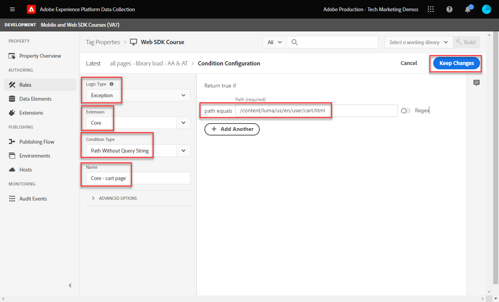

# 태그 규칙 만들기

태그 규칙을 사용하여 XDM 개체를 사용하여 Platform Edge Network에 이벤트를 전송하는 방법을 알아봅니다. 태그 규칙은 태그 속성에 작업을 지시하는 이벤트, 조건 및 작업의 조합입니다.

>[!NOTE]
>
> 데모 목적으로 이 단원의 연습은 [데이터 요소 만들기](create-data-elements.md) 단계; 에서 사용자의 콘텐츠 및 ID를 캡처하기 위한 XDM 이벤트 작업 보내기 [Luma 데모 사이트](https://luma.enablementadobe.com/content/luma/us/en.html).

## 학습 목표

이 단원을 마치면 다음을 수행할 수 있습니다.

* 태그 내의 규칙을 관리하기 위해 이름 지정 규칙을 사용합니다
* XDM 이벤트를 전송하는 태그 규칙 만들기
* 개발 라이브러리에 태그 규칙 게시

## 전제 조건

데이터 수집 태그 및 [Luma 데모 사이트](https://luma.enablementadobe.com/content/luma/us/en.html), 및에서 다음 이전 단원을 자습서에서 완료했어야 합니다.

* [권한 구성](configure-permissions.md)
* [XDM 스키마 구성](configure-schemas.md)
* [ID 네임스페이스 구성](configure-identities.md)
* [데이터 스트림 구성](configure-datastream.md)
* [태그 속성에 설치된 웹 SDK 확장](install-web-sdk.md)
* [데이터 요소 만들기](create-data-elements.md)

## 이름 지정 규칙

태그의 규칙을 더 잘 관리하려면 표준 명명 규칙을 따르는 것이 좋습니다. 이 자습서에서는 다음의 세 부분으로 구성된 이름 지정 규칙을 사용합니다.

* [위치] - [이벤트] - [도구]

다음의 경우;

1. 위치는 규칙이 실행되는 사이트의 페이지 또는 페이지입니다
1. 이벤트는 비콘을 실행하는 트리거입니다
1. 도구는 해당 규칙의 작업 단계에서 사용되는 특정 응용 프로그램 또는 응용 프로그램입니다

## 태그 규칙 만들기

태그에서 규칙은 다양한 조건에서 작업(호출 실행)을 실행하는 데 사용됩니다. 이 첫 번째 규칙을 사용하여 웹 SDK의 [!UICONTROL 이벤트 보내기] 작업. 이 자습서의 후반부에서는 방문자가 있는 페이지 유형에 따라 다른 버전의 XDM 개체를 전송합니다. 이러한 이유로, 규칙 조건을 사용하여 이러한 다른 유형의 페이지를 제외합니다.

태그 규칙을 만들려면:

1. 이 자습서에서 사용하는 태그 속성을 엽니다
1. 이동 **[!UICONTROL 규칙]** 왼쪽 탐색
1. 을(를) 선택합니다 **[!UICONTROL 새 규칙 만들기]** 버튼
   
1. 규칙 이름을 지정합니다 `all pages - library load - AA & AT`

   >[!NOTE]
   >
   > 이 규칙은 이후 단원에서 Adobe Analytics 및 Target에 의해 특정 방식으로 사용되므로 이러한 이유로 인해 `AA & AT` 는 이름 끝에 사용됩니다.

1. 에서 **[!UICONTROL 이벤트]** 섹션, **[!UICONTROL 추가]**

   
1. 를 사용하십시오 **[!UICONTROL 코어 확장]** 을(를) 선택합니다. `Library Loaded (Page Top)` 로서의 **[!UICONTROL 이벤트 유형]**.

   이 설정은 태그 라이브러리가 페이지에 로드될 때마다 규칙이 실행됨을 의미합니다.
1. 선택 **[!UICONTROL 변경 내용 유지]** 기본 규칙 화면으로 돌아갑니다.
   
1. 에서 **[!UICONTROL 조건]** 섹션에서 **[!UICONTROL 추가]** 버튼
   
1. 선택 **[!UICONTROL 논리 유형]** `Exception`, **[!UICONTROL 확장]** `Core`, 및 **[!UICONTROL 조건 유형]** `Path Without Query String`
1. URL 경로를 입력합니다 `/content/luma/us/en/user/cart.html` 에서 **[!UICONTROL 경로가 다음과 같음]** 필드 및 **[!UICONTROL 이름]** it `Core - cart page`
1. 선택 **[!UICONTROL 변경 내용 유지]**

   
1. 다음 URL 경로에 대해 3개의 예외를 더 추가합니다

   * **`Core - checkout page`** for `/content/luma/us/en/user/checkout.html`
   * **`Core - thank you page`** for `/content/luma/us/en/user/checkout/order/thank-you.html`
   * **`Core - product page`** 대상 `/products/` Regex 스위치를 켜서

   

1. 에서 **[!UICONTROL 작업]** 섹션, **[!UICONTROL 추가]**
1. 선택 **[!UICONTROL Adobe Experience Platform Web SDK]** 로서의 **[!UICONTROL 확장]**
1. 선택 **[!UICONTROL 이벤트 보내기]** 로서의 **[!UICONTROL 작업 유형]**
1. 선택 **[!UICONTROL web.webpagedetails.pageViews]** 로서의 **[!UICONTROL 유형]**.

   >[!WARNING]
   >
   > 이 드롭다운은 **`xdm.eventType`** 변수를 채우는 방법을 설명합니다. 이 필드에 자유 형식 레이블을 입력할 수도 있지만 적극 권장합니다 **포함하지 않음** Platform에 대해 부정적인 영향을 미칠 수 있습니다.

1. 로서의 **[!UICONTROL XDM 데이터]**&#x200B;에서 을(를) 선택합니다. `xdm.content` 이전 단원에서 만든 데이터 요소
1. 선택 **[!UICONTROL 변경 내용 유지]** 기본 규칙 화면으로 돌아갑니다.

   
1. 선택 **[!UICONTROL 저장]** 규칙을 저장하려면

   

## 라이브러리에 규칙 게시

다음으로, 규칙이 작동하는지 확인할 수 있도록 개발 환경에 규칙을 게시합니다.

라이브러리를 만들려면:

1. 이동 **[!UICONTROL 게시 흐름]** 왼쪽 탐색
1. 선택 **[!UICONTROL 라이브러리 추가]**

   
1. 대상 **[!UICONTROL 이름]**, 입력 `Luma Web SDK Tutorial`
1. 대상 **[!UICONTROL 환경]**, 선택 `Development`
1. 선택  **[!UICONTROL 변경된 모든 리소스 추가]**

   >[!NOTE]
   >
   >    Adobe Experience Platform Web SDK 확장 및 `all pages - library load - AA & AT` 규칙, 이전 단원에서 만든 태그 구성 요소가 표시됩니다. 코어 확장에는 모든 웹 태그 속성에 필요한 기본 JavaScript가 포함되어 있습니다.

1. 선택 **[!UICONTROL 개발을 위한 저장 및 구축]**

   

라이브러리를 빌드하는 데 몇 분이 걸릴 수 있고 라이브러리가 완료되면 라이브러리 이름 왼쪽에 녹색 점이 표시됩니다.

보시다시피 [!UICONTROL 게시 흐름] 여기서는 이 자습서의 범위를 벗어난 게시 프로세스에 더 많은 작업이 있습니다. 이 자습서에서는 개발 환경에서 단일 라이브러리를 사용합니다.

이제 Adobe Experience Platform Debugger를 사용하여 요청에서 데이터의 유효성을 검사할 준비가 되었습니다.

[다음 ](validate-with-debugger.md)

>[!NOTE]
>
>Adobe Experience Platform Web SDK에 대한 학습에 시간을 내주셔서 감사합니다. 질문이 있거나 일반 피드백을 공유하거나 향후 컨텐츠에 대한 제안 사항이 있는 경우 해당 정보를 공유하십시오 [Experience League 커뮤니티 토론 게시물](https://experienceleaguecommunities.adobe.com/t5/adobe-experience-platform-launch/tutorial-discussion-implement-adobe-experience-cloud-with-web/td-p/444996)
