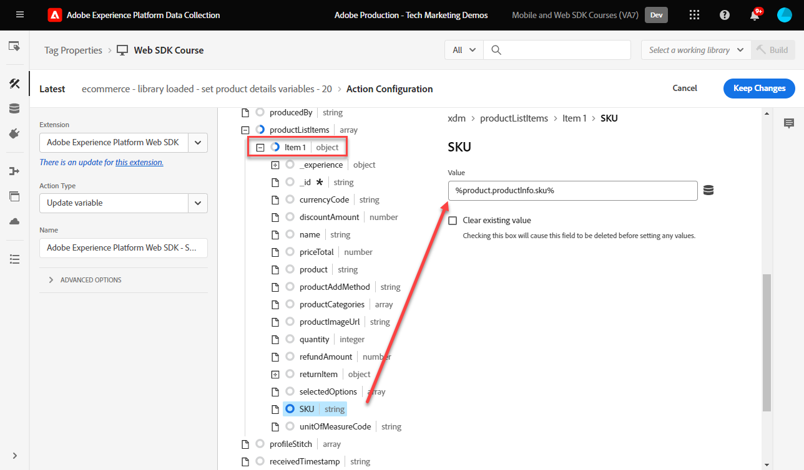

# 태그 규칙 만들기

태그 규칙을 사용하여 XDM 오브젝트와 함께 Adobe Experience Platform Edge Network에 이벤트를 전송하는 방법에 대해 알아봅니다. 태그 규칙은 태그 속성에 작업을 수행하도록 지시하는 이벤트, 조건 및 작업의 조합입니다. Platform Web SDK을 사용하면 규칙을 사용하여 적합한 데이터로 이벤트를 Platform Edge Network에 전송합니다.

## 학습 목표

이 단원을 마치면 다음을 수행할 수 있습니다.

* 태그 내 규칙 관리에 명명 규칙 사용
* 변수 업데이트 및 이벤트 보내기 작업을 사용하여 XDM 필드로 이벤트 보내기
* 여러 규칙에 대해 여러 XDM 필드 세트 스택
* 개별 또는 전체 배열 데이터 요소를 XDM 개체에 매핑
* 개발 라이브러리에 태그 규칙 게시

## 전제 조건

데이터 수집 태그 및 [Luma 데모 사이트](https://luma.enablementadobe.com/content/luma/us/en.html)에 익숙하고 자습서의 이전 단원을 완료했습니다.

* [XDM 스키마 구성](configure-schemas.md)
* [ID 네임스페이스 구성](configure-identities.md)
* [데이터스트림 구성](configure-datastream.md)
* [웹 SDK 확장 기능 설치](install-web-sdk.md)
* [데이터 요소 만들기](create-data-elements.md)
* [ID 만들기](create-identities.md)

## 이름 지정 규칙

태그에서 규칙을 관리하려면 표준 명명 규칙을 따르는 것이 좋습니다. 이 자습서에서는 5가지 부분으로 구성된 명명 규칙을 사용합니다.

* [**위치**] - [**이벤트**] - [**목적**] - [**순서**]

다음의 경우

1. **location**&#x200B;은(는) 규칙이 실행되는 사이트의 페이지입니다.
1. **event**&#x200B;은(는) 규칙의 트리거입니다.
1. **목적**&#x200B;은(는) 규칙에서 수행하는 기본 작업입니다.
1. **order**&#x200B;은(는) 다른 규칙과 관련하여 규칙이 실행되는 순서입니다.
<!-- minor update -->

## 태그 규칙 만들기

태그에서 규칙은 다양한 조건에서 작업(호출 실행)을 실행하는 데 사용됩니다. Platform Web SDK 태그 확장에는 이 단원에서 사용하는 두 가지 작업이 포함되어 있습니다.

* **[!UICONTROL 변수 업데이트]** 데이터 요소를 XDM 개체의 속성에 매핑합니다.
* **[!UICONTROL 이벤트 보내기]**&#x200B;에서 XDM 개체를 Experience Platform Edge Network으로 보냅니다.

이 단원의 나머지 부분에서

1. **[!UICONTROL 변수 업데이트]** 작업으로 규칙을 만들어 XDM 필드의 &quot;전역 구성&quot;을 정의합니다.

1. **[!UICONTROL 변수 업데이트]** 작업을 사용하여 &quot;전역 구성&quot;을 재정의하고 특정 조건에서 추가 XDM 필드를 제공하는 추가 규칙을 만듭니다(예: 제품 페이지에 제품 세부 정보 추가).

1. **[!UICONTROL 이벤트 보내기]** 작업으로 다른 규칙을 만들어 전체 XDM 개체를 Adobe Experience Platform Edge Network으로 보냅니다.

이러한 모든 규칙은 &quot;[!UICONTROL order]&quot; 옵션을 사용하여 올바르게 순서가 지정됩니다.

이 비디오에서는 프로세스에 대한 개요를 제공합니다.

>[!VIDEO](https://video.tv.adobe.com/v/3427710/?learn=on&enablevpops)

### 전역 구성 필드

글로벌 XDM 필드에 대한 태그 규칙을 만들려면 다음을 수행하십시오.

1. 이 자습서에서 사용하는 태그 속성을 엽니다

1. 왼쪽 탐색에서 **[!UICONTROL 규칙]**(으)로 이동

1. **[!UICONTROL 새 규칙 만들기]** 단추 선택

   

1. 규칙 이름을 지정합니다 `all pages - library loaded - set global variables - 1`

1. **[!UICONTROL 이벤트]** 섹션에서 **[!UICONTROL 추가]**&#x200B;를 선택합니다.

   

1. **[!UICONTROL 코어 확장]**&#x200B;을(를) 사용하고 **[!UICONTROL 로드된 라이브러리(페이지 상단)]**&#x200B;를 **[!UICONTROL 이벤트 유형]**(으)로 선택합니다.

1. **[!UICONTROL 고급]** 드롭다운을 선택하고 `1`순서&#x200B;**[!UICONTROL (으)로]**&#x200B;을(를) 입력하십시오.

   >[!NOTE]
   >
   > 주문 번호가 낮을수록 더 빨리 실행됩니다. 따라서 &quot;글로벌 구성&quot;에 낮은 주문 번호를 제공합니다.

1. 기본 규칙 화면으로 돌아가려면 **[!UICONTROL 변경 내용 유지]**&#x200B;를 선택하십시오.
   

1. **[!UICONTROL 작업]** 섹션에서 **[!UICONTROL 추가]**&#x200B;를 선택합니다.

1. **[!UICONTROL 확장]**(으)로 **[!UICONTROL Adobe Experience Platform Web SDK]**&#x200B;을(를) 선택합니다.

1. **[!UICONTROL 작업 유형]**(으)로 **[!UICONTROL 변수 업데이트]**&#x200B;를 선택합니다.

1. **[!UICONTROL 데이터 요소]**(으)로 `xdm.variable.content`데이터 요소 만들기[ 단원에서 만든 ](create-data-elements.md)을(를) 선택합니다.

   

이제 [!UICONTROL 데이터 요소]를 XDM 개체에서 사용하는 [!UICONTROL 스키마]에 매핑합니다. 개별 속성 또는 전체 객체에 매핑할 수 있습니다. 이 예제에서는 개별 속성에 매핑합니다.

1. eventType 필드를 찾아 선택합니다.

1. 값 `web.webpagedetails.pageViews` 입력

   >[!TIP]
   >
   > `eventType` 필드에 채울 값을 이해하려면 스키마 페이지로 이동하여 `eventType` 필드를 선택하여 오른쪽 레일에서 제안된 값을 확인해야 합니다. 필요한 경우 새 값을 입력할 수도 있습니다.
   > 스키마 페이지의 

1. 그런 다음 스키마에서 `identityMap` 개체를 찾아 선택합니다

1. `identityMap.loginID` 데이터 요소에 매핑

   

   >[!TIP]
   >
   > 데이터 요소가 null인 경우 XDM 필드는 네트워크 요청에 포함되지 않습니다. 따라서 사용자가 인증되지 않았고 `identityMap.loginID` 데이터 요소가 null이면 `identityMap` 개체가 전송되지 않습니다. 이것이 &quot;전역 구성&quot;에서 이 구성을 정의할 수 있는 이유입니다.

1. **`web`** 개체에 도달할 때까지 아래로 스크롤합니다

1. 열려면 선택하십시오.

1. 다음 데이터 요소를 해당 `web` XDM 변수에 매핑합니다

   * **`web.webPageDetials.name`** - `%page.pageInfo.pageName%`
   * **`web.webPageDetials.server`** - `%page.pageInfo.server%`
   * **`web.webPageDetials.siteSection`** - `%page.pageInfo.hierarchie1%`

1. `web.webPageDetials.pageViews.value`을 `1`로 설정합니다.

   

   >[!TIP]
   >
   > Adobe Analytics에서 비콘을 페이지 보기로 처리하는 데 `eventType`이(가) `web.webpagedetails.pageViews` 또는 `web.webPageDetails.pageViews.value`(으)로 설정되지 않아도 되지만 다른 다운스트림 응용 프로그램의 페이지 보기를 표시하는 표준 방법을 사용하는 것이 유용합니다.

1. 다음 화면에서 **[!UICONTROL 변경 내용 유지]**&#x200B;를 선택한 다음 **[!UICONTROL 저장]**&#x200B;을 선택하여 규칙 만들기를 완료합니다

### 제품 페이지 필드

이제 **[!UICONTROL Platform Edge Network]**&#x200B;로 보내기 전에 XDM 개체를 보강하기 위해 순서가 지정된 추가 규칙에서 [!UICONTROL 변수 업데이트]를 사용하십시오.

>[!TIP]
>
>규칙 순서는 이벤트가 트리거될 때 먼저 실행되는 규칙을 결정합니다. 두 규칙의 이벤트 유형이 동일한 경우 숫자가 가장 낮은 규칙이 먼저 실행됩니다.
> 

Luma의 제품 세부 사항 페이지에서 제품 보기를 추적하여 시작합니다.

1. **[!UICONTROL 규칙 추가]** 선택
1. 이름을 [!UICONTROL `ecommerce - library loaded - set product details variables - 20`]로 지정합니다.
1. 새 트리거를 추가하려면 이벤트 아래에서 을(를) 선택하십시오.
1. **[!UICONTROL 확장]**&#x200B;에서 **[!UICONTROL 코어]**&#x200B;을(를) 선택합니다.
1. **[!UICONTROL 이벤트 유형]**&#x200B;에서 **[!UICONTROL 로드된 라이브러리(페이지 상단)]**&#x200B;를 선택합니다.
1. **[!UICONTROL 고급 옵션]**&#x200B;을(를) 열려면 선택하고 `20`을(를) 입력하십시오. 이 순서 값은 전역 구성을 설정하는 _의_ after`all pages - library loaded - set global variables - 1` 규칙이 실행되도록 합니다.
1. **[!UICONTROL 변경 내용 유지]** 선택

   

1. **[!UICONTROL 조건]**&#x200B;에서 **[!UICONTROL 추가]**&#x200B;를 선택하십시오.
1. **[!UICONTROL 논리 형식]**&#x200B;을(를) **[!UICONTROL 보통]**(으)로 둡니다.
1. **[!UICONTROL 확장]**&#x200B;을(를) **[!UICONTROL 코어]**(으)로 유지
1. **[!UICONTROL 조건 유형]**&#x200B;을(를) **[!UICONTROL 쿼리 문자열이 없는 경로]**(으)로 선택
1. 오른쪽에서 **[!UICONTROL Regex]** 토글을 활성화합니다
1. **[!UICONTROL 경로가]**&#x200B;인 경우 `/products/`을(를) 설정합니다. Luma 데모 사이트의 경우 규칙이 제품 페이지에서만 트리거되도록 합니다
1. **[!UICONTROL 변경 내용 유지]** 선택

   

1. **[!UICONTROL 작업]**&#x200B;에서 **[!UICONTROL 추가]**&#x200B;를 선택합니다.
1. **[!UICONTROL Adobe Experience Platform Web SDK]** 확장 선택
1. **[!UICONTROL 작업 유형]**&#x200B;을(를) **[!UICONTROL 변수 업데이트]**(으)로 선택
1. `xdm.variable.content`을(를) **[!UICONTROL 데이터 요소]**(으)로 선택
1. `commerce` 개체까지 아래로 스크롤
1. **[!UICONTROL productViews]** 개체를 열고 **[!UICONTROL value]**&#x200B;을(를) `1`(으)로 설정합니다.

   

   >[!TIP]
   >
   >XDM에서 commerce.productViews.value=1을(를) 설정하면 Analytics의 `prodView` 이벤트에 자동으로 매핑됩니다

1. 아래로 스크롤하여 `eventType`을(를) `commerce.productViews`(으)로 설정합니다.

   >[!NOTE]
   >
   >이 규칙의 순서가 높으므로 &quot;전역 구성&quot; 규칙에 설정된 `eventType`을(를) 덮어씁니다. `eventType`에는 하나의 값만 포함될 수 있으며 가장 중요한 이벤트로 설정하는 것이 좋습니다.

1. 아래로 스크롤하여 `productListItems` 배열 선택
1. **[!UICONTROL 개별 항목 제공]** 선택
1. **[!UICONTROL 항목 추가]** 선택

   

   >[!CAUTION]
   >
   >**`productListItems`**&#x200B;은(는) `array` 데이터 형식이므로 데이터가 요소의 컬렉션으로 들어올 것으로 예상됩니다. Luma 데모 사이트의 데이터 레이어 구조와 Luma 사이트에서 한 번에 하나의 제품만 볼 수 있으므로 항목을 개별적으로 추가합니다. 자체 웹 사이트에서 를 구현할 때 데이터 레이어 구조에 따라 전체 어레이를 제공할 수 있습니다.

1. **[!UICONTROL 항목 1]**&#x200B;을(를) 열려면 선택하십시오.
1. **`productListItems.item1.SKU`**&#x200B;을(를) `%product.productInfo.sku%`에 매핑

   

1. **[!UICONTROL 변경 내용 유지]** 선택

1. 규칙을 저장하려면 **[!UICONTROL 저장]**&#x200B;을 선택하십시오.

### 장바구니 필드

배열이 XDM 스키마의 형식과 일치하는 경우 전체 배열을 XDM 개체에 매핑할 수 있습니다. 이전에 만든 사용자 지정 코드 데이터 요소 `cart.productInfo`은(는) Luma의 `digitalData.cart.cartEntries` 데이터 레이어 개체를 통해 반복되며 XDM 스키마의 `productListItems` 개체의 필수 형식으로 변환됩니다.

이를 설명하기 위해서는 아래 Luma 사이트 데이터 레이어(왼쪽)와 번역된 데이터 요소(오른쪽)의 비교를 참조하십시오.

데이터 요소를 `productListItems` 구조와 비교합니다(힌트, 일치해야 함).

>[!IMPORTANT]
>
>`price` 및 `qty`과(와) 같은 데이터 레이어의 문자열 값이 데이터 요소의 숫자로 다시 포맷되어 숫자 변수가 변환되는 방법을 참고하십시오. 이러한 형식 요구 사항은 플랫폼의 데이터 무결성에 중요하며 [스키마 구성](configure-schemas.md) 단계에서 결정됩니다. 이 예제에서 **[!UICONTROL quantity]**&#x200B;은(는) **[!UICONTROL Integer]** 데이터 형식을 사용합니다.
>&#x200B;> 

이제 배열을 XDM 개체에 매핑하겠습니다.

1. 이름이 `ecommerce - library loaded - set shopping cart variables - 20`인 새 규칙 만들기
1. 새 트리거를 추가하려면 이벤트 아래에서 을(를) 선택하십시오.
1. **[!UICONTROL 확장]**&#x200B;에서 **[!UICONTROL 코어]**&#x200B;을(를) 선택합니다.
1. **[!UICONTROL 이벤트 유형]**&#x200B;에서 **[!UICONTROL 로드된 라이브러리(페이지 상단)]**&#x200B;를 선택합니다.
1. **[!UICONTROL 고급 옵션]**&#x200B;을(를) 열려면 선택하고 `20`을(를) 입력하십시오.
1. **[!UICONTROL 변경 내용 유지]** 선택

   

1. **[!UICONTROL 조건]**&#x200B;에서 **[!UICONTROL 추가]**&#x200B;를 선택하십시오.
1. **[!UICONTROL 논리 형식]**&#x200B;을(를) **[!UICONTROL 보통]**(으)로 둡니다.
1. **[!UICONTROL 확장]**&#x200B;을(를) **[!UICONTROL 코어]**(으)로 유지
1. **[!UICONTROL 조건 유형]**&#x200B;을(를) **[!UICONTROL 쿼리 문자열이 없는 경로]**(으)로 선택
1. 오른쪽에서 **Do not** **[!UICONTROL Regex]** 토글을 사용하도록 설정합니다.
1. **[!UICONTROL 경로가]**&#x200B;인 경우 `/content/luma/us/en/user/cart.html`을(를) 설정합니다. Luma 데모 사이트의 경우 규칙이 장바구니 페이지에서 트리거만 하는지 확인합니다
1. **[!UICONTROL 변경 내용 유지]** 선택

   

1. **[!UICONTROL 작업]**&#x200B;에서 **[!UICONTROL 추가]**&#x200B;를 선택합니다.
1. **[!UICONTROL Adobe Experience Platform Web SDK]** 확장 선택
1. **[!UICONTROL 작업 유형]**&#x200B;을(를) **[!UICONTROL 변수 업데이트]**(으)로 선택
1. `xdm.variable.content`을(를) **[!UICONTROL 데이터 요소]**(으)로 선택
1. `commerce` 개체까지 아래로 스크롤한 다음 선택하여 엽니다.
1. **[!UICONTROL productListViews]** 개체를 열고 **[!UICONTROL value]**&#x200B;을(를) `1`(으)로 설정합니다.

   

   >[!TIP]
   >
   >XDM에서 commerce.productListViews.value=1을(를) 설정하면 Analytics의 `scView` 이벤트에 자동으로 매핑됩니다

1. `eventType`을(를) 선택하고 `commerce.productListViews`(으)로 설정

1. 아래로 스크롤하여 **[!UICONTROL productListItems]** 배열을 선택하십시오.

1. **[!UICONTROL 전체 배열 제공]** 선택

1. **`cart.productInfo`** 데이터 요소에 매핑

1. **[!UICONTROL 변경 내용 유지]** 선택

1. 규칙을 저장하려면 **[!UICONTROL 저장]**&#x200B;을 선택하십시오.

아래 차이점을 사용하여 동일한 패턴에 따라 체크아웃 및 구매를 위한 다른 두 규칙을 만듭니다.

**규칙 이름**: `ecommerce  - library loaded - set checkout variables - 20`

1. **[!UICONTROL 조건]**: /content/luma/us/en/user/checkout.html
1. `eventType`을 `commerce.checkouts`로 설정합니다.
1. `commerce.checkout.value`을 `1`로 설정합니다.

   >[!TIP]
   >
   >Analytics에서 `scCheckout` 이벤트를 설정하는 것과 같습니다.

**규칙 이름**: `ecommerce - library loaded - set purchase variables -  20`

1. **[!UICONTROL 조건]**: /content/luma/us/en/user/checkout/order/thank-you.html
1. `eventType`을 `commerce.purchases`로 설정합니다.
1. `commerce.purchases.value`을 `1`로 설정합니다.

   >[!TIP]
   >
   >Analytics에서 `purchase` 이벤트를 설정하는 것과 같습니다.

1. `commerce.order.purchaseID`을(를) `cart.orderId` 데이터 요소로 설정
1. `commerce.order.currencyCode`을(를) 하드 코딩된 값 `USD`(으)로 설정합니다.

   

   >[!TIP]
   >
   >Analytics에서 `s.purchaseID` 및 `s.currencyCode` 변수를 설정하는 것과 같습니다.

1. 아래로 스크롤하여 **[!UICONTROL productListItems]** 배열을 선택하십시오.
1. **[!UICONTROL 전체 배열 제공]** 선택
1. **`cart.productInfo.purchase`** 데이터 요소에 매핑
1. **[!UICONTROL 변경 내용 유지]** 선택
1. **[!UICONTROL 저장]** 선택

완료되면 다음 규칙이 생성됩니다.

### 이벤트 규칙 보내기

변수를 설정했으므로 **[!UICONTROL 이벤트 보내기]** 작업으로 전체 XDM 개체를 Platform Edge Network으로 보내는 규칙을 만들 수 있습니다.

1. 오른쪽에서 **[!UICONTROL 규칙 추가]**&#x200B;를 선택하여 다른 규칙을 만듭니다

1. 규칙 이름을 지정합니다 `all pages - library loaded - send event - 50`

1. **[!UICONTROL 이벤트]** 섹션에서 **[!UICONTROL 추가]**&#x200B;를 선택합니다.

1. **[!UICONTROL 코어 확장]**&#x200B;을(를) 사용하고 `Library Loaded (Page Top)`이벤트 유형&#x200B;**[!UICONTROL (으)로]**&#x200B;을(를) 선택하십시오.

1. **[!UICONTROL 고급]** 드롭다운을 선택하고 `50`순서&#x200B;**[!UICONTROL 에]**&#x200B;을(를) 입력하십시오. 이렇게 하면 `1` 또는 `20`을(를) [!UICONTROL Order]&#x200B;(으)로 설정한 다른 모든 규칙 이후에 이 규칙이 실행됩니다.

1. 기본 규칙 화면으로 돌아가려면 **[!UICONTROL 변경 내용 유지]**&#x200B;를 선택하십시오.
   

1. **[!UICONTROL 작업]** 섹션에서 **[!UICONTROL 추가]**&#x200B;를 선택합니다.

1. **[!UICONTROL 확장]**(으)로 **[!UICONTROL Adobe Experience Platform Web SDK]**&#x200B;을(를) 선택합니다.

1. **[!UICONTROL 작업 유형]**(으)로 **[!UICONTROL 이벤트 보내기]**&#x200B;를 선택합니다.

1. **[!UICONTROL XDM]**(으)로 이전 단원에서 만든 `xdm.variable.content` 데이터 요소를 선택합니다.

1. 기본 규칙 화면으로 돌아가려면 **[!UICONTROL 변경 내용 유지]**&#x200B;를 선택하십시오.

   
1. 규칙을 저장하려면 **[!UICONTROL 저장]**&#x200B;을 선택하십시오.

   

## 라이브러리에 규칙 게시

그런 다음 규칙이 작동하는지 확인할 수 있도록 개발 환경에 규칙을 게시합니다.

라이브러리를 만들려면 다음 작업을 수행하십시오.

1. 왼쪽 탐색에서 **[!UICONTROL 게시 흐름]**(으)로 이동

1. **[!UICONTROL 라이브러리 추가]** 선택

   
1. **[!UICONTROL Name]**&#x200B;에 대해 `Luma Web SDK Tutorial`을(를) 입력하십시오.
1. **[!UICONTROL 환경]**&#x200B;에 대해 `Development`을(를) 선택합니다.
1. **[!UICONTROL 변경된 모든 리소스 추가]** 선택

   >[!NOTE]
   >
   >    이전 단원에서 만든 모든 태그 구성 요소가 표시됩니다. 코어 확장에는 모든 웹 태그 속성에 필요한 기본 JavaScript이 포함되어 있습니다.

1. **[!UICONTROL 개발을 위한 저장 및 빌드 선택]**

   

라이브러리를 빌드하는 데 몇 분 정도 소요될 수 있으며 완료되면 라이브러리 이름 왼쪽에 녹색 점이 표시됩니다.

[!UICONTROL 게시 플로우] 화면에서 볼 수 있듯이 게시 프로세스에 대한 많은 내용이 있으므로 이 자습서의 범위를 벗어납니다. 이 자습서에서는 개발 환경의 단일 라이브러리를 사용합니다.

이제 Adobe Experience Platform Debugger을 사용하여 요청에 있는 데이터의 유효성을 검사할 준비가 되었습니다.

>[!NOTE]
>
>Adobe Experience Platform 웹 SDK에 대해 학습하는 데 시간을 투자해 주셔서 감사합니다. 질문이 있거나 일반적인 피드백을 공유하고 싶거나 향후 콘텐츠에 대한 제안이 있는 경우 이 [Experience League 커뮤니티 토론 게시물](https://experienceleaguecommunities.adobe.com/t5/adobe-experience-platform-data/tutorial-discussion-implement-adobe-experience-cloud-with-web/td-p/444996)에서 공유하십시오.
