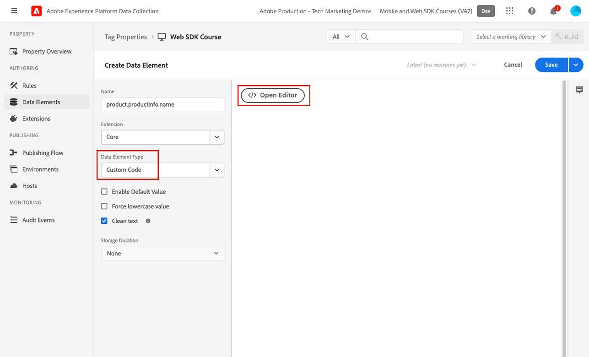
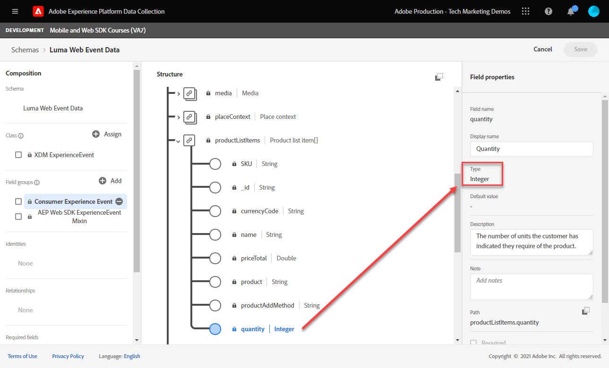
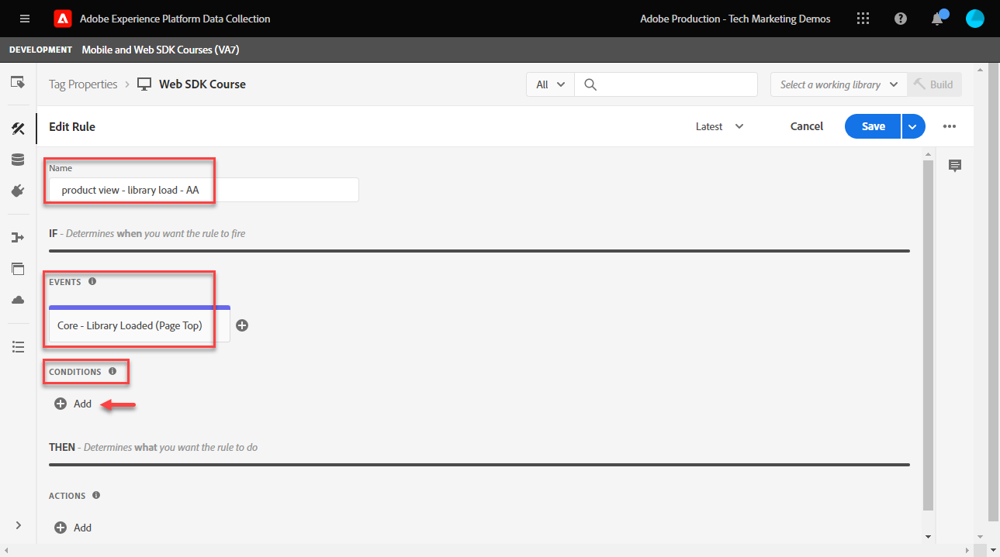

# Platform Web SDK를 사용하여 Adobe Analytics 설정

을 사용하여 Adobe Analytics을 설정하는 방법을 알아봅니다 [웹 SDK Experience Platform](https://experienceleague.adobe.com/docs/platform-learn/data-collection/web-sdk/overview.html)를 설정하고, 태그 규칙을 만들어 Adobe Analytics으로 데이터를 보내고, Analytics가 데이터를 예상대로 캡처하는지 확인합니다.

[Adobe Analytics](https://experienceleague.adobe.com/docs/analytics.html?lang=ko-KR) 는 고객 인텔리전스로 고객을 사람으로 이해하고 고객 인텔리전스로 비즈니스를 이끌어 나갈 수 있는 업계 선도적인 애플리케이션입니다.

## 학습 목표

이 단원을 마치면 다음을 수행할 수 있습니다.

* Adobe Analytics에 대한 XDM 스키마를 구성하고 Analytics에 대해 자동 매핑되고 수동으로 매핑된 XDM 변수 간의 차이점을 파악합니다
* Adobe Analytics을 사용하도록 데이터 스트림 구성
* 개별 또는 전체 배열 데이터 요소를 XDM 개체에 매핑
* XDM 개체를 사용하여 Adobe Analytics에서 페이지 보기 캡처
* Adobe Analytics 제품 문자열에 대한 XDM 개체를 사용하여 전자 상거래 데이터 캡처
* Adobe Analytics 변수의 유효성 검사는 Experience Platform 디버거를 사용하여 XDM 개체로 설정됩니다
* Adobe Analytics 처리 규칙을 사용하여 사용자 지정 변수 설정
* 실시간 보고서를 사용하여 Adobe Analytics에서 데이터 유효성 검사를 캡처합니다

## 전제 조건

태그, Adobe Analytics 및 [Luma 데모 사이트](https://luma.enablementadobe.com/content/luma/us/en.html){target=&quot;_blank&quot;} 로그인 및 쇼핑 기능.

테스트/개발 보고서 세트 ID가 하나 이상 필요합니다. 이 자습서에 사용할 수 있는 테스트/개발 보고서 세트가 없는 경우 [하나를 만드십시오.](https://experienceleague.adobe.com/docs/analytics/admin/manage-report-suites/new-report-suite/t-create-a-report-suite.html).

자습서에서 이전 섹션의 모든 단계를 완료했어야 합니다.

* 초기 구성
   * [권한 구성](configure-permissions.md)
   * [XDM 스키마 구성](configure-schemas.md)
   * [ID 네임스페이스 구성](configure-identities.md)
   * [데이터 스트림 구성](configure-datastream.md)
* 태그 구성
   * [웹 SDK 확장 설치](install-web-sdk.md)
   * [데이터 요소 만들기](create-data-elements.md)
   * [태그 규칙 만들기](create-tag-rule.md)
   * [Adobe Experience Platform 디버거를 사용한 유효성 검사](validate-with-debugger.md)

## XDM 스키마 및 Analytics의 변수

축하합니다! 에서 Adobe Analytics과 호환되는 스키마를 이미 구성했습니다 [스키마 구성](configure-schemas.md) 수업!

Platform Web SDK를 구현하는 것은 제품에 관계없이 가능한 한 수행되어야 합니다. Adobe Analytics의 경우 스키마 생성 중에 또는 일반적으로 수행한 태그 규칙 구성 동안에는 eVar, prop 및 이벤트가 발생하지 않습니다. 대신, 모든 XDM 키-값 쌍은 다음 두 가지 방법 중 하나로 Analytics 변수에 매핑되는 컨텍스트 데이터 변수가 됩니다.

1. 예약된 XDM 필드를 사용하여 자동으로 매핑된 변수
1. Analytics 처리 규칙을 사용하여 수동으로 매핑된 변수

Adobe Analytics에 자동으로 매핑되는 XDM 변수를 이해하려면 다음을 참조하십시오 [Analytics에 자동으로 매핑된 변수](https://experienceleague.adobe.com/docs/experience-platform/edge/data-collection/adobe-analytics/automatically-mapped-vars.html?lang=en). 자동 매핑되지 않은 모든 변수는 수동으로 매핑해야 합니다.

스키마에서 생성된 스키마 [스키마 구성](configure-schemas.md) 단원에는 이 표에 요약된 대로 몇 가지 Analytics 변수에 자동 매핑되어 있습니다.

| XDM에서 Analytics로 자동 매핑된 변수 | Adobe Analytics 변수 |
|-------|---------|
| `identitymap.ecid.[0].id` | mid |
| `web.webPageDetails.pageViews.value` | 페이지 보기 s.t() 호출 |
| `web.webPageDetails.name` | s.pageName |
| `web.webPageDetails.server` | s.server |
| `web.webPageDetails.siteSection` | s.channel |
| `commerce.productViews.value` | prodView |
| `commerce.productListViews.value` | scView |
| `commerce.checkouts.value` | scCheckout |
| `commerce.purchases.value` | 구매 |
| `commerce.order.currencyCode` | s.currencyCode |
| `commerce.order.purchaseID` | s.purchaseID |
| `productListItems[].SKU` | s.products=;product name;;;; (기본 - 아래 참고 참조) |
| `productListItems[].name` | s.products=;product name;;;; (대체 - 아래 참고 참조) |
| `productListItems[].quantity` | s.products=;;product quantity;;; |
| `productListItems[].priceTotal` | s.product=;;product price;; |

>[!NOTE]
>
>Analytics 제품 문자열의 개별 섹션은 `productListItems` 개체.
>2022년 8월 18일부터, `productListItems[].SKU` 는 s.products 변수의 제품 이름에 매핑하기 위해 우선 순위를 갖습니다.
>으로 설정된 값 `productListItems[].name` 가 제품 이름에 매핑된 경우에만 `productListItems[].SKU` 존재하지 않습니다. 그렇지 않으면 매핑되지 않고 컨텍스트 데이터에서 사용할 수 있습니다.
>빈 문자열 또는 null을 로 설정하지 마십시오  `productListItems[].SKU`. 이는 s.products 변수의 제품 이름에 매핑하는 원치 않는 효과가 있습니다.


## 데이터 스트림 구성

Platform Web SDK는 웹 사이트에서 Platform Edge 네트워크로 데이터를 전송합니다. 그러면 데이터 스트림은 Platform Edge 네트워크에 해당 데이터를 전달할 위치(이 경우 Adobe Analytics 보고서 세트)를 알려줍니다.

1. 이동 [데이터 수집](https://experience.adobe.com/#/data-collection){target=&quot;blank&quot;} 인터페이스
1. 왼쪽 탐색에서 를 선택합니다 **[!UICONTROL 데이터 스트림]**
1. 앞에서 만든 을(를) 선택합니다 `Luma Web SDK` 데이터 스트림

   

1. 선택 **[!UICONTROL 서비스 추가]**

   
1. 선택 **[!UICONTROL Adobe Analytics]** 로서의 **[!UICONTROL 서비스]**
1. 을(를) 입력합니다.  **[!UICONTROL 보고서 세트 ID]** 개발 보고서 세트
1. **[!UICONTROL 저장]**&#x200B;을 선택합니다

   

   >[!TIP]
   >
   >을 선택하여 보고서 세트를 더 추가합니다 **[!UICONTROL 보고서 세트 추가]** 는 다중 세트 태깅과 같습니다.

>[!WARNING]
>
>이 자습서에서는 개발 Adobe Analytics 보고서 세트만 구성합니다. 자체 웹 사이트에 대한 데이터 저장소를 만들 때 스테이징 및 프로덕션 환경을 위한 추가 데이터 세트 및 보고서 세트를 만듭니다.


## 추가 데이터 요소 만들기

그런 다음 Luma 데이터 레이어에서 추가 데이터를 캡처하여 Platform Edge Network로 전송합니다. 단원은 일반적인 Adobe Analytics 요구 사항에 중점을 두지만, 캡처한 모든 데이터는 데이터 스트림 구성을 기반으로 다른 대상으로 쉽게 전송할 수 있습니다. 예를 들어 Adobe Experience Platform 단원을 완료한 경우 이 단원에서 캡처하는 추가 데이터도 Platform으로 전송됩니다.

### 전자 상거래 데이터 요소 만들기

데이터 요소 만들기 단원에서 다음을 수행합니다 [만든 JavaScript 데이터 요소](create-data-elements.md#create-data-elements-to-capture-the-data-layer) 컨텐츠 및 ID 세부 사항을 캡처했습니다. 이제 전자 상거래 데이터를 캡처할 추가 데이터 요소를 만듭니다. 왜냐하면 [Luma 데모 사이트](https://luma.enablementadobe.com/content/luma/us/en.html){target=&quot;_blank&quot;}에서는 장바구니의 제품 세부 사항 페이지 및 제품에 대해 서로 다른 데이터 계층 구조를 사용하므로 각 시나리오에 대해 데이터 요소를 만들어야 합니다. Luma 데이터 레이어에서 필요한 항목을 선택하려면 일부 사용자 지정 코드 데이터 요소를 만들어야 합니다. 이 요소는 자체 사이트에서 구현할 때 필요할 수도 있고 필요하지 않을 수도 있습니다. 이 경우 각 제품의 특정 세부 사항을 선택하려면 일련의 장바구니 항목을 반복해야 합니다. 아래에 제공된 코드 조각을 사용하십시오.

1. 자습서에서 사용하는 태그 속성을 엽니다
1. 이동 **[!UICONTROL 데이터 요소]**
1. **[!UICONTROL 데이터 요소 추가]**&#x200B;를 선택합니다
1. 이름을 지정합니다 **`product.productInfo.sku`**
1. 를 사용하십시오 **[!UICONTROL 사용자 지정 코드]** **[!UICONTROL 데이터 요소 유형]**
1. 확인란 왼쪽 **[!UICONTROL 소문자 강제 적용 값]** 및 **[!UICONTROL 텍스트 정리]** 선택 안 함
1. Leave `None` 로서의 **[!UICONTROL 저장 기간]** 이 값은 모든 페이지에서 다르므로 설정
1. 선택 **[!UICONTROL 편집기 열기]**

   

1. 다음 코드를 복사하여 붙여 넣습니다

   ```javascript
   var cart = digitalData.product;
   var cartItem;
   cart.forEach(function(item){
   cartItem = item.productInfo.sku;
   });
   return cartItem;
   ```

1. 선택 **[!UICONTROL 저장]** 사용자 지정 코드를 저장하려면

   

1. 선택 **[!UICONTROL 저장]** 데이터 요소를 저장하려면

동일한 단계에 따라 이러한 추가 데이터 요소를 만듭니다.

* **`product.productInfo.title`**

   ```javascript
   var cart = digitalData.product;
   var cartItem;
   cart.forEach(function(item){
   cartItem = item.productInfo.title;
   });
   return cartItem;
   ```

* **`cart.productInfo`**

   ```javascript
   var cart = digitalData.cart.cartEntries;
   var cartItem = [];
   cart.forEach(function(item, index, array){
   var qty = parseInt(item.qty);
   var price = parseInt(item.price);
   cartItem.push({
   "SKU": item.sku,
   "name":item.title,
   "quantity":qty,
   "priceTotal":price
   });
   });
   return cartItem;
   ```

이러한 데이터 요소를 추가하고 의 [데이터 요소 만들기](create-data-elements.md) 단원에는 다음 데이터 요소가 있어야 합니다.

| 데이터 요소 |
-----------------------------|
| `cart.orderId` |
| `cart.productInfo` |
| `identityMap.loginID` |
| `page.pageInfo.hierarchie1` |
| `page.pageInfo.pageName` |
| `page.pageInfo.server` |
| `product.productInfo.sku` |
| `product.productInfo.title` |
| `user.profile.attributes.loggedIn` |
| `user.profile.attributes.username` |
| `xdm.content` |

>[!IMPORTANT]
>
>이 자습서에서는 각 이벤트에 대해 다른 XDM 개체를 만듭니다. 즉, 페이지 이름 및 identityMap과 같은 모든 히트에서 &quot;전역적으로&quot; 사용할 수 있다고 간주되는 변수를 다시 매핑해야 합니다. 그러나, 다음을 수행할 수 있습니다 [개체 병합](https://experienceleague.adobe.com/docs/experience-platform/tags/extensions/adobe/core/overview.html#merged-objects) 또는 [테이블 매핑](https://exchange.adobe.com/experiencecloud.details.103136.mapping-table.html) 실제 상황에서 XDM 개체를 보다 효율적으로 관리할 수 있습니다. 이 단원에서 전역 변수는 다음과 같이 간주됩니다.
>
>* **[!UICONTROL identityMap]** 에 따라 인증된 ID를 캡처합니다. [ID 맵 데이터 요소 만들기](create-data-elements.md#create-identity-map-data-element) 에서 연습 [데이터 요소 만들기](create-data-elements.md) 단원.
>* **[!UICONTROL 웹]** 에 따라 컨텐츠를 캡처할 개체 [content XDM 개체](create-data-elements.md#map-content-data-elements-to-XDM-Schema-individually) 에서 연습 [데이터 요소 만들기](create-data-elements.md) 위의 모든 데이터 요소에 대해 단원을 합니다.


### 페이지 보기 수 증가

데이터 요소 만들기 단원에서 다음을 수행합니다 [생성됨 `xdm.content` 데이터 요소](create-data-elements.md#map-content-data-elements-to-xdm-schema-individually) 컨텐츠 차원을 캡처합니다. 이제 데이터를 Adobe Analytics에 전송하므로 추가 XDM 필드를 매핑하여 비콘이 Analytics의 페이지 보기로 처리되어야 함을 나타냅니다.

1. 다음 문서를 엽니다. `xdm.content` 데이터 요소
1. 아래로 스크롤하여 을 선택하여 `web.webPageDetails`
1. 을(를) 선택하여 **[!UICONTROL pageViews]** 개체
1. 설정 **[!UICONTROL value]** to `1`
1. [!UICONTROL **저장**]&#x200B;을 선택합니다

   

>[!TIP]
>
>이 필드는 **`s.t()`** 를 사용하여 Analytics에 대한 페이지 보기 비콘 `AppMeasurement.js`. 링크 클릭 비콘에 대해 `webInteraction.linkClicks.value` to `1`


### 제품 문자열 설정

제품 문자열에 매핑되기 전에 Adobe Analytics과 특별한 관계가 있는 전자 상거래 데이터를 캡처하는 데 사용되는 두 개의 기본 개체가 XDM 스키마 내에 있음을 이해하는 것이 중요합니다.

1. 다음 `commerce` 개체는 다음과 같은 Analytics 이벤트를 설정합니다. `prodView`, `scView`, 및 `purchase`
1. 다음 `productListItems` 개체는 다음과 같은 Analytics 차원을 설정합니다. `productID`.

자세한 내용은 [상거래 및 제품 데이터 수집](https://experienceleague.adobe.com/docs/experience-platform/edge/data-collection/collect-commerce-data.html?lang=en) 자세한 내용

또한 다음을 수행할 수 있음을 이해하는 것이 중요합니다 **[!UICONTROL 개별 속성 제공]** 개별 XDM 필드 또는 **[!UICONTROL 전체 스토리지 제공]** XDM 개체


### XDM 개체에 개별 특성 매핑

Luma 데모 사이트의 제품 세부 사항 페이지에서 데이터를 캡처하도록 개별 변수에 매핑할 수 있습니다.

1. 만들기 **[!UICONTROL XDM 개체]** **[!UICONTROL 데이터 요소 유형]** 명명된 이름 **`xdm.commerce.prodView`**
1. 이전 단원에서 사용되는 것과 동일한 Platform Sandbox 및 XDM 스키마를 선택합니다
1. 를 엽니다. **[!UICONTROL 상거래]** 개체
1. 를 엽니다. **[!UICONTROL productViews]** 개체 및 설정 **[!UICONTROL value]** to `1`

   

   >[!TIP]
   >
   >이 단계는 `prodView` analytics의 이벤트


1. 아래로 스크롤하여 선택합니다. `productListItems` 배열
1. 선택 **[!UICONTROL 개별 항목 제공]**
1. 선택 **[!UICONTROL 항목 추가]**

   

   >[!CAUTION]
   >
   >다음 **`productListItems`** is `array` 데이터가 요소 컬렉션으로 들어올 것으로 예상되는 데이터 유형입니다. Luma 데모 사이트의 데이터 계층 구조 때문에 Luma 사이트에서 한 번에 한 제품만 볼 수 있으므로 항목을 개별적으로 추가합니다. 자체 웹 사이트에서 를 구현할 때 데이터 계층 구조에 따라 전체 어레이를 제공할 수 있습니다.

1. 열려면 선택하십시오. **[!UICONTROL 항목 1]**
1. 다음 XDM 변수를 데이터 요소에 매핑

   * **`productListItems.item1.SKU`** to `%product.productInfo.sku%`
   * **`productListItems.item1.name`** to `%product.productInfo.title%`

   

   >[!IMPORTANT]
   >
   >이 XDM 개체를 저장하기 전에 &quot;전역&quot; 변수와 페이지 보기 증분 항목을 설정해야 합니다.
   >

1. **[!UICONTROL 저장]**&#x200B;을 선택합니다

### 전체 배열을 XDM 개체에 매핑

앞에서 언급한 바와 같이 Luma 데모 사이트는 장바구니의 제품에 대해 다른 데이터 계층 구조를 사용합니다. 사용자 지정 코드 데이터 요소 `cart.productInfo` 이전에 만든 데이터 요소는 `digitalData.cart.cartEntries` 데이터 레이어 개체를 변환하여 필요한 XDM 개체 스키마로 변환합니다. 새 형식 **정확히 일치함** 에 의해 정의된 스키마 `productListItems` xdm 스키마의 객체입니다.

예를 들어, Luma 사이트 데이터 레이어(왼쪽)와 번역된 데이터 요소(오른쪽)의 비교를 참조하십시오.


데이터 요소를 와 비교 `productListItems` 구조(힌트, 일치해야 함)

>[!IMPORTANT]
>
>숫자 변수가 변환되는 방법을 참고하십시오. `price` 및 `qty` 데이터 요소의 숫자로 형식이 변경되었습니다. 이러한 형식 요구 사항은 플랫폼의 데이터 무결성에 중요하며 [스키마 구성](configure-schemas.md) 단계. 예제에서는 **[!UICONTROL 수량]** 사용 **[!UICONTROL 정수]** 데이터 유형.
> 

이제 다시 XDM 개체를 전체 배열에 매핑합니다. 장바구니 페이지에서 제품을 캡처할 XDM 개체 데이터 요소를 만듭니다.

1. 만들기 **[!UICONTROL XDM 개체]** **[!UICONTROL 데이터 요소 유형]** 명명된 이름 **`xdm.commerce.cartView`**
1. 이 자습서에서 사용하는 것과 동일한 Platform Sandbox 및 XDM 스키마를 선택하십시오
1. 를 엽니다. **[!UICONTROL 상거래]** 개체
1. 를 엽니다. **[!UICONTROL productListViews]** 개체 및 설정 `value` to `1`

   >[!TIP]
   >
   >이 단계는 `scView` analytics의 이벤트

1. 아래로 스크롤하여 선택합니다. **[!UICONTROL productListItems]** 배열
1. 선택 **[!UICONTROL 전체 스토리지 제공]**
1. 매핑 대상 **`cart.productInfo`** 데이터 요소

   

   >[!IMPORTANT]
   >
   >이 XDM 개체를 저장하기 전에 &quot;전역&quot; 변수와 페이지 보기 증분 항목을 설정해야 합니다.
   >

1. **[!UICONTROL 저장]**&#x200B;을 선택합니다

다른 만들기 **[!UICONTROL XDM 개체]**  **[!UICONTROL 데이터 요소 유형]** 체크아웃 호출 `xdm.commerce.checkout`. 이번에는 **[!UICONTROL commerce.checkouts.value]** to `1`, 맵 **[!UICONTROL productListItems]** to **`cart.productInfo`** 방금 수행한 것과 마찬가지로, &quot;전역&quot; 변수와 페이지 보기 카운터를 추가합니다.

>[!TIP]
>
>이 단계는 `scCheckout` analytics의 이벤트


를 캡처하는 추가 단계가 있습니다 `purchase` 이벤트:

1. 다른 만들기  **[!UICONTROL XDM 개체]**  **[!UICONTROL 데이터 요소 유형]** 에 `xdm.commerce.purchase`
1. 열기 **[!UICONTROL 상거래]** 개체
1. 를 엽니다. **[!UICONTROL 주문]** 개체
1. 맵 **[!UICONTROL purchaseID]** 변환 후 `cart.orderId` 데이터 요소
1. 설정 **[!UICONTROL currencyCode]** 하드 코딩된 값으로 `USD`

   

   >[!TIP]
   >
   >이는 설정 값과 같습니다 `s.purcahseID` 및 `s.currencyCode` analytics의 변수

1. 을(를) 선택하여 `purchases` 개체 및 설정 `value` to `1`
   >[!TIP]
   >
   >이는 설정 값과 같습니다 `purchase` analytics의 이벤트

   >[!IMPORTANT]
   >
   >이 XDM 개체를 저장하기 전에 &quot;전역&quot; 변수와 페이지 보기 증분 항목을 설정해야 합니다.
   >

1. **[!UICONTROL 저장]**&#x200B;을 선택합니다

이 단계를 마치면 다음 5개의 XDM 개체 데이터 요소를 만들어야 합니다.

| XDM 개체 데이터 요소 |
-----------------------------|
| `xdm.commerce.cartView` |
| `xdm.commerce.checkout` |
| `xdm.commerce.prodView` |
| `xdm.commerce.purchase` |
| `xdm.content` |


## Platform Web SDK에 대한 추가 규칙 만들기

여러 XDM 개체 데이터 요소를 만든 후에는 규칙을 사용하여 비콘을 설정할 준비가 되었습니다. 이 연습에서는 전자 상거래 이벤트당 개별 규칙을 만들고 조건을 사용하여 규칙이 오른쪽 페이지에서 실행됩니다. 제품 보기 이벤트로 시작합니다.

1. 왼쪽 탐색에서 를 선택합니다 **[!UICONTROL 규칙]** 그런 다음 **[!UICONTROL 규칙 추가]**
1. 이름을 지정합니다  [!UICONTROL `product view - library load - AA`]
1. 아래 **[!UICONTROL 이벤트]**, 선택 **[!UICONTROL 라이브러리가 로드됨(페이지 상단)]**
1. 아래 **[!UICONTROL 조건]**, 다음으로 선택 **[!UICONTROL 추가]**

   

1. Leave **[!UICONTROL 논리 유형]** 로서의 **[!UICONTROL 일반]**
1. Leave **[!UICONTROL 확장]** 로서의 **[!UICONTROL 코어]**
1. 선택 **[!UICONTROL 조건 유형]** 로서의 **[!UICONTROL 쿼리 문자열이 없는 경로]**
1. 오른쪽에서 을(를) 활성화합니다 **[!UICONTROL Regex]** 전환
1. 아래 **[!UICONTROL 경로가 다음과 같음]** 설정 `/products/`. Luma 데모 사이트의 경우 이 플러그인은 제품 페이지에서 규칙만 트리거하도록 합니다
1. 선택 **[!UICONTROL 변경 내용 유지]**

   

1. 아래 **[!UICONTROL 작업]** 선택 **[!UICONTROL 추가]**
1. 선택 **[!UICONTROL Adobe Experience Platform Web SDK]** 확장
1. 선택 **[!UICONTROL 작업 유형]** 로서의 **[!UICONTROL 이벤트 보내기]**
1. 다음 **[!UICONTROL 유형]** 필드에는 선택할 값의 드롭다운 목록이 있습니다. 선택 `[!UICONTROL commerce.productViews]`

   >[!TIP]
   >
   >여기서 선택한 값은 데이터가 Analytics에 매핑되는 방식에는 영향을 주지 않지만 Adobe Experience Platform의 세그먼트 빌더 인터페이스에서 사용되므로 이 변수를 신중하게 적용하는 것이 좋습니다. 선택한 값은 `[!UICONTROL c.a.x.eventtype]` 컨텍스트 데이터 변수 다운스트림으로 이동합니다.

1. 아래 **[!UICONTROL XDM 데이터]**&#x200B;에서 을(를) 선택합니다. `[!UICONTROL xdm.commerce.prodView]` XDM 개체 데이터 요소
1. 선택 **[!UICONTROL 변경 내용 유지]**

   

1. 규칙은 아래와 유사해야 합니다. **[!UICONTROL 저장]**&#x200B;을 선택합니다

   


다음 매개 변수를 사용하여 다른 모든 전자 상거래 이벤트에 대해 동일한 작업을 반복합니다.

**규칙 이름**: 장바구니 보기 - 라이브러리 로드 - AA

* **[!UICONTROL 이벤트 유형]**: 라이브러리가 로드됨(페이지 상단)
* **[!UICONTROL 조건]**: /content/luma/us/en/user/cart.html
* **웹 SDK에 있는 값 입력 - 작업 보내기**: commerce.productListViews
* **웹 SDK용 XDM 데이터 - 전송 작업:** `%xdm.commerce.cartView%`

**규칙 이름**: 체크아웃 - 라이브러리 로드 - AA

* **[!UICONTROL 이벤트 유형]**: 라이브러리가 로드됨(페이지 상단)
* **[!UICONTROL 조건]** /content/luma/us/en/user/checkout.html
* **웹 SDK 유형 - 작업 보내기**: commerce.checkouts
* **웹 SDK용 XDM 데이터 - 전송 작업:** `%xdm.commerce.checkout%`

**규칙 이름**: 구매 - 라이브러리 로드 - AA

* **[!UICONTROL 이벤트 유형]**: 라이브러리가 로드됨(페이지 상단)
* **[!UICONTROL 조건]** /content/luma/us/en/user/checkout/order/thank-you.html
* **웹 SDK 유형 - 작업 보내기**: commerce.purchases
* **웹 SDK용 XDM 데이터 - 전송 작업:** `%xdm.commerce.purchase%`

이 작업을 완료하면 다음 규칙이 만들어져야 합니다.


## 개발 환경 구축

새 데이터 요소와 규칙을 `Luma Web SDK Tutorial` 라이브러리 태그를 지정하고 개발 환경을 다시 빌드합니다.


## Platform Web SDK용 Adobe Analytics 유효성 검사

에서 [Debugger](validate-with-debugger.md) 단원에서 Platform Debugger 및 브라우저 개발자 콘솔과 함께 클라이언트 측 XDM 개체 비콘을 검사하는 방법을 학습했습니다. 이 비콘은 디버그 방법과 유사합니다 `AppMeasurement.js` Analytics 구현. Analytics가 Platform Web SDK를 통해 데이터를 제대로 캡처하고 있는지 확인하려면 다음 두 단계를 더 수행해야 합니다.

1. Experience Platform 디버거의 Edge Trace 기능을 사용하여 Platform Edge Network의 XDM 개체에 의해 데이터가 처리되는 방식을 확인합니다
1. 처리 규칙 및 실시간 보고서를 사용하여 Analytics에서 데이터를 처리하는 방법을 확인합니다.

### Edge Trace 사용

Adobe Analytics에서 Experience Platform 디버거의 Edge Trace 기능을 사용하여 ECID, 페이지 보기, 제품 문자열 및 전자 상거래 이벤트를 캡처하는지 확인하는 방법을 알아봅니다.

### Experience Cloud ID 유효성 검사

1. 로 이동합니다. [Luma 데모 사이트](https://luma.enablementadobe.com/content/luma/us/en.html){target=&quot;_blank&quot;} 및 Experience Platform 디버거를 사용하여 다음을 수행합니다. [사이트의 태그 속성을 자신의 개발 속성으로 전환합니다.](validate-with-debugger.md#use-the-experience-platform-debugger-to-map-to-your-tags-property)

   >[!WARNING]
   >
   >계속 진행하기 전에 Luma 사이트에 로그인했는지 확인하십시오.  로그인하지 않은 경우 Luma 사이트에서 체크아웃을 허용하지 않습니다.
   >
   > 1. Luma에서 오른쪽 상단의 로그인 단추를 선택하고 자격 증명을 사용합니다 **u: test@adobe.com p: 테스트** 인증
   >
   > 1. 으로 자동으로 리디렉션됩니다. [Didi Sport Watch 제품 페이지](https://luma.enablementadobe.com/content/luma/us/en/products/gear/watches/didi-sport-watch.html#24-WG02) 다음 페이지 로드 시


1. Edge Trace를 활성화하려면 Debugger Experience Platform으로 이동하여 왼쪽 탐색에서 를 선택합니다. **[!UICONTROL 로그]**&#x200B;를 선택한 다음, **[!UICONTROL Edge]** 탭을 선택하고 **[!UICONTROL Connect]**

   

1. 지금은 비어 있을 것입니다

   

1. 새로 고침 [Didi Sport Watch 제품 페이지](https://luma.enablementadobe.com/content/luma/us/en/products/gear/watches/didi-sport-watch.html#24-WG02) Experience Platform 디버거를 다시 확인하면 데이터가 수신됩니다. 다음으로 시작하는 행 **[!UICONTROL Analytics 자동 매핑 RSID]** Adobe Analytics 비콘입니다.
1. 을(를) 선택하여 `[!UICONTROL mappedQueryParams]` 드롭다운과 두 번째 드롭다운을 사용하여 Analytics 변수 보기

   

   >[!TIP]
   >
   >두 번째 드롭다운은 데이터를 전송하는 Analytics 보고서 세트 ID에 해당합니다. 스크린샷에 있는 보고서 세트가 아니라 고유한 보고서 세트와 일치해야 합니다.

1. 아래로 스크롤하여 찾기 `[!UICONTROL c.a.x.identitymap.ecid.[0].id]`. ECID를 캡처하는 컨텍스트 데이터 변수입니다
1. Analytics가 표시될 때까지 아래로 스크롤합니다. `[!UICONTROL mid]` 변수를 채우는 방법을 설명합니다. 두 ID가 모두 장치의 Experience Cloud ID와 일치합니다.

   

   >[!NOTE]
   >
   >로그인되었으므로 잠시 동안 인증된 ID의 유효성을 검사하십시오 `112ca06ed53d3db37e4cea49cc45b71e` 사용자 **test@adobe.com** 도 캡처되었습니다. `[!UICONTROL c.a.x.identitymap.lumacrmid.[0].id]`


### 컨텐츠 페이지 보기 수

동일한 비콘을 사용하여 컨텐츠 페이지 보기가 Analytics에 의해 캡처되는지 확인합니다.

1. 찾기 `[!UICONTROL c.a.x.web.webpagedetails.pageviews.value]=1`. 그것은 당신에게 `s.t()` 페이지 보기 비콘이 Analytics로 전송되고 있습니다.
1. 아래로 스크롤하여 `[!UICONTROL gn]` 변수를 채우는 방법을 설명합니다. 에 대한 Analytics 동적 구문입니다. `[!UICONTROL s.pageName]` 변수를 채우는 방법을 설명합니다. 데이터 계층에서 페이지 이름을 캡처합니다.

   

### 제품 문자열 및 전자 상거래 이벤트

이미 제품 페이지에 있으므로 이 연습에서는 Analytics에서 제품 데이터를 캡처했는지 확인하기 위해 동일한 Edge Trace를 계속 사용합니다. 제품 문자열과 전자 상거래 이벤트 모두 자동으로 XDM 변수를 Analytics에 매핑합니다. 적절한 `productListItem` 다음 기간 동안 XDM 변수 [Adobe Analytics용 XDM 스키마 구성](setup-analytics.md#configure-an-xdm-schema-for-adobe-analytics)를 설정하는 경우 Platform Edge Network에서는 데이터를 적절한 analytics 변수에 매핑합니다.

1. 먼저 `Product String` 이(가) 설정되어 있습니다.
1. 찾기 `[!UICONTROL c.a.x.productlistitems.][0].[!UICONTROL sku]`. 변수는 `productListItems.item1.sku` 이 단원의 이전
1. 아래로 스크롤하여 `[!UICONTROL pl]` 변수를 채우는 방법을 설명합니다. Analytics 제품 문자열 변수의 동적 구문입니다
1. 두 값 모두 데이터 계층에서 사용할 수 있는 제품 이름과 일치합니다

   

에지 추적 처리 `commerce` 이벤트가 `productList` 차원. 매핑된 제품 이름을 보는 것과 동일한 방식으로 매핑된 컨텍스트 데이터 변수가 표시되지 않습니다 `[!UICONTROL c.a.x.productlistitem.[0].name]` 위에 표시됩니다. 대신 Edge Trace는 Analytics에서 최종 이벤트 자동 매핑을 표시합니다 `event` 변수를 채우는 방법을 설명합니다. Platform Edge Network는 적절한 XDM에 매핑하는 한 그에 따라 매핑합니다 `commerce` 변수를 채우는 동안 [Adobe Analytics용 스키마 구성](setup-analytics.md#configure-an-xdm-schema-for-adobe-analytics); 이 경우 `commerce.productViews.value=1`.

1. Experience Platform 디버거 창으로 돌아와 아래로 스크롤합니다. `[!UICONTROL event]` 변수를으로 설정합니다. `[!UICONTROL prodView]`

   

나머지 전자 상거래 이벤트 및 제품 문자열이 Analytics에 설정되어 있는지 확인하십시오.

1. 추가 [디디 스포츠 워치](https://luma.enablementadobe.com/content/luma/us/en/products/gear/watches/didi-sport-watch.html#24-WG02) 장바구니로
1. 로 이동합니다. [장바구니 페이지](https://luma.enablementadobe.com/content/luma/us/en/user/cart.html), Edge Trace에서 을 확인합니다. `[!UICONTROL events: "scView"]` 및 제품 문자열

   

1. 체크아웃을 진행하려면 Edge Trace에서 을 확인하십시오. `[!UICONTROL events: "scCheckout"]` 및 제품 문자열

   

1. 그냥 작성하세요 **이름** 및 **성** 배송 양식의 필드를 선택하고 **계속**. 다음 페이지에서 **주문**
1. 확인 페이지에서 Edge Trace에서 을 확인합니다.

   * 설정 중인 구매 이벤트 `[!UICONTROL events: "purchase"]`
   * 설정되는 통화 코드 변수 `[!UICONTROL cc: "USD"]`
   * 구매 ID 설정 중 `[!UICONTROL pi]`
   * 제품 문자열 `[!UICONTROL pl]` 제품명, 수량 및 가격 설정

   

## 처리 규칙 및 실시간 보고서

이제 Edge Trace를 사용하여 Analytics 비콘의 유효성을 검사했으므로 실시간 보고서를 사용하여 Analytics에서 데이터가 처리되었는지 확인할 수도 있습니다. 실시간 보고서를 확인하려면 먼저 Analytics에 대한 처리 규칙을 구성해야 합니다 `props` 필요한 경우.

### 사용자 지정 Analytics 매핑에 대한 처리 규칙

이 연습에서는 실시간 보고서에서 볼 수 있도록 하나의 XDM 변수를 prop에 매핑합니다. 모든 사용자 지정 매핑에 대해 동일한 단계를 수행합니다 `eVar`, `prop`, `event`또는 처리 규칙을 통해 액세스할 수 있는 변수입니다.

1. Analytics UI에서 [!UICONTROL 관리] > [!UICONTROL 관리 도구] > [!UICONTROL 보고서 세트 ]
1. 자습서에서 사용하는 개발/테스트 보고서 세트를 선택합니다. > [!UICONTROL 설정 편집] > [!UICONTROL 일반] > [!UICONTROL 처리 규칙]

   

1. 규칙을 만들 대상 **[!UICONTROL 다음 값 덮어쓰기]** `[!UICONTROL Product Name (prop1)]` to `a.x.productlistitems.0.name`. 규칙을 만드는 이유에 대한 메모를 추가하고 규칙 제목의 이름을 지정합니다. **[!UICONTROL 저장]**&#x200B;을 선택합니다

   

   >[!IMPORTANT]
   >
   >처리 규칙에 처음 매핑하면 UI가 XDM 개체의 컨텍스트 데이터 변수를 표시하지 않습니다. 값을 선택하는 문제를 수정하려면 저장 후 다시 편집하십시오. 이제 모든 XDM 변수가 표시됩니다.

1. 이동 [!UICONTROL 설정 편집] >  [!UICONTROL 실시간]. 컨텐츠 페이지 보기, 제품 보기 및 구매의 유효성을 검사할 수 있도록 아래에 표시된 다음 매개 변수로 세 가지 모두를 구성합니다

   

1. 유효성 검사 단계를 반복합니다. 실시간 보고서가 그에 따라 데이터를 채우게 됩니다.

   **페이지 보기 횟수**
   

   **제품 보기**
   

   **구매**
   

1. 작업 공간 UI에서 구입한 제품의 전체 전자 상거래 흐름을 볼 테이블을 만듭니다

   

XDM 필드를 Analytics 변수에 매핑하는 방법에 대한 자세한 내용은 비디오를 참조하십시오 [웹 SDK 변수를 Adobe Analytics에 매핑](https://experienceleague.adobe.com/docs/analytics-learn/tutorials/analysis-use-cases/internal-site-search/map-web-sdk-variables-into-adobe-analytics.html).

축하합니다! 단원이 끝났으며 이제 웹 사이트에서 Platform Web SDK를 사용하여 Adobe Analytics을 구현할 준비가 되었습니다.

[다음: ](setup-audience-manager.md)

>[!NOTE]
>
>Adobe Experience Platform Web SDK에 대한 학습에 시간을 내주셔서 감사합니다. 질문이 있거나 일반 피드백을 공유하거나 향후 컨텐츠에 대한 제안 사항이 있는 경우 해당 정보를 공유하십시오 [Experience League 커뮤니티 토론 게시물](https://experienceleaguecommunities.adobe.com/t5/adobe-experience-platform-launch/tutorial-discussion-implement-adobe-experience-cloud-with-web/td-p/444996)
