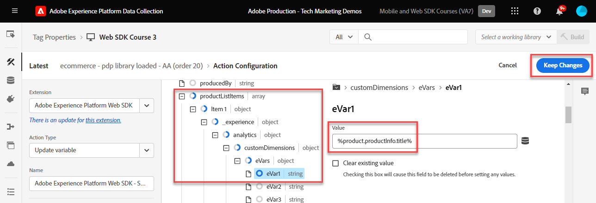
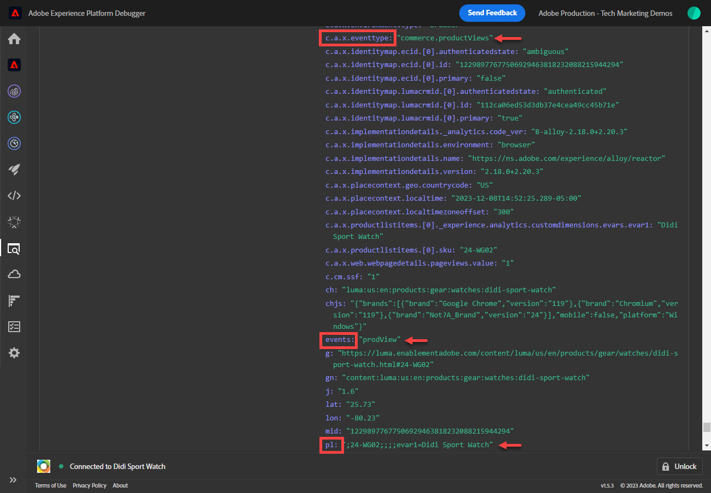
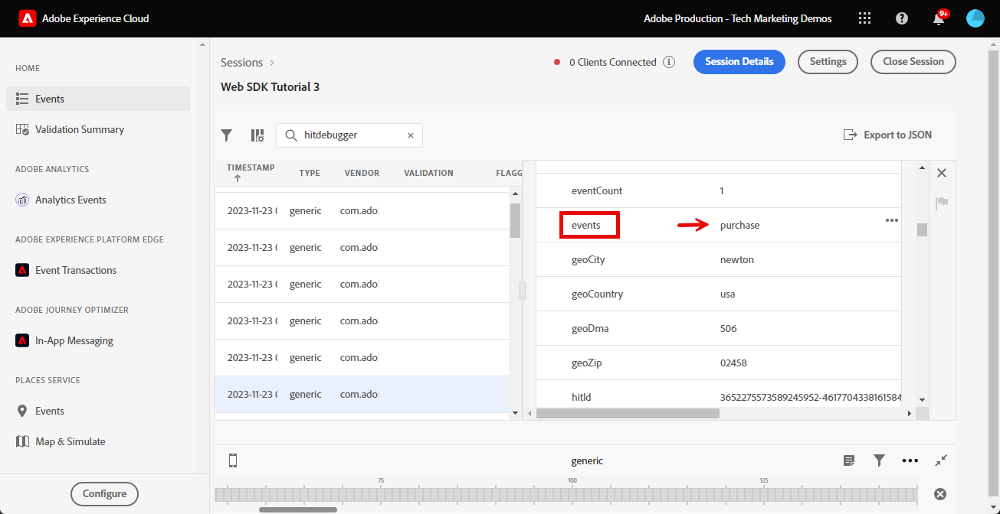

# Adobe Experience Platform Web SDK으로 Adobe Analytics 설정

[Adobe Analytics Web SDK](https://experienceleague.adobe.com/en/docs/platform-learn/data-collection/web-sdk/overview)를 사용하여 Adobe Experience Platform을 설정하고, Adobe Analytics에 데이터를 보내기 위한 태그 규칙을 만들고, Analytics가 데이터를 예상대로 캡처하고 있는지 확인하는 방법에 대해 알아봅니다.

[Adobe Analytics](https://experienceleague.adobe.com/ko/docs/analytics)은(는) 고객 인텔리전스로 고객을 사람으로 이해하고 고객 인텔리전스로 비즈니스를 이끌어 나갈 수 있는 업계 선도적인 애플리케이션입니다.

## 학습 목표

이 단원을 마치면 다음을 수행할 수 있습니다.

* Adobe Analytics을 활성화하기 위한 데이터 스트림 구성
* Analytics 변수에 자동 매핑되는 표준 XDM 필드 식별
* 데이터 개체에서 Analytics 변수 설정
* 데이터 스트림을 재정의하여 데이터를 다른 보고서 세트에 보냅니다.
* 디버거 및 Assurance을 사용하여 Adobe Analytics 변수 유효성 검사

## 전제 조건

이 단원을 완료하려면 먼저 다음 작업을 수행해야 합니다.

* Adobe Analytics에 대해 잘 알고 있고 액세스할 수 있습니다.

* 하나 이상의 테스트/개발 보고서 세트 ID가 있습니다. 이 자습서에 사용할 수 있는 테스트/개발 보고서 세트가 없는 경우 [만드십시오](https://experienceleague.adobe.com/en/docs/analytics/admin/admin-tools/manage-report-suites/c-new-report-suite/t-create-a-report-suite).

* 이 자습서의 초기 구성 및 태그 구성 섹션에서 이전 단원을 완료합니다.

## 데이터 스트림 구성

Platform Web SDK은 웹 사이트에서 Platform Edge Network으로 데이터를 전송합니다. 그런 다음 데이터 스트림은 데이터를 전송해야 하는 Adobe Analytics 보고서 세트를 Platform Edge Network에 알려줍니다.

1. [데이터 수집](https://experience.adobe.com/#/data-collection){target="blank"} 인터페이스로 이동
1. 왼쪽 탐색에서 **[!UICONTROL 데이터스트림]**&#x200B;을 선택합니다.
1. 이전에 만든 `Luma Web SDK: Development Environment` 데이터스트림 선택

   

1. **[!UICONTROL 서비스 추가]** 선택
   
1. **[!UICONTROL Adobe Analytics]**&#x200B;을(를) **[!UICONTROL 서비스]**(으)로 선택
1. 개발 보고서 세트의 **[!UICONTROL 보고서 세트 ID]** 입력
1. **[!UICONTROL 저장]** 선택

   

   >[!TIP]
   >
   >**[!UICONTROL 보고서 세트 추가]**&#x200B;를 선택하여 더 많은 보고서 세트를 추가하는 것은 다중 세트 태그 지정과 같습니다.

>[!WARNING]
>
>이 자습서에서는 개발 환경에 대해서만 Adobe Analytics 보고서 세트를 구성합니다. 자체 웹 사이트에 대한 데이터스트림을 생성할 때 스테이징 및 프로덕션 환경에 대한 추가 데이터스트림 및 보고서 세트를 생성해야 합니다.

## Analytics 변수 설정

웹 SDK 구현에서 Analytics 변수를 설정하는 방법에는 몇 가지가 있습니다.

1. Analytics 변수에 대한 XDM 필드 자동 매핑 (자동).
1. `data` 개체에 필드를 설정합니다(권장).
1. Analytics 처리 규칙에서 XDM 필드를 Analytics 변수에 매핑합니다(더 이상 권장되지 않음).
1. XDM 스키마에서 Analytics 변수에 직접 매핑합니다(더 이상 권장되지 않음).

2024년 5월부터 Platform Web SDK을 사용하여 Adobe Analytics을 구현하기 위해 XDM 스키마를 만들 필요가 없습니다. `data` 개체(및 [데이터 요소 만들기](create-data-elements.md) 단원에서 만든 `data.variable` 데이터 요소)를 사용하여 모든 사용자 지정 Analytics 변수를 설정할 수 있습니다. 데이터 개체에서 이러한 변수를 설정하면 기존 Analytics 고객에게 익숙하고, 처리 규칙 인터페이스를 사용하는 것보다 효율적이며, 불필요한 데이터가 실시간 고객 프로필에 공간을 차지하는 것을 방지합니다(Real-Time Customer Data Platform 또는 Journey Optimizer이 있는 경우 중요).

### 자동으로 매핑된 필드

많은 XDM 필드는 자동으로 Analytics 변수에 매핑됩니다. 최신 매핑 목록을 확인하려면 [Adobe Experience Edge의 Analytics 변수 매핑](https://experienceleague.adobe.com/en/docs/experience-platform/edge/data-collection/adobe-analytics/automatically-mapped-vars)을 참조하십시오.

사용자 지정 스키마를 정의하지 않았더라도 _이(가) 발생할 경우_&#x200B;입니다. Experience Platform Web SDK은 자동으로 일부 데이터를 수집하여 XDM 필드로 Platform Edge Network에 보냅니다. 예를 들어 Web SDK은 현재 페이지 URL을 읽고 XDM 필드 `web.webPageDetails.URL`(으)로 보냅니다. 이 필드는 Adobe Analytics으로 전달되며 Adobe Analytics의 페이지 URL 보고서가 자동으로 채워집니다.

이 자습서에서 XDM 스키마로 Adobe Analytics용 Web SDK을 구현하는 경우, 이 표에 설명된 대로 Analytics 변수에 자동 매핑되도록 사용자 지정 구현한 XDM 필드 중 일부가 있습니다.

| XDM을 Analytics에 자동 매핑된 변수로 | Adobe Analytics 변수 |
|-------|---------|
| `identitymap.ecid.[0].id` | mid |
| `web.webPageDetails.name` | s.pageName |
| `web.webPageDetails.server` | s.server |
| `web.webPageDetails.siteSection` | s.channel |
| `commerce.productViews.value` | prodView |
| `commerce.productListViews.value` | scView |
| `commerce.checkouts.value` | scCheckout |
| `commerce.purchases.value` | 구매 |
| `commerce.order.currencyCode` | s.currencyCode |
| `commerce.order.purchaseID` | s.purchaseID |
| `productListItems[].SKU` | s.products=;product name;;;; (primary - 아래 참고 사항 참조) |
| `productListItems[].name` | s.products=;product name;;;; (fallback - 아래 참고 사항 참조) |
| `productListItems[].quantity` | s.products=;;product quantity;;; |
| `productListItems[].priceTotal` | s.product=;;;product price;; |

Analytics 제품 문자열의 개별 섹션은 `productListItems` 개체 아래에서 다양한 XDM 변수를 통해 설정됩니다.

>[!NOTE]
>
>2022년 8월 18일부터 `productListItems[].SKU`은(는) s.products 변수의 제품 이름에 매핑하는 우선 순위를 갖습니다.
>>`productListItems[].name`(으)로 설정된 값은 `productListItems[].SKU`이(가) 없는 경우에만 제품 이름에 매핑됩니다. 그렇지 않으면 매핑되지 않고 컨텍스트 데이터에서 사용할 수 있습니다.
>>빈 문자열 또는 null을 `productListItems[].SKU`(으)로 설정하지 마십시오. 이렇게 하면 s.products 변수의 제품 이름에 매핑되지 않는 효과가 있습니다.

### 데이터 개체에서 변수 설정

하지만 evar, prop, 이벤트는 어떻습니까? `data` 개체에 변수를 설정하는 것이 Web SDK에서 이러한 Analytics 변수를 설정하는 데 권장되는 방법입니다. 데이터 객체에서 변수를 설정하면 자동으로 매핑된 변수를 덮어쓸 수도 있습니다.

먼저 `data` 개체는 무엇입니까? 모든 웹 SDK 이벤트에서는 사용자 지정 데이터가 있는 두 개체, 즉 `xdm` 개체와 `data` 개체를 보낼 수 있습니다. 둘 다 Platform Edge Network으로 전송되지만 `xdm` 개체만 Experience Platform 데이터 세트로 전송됩니다. `data` 개체의 속성은 데이터 수집을 위한 데이터 준비 기능을 사용하여 Edge에서 `xdm` 필드에 매핑될 수 있지만 그렇지 않으면 Experience Platform으로 전송되지 않습니다. 따라서 Experience Platform에 기본적으로 구축되지 않은 Analytics와 같은 애플리케이션에 데이터를 전송하는 것이 이상적입니다.

다음은 일반적인 웹 SDK 호출의 두 개체입니다.

Adobe Analytics은 `data.__adobe.analytics` 개체에서 모든 속성을 찾아 Analytics 변수에 사용하도록 구성되어 있습니다.

이제 이것이 어떻게 작동하는지 알아보겠습니다. 페이지 이름으로 `eVar1` 및 `prop1`을(를) 설정하고 XDM 매핑 값을 덮어쓰는 방법을 살펴보겠습니다

1. 태그 규칙 `all pages - library loaded - set global variables - 1`을(를) 엽니다
1. 새 **[!UICONTROL 작업]** 추가
1. **[!UICONTROL Adobe Experience Platform Web SDK]** 확장 선택
1. **[!UICONTROL 작업 유형]**&#x200B;을(를) **[!UICONTROL 변수 업데이트]**(으)로 선택
1. `data.variable`을(를) **[!UICONTROL 데이터 요소]**(으)로 선택
1. **[!UICONTROL analytics]** 개체 선택
1. `eVar1`을(를) `page.pageInfo.pageName` 데이터 요소로 설정
1. `prop1`을(를) 설정하여 `eVar1`의 값을 복사합니다.
1. XDM 매핑 값의 덮어쓰기를 테스트하려면 **[!UICONTROL 추가 속성]** 섹션에서 페이지 이름을 정적 값 `test`(으)로 설정합니다.
1. 규칙 저장

이제 전송 이벤트 규칙에 데이터 개체를 포함해야 합니다.

1. 태그 규칙 `all pages - library loaded - send event - 50`을(를) 엽니다
1. **[!UICONTROL 이벤트 보내기]** 작업 열기
1. `data.variable`을(를) **[!UICONTROL 데이터]**(으)로 선택
1. **[!UICONTROL 변경 내용 유지]** 선택
1. **[!UICONTROL 저장]** 선택

<!--

### Map to Analytics variables with processing rules

All fields in the XDM schema become available to Adobe Analytics as Context Data Variables with the following prefix `a.x.`. For example, `a.x.web.webinteraction.region`

In this exercise, you map one XDM variable to a prop. Follow these same steps for any custom mapping that you must do for any `eVar`, `prop`, `event`, or variable accessible via Processing Rules.

1. Go to the Analytics interface
1. Go to [!UICONTROL Admin] > [!UICONTROL Admin Tools] > [!UICONTROL Report Suites ]
1. Select the dev/test report suite that you are using for the tutorial > [!UICONTROL Edit Settings] > [!UICONTROL General] > [!UICONTROL Processing Rules]

       

1. Create a rule to **[!UICONTROL Overwrite value of]** `[!UICONTROL Product SKU (prop1)]` to `a.x.productlistitems.0.sku`. Remember to add a note about why you are creating the rule and name your rule title. Select **[!UICONTROL Save]**

       

    >[!IMPORTANT]
    >
    >The first time you map to a processing rule, the UI does not show you the context data variables from the XDM object. To fix that select any value, Save, and come back to edit. All XDM variables should now appear.

### Map to Analytics variables using the Adobe Analytics field group

An alternative to processing rules is to map to Analytics variables in the XDM schema using the `Adobe Analytics ExperienceEvent Template` field group. This approach has gained popularity because many users find it simpler than configuring processing rules, however, by increasing the size of the XDM payload it could in turn increase the profile size in other applications like Real-Time CDP.

To add the `Adobe Analytics ExperienceEvent Template` field group to your schema:

1. Open the [Data Collection](https://experience.adobe.com/#/data-collection){target="blank"} interface
1. Select **[!UICONTROL Schemas]** from the left navigation
1. Make sure you are in the sandbox you are using from the tutorial
1. Open your `Luma Web Event Data` schema
1. In the **[!UICONTROL Field Groups]** section, select **[!UICONTROL Add]**
1. Find the `Adobe Analytics ExperienceEvent Template` field group and add it to your schema

Now, set a merchandising eVar in the product string. With the `Adobe Analytics ExperienceEvent Template` field group, you are able to map variables to merchandising eVars or events within the product string. This is also known as setting **Product Syntax Merchandising**. 

1. Go back to your tag property

1. Open the rule `ecommerce - library loaded - set product details variables - 20`

1. Open the **[!UICONTROL Set Variable]** action

1. Select to open `_experience > analytics > customDimensions > eVars > eVar1`

1. Set the **[!UICONTROL Value]** to `%product.productInfo.title%`

1. Select **[!UICONTROL Keep Changes]**

    

1. Select **[!UICONTROL Save]** to save the rule

As you just saw, basically all of the Analytics variables can be set in the `Adobe Analytics ExperienceEvent Template` field group.

>[!NOTE]
>
> Notice the `_experience` object under `productListItems` > `Item 1`. Setting any variable under this [!UICONTROL object] sets Product Syntax eVars or Events.

-->

## 다른 보고서 세트로 데이터 보내기

방문자가 특정 페이지에 있을 때 전송할 Adobe Analytics 보고서 세트 데이터를 변경할 수 있습니다. 이를 위해서는 데이터 스트림과 규칙 모두에서 구성해야 합니다.

### 보고서 세트 재정의를 위한 데이터스트림 구성

데이터 스트림에서 Adobe Analytics 보고서 세트 재정의 설정을 구성하려면 다음 작업을 수행하십시오.

1. 데이터 스트림 열기
1.  메뉴를 연 다음 **[!UICONTROL 편집]**&#x200B;을 선택하여 **[!UICONTROL Adobe Analytics]** 구성을 편집하십시오.

   

1. **[!UICONTROL 고급 옵션]**&#x200B;을 선택하여 **[!UICONTROL 보고서 세트 무시]**&#x200B;를 엽니다.

1. 재정의할 보고서 세트를 선택합니다. 이 경우 `Web SDK Course Dev` 및 `Web SDK Course Stg`

1. **[!UICONTROL 저장]** 선택

   

### 보고서 세트 재정의에 대한 규칙 구성

다른 보고서 세트에 추가 페이지 보기 호출을 보내는 규칙을 만들어 보겠습니다. 데이터 스트림 재정의 기능을 사용하여 **[!UICONTROL 이벤트 보내기]** 작업을 사용하여 페이지에 대한 보고서 세트를 변경할 수 있습니다.

1. 새 규칙을 만들어 이름을 `homepage - library loaded - AA report suite override - 51`로 지정합니다.

1. **[!UICONTROL 이벤트]**&#x200B;에서 더하기 기호를 선택하여 새 트리거를 추가합니다.

1. **[!UICONTROL 확장]**&#x200B;에서 **[!UICONTROL 코어]**&#x200B;을(를) 선택합니다.

1. **[!UICONTROL 이벤트 유형]**&#x200B;에서 **[!UICONTROL 로드된 라이브러리(페이지 상단)]**&#x200B;를 선택합니다.

1. **[!UICONTROL 고급 옵션]**&#x200B;을(를) 열려면 선택하고 `51`을(를) 입력하십시오. 이렇게 하면 **[!UICONTROL 변수 업데이트]** 작업 유형으로 기준 XDM을 설정하는 `all pages - library loaded - send event - 50` 이후에 규칙이 실행됩니다.
1. **[!UICONTROL 변경 내용 유지]** 선택

   

1. **[!UICONTROL 조건]**&#x200B;에서 **[!UICONTROL 추가]**&#x200B;를 선택하십시오.

1. **[!UICONTROL 논리 형식]**&#x200B;을(를) **[!UICONTROL 보통]**(으)로 둡니다.

1. **[!UICONTROL 확장]**&#x200B;을(를) **[!UICONTROL 코어]**(으)로 유지

1. **[!UICONTROL 조건 유형]**&#x200B;을(를) **[!UICONTROL 쿼리 문자열이 없는 경로]**(으)로 선택

1. 오른쪽에서 **[!UICONTROL Regex]** 토글을 사용하지 않도록 설정합니다.

1. **[!UICONTROL 경로가]**&#x200B;인 경우 `/content/luma/us/en.html`을(를) 설정합니다. Luma 데모 사이트의 경우 규칙이 홈 페이지에서만 트리거되도록 합니다

1. **[!UICONTROL 변경 내용 유지]** 선택

   

1. **[!UICONTROL 작업]**&#x200B;에서 **[!UICONTROL 추가]**&#x200B;를 선택합니다.

1. **[!UICONTROL 확장]**(으)로 **[!UICONTROL Adobe Experience Platform Web SDK]**&#x200B;을(를) 선택합니다.

1. **[!UICONTROL 작업 유형]**(으)로 **[!UICONTROL 이벤트 보내기]**&#x200B;를 선택합니다.

1. **[!UICONTROL XDM 데이터]**(으)로, [데이터 요소 만들기](create-data-elements.md) 단원에서 만든 `xdm.variable.content` 데이터 요소를 선택합니다

1. **[!UICONTROL Data]**(으)로 [데이터 요소 만들기](create-data-elements.md) 단원에서 만든 `data.variable` 데이터 요소를 선택합니다

   

1. **[!UICONTROL 데이터 스트림 구성 재정의]** 섹션까지 아래로 스크롤합니다.

1. **[!UICONTROL 개발]** 탭을 선택한 상태로 둡니다.

   >[!TIP]
   >
   >    이 탭은 재정의가 발생하는 태그 환경을 결정합니다. 이 연습에서는 개발 환경만 지정하지만 프로덕션에 배포할 때는 **[!UICONTROL 프로덕션]** 환경에서도 지정해야 합니다.

1. 자습서에 사용하는 **[!UICONTROL 샌드박스]**&#x200B;를 선택하십시오.
1. **[!UICONTROL 데이터 스트림]**(이 경우 `Luma Web SDK: Development Environment`) 선택

1. **[!UICONTROL 보고서 세트]**&#x200B;에서 재정의하는 데 사용할 보고서 사이트를 선택하십시오. 이 경우 `tmd-websdk-course-stg`입니다.

1. **[!UICONTROL 변경 내용 유지]** 선택

1. 규칙을 **[!UICONTROL 저장]**

   

## 개발 환경 구축

업데이트된 규칙을 `Luma Web SDK Tutorial` 태그 라이브러리에 추가하고 개발 환경을 다시 빌드합니다.

축하합니다! 다음 단계는 Experience Platform Web SDK을 통해 Adobe Analytics 구현의 유효성을 검사하는 것입니다.

## 디버거를 사용하여 Adobe Analytics 유효성 검사

Adobe Analytics이 Experience Platform Debugger의 Edge 추적 기능을 사용하여 ECID, 페이지 보기, 제품 문자열 및 전자 상거래 이벤트를 캡처하고 있는지 확인하는 방법을 알아봅니다.

[Debugger](validate-with-debugger.md) 단원에서 `AppMeasurement.js` Analytics 구현을 디버깅하는 방법과 유사한 Platform Debugger 및 브라우저 개발자 콘솔을 사용하여 클라이언트측 XDM 요청을 검사하는 방법을 배웠습니다. 또한 Adobe 애플리케이션으로 전송된 Platform Edge Network 서버측 요청의 유효성 검사와 Assurance을 사용하여 완전히 처리된 페이로드를 확인하는 방법에 대해 배웠습니다.

Analytics가 Experience Platform Web SDK을 통해 데이터를 제대로 캡처하고 있는지 확인하려면 다음 두 단계를 더 수행해야 합니다.

1. Experience Platform Debugger의 Edge 추적 기능을 사용하여 Platform Edge Network의 XDM 개체에서 데이터가 처리되는 방식의 유효성을 검사합니다
1. Adobe Experience Platform Assurance을 사용하여 Analytics에서 데이터가 완전히 처리되는 방식의 유효성 검사

### Experience Cloud ID 유효성 검사

1. [Luma 데모 사이트](https://luma.enablementadobe.com/content/luma/us/en.html){target="_blank"}(으)로 이동
1. 오른쪽 상단에 있는 로그인 단추를 선택하고 자격 증명 u: test@test.com p: 테스트를 사용하여 인증합니다.
1. Experience Platform Debugger를 열고 [사이트의 태그 속성을 고유한 개발 속성으로 전환](validate-with-debugger.md#use-the-experience-platform-debugger-to-map-to-your-tags-property)

1. Edge 추적을 사용하려면 Experience Platform Debugger로 이동하고 왼쪽 탐색에서 **[!UICONTROL 로그]**&#x200B;를 선택한 다음 **[!UICONTROL Edge]** 탭을 선택하고 **[!UICONTROL 연결]**&#x200B;을 선택합니다

   

1. 지금은 비어 있습니다.

   

1. Luma 페이지를 새로 고치고 Experience Platform Debugger를 다시 확인합니다. 데이터가 통과된 것을 볼 수 있습니다. **[!UICONTROL Analytics 자동 매핑]**(으)로 시작하는 행은 Adobe Analytics 비콘입니다
1. Analytics 변수를 보려면 `[!UICONTROL mappedQueryParams]` 드롭다운과 두 번째 드롭다운을 모두 열려면 선택하십시오.

   

   >[!TIP]
   >
   >두 번째 드롭다운은 데이터를 보내는 Analytics 보고서 세트 ID에 해당합니다. 스크린샷의 보고서 세트가 아니라 자신의 보고서 세트와 일치해야 합니다.

1. 아래로 스크롤하여 `[!UICONTROL c.a.x.identitymap.ecid.[0].id]`을(를) 찾습니다. ECID를 캡처하는 컨텍스트 데이터 변수입니다
1. Analytics `[!UICONTROL mid]` 변수가 표시될 때까지 아래로 스크롤합니다. 두 ID 모두 장치의 Experience Cloud ID와 일치합니다.
1. Luma 사이트에서:

   

   >[!NOTE]
   >
   >로그인했으므로 `[!UICONTROL c.a.x.identitymap.lumacrmid.[0].id]`에서 **`test@test.com`** 사용자에 대한 인증된 ID `b642b4217b34b1e8d3bd915fc65c4452`의 유효성을 검사하는 동안 잠시 기다려 주십시오.

### 보고서 세트 재정의 유효성 검사

위에서 [Luma 홈 페이지](https://luma.enablementadobe.com/content/luma/us/en.html)에 대한 데이터 스트림 재정의를 구성했습니다.  이 구성의 유효성을 검사하려면

1. 재정의가 적용된 후 **[!UICONTROL 데이터스트림 구성이 있는 행을 찾습니다]**. 여기에서 보고서 세트 무시를 위해 구성된 기본 보고서 세트와 추가 보고서 세트를 찾을 수 있습니다.

   

1. **[!UICONTROL Analytics 자동 매핑]**(으)로 시작하는 행까지 아래로 스크롤하여 `[!UICONTROL reportSuiteIds]`에 재정의 구성에 지정한 보고서 세트가 표시되는지 확인합니다

   

### 콘텐츠 페이지 보기 수 유효성 검사

[Didi Sport Watch 제품 페이지](https://luma.enablementadobe.com/content/luma/us/en/products/gear/watches/didi-sport-watch.html#24-WG02)와 같은 제품 페이지로 이동합니다.  Analytics에서 컨텐츠 페이지 보기를 캡처하는지 확인합니다.

1. `[!UICONTROL c.a.x.web.webpagedetails.pageviews.value]=1` 검색
1. 아래로 스크롤하여 `[!UICONTROL gn]` 변수를 확인합니다. `[!UICONTROL s.pageName]` 변수에 대한 Analytics 동적 구문입니다. 데이터 레이어에서 페이지 이름을 캡처합니다.

   >[!NOTE]
   >
   > 이전 연습에서 `data` 개체로 `xdm` 개체를 덮어쓴 경우 `gn` 값이 `test`일 수 있습니다.

   

### 제품 문자열 및 전자 상거래 이벤트 유효성 검사

이미 제품 페이지를 사용하고 있으므로 이 연습에서는 동일한 Edge 추적을 사용하여 Analytics가 제품 데이터를 캡처하는지 확인합니다. 제품 문자열 및 전자 상거래 이벤트는 모두 XDM 변수를 Analytics에 자동으로 매핑합니다. [Adobe Analytics에 대한 XDM 스키마를 구성](setup-analytics.md#configure-an-xdm-schema-for-adobe-analytics)하는 동안 적절한 `productListItem` XDM 변수에 매핑했다면 Platform Edge Network에서 적절한 Analytics 변수에 데이터를 매핑합니다.

**먼저 `Product String`이(가) 설정되어 있는지 확인**

1. `[!UICONTROL c.a.x.productlistitems.][0].[!UICONTROL sku]` 검색 변수는 이 단원의 앞부분에서 `productListItems.item1.sku`에 매핑한 데이터 요소 값을 캡처합니다.
1. `[!UICONTROL c.a.x.productlistitems.][0].[!UICONTROL _experience.analytics.customdimensions.evars.evar1]`도 찾습니다. 변수는 `productListItems.item1._experience.analytics.customdimensions.evars.evar1`에 매핑한 데이터 요소 값을 캡처합니다.
1. 아래로 스크롤하여 `[!UICONTROL pl]` 변수를 확인합니다. Analytics 제품 문자열 변수의 동적 구문입니다
1. 데이터 계층의 제품 이름은 제품 문자열의 `[!UICONTROL c.a.x.productlistitems.][0].[!UICONTROL sku]` 및 `[!UICONTROL product]` 매개 변수에 모두 매핑됩니다.  또한 데이터 계층의 제품 제목은 제품 문자열의 머천다이징 evar1에 매핑됩니다.

   

   Edge 추적은 `commerce` 이벤트를 `productList` 차원과 약간 다르게 처리합니다. 위의 `[!UICONTROL c.a.x.productlistitem.[0].name]`에 매핑된 제품 이름과 같은 방식으로 매핑된 컨텍스트 데이터 변수가 없습니다. 대신 Edge 추적은 Analytics `event` 변수에 최종 이벤트 자동 매핑을 표시합니다. Platform Edge Network은 [Adobe Analytics에 대한 스키마를 구성](setup-analytics.md#configure-an-xdm-schema-for-adobe-analytics)(이 경우 `commerce.productViews.value=1`)하는 동안 적절한 XDM `commerce` 변수에 매핑하기만 하면 해당 변수를 매핑합니다.

1. Experience Platform Debugger 창으로 돌아가 `[!UICONTROL events]` 변수로 스크롤하면 `[!UICONTROL prodView]`(으)로 설정됩니다.

1. 제품 페이지에 있으므로 `[!UICONTROL c.a.x.eventType]`이(가) `commerce.productViews`(으)로 설정되어 있습니다.

   >[!TIP]
   >
   > `ecommerce - library loaded - set product details variables - 20` 규칙은 `all pages - library loaded - set global variables - 1` 규칙이 설정한 `eventType`의 값을 시퀀스 뒷부분에서 트리거하도록 설정했으므로 덮어씁니다

   

**나머지 전자 상거래 이벤트와 제품 문자열이 Analytics에 대해 설정되어 있는지 확인**

1. 장바구니에 [Didi Sport Watch](https://luma.enablementadobe.com/content/luma/us/en/products/gear/watches/didi-sport-watch.html#24-WG02) 추가
1. [장바구니 페이지](https://luma.enablementadobe.com/content/luma/us/en/user/cart.html)&#x200B;(으)로 이동하여 다음 항목에 대한 Edge 추적 확인

   * `eventType`이(가) `commerce.productListViews`(으)로 설정됨
   * `[!UICONTROL events: "scView"]` 및
   * 제품 문자열이 설정됩니다.

   

1. 체크아웃으로 이동하여 다음에 대한 Edge 추적 을 확인하십시오.

   * `eventType`이(가) `commerce.checkouts`(으)로 설정됨
   * `[!UICONTROL events: "scCheckout"]` 및
   * 제품 문자열이 설정됩니다.

   

1. 배송 양식에 **이름** 및 **성** 필드만 입력하고 **계속**&#x200B;을 선택하세요. 다음 페이지에서 **주문**&#x200B;을 선택하세요.
1. 확인 페이지에서 다음에 대한 Edge 추적 을 확인하십시오.

   * `eventType`이(가) `commerce.purchases`(으)로 설정됨
   * 구매 이벤트가 `[!UICONTROL events: "purchase"]` 설정 중입니다.
   * 통화 코드 변수 설정 중 `[!UICONTROL cc: "USD"]`
   * `[!UICONTROL pi]`에 설정되는 구매 ID
   * 제품 이름, 수량 및 가격을 설정하는 제품 문자열 `[!UICONTROL pl]`

   

## Assurance을 사용하여 Adobe Analytics 유효성 검사

Adobe Experience Platform Assurance을 사용하면 웹 사이트 및 모바일 애플리케이션에서 데이터를 수집하거나 경험을 제공하는 방법을 검사, 증명, 시뮬레이션 및 검증할 수 있습니다.

이전 연습에서는 Adobe Analytics이 Experience Platform Debugger의 Edge 추적 기능을 사용하여 ECID, 페이지 보기, 제품 문자열 및 전자 상거래 이벤트를 캡처하고 있음을 확인했습니다.  그런 다음 Edge Trace의 동일한 데이터에 액세스하는 대체 인터페이스인 Adobe Experience Platform Assurance을 사용하여 이러한 동일한 이벤트를 확인합니다.

[Assurance](validate-with-assurance.md) 단원에서 배운 대로 Assurance 세션을 시작하는 방법에는 여러 가지가 있습니다. 마지막 연습에서 시작한 Edge 추적 세션으로 이미 Adobe Experience Platform Debugger이 열려 있으므로 디버거를 통해 Assurance에 액세스하는 것이 좋습니다.

**[!UICONTROL &quot;웹 SDK 자습서 3&quot;]** Assurance 세션 내에서 이벤트 검색 표시줄에 **[!UICONTROL &quot;hitdebugger&quot;]**을(를) 입력하여 결과를 Adobe Analytics Post에서 처리된 데이터로 필터링합니다.

### Experience Cloud ID 유효성 검사

Adobe Analytics이 ECID를 캡처하고 있는지 확인하려면 비콘을 선택하고 페이로드를 엽니다.  이 비콘의 공급업체는 **[!UICONTROL com.adobe.analytics.hitdebugger]**여야 합니다.

그런 다음 **[!UICONTROL mcvisId]**(으)로 아래로 스크롤하여 ECID가 올바르게 캡처되었는지 확인합니다

### 콘텐츠 페이지 보기 수 유효성 검사

동일한 비콘을 사용하여 컨텐츠 페이지 보기가 올바른 Adobe Analytics 변수에 매핑되었는지 확인합니다.
**[!UICONTROL pageName]**(으)로 아래로 스크롤하여 `Page Name`이(가) 올바르게 캡처되었는지 확인합니다.

    >[!NOTE]
    >
    > 이전 연습에서 &#39;data&#39; 개체로 &#39;xdm&#39; 개체를 덮어쓴 경우 &#39;pageName&#39; 값이 &#39;test&#39;일 수 있습니다.
    
    

### 제품 문자열 및 전자 상거래 이벤트 유효성 검사

위의 Experience Platform Debugger를 사용하여 유효성을 검사할 때 사용된 동일한 유효성 검사 사용 사례에 따라 동일한 비콘을 사용하여 `Ecommerce Events` 및 `Product String`의 유효성을 계속 검사하십시오.

1. **[!UICONTROL 이벤트]**&#x200B;에 `prodView`이(가) 포함된 페이로드를 찾습니다.
   
1. **[!UICONTROL product-string]**(으)로 스크롤하여 `Product String`의 유효성을 검사하십시오.
   * `Product SKU` 및 `Merchandizing eVar1`을(를) 확인합니다.
1. 아래로 더 스크롤하여 이전 섹션에서 처리 규칙을 사용하여 구성한 `prop1`에 `Product SKU`이(가) 포함되어 있는지 확인합니다.\
   

장바구니, 체크아웃 및 구매 이벤트를 검토하여 구현의 유효성을 계속 확인합니다.

1. **[!UICONTROL events]**&#x200B;에 `scView`이(가) 포함된 페이로드를 찾아 제품 문자열의 유효성을 검사합니다.
   
1. **[!UICONTROL events]**&#x200B;에 `scCheckout`이(가) 포함된 페이로드를 찾아 제품 문자열의 유효성을 검사합니다.
   
1. **[!UICONTROL 이벤트]**&#x200B;에 `purchase`이(가) 포함된 페이로드를 찾습니다.
   
1. `purchase` 이벤트의 유효성을 검사할 때 `Product String`에 `Product SKU`, `Product Quantity` 및 `Product Total Price`이(가) 있어야 합니다.
1. 또한 `purchase`의 경우 `purchase-id` 및/또는 `purchaseId`이(가) 설정되어 있는지 확인합니다.

축하합니다! 네가 해냈어! 이 작업은 단원을 마쳤으며 이제 자신의 웹 사이트에 대해 Platform Web SDK을 사용하여 Adobe Analytics을 구현할 준비가 되었습니다.

[다음: ](setup-audience-manager.md)

>[!NOTE]
>
>Adobe Experience Platform 웹 SDK에 대해 학습하는 데 시간을 투자해 주셔서 감사합니다. 질문이 있거나 일반적인 피드백을 공유하고 싶거나 향후 콘텐츠에 대한 제안이 있는 경우 이 [Experience League 커뮤니티 토론 게시물](https://experienceleaguecommunities.adobe.com/t5/adobe-experience-platform-data/tutorial-discussion-implement-adobe-experience-cloud-with-web/td-p/444996)에서 공유하십시오.
