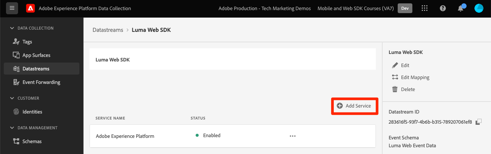
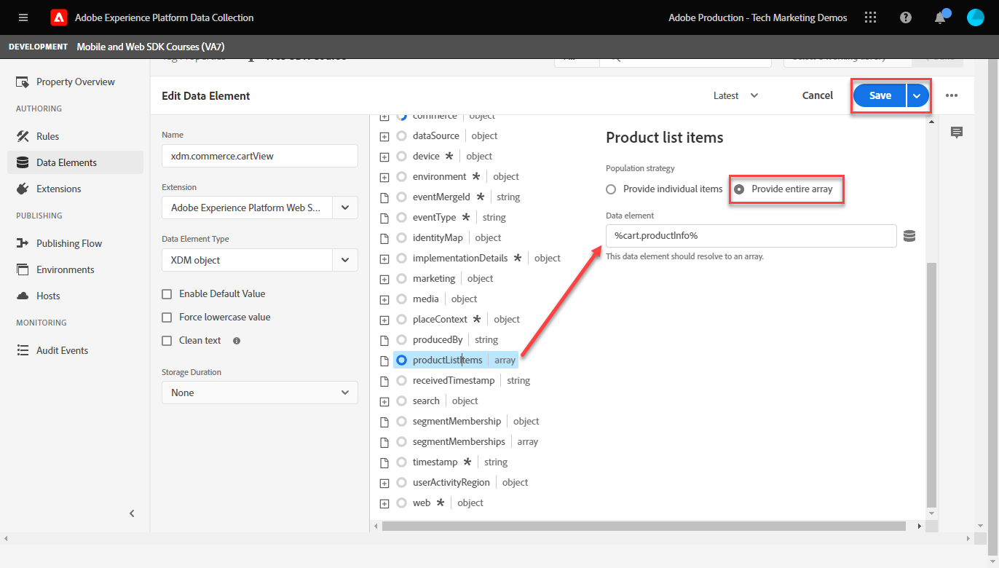
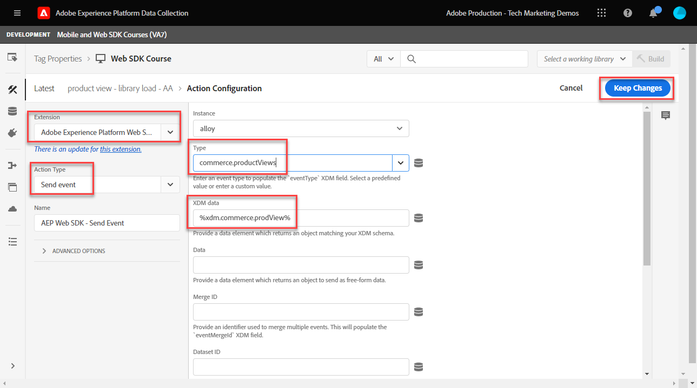

# Platform Web SDK를 사용하여 Adobe Analytics 설정


>[!CAUTION]
>
>2024년 3월 15일 금요일에 이 자습서에 대한 주요 변경 사항을 게시하려고 합니다. 이 시점 이후에는 많은 연습이 변경되며 모든 단원을 완료하려면 튜토리얼을 처음부터 다시 시작해야 할 수 있습니다.

다음을 사용하여 Adobe Analytics을 설정하는 방법 알아보기 [Experience Platform Web SDK](https://experienceleague.adobe.com/docs/platform-learn/data-collection/web-sdk/overview.html), 태그 규칙을 만들어 데이터를 Adobe Analytics으로 전송하고, Analytics가 데이터를 예상대로 캡처하는지 확인합니다.

[Adobe Analytics](https://experienceleague.adobe.com/docs/analytics.html?lang=ko-KR) 은 고객 인텔리전스로 고객을 사람으로 이해하고 고객 인텔리전스로 비즈니스를 이끌어 나갈 수 있는 업계 선도적인 애플리케이션입니다.

## 학습 목표

이 단원을 마치면 다음을 수행할 수 있습니다.

* Adobe Analytics에 대한 XDM 스키마를 구성하고 Analytics에 대한 자동 매핑 변수와 수동 매핑 XDM 변수의 차이점을 이해합니다
* Adobe Analytics을 활성화하기 위한 데이터 스트림 구성
* 개별 또는 전체 배열 데이터 요소를 XDM 개체에 매핑
* XDM 개체를 사용하여 Adobe Analytics에서 페이지 보기 캡처
* Adobe Analytics 제품 문자열의 XDM 개체를 사용하여 전자 상거래 데이터 캡처
* Experience Platform 디버거를 사용하여 Adobe Analytics 변수가 XDM 개체로 설정되어 있는지 확인합니다.
* Adobe Analytics 처리 규칙을 사용하여 사용자 지정 변수 설정
* 실시간 보고서를 사용하는 Adobe Analytics에서 데이터의 유효성 검사

## 전제 조건

태그, Adobe Analytics 및 [Luma 데모 사이트](https://luma.enablementadobe.com/content/luma/us/en.html){target="_blank"} 로그인 및 쇼핑 기능.

하나 이상의 테스트/개발 보고서 세트 ID가 필요합니다. 이 자습서에 사용할 수 있는 테스트/개발 보고서 세트가 없는 경우 [하나를 만드십시오.](https://experienceleague.adobe.com/docs/analytics/admin/manage-report-suites/new-report-suite/t-create-a-report-suite.html).

자습서의 이전 섹션에서 모든 단계를 완료했어야 합니다.

* 초기 구성
   * [권한 구성](configure-permissions.md)
   * [XDM 스키마 구성](configure-schemas.md)
   * [ID 네임스페이스 구성](configure-identities.md)
   * [데이터스트림 구성](configure-datastream.md)
* 태그 구성
   * [웹 SDK 확장 기능 설치](install-web-sdk.md)
   * [데이터 요소 만들기](create-data-elements.md)
   * [태그 규칙 만들기](create-tag-rule.md)
   * [Adobe Experience Platform Debugger로 유효성 검사](validate-with-debugger.md)

## XDM 스키마 및 Analytics 변수

축하합니다! 에서 Adobe Analytics과 호환되는 스키마를 이미 구성했습니다. [스키마 구성](configure-schemas.md) 레슨!

Platform Web SDK 구현은 가능한 한 제품과 관계없어야 합니다. Adobe Analytics의 경우 eVar, prop 및 이벤트 매핑은 스키마 생성 중이나 일반적으로 수행되었던 태그 규칙 구성 중에는 발생하지 않습니다. 대신 모든 XDM 키-값 쌍이 다음 두 가지 방법 중 하나로 Analytics 변수에 매핑되는 컨텍스트 데이터 변수가 됩니다.

1. 예약된 XDM 필드를 사용하여 자동으로 매핑된 변수
1. Analytics 처리 규칙을 사용하여 수동으로 매핑된 변수

Adobe Analytics에 자동 매핑된 XDM 변수를 이해하려면 다음을 참조하십시오. [Analytics에서 자동으로 매핑된 변수](https://experienceleague.adobe.com/docs/experience-platform/edge/data-collection/adobe-analytics/automatically-mapped-vars.html?lang=en). 자동 매핑되지 않은 모든 변수는 수동으로 매핑해야 합니다.

에서 생성된 스키마 [스키마 구성](configure-schemas.md) 단원에는 이 표에 설명된 대로 Analytics 변수에 자동으로 매핑된 몇 가지 기능이 포함되어 있습니다.

| XDM을 Analytics에 자동 매핑된 변수로 | Adobe Analytics 변수 |
|-------|---------|
| `identitymap.ecid.[0].id` | mid |
| `web.webPageDetails.pageViews.value` | 페이지 보기 s.t() 호출 |
| `web.webPageDetails.name` | s.pageName |
| `web.webPageDetails.server` | s.server |
| `web.webPageDetails.siteSection` | s.channel |
| `commerce.productViews.value` | prodView |
| `commerce.productListViews.value` | scView |
| `commerce.checkouts.value` | scCheckout |
| `commerce.purchases.value` | 구매 |
| `commerce.order.currencyCode` | s.currencyCode |
| `commerce.order.purchaseID` | s.purchaseID |
| `productListItems[].SKU` | s.products=;product name;;;; (primary - 아래 참고 사항 참조) |
| `productListItems[].name` | s.products=;product name;;;; (fallback - 아래 참고 사항 참조) |
| `productListItems[].quantity` | s.products=;;product quantity;;; |
| `productListItems[].priceTotal` | s.product=;;;product price;; |

>[!NOTE]
>
>Analytics 제품 문자열의 개별 섹션은 `productListItems` 개체.
>2022년 8월 18일 기준 `productListItems[].SKU` 는 s.products 변수의 제품 이름에 매핑하는 데 우선 순위를 둡니다.
>값이 로 설정된 경우 `productListItems[].name` 는 다음과 같은 경우에만 제품 이름에 매핑됩니다. `productListItems[].SKU` 존재하지 않습니다. 그렇지 않으면 매핑되지 않고 컨텍스트 데이터에서 사용할 수 있습니다.
>빈 문자열 또는 null을 로 설정하지 마십시오.  `productListItems[].SKU`. 이렇게 하면 s.products 변수의 제품 이름에 매핑되지 않는 효과가 있습니다.


## 데이터 스트림 구성

Platform Web SDK는 웹 사이트에서 Platform Edge Network로 데이터를 전송합니다. 그런 다음 데이터 스트림은 Platform Edge Network에 해당 데이터를 전달할 위치를 알려줍니다(이 경우 Adobe Analytics 보고서 세트 중 어느 것인지).

1. 다음으로 이동 [데이터 수집](https://experience.adobe.com/#/data-collection){target="blank"} 인터페이스
1. 왼쪽 탐색에서 을 선택합니다. **[!UICONTROL 데이터스트림]**
1. 이전에 만든 항목 선택 `Luma Web SDK` 데이터스트림

   

1. 선택 **[!UICONTROL 서비스 추가]**
   
1. 선택 **[!UICONTROL Adobe Analytics]** (으)로 **[!UICONTROL 서비스]**
1. 다음을 입력합니다.  **[!UICONTROL 보고서 세트 ID]** 개발 보고서 세트 의
1. 선택 **[!UICONTROL 저장]**

   

   >[!TIP]
   >
   >을 선택하여 더 많은 보고서 세트 추가 **[!UICONTROL 보고서 세트 추가]** 는 다중 세트 태깅에 해당합니다.

>[!WARNING]
>
>이 자습서에서는 개발 Adobe Analytics 보고서 세트만 구성합니다. 자체 웹 사이트에 대한 데이터스트림을 생성할 때 스테이징 및 프로덕션 환경에 대한 추가 데이터스트림 및 보고서 세트를 생성합니다.


## 추가 데이터 요소 만들기

그런 다음 Luma 데이터 레이어에서 추가 데이터를 캡처하여 Platform Edge Network로 전송합니다. 이 단원에서는 일반적인 Adobe Analytics 요구 사항에 중점을 두고 있지만, 캡처된 모든 데이터는 데이터 스트림 구성에 따라 다른 대상으로 쉽게 전송할 수 있습니다. 예를 들어 Adobe Experience Platform 단원을 완료한 경우 이 단원에서 캡처한 추가 데이터도 플랫폼으로 전송됩니다.

### 전자 상거래 데이터 요소 만들기

데이터 요소 만들기 단원 동안 [생성된 JavaScript 데이터 요소](create-data-elements.md#create-data-elements-to-capture-the-data-layer) 캡처된 컨텐츠 및 id 세부 정보. 이제 전자 상거래 데이터를 캡처하기 위한 추가 데이터 요소를 만듭니다. 이유: [Luma 데모 사이트](https://luma.enablementadobe.com/content/luma/us/en.html){target="_blank"} 에서는 장바구니의 제품 세부 사항 페이지 및 제품에 대해 서로 다른 데이터 계층 구조를 사용합니다. 각 시나리오에 대한 데이터 요소를 만들어야 합니다. Luma 데이터 레이어에서 필요한 항목을 가져오기 위해 일부 사용자 지정 코드 데이터 요소를 만들어야 합니다. 이는 자체 사이트에서 구현할 때 필요할 수도 있고 필요하지 않을 수도 있습니다. 이 경우 장바구니 항목 배열을 반복해야 각 제품의 특정 세부 정보를 가져올 수 있습니다. 아래에 제공된 코드 조각을 사용하십시오.

1. 자습서에 사용 중인 태그 속성을 엽니다
1. 다음으로 이동 **[!UICONTROL 데이터 요소]**
1. 선택 **[!UICONTROL 데이터 요소 추가]**
1. 이름 지정 **`product.productInfo.sku`**
1. 사용 **[!UICONTROL 사용자 지정 코드]** **[!UICONTROL 데이터 요소 유형]**
1. 다음에 대한 확인란 남기기 **[!UICONTROL 소문자 강제 적용 값]** 및 **[!UICONTROL 텍스트 정리]** 선택되지 않음
1. 나가기 `None` (으)로 **[!UICONTROL 저장 기간]** 이 값은 모든 페이지에서 다르므로 설정
1. 선택 **[!UICONTROL 편집기 열기]**

   

1. 다음 코드를 복사하여 붙여 넣습니다.

   ```javascript
   var cart = digitalData.product;
   var cartItem;
   cart.forEach(function(item){
   cartItem = item.productInfo.sku;
   });
   return cartItem;
   ```

1. 선택 **[!UICONTROL 저장]** 사용자 지정 코드를 저장하려면

   

1. 선택 **[!UICONTROL 저장]** 데이터 요소를 저장하려면

이러한 추가 데이터 요소를 만들려면 동일한 단계를 따르십시오.

* **`product.productInfo.title`**

  ```javascript
  var cart = digitalData.product;
  var cartItem;
  cart.forEach(function(item){
  cartItem = item.productInfo.title;
  });
  return cartItem;
  ```

* **`cart.productInfo`**

  ```javascript
  var cart = digitalData.cart.cartEntries;
  var cartItem = [];
  cart.forEach(function(item, index, array){
  var qty = parseInt(item.qty);
  var price = parseInt(item.price);
  cartItem.push({
  "SKU": item.sku,
  "name":item.title,
  "quantity":qty,
  "priceTotal":price
  });
  });
  return cartItem;
  ```

이러한 데이터 요소를 추가하고 의 이전 요소를 만든 후 [데이터 요소 만들기](create-data-elements.md) 단원, 다음 데이터 요소가 있어야 합니다.

| 데이터 요소 |
-----------------------------|
| `cart.orderId` |
| `cart.productInfo` |
| `identityMap.loginID` |
| `page.pageInfo.hierarchie1` |
| `page.pageInfo.pageName` |
| `page.pageInfo.server` |
| `product.productInfo.sku` |
| `product.productInfo.title` |
| `user.profile.attributes.loggedIn` |
| `user.profile.attributes.username` |
| `xdm.content` |

>[!IMPORTANT]
>
>이 자습서에서는 각 이벤트에 대해 다른 XDM 개체를 만듭니다. 즉, 페이지 이름 및 identityMap과 같이 모든 히트에서 &quot;전역&quot;으로 사용할 수 있는 것으로 간주되는 변수를 다시 매핑해야 합니다. 그러나 다음을 수행할 수 있습니다. [오브젝트 병합](https://experienceleague.adobe.com/docs/experience-platform/tags/extensions/adobe/core/overview.html#merged-objects) 또는 사용 [테이블 매핑](https://exchange.adobe.com/experiencecloud.details.103136.mapping-table.html) 를 사용하면 실제 상황에서 XDM 개체를 보다 효율적으로 관리할 수 있습니다. 이 단원에서 글로벌 변수는 다음과 같이 간주됩니다.
>
>* **[!UICONTROL identityMap]** 에 따라 인증된 ID를 캡처합니다. [ID 맵 데이터 요소 만들기](create-data-elements.md#create-identity-map-data-element) 연습: [데이터 요소 만들기](create-data-elements.md) 레슨.
>* **[!UICONTROL 웹]** 에 따라 컨텐츠를 캡처할 객체 [콘텐츠 XDM 개체](create-data-elements.md#map-content-data-elements-to-XDM-Schema-individually) 연습: [데이터 요소 만들기](create-data-elements.md) 위의 모든 데이터 요소에 대해 단원을 지정합니다.

### 페이지 보기 수 증가

데이터 요소 만들기 단원에서 다음 작업을 수행합니다 [이(가) 을(를) 만들었습니다. `xdm.content` 데이터 요소](create-data-elements.md#map-content-data-elements-to-xdm-schema-individually) 컨텐츠 차원을 캡처합니다. 이제 Adobe Analytics으로 데이터를 전송하므로 추가 XDM 필드도 매핑하여 비콘이 Analytics의 페이지 보기로 처리되어야 함을 표시해야 합니다.

1. 을(를) 엽니다 `xdm.content` 데이터 요소
1. 아래로 스크롤한 다음 을(를) 선택하여 까지 열기 `web.webPageDetails`
1. 을(를) 선택하여 열기 **[!UICONTROL pageViews]** 오브젝트
1. 설정 **[!UICONTROL 값]** 끝 `1`
1. 선택 [!UICONTROL **저장**]

   

>[!TIP]
>
>이 필드는 을(를) 보내는 것과 같습니다. **`s.t()`** 를 사용하는 Analytics용 페이지 보기 비콘 `AppMeasurement.js`. 링크 클릭 비콘의 경우 `webInteraction.linkClicks.value` 끝 `1`


### 제품 문자열 설정

제품 문자열에 매핑하기 전에 XDM 스키마 내에 Adobe Analytics과 특별한 관계가 있는 전자 상거래 데이터를 캡처하는 데 사용되는 두 개의 기본 개체가 있음을 이해하는 것이 중요합니다.

1. 다음 `commerce` 객체는 다음과 같은 Analytics 이벤트를 설정합니다. `prodView`, `scView`, 및 `purchase`
1. 다음 `productListItems` 객체는 다음과 같은 Analytics 차원을 설정합니다. `productID`.

다음을 참조하십시오 [상거래 및 제품 데이터 수집](https://experienceleague.adobe.com/docs/experience-platform/edge/data-collection/collect-commerce-data.html?lang=en) 을 참조하십시오.

또한 다음을 이해할 수 있습니다. **[!UICONTROL 개별 속성 제공]** 개별 XDM 필드 또는 **[!UICONTROL 전체 스토리지 제공]** XDM 개체에 연결합니다.


### XDM 개체에 개별 속성 매핑

개별 변수에 매핑하여 Luma 데모 사이트의 제품 세부 사항 페이지에서 데이터를 캡처할 수 있습니다.

1. 만들기 **[!UICONTROL XDM 개체]** **[!UICONTROL 데이터 요소 유형]** 명명된 **`xdm.commerce.prodView`**
1. 이전 단원에서 사용한 것과 동일한 Platform 샌드박스 및 XDM 스키마 선택
1. 를 엽니다. **[!UICONTROL commerce]** 오브젝트
1. 를 엽니다. **[!UICONTROL 제품 보기]** 오브젝트 및 세트 **[!UICONTROL 값]** 끝 `1`

   

   >[!TIP]
   >
   >이 단계는 설정과 같습니다 `prodView` analytics의 이벤트


1. 아래로 스크롤하여 선택 `productListItems` 배열
1. 선택 **[!UICONTROL 개별 항목 제공]**
1. 선택 **[!UICONTROL 항목 추가]**

   

   >[!CAUTION]
   >
   >다음 **`productListItems`** 은(는) `array` 데이터가 요소의 컬렉션으로 들어올 것을 예상하도록 데이터 유형입니다. Luma 데모 사이트의 데이터 레이어 구조와 Luma 사이트에서 한 번에 하나의 제품만 볼 수 있으므로 항목을 개별적으로 추가합니다. 자체 웹 사이트에서 를 구현할 때 데이터 레이어 구조에 따라 전체 어레이를 제공할 수 있습니다.

1. 열려면 선택하십시오. **[!UICONTROL 항목 1]**
1. 다음 XDM 변수를 데이터 요소에 매핑

   * **`productListItems.item1.SKU`** 끝 `%product.productInfo.sku%`
   * **`productListItems.item1.name`** 끝 `%product.productInfo.title%`

   

   >[!IMPORTANT]
   >
   >이 XDM 개체를 저장하기 전에 &quot;전역&quot; 변수와 페이지 보기 증가자도 설정해야 합니다.
   >

1. 선택 **[!UICONTROL 저장]**

### XDM 개체에 전체 어레이 매핑

앞에서 설명한 대로 Luma 데모 사이트는 장바구니에 있는 제품에 대해 다른 데이터 레이어 구조를 사용합니다. 사용자 지정 코드 데이터 요소 `cart.productInfo` 이전에 만든 데이터 요소는 `digitalData.cart.cartEntries` 데이터 레이어 개체를 필요한 XDM 개체 스키마로 변환합니다. 새 형식 **은(는) 정확히 일치해야 합니다.** 에 의해 정의된 스키마 `productListItems` XDM 스키마 오브젝트.

이를 설명하기 위해서는 아래 Luma 사이트 데이터 레이어(왼쪽)와 번역된 데이터 요소(오른쪽)의 비교를 참조하십시오.


데이터 요소를 `productListItems` 구조(힌트, 일치해야 함).

>[!IMPORTANT]
>
>숫자 변수가 데이터 레이어의 문자열 값과 함께 변환되는 방식을 확인합니다. `price` 및 `qty` 데이터 요소의 숫자로 형식이 변경되었습니다. 이러한 형식 요구 사항은 플랫폼의 데이터 무결성에 중요하며 다음 기간 동안 결정됩니다. [스키마 구성](configure-schemas.md) 단계. 이 예에서는 **[!UICONTROL 수량]** 를 사용합니다. **[!UICONTROL 정수]** 데이터 유형.
> 

이제 전체 어레이에 XDM 개체 매핑으로 돌아갑니다. XDM 개체 데이터 요소를 만들어 장바구니 페이지에서 제품을 캡처합니다.

1. 만들기 **[!UICONTROL XDM 개체]** **[!UICONTROL 데이터 요소 유형]** 명명된 **`xdm.commerce.cartView`**
1. 이 자습서에서 사용하는 것과 동일한 Platform 샌드박스 및 XDM 스키마 선택
1. 를 엽니다. **[!UICONTROL commerce]** 오브젝트
1. 를 엽니다. **[!UICONTROL 제품 목록 보기 수]** 오브젝트 및 세트 `value` 끝 `1`

   >[!TIP]
   >
   >이 단계는 설정과 같습니다 `scView` analytics의 이벤트

1. 아래로 스크롤하여 선택 **[!UICONTROL productListItem]** 배열
1. 선택 **[!UICONTROL 전체 스토리지 제공]**
1. 다음에 매핑 **`cart.productInfo`** 데이터 요소

   

   >[!IMPORTANT]
   >
   >이 XDM 개체를 저장하기 전에 &quot;전역&quot; 변수와 페이지 보기 증가자도 설정해야 합니다.
   >

1. 선택 **[!UICONTROL 저장]**

다른 항목 만들기 **[!UICONTROL XDM 개체]**  **[!UICONTROL 데이터 요소 유형]** 체크아웃 호출 `xdm.commerce.checkout`. 이 시간은 **[!UICONTROL commerce.checkouts.value]** 끝 `1`, 맵 **[!UICONTROL productListItem]** 끝 **`cart.productInfo`** 방금 한 것처럼 &quot;전역&quot; 변수와 페이지 보기 카운터를 추가합니다.

>[!TIP]
>
>이 단계는 설정과 같습니다 `scCheckout` analytics의 이벤트


다음을 캡처하는 추가 단계가 있습니다. `purchase` 이벤트:

1. 다른 항목 만들기  **[!UICONTROL XDM 개체]**  **[!UICONTROL 데이터 요소 유형]** (이)가 호출된 구매의 경우 `xdm.commerce.purchase`
1. 열기 **[!UICONTROL commerce]** 오브젝트
1. 를 엽니다. **[!UICONTROL 주문]** 오브젝트
1. 맵 **[!UICONTROL purchaseID]** (으)로 `cart.orderId` 데이터 요소
1. 설정 **[!UICONTROL currencyCode]** 하드코딩된 값에 `USD`

   

   >[!TIP]
   >
   >이는 설정에 해당합니다. `s.purcahseID` 및 `s.currencyCode` analytics의 변수

1. 을(를) 선택하여 열기 `purchases` 오브젝트 및 세트 `value` 끝 `1`
   >[!TIP]
   >
   >이는 설정에 해당합니다. `purchase` analytics의 이벤트

   >[!IMPORTANT]
   >
   >이 XDM 개체를 저장하기 전에 &quot;전역&quot; 변수와 페이지 보기 증가자도 설정해야 합니다.
   >

1. 선택 **[!UICONTROL 저장]**

이러한 단계를 마치면 다음 5개의 XDM 개체 데이터 요소를 만들어야 합니다.

| XDM 개체 데이터 요소 |
-----------------------------|
| `xdm.commerce.cartView` |
| `xdm.commerce.checkout` |
| `xdm.commerce.prodView` |
| `xdm.commerce.purchase` |
| `xdm.content` |


## Platform Web SDK에 대한 추가 규칙 만들기

생성된 여러 XDM 개체 데이터 요소를 사용하면 규칙을 사용하여 비콘을 설정할 준비가 된 것입니다. 이 연습에서는 전자 상거래 이벤트별로 개별 규칙을 만들고 조건을 사용하여 규칙이 올바른 페이지에서 실행되도록 합니다. 제품 보기 이벤트로 시작하겠습니다.

1. 왼쪽 탐색에서 을 선택합니다. **[!UICONTROL 규칙]** 다음을 선택합니다. **[!UICONTROL 규칙 추가]**
1. 이름 지정  [!UICONTROL `product view - library load - AA`]
1. 아래 **[!UICONTROL 이벤트]**, 선택 **[!UICONTROL 라이브러리가 로드됨 (페이지 상단)]**
1. 아래 **[!UICONTROL 조건]**&#x200B;을(를) 선택합니다 **[!UICONTROL 추가]**

   

1. 나가기 **[!UICONTROL 논리 유형]** 다음으로: **[!UICONTROL 보통]**
1. 나가기 **[!UICONTROL 확장]** 다음으로: **[!UICONTROL 코어]**
1. 선택 **[!UICONTROL 조건 유형]** 다음으로: **[!UICONTROL 쿼리 문자열이 없는 경로]**
1. 오른쪽에서 **[!UICONTROL 정규 표현식]** 전환
1. 아래 **[!UICONTROL 경로가 다음과 같음]** set `/products/`. Luma 데모 사이트의 경우 규칙이 제품 페이지에서만 트리거되도록 합니다
1. 선택 **[!UICONTROL 변경 내용 유지]**

   

1. 아래 **[!UICONTROL 작업]** 선택 **[!UICONTROL 추가]**
1. 선택 **[!UICONTROL Adobe Experience Platform 웹 SDK]** 확장
1. 선택 **[!UICONTROL 작업 유형]** 다음으로: **[!UICONTROL 이벤트 보내기]**
1. 다음 **[!UICONTROL 유형]** 필드에는 선택할 수 있는 값의 드롭다운 목록이 있습니다. 선택 `[!UICONTROL commerce.productViews]`

   >[!TIP]
   >
   >여기서 선택한 값은 데이터가 Analytics에 매핑되는 방식에는 영향을 주지 않지만 이 변수는 Adobe Experience Platform의 세그먼트 빌더 인터페이스에서 사용되므로 신중하게 적용하는 것이 좋습니다. 선택한 값은 다음에서 사용할 수 있습니다. `[!UICONTROL c.a.x.eventtype]` 컨텍스트 데이터 변수 다운스트림

1. 아래 **[!UICONTROL XDM 데이터]**&#x200B;를 선택하고 `[!UICONTROL xdm.commerce.prodView]` XDM 개체 데이터 요소
1. 선택 **[!UICONTROL 변경 내용 유지]**

   

1. 규칙은 아래와 유사해야 합니다. 선택 **[!UICONTROL 저장]**

   


다음 매개 변수를 사용하여 다른 모든 전자 상거래 이벤트에 대해 동일한 작업을 반복합니다.

**규칙 이름**: 장바구니 보기 - 라이브러리 로드 - AA

* **[!UICONTROL 이벤트 유형]**: 로드된 라이브러리(페이지 상단)
* **[!UICONTROL 조건]**: /content/luma/us/en/user/cart.html
* **Web SDK - Send Action 아래에 값 입력**: commerce.productListViews
* **웹 SDK용 XDM 데이터 - 전송 작업:** `%xdm.commerce.cartView%`

**규칙 이름**: 체크아웃 - 라이브러리 로드 - AA

* **[!UICONTROL 이벤트 유형]**: 로드된 라이브러리(페이지 상단)
* **[!UICONTROL 조건]** /content/luma/us/en/user/checkout.html
* **웹 SDK 유형 - 작업 보내기**: commerce.checkouts
* **웹 SDK용 XDM 데이터 - 전송 작업:** `%xdm.commerce.checkout%`

**규칙 이름**: 구매 - 라이브러리 로드 - AA

* **[!UICONTROL 이벤트 유형]**: 로드된 라이브러리(페이지 상단)
* **[!UICONTROL 조건]** /content/luma/us/en/user/checkout/order/thank-you.html
* **웹 SDK 유형 - 작업 보내기**: commerce.purchases
* **웹 SDK용 XDM 데이터 - 전송 작업:** `%xdm.commerce.purchase%`

완료되면 다음 규칙이 생성됩니다.


## 개발 환경 구축

에 새 데이터 요소 및 규칙 추가 `Luma Web SDK Tutorial` 태그 라이브러리를 만들고 개발 환경을 다시 빌드합니다.


## Platform Web SDK용 Adobe Analytics 유효성 검사

다음에서 [디버거](validate-with-debugger.md) 단원, Platform Debugger 및 브라우저 개발자 콘솔을 사용하여 클라이언트측 XDM 개체 비콘을 검사하는 방법에 대해 알아보았습니다. 이는 을 디버깅하는 방법과 유사합니다. `AppMeasurement.js` Analytics 구현. Analytics가 Platform Web SDK를 통해 데이터를 제대로 캡처하고 있는지 확인하려면 다음 두 단계를 더 수행해야 합니다.

1. Experience Platform 디버거의 Edge Trace 기능을 사용하여 Platform Edge Network의 XDM 개체에서 데이터가 처리되는 방식을 확인합니다
1. 처리 규칙 및 실시간 보고서를 사용하여 Analytics에서 데이터가 처리되는 방식을 확인합니다.

### Edge 추적 사용

Adobe Analytics이 Experience Platform 디버거의 Edge Trace 기능을 사용하여 ECID, 페이지 보기, 제품 문자열 및 전자 상거래 이벤트를 캡처하고 있는지 확인하는 방법을 알아봅니다.

### Experience Cloud ID 유효성 검사

1. 로 이동 [Luma 데모 사이트](https://luma.enablementadobe.com/content/luma/us/en.html){target="_blank"} Experience Platform 디버거를 사용하여 [사이트의 태그 속성을 자신의 개발 속성으로 전환합니다.](validate-with-debugger.md#use-the-experience-platform-debugger-to-map-to-your-tags-property)

   >[!WARNING]
   >
   >계속하기 전에 Luma 사이트에 로그인했는지 확인하십시오.  로그인하지 않은 경우 Luma 사이트에서 체크아웃을 허용하지 않습니다.
   >
   > 1. Luma에서 오른쪽 상단의 로그인 버튼을 선택하고 자격 증명을 사용합니다 **u: test@adobe.com p: 테스트** 인증하려면
   >
   > 1. 에 자동으로 리디렉션됩니다. [Didi Sport Watch 제품 페이지](https://luma.enablementadobe.com/content/luma/us/en/products/gear/watches/didi-sport-watch.html#24-WG02) 다음 페이지 로드 시

1. Edge 추적을 활성화하려면 왼쪽 탐색에서 Experience Platform 디버거 로 이동한 다음 **[!UICONTROL 로그]**&#x200B;을(를) 선택한 다음 **[!UICONTROL Edge]** 탭을 클릭하고 다음을 선택합니다 **[!UICONTROL 연결]**

   

1. 지금은 비어 있습니다.

   

1. 새로 고침 [Didi Sport Watch 제품 페이지](https://luma.enablementadobe.com/content/luma/us/en/products/gear/watches/didi-sport-watch.html#24-WG02) Experience Platform 디버거를 다시 확인하십시오. 데이터가 통과되는 것을 볼 수 있습니다. 다음으로 시작하는 행 **[!UICONTROL Analytics 자동 매핑 RSID]** Adobe Analytics 비콘임
1. 을(를) 선택하여 둘 다 엽니다. `[!UICONTROL mappedQueryParams]` 드롭다운 및 Analytics 변수를 볼 두 번째 드롭다운

   

   >[!TIP]
   >
   >두 번째 드롭다운은 데이터를 보내는 Analytics 보고서 세트 ID에 해당합니다. 스크린샷의 보고서 세트가 아니라 자신의 보고서 세트와 일치해야 합니다.

1. 아래로 스크롤하여 찾기 `[!UICONTROL c.a.x.identitymap.ecid.[0].id]`. ECID를 캡처하는 컨텍스트 데이터 변수입니다
1. Analytics가 표시될 때까지 아래로 계속 스크롤 `[!UICONTROL mid]` 변수를 채우는 방법에 따라 페이지를 순서대로 표시합니다. 두 ID 모두 장치의 Experience Cloud ID와 일치합니다.

   

   >[!NOTE]
   >
   >로그인했으므로 잠시 시간을 내어 인증된 ID의 유효성을 검사하십시오 `112ca06ed53d3db37e4cea49cc45b71e` 사용자용 **test@adobe.com** 에도 캡처됩니다. `[!UICONTROL c.a.x.identitymap.lumacrmid.[0].id]`


### 콘텐츠 페이지 보기 수

동일한 비콘을 사용하여 Analytics에 의해 캡처된 콘텐츠 페이지 보기를 확인할 수 있습니다.

1. 다음을 찾습니다. `[!UICONTROL c.a.x.web.webpagedetails.pageviews.value]=1`. 이는 다음을 말해줍니다. `s.t()` 페이지 보기 비콘이 Analytics로 전송되고 있습니다.
1. 아래로 스크롤하여 `[!UICONTROL gn]` 변수를 채우는 방법에 따라 페이지를 순서대로 표시합니다. 다음에 대한 Analytics 동적 구문입니다. `[!UICONTROL s.pageName]` 변수를 채우는 방법에 따라 페이지를 순서대로 표시합니다. 데이터 레이어에서 페이지 이름을 캡처합니다.

   

### 제품 문자열 및 전자 상거래 이벤트

이미 제품 페이지를 사용하고 있으므로 이 연습에서는 동일한 Edge Trace를 사용하여 제품 데이터가 Analytics에 캡처되는지 확인합니다. 제품 문자열 및 전자 상거래 이벤트는 모두 XDM 변수를 Analytics에 자동으로 매핑합니다. 를 로 매핑하기만 하면 됩니다. `productListItem` XDM 변수 [Adobe Analytics에 대한 XDM 스키마 구성](setup-analytics.md#configure-an-xdm-schema-for-adobe-analytics), Platform Edge Network는 데이터를 적절한 analytics 변수에 매핑합니다.

1. 먼저 다음을 확인합니다. `Product String` 은(는) 설정되어 있습니다.
1. 다음을 찾습니다. `[!UICONTROL c.a.x.productlistitems.][0].[!UICONTROL sku]`. 변수는 매핑한 데이터 요소 값을 캡처합니다. `productListItems.item1.sku` 이 단원의 앞 부분
1. 아래로 스크롤하여 `[!UICONTROL pl]` 변수를 채우는 방법에 따라 페이지를 순서대로 표시합니다. Analytics 제품 문자열 변수의 동적 구문입니다
1. 두 값 모두 데이터 레이어에서 사용할 수 있는 제품 이름과 일치합니다

   

Edge Trace 처리 `commerce` 이벤트가 와 약간 다름 `productList` 차원. 제품 이름이 매핑된 것과 같은 방식으로 매핑된 컨텍스트 데이터 변수가 표시되지 않습니다 `[!UICONTROL c.a.x.productlistitem.[0].name]` 위. 대신 Edge Trace 는 Analytics에서 최종 이벤트 자동 매핑을 보여 줍니다 `event` 변수를 채우는 방법에 따라 페이지를 순서대로 표시합니다. Platform Edge Network는 적절한 XDM에 매핑하는 한 그에 따라 매핑합니다 `commerce` 변수 기간 [Adobe Analytics에 대한 스키마 구성](setup-analytics.md#configure-an-xdm-schema-for-adobe-analytics); 이 경우 `commerce.productViews.value=1`.

1. Experience Platform 디버거 창으로 돌아가서 `[!UICONTROL event]` 변수가 있는 경우 이 변수가 `[!UICONTROL prodView]`

   

나머지 전자 상거래 이벤트와 제품 문자열이 Analytics에 대해 설정되어 있는지 확인합니다.

1. 추가 [디디 스포츠 워치](https://luma.enablementadobe.com/content/luma/us/en/products/gear/watches/didi-sport-watch.html#24-WG02) 장바구니에 추가
1. 로 이동 [장바구니 페이지](https://luma.enablementadobe.com/content/luma/us/en/user/cart.html), Edge Trace 확인 `[!UICONTROL events: "scView"]` 및 제품 문자열

   

1. 체크아웃으로 이동하여 다음에 대한 Edge Trace 를 확인합니다. `[!UICONTROL events: "scCheckout"]` 및 제품 문자열

   

1. 다음 항목만 작성 **이름** 및 **성** 배송 양식의 필드 및 선택 **계속**. 다음 페이지에서 를 선택합니다. **주문**
1. 확인 페이지에서 다음에 대한 Edge Trace 를 선택합니다.

   * 구매 이벤트 설정 중 `[!UICONTROL events: "purchase"]`
   * 통화 코드 변수 설정 중 `[!UICONTROL cc: "USD"]`
   * 구매 ID가 설정되는 위치 `[!UICONTROL pi]`
   * 제품 문자열 `[!UICONTROL pl]` 제품 이름, 수량 및 가격 설정

   

## 처리 규칙 및 실시간 보고서

Edge Trace를 사용하여 Analytics 비콘의 유효성을 검사했으므로 이제 실시간 보고서를 사용하여 Analytics에서 데이터가 처리되는지 확인할 수도 있습니다. 실시간 보고서를 확인하기 전에 Analytics에 대한 처리 규칙을 구성해야 합니다 `props` 필요한 경우.

### 사용자 지정 Analytics 매핑에 대한 처리 규칙

이 연습에서는 실시간 보고서에서 볼 수 있도록 하나의 XDM 변수를 prop에 매핑합니다. 에 대해 수행해야 하는 모든 사용자 지정 매핑에 대해 다음과 동일한 단계를 수행합니다 `eVar`, `prop`, `event`또는 처리 규칙을 통해 액세스할 수 있는 변수입니다.

1. Analytics UI에서 [!UICONTROL 관리자] > [!UICONTROL 관리 도구] > [!UICONTROL 보고서 세트]
1. 자습서에서 사용 중인 개발/테스트 보고서 세트를 선택합니다. > [!UICONTROL 설정 편집] > [!UICONTROL 일반] > [!UICONTROL 처리 규칙]

   

1. 규칙 만들기 **[!UICONTROL 값 덮어쓰기]** `[!UICONTROL Product Name (prop1)]` 끝 `a.x.productlistitems.0.name`. 규칙을 만드는 이유를 메모에 추가하고 규칙 제목에 이름을 지정해야 합니다. 선택 **[!UICONTROL 저장]**

   

   >[!IMPORTANT]
   >
   >처리 규칙에 처음 매핑하면 UI에 XDM 개체의 컨텍스트 데이터 변수가 표시되지 않습니다. 이 문제를 해결하려면 를 저장하고 다시 편집하십시오. 이제 모든 XDM 변수가 표시됩니다.

1. 다음으로 이동 [!UICONTROL 설정 편집] >  [!UICONTROL 실시간]. 콘텐츠 페이지 조회수, 제품 보기 및 구매를 확인할 수 있도록 아래 표시된 매개 변수로 세 가지를 모두 구성합니다

   

1. 유효성 검사 단계를 반복하면 실시간 보고서가 그에 따라 데이터를 채웁니다.

   **페이지 보기 수**
   

   **제품 보기**
   

   **구매**
   

1. Workspace UI에서 표를 만들어 구입한 제품의 전체 전자 상거래 흐름을 확인합니다

   

XDM 필드를 Analytics 변수에 매핑하는 방법에 대한 자세한 내용은 비디오를 참조하십시오. [Web SDK 변수를 Adobe Analytics에 매핑](https://experienceleague.adobe.com/docs/analytics-learn/tutorials/analysis-use-cases/internal-site-search/map-web-sdk-variables-into-adobe-analytics.html).

축하합니다! 이 작업은 단원을 마쳤으며 이제 자체 웹 사이트에 대해 Platform Web SDK를 사용하여 Adobe Analytics을 구현할 준비가 되었습니다.

[다음: ](setup-audience-manager.md)

>[!NOTE]
>
>Adobe Experience Platform Web SDK에 대해 학습하는 데 시간을 투자해 주셔서 감사합니다. 질문이 있거나 일반적인 피드백을 공유하려는 경우 또는 향후 콘텐츠에 대한 제안이 있는 경우 이에 대해 공유하십시오 [Experience League 커뮤니티 토론 게시물](https://experienceleaguecommunities.adobe.com/t5/adobe-experience-platform-launch/tutorial-discussion-implement-adobe-experience-cloud-with-web/td-p/444996)
