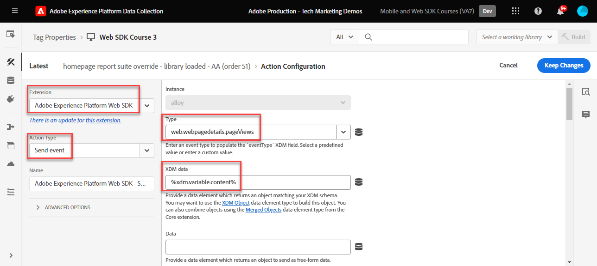
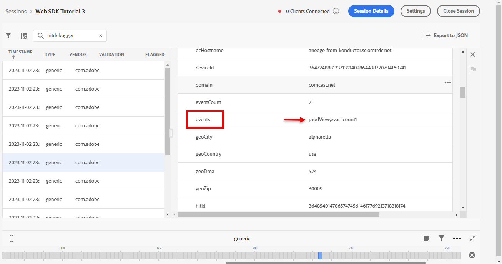

# Platform Web SDK를 사용하여 Adobe Analytics 설정

다음을 사용하여 Adobe Analytics을 설정하는 방법 알아보기 [Experience Platform Web SDK](https://experienceleague.adobe.com/docs/platform-learn/data-collection/web-sdk/overview.html), 태그 규칙을 만들어 데이터를 Adobe Analytics으로 전송하고, Analytics가 데이터를 예상대로 캡처하는지 확인합니다.

[Adobe Analytics](https://experienceleague.adobe.com/docs/analytics.html?lang=ko-KR) 은 고객 인텔리전스로 고객을 사람으로 이해하고 고객 인텔리전스로 비즈니스를 이끌어 나갈 수 있는 업계 선도적인 애플리케이션입니다.

## 학습 목표

이 단원을 마치면 다음을 수행할 수 있습니다.

* Adobe Analytics을 활성화하기 위한 데이터 스트림 구성
* Analytics 변수에 자동 매핑될 표준 XDM 필드 확인
* Adobe Analytics ExperienceEvent 템플릿 필드 그룹 또는 처리 규칙을 사용하여 사용자 지정 Analytics 변수 설정
* 데이터 스트림을 재정의하여 데이터를 다른 보고서 세트에 보냅니다.
* Debugger 및 Assurance를 사용하여 Adobe Analytics 변수 확인

## 전제 조건

이 단원을 완료하려면 먼저 다음 작업을 수행해야 합니다.

* Adobe Analytics에 대해 잘 알고 있고 액세스할 수 있습니다.

* 하나 이상의 테스트/개발 보고서 세트 ID가 있습니다. 이 자습서에 사용할 수 있는 테스트/개발 보고서 세트가 없는 경우 [하나를 만드십시오.](https://experienceleague.adobe.com/docs/analytics/admin/manage-report-suites/new-report-suite/t-create-a-report-suite.html).

* 이 자습서의 초기 구성 및 태그 구성 섹션에서 이전 단원을 완료합니다.

## 데이터 스트림 구성

Platform Web SDK는 웹 사이트에서 Platform Edge Network으로 데이터를 전송합니다. 그런 다음 데이터 스트림은 데이터가 전달되는 Adobe Analytics 보고서 세트에 대한 플랫폼 Edge Network을 알려줍니다.

1. 다음으로 이동 [데이터 수집](https://experience.adobe.com/#/data-collection){target="blank"} 인터페이스
1. 왼쪽 탐색에서 을 선택합니다. **[!UICONTROL 데이터스트림]**
1. 이전에 만든 항목 선택 `Luma Web SDK: Development Environment` 데이터스트림

   

1. 선택 **[!UICONTROL 서비스 추가]**
   
1. 선택 **[!UICONTROL Adobe Analytics]** (으)로 **[!UICONTROL 서비스]**
1. 다음을 입력합니다.  **[!UICONTROL 보고서 세트 ID]** 개발 보고서 세트 의
1. 선택 **[!UICONTROL 저장]**

   

   >[!TIP]
   >
   >을 선택하여 더 많은 보고서 세트 추가 **[!UICONTROL 보고서 세트 추가]** 는 다중 세트 태깅에 해당합니다.

>[!WARNING]
>
>이 자습서에서는 개발 환경에 대해서만 Adobe Analytics 보고서 세트를 구성합니다. 자체 웹 사이트에 대한 데이터스트림을 생성할 때 스테이징 및 프로덕션 환경에 대한 추가 데이터스트림 및 보고서 세트를 생성합니다.

## XDM 스키마 및 Analytics 변수

축하합니다! 에서 Adobe Analytics과 호환되는 스키마를 이미 구성했습니다. [스키마 구성](configure-schemas.md) 레슨!

하지만 여러분은 궁금하실 겁니다. 어떻게 모든 소품, evar, 이벤트를 설정할까요?

다음과 같은 몇 가지 접근 방식을 사용하여 동시에 사용할 수 있습니다.

1. 표준 XDM 필드를 설정하면 일부 필드가 Analytics 변수에 자동으로 매핑됩니다.
1. Analytics 처리 규칙에서 추가 XDM 필드를 Analytics 변수에 매핑합니다.
1. XDM 스키마에서 Analytics 변수에 직접 매핑합니다.

<!-- Implementing Platform Web SDK should be as product-agnostic as possible. For Adobe Analytics, mapping eVars, props, and events doesn't occur during schema creation, nor during the tag rules configuration as it has been done traditionally. Instead, every XDM key-value pair becomes a Context Data Variable that maps to an Analytics variable in one of two ways: 

1. Automatically mapped variables using reserved XDM fields
1. Manually mapped variables using Analytics Processing Rules

To understand what XDM variables are auto-mapped to Adobe Analytics, please see [Variables automatically mapped in Analytics](https://experienceleague.adobe.com/docs/experience-platform/edge/data-collection/adobe-analytics/automatically-mapped-vars.html?lang=en). Any variable that is not auto-mapped must be manually mapped. 

 1. **Product-agnostic XDM**: maintain a semantic key-value pair XDM schema and use [Adobe Analytics Processing Rules](https://experienceleague.adobe.com/docs/analytics/admin/admin-tools/manage-report-suites/edit-report-suite/report-suite-general/c-processing-rules/processing-rules.html) to map the XDM fields to eVars, props, and so on. By a semantic XDM schema, we mean that the field names themselves have meaning. For example, the field name `web.webPageDetails.pageName` has more meaning than say `prop1` or `evar3`.

 1. **Analytics-specific XDM**: Use a purpose-built Adobe Analytics field group in the XDM schema called `Adobe Analytics ExperienceEvent Template`
 
The approach Adobe has seen customers prefer is the **Analytics-specific XDM**, because it skips the mapping step in the Adobe Analytics Processing Rules interface. The steps in this lesson use the **Analytics-specific XDM** approach.
-->

### 자동으로 매핑된 필드

많은 XDM 필드는 자동으로 Analytics 변수에 매핑됩니다.

에서 생성된 스키마 [스키마 구성](configure-schemas.md) 단원에는 이 표에 설명된 대로 Analytics 변수에 자동으로 매핑된 몇 가지 기능이 포함되어 있습니다.

| XDM을 Analytics에 자동 매핑된 변수로 | Adobe Analytics 변수 |
|-------|---------|
| `identitymap.ecid.[0].id` | mid |
| `web.webPageDetails.name` | s.pageName |
| `web.webPageDetails.server` | s.server |
| `web.webPageDetails.siteSection` | s.channel |
| `commerce.productViews.value` | prodView |
| `commerce.productListViews.value` | scView |
| `commerce.checkouts.value` | scCheckout |
| `commerce.purchases.value` | 구매 |
| `commerce.order.currencyCode` | s.currencyCode |
| `commerce.order.purchaseID` | s.purchaseID |
| `productListItems[].SKU` | s.products=;product name;;;; (primary - 아래 참고 사항 참조) |
| `productListItems[].name` | s.products=;product name;;;; (fallback - 아래 참고 사항 참조) |
| `productListItems[].quantity` | s.products=;;product quantity;;; |
| `productListItems[].priceTotal` | s.product=;;;product price;; |

Analytics 제품 문자열의 개별 섹션은 `productListItems` 개체.
>2022년 8월 18일 기준 `productListItems[].SKU` 는 s.products 변수의 제품 이름에 매핑하는 데 우선 순위를 둡니다.
>값이 로 설정된 경우 `productListItems[].name` 는 다음과 같은 경우에만 제품 이름에 매핑됩니다. `productListItems[].SKU` 존재하지 않습니다. 그렇지 않으면 매핑되지 않고 컨텍스트 데이터에서 사용할 수 있습니다.
>빈 문자열 또는 null을 로 설정하지 마십시오.  `productListItems[].SKU`. 이렇게 하면 s.products 변수의 제품 이름에 매핑되지 않는 효과가 있습니다.

매핑의 최신 목록을 확인하려면 다음을 참조하십시오. [Adobe Experience Edge의 Analytics 변수 매핑](https://experienceleague.adobe.com/docs/experience-platform/edge/data-collection/adobe-analytics/automatically-mapped-vars.html).

### 처리 규칙을 사용하여 Analytics 변수에 매핑

XDM 스키마의 모든 필드는 다음 접두사를 사용하는 컨텍스트 데이터 변수로 Adobe Analytics에서 사용할 수 있습니다 `a.x.`. 예, `a.x.web.webinteraction.region`

이 연습에서는 하나의 XDM 변수를 prop에 매핑합니다. 에 대해 수행해야 하는 모든 사용자 지정 매핑에 대해 다음과 동일한 단계를 수행합니다 `eVar`, `prop`, `event`또는 처리 규칙을 통해 액세스할 수 있는 변수입니다.

1. Analytics 인터페이스로 이동
1. 다음으로 이동 [!UICONTROL 관리자] > [!UICONTROL 관리 도구] > [!UICONTROL 보고서 세트]
1. 자습서에 사용할 개발/테스트 보고서 세트를 선택합니다. > [!UICONTROL 설정 편집] > [!UICONTROL 일반] > [!UICONTROL 처리 규칙]

   

1. 규칙 만들기 **[!UICONTROL 값 덮어쓰기]** `[!UICONTROL Product SKU (prop1)]` 끝 `a.x.productlistitems.0.sku`. 규칙을 만드는 이유에 대한 메모를 추가하고 규칙 제목에 이름을 지정해야 합니다. 선택 **[!UICONTROL 저장]**

   

   >[!IMPORTANT]
   >
   >처리 규칙에 처음 매핑할 때 UI는 XDM 개체의 컨텍스트 데이터 변수를 표시하지 않습니다. 이 문제를 해결하려면 를 저장하고 다시 편집하십시오. 이제 모든 XDM 변수가 표시됩니다.

### Adobe Analytics 필드 그룹을 사용하여 Analytics 변수에 매핑

처리 규칙에 대한 대체 방법은 를 사용하여 XDM 스키마의 Analytics 변수에 매핑하는 것입니다. `Adobe Analytics ExperienceEvent Template` 필드 그룹입니다. 이 방법은 많은 사용자가 처리 규칙을 구성하는 것보다 간단하다고 생각하기 때문에 인기를 얻었지만 XDM 페이로드 크기를 늘리면 Real-Time CDP과 같은 다른 애플리케이션에서 프로필 크기가 늘어날 수 있습니다.

을(를) 추가하려면 `Adobe Analytics ExperienceEvent Template` 스키마에 대한 필드 그룹:

1. 를 엽니다. [데이터 수집](https://experience.adobe.com/#/data-collection){target="blank"} 인터페이스
1. 선택 **[!UICONTROL 스키마]** 왼쪽 탐색에서
1. 자습서에서 사용 중인 샌드박스에 있는지 확인합니다
1. 을(를) 엽니다 `Luma Web Event Data` 스키마
1. 다음에서 **[!UICONTROL 필드 그룹]** 섹션, 선택 **[!UICONTROL 추가]**
1. 다음 찾기 `Adobe Analytics ExperienceEvent Template` 필드 그룹 및 스키마에 추가

이제 제품 문자열에서 머천다이징 eVar을 설정합니다. 포함 `Adobe Analytics ExperienceEvent Template` 필드 그룹에서는 변수를 머천다이징 eVar 또는 제품 문자열 내의 이벤트에 매핑할 수 있습니다. 이를 설정이라고도 합니다 **제품 구문 상품화**.

1. 태그 속성으로 돌아가기

1. 규칙 열기 `ecommerce - library loaded - set product details variables - 20`

1. 를 엽니다. **[!UICONTROL 변수 설정]** 작업

1. 열려면 선택하십시오. `_experience > analytics > customDimensions > eVars > eVar1`

1. 설정 **[!UICONTROL 값]** 끝 `%product.productInfo.title%`

1. 선택 **[!UICONTROL 변경 내용 유지]**

   

1. 선택 **[!UICONTROL 저장]** 규칙을 저장하려면

위에서 보듯이 기본적으로 모든 Analytics 변수는 `Adobe Analytics ExperienceEvent Template` 필드 그룹입니다.

>[!NOTE]
>
> 다음 사항에 주목합니다. `_experience` 아래에 있는 오브젝트 `productListItems` > `Item 1`. 이 아래에서 변수 설정 [!UICONTROL 오브젝트] 제품 구문 eVar 또는 이벤트를 설정합니다.

## 다른 보고서 세트로 데이터 보내기

방문자가 특정 페이지에 있을 때 전송할 Adobe Analytics 보고서 세트 데이터를 변경할 수 있습니다. 이를 위해서는 데이터 스트림과 규칙 모두에서 구성해야 합니다.

### 보고서 세트 재정의를 위한 데이터스트림 구성

데이터 스트림에서 Adobe Analytics 보고서 세트 재정의 설정을 구성하려면 다음 작업을 수행하십시오.

1. 데이터 스트림 열기
1. 편집 **[!UICONTROL Adobe Analytics]** 를 열어 구성  메뉴를 선택한 다음 선택 **[!UICONTROL 편집]**

   

1. 다음 항목 선택 **[!UICONTROL 고급 옵션]** 열다 **[!UICONTROL 보고서 세트 무시]**

1. 재정의할 보고서 세트를 선택합니다. 이 경우, `Web SDK Course Dev` 및 `Web SDK Course Stg`

1. 선택 **[!UICONTROL 저장]**

   

### 보고서 세트 재정의에 대한 규칙 구성

다른 보고서 세트에 추가 페이지 보기 호출을 보내는 규칙을 만들어 보겠습니다. 데이터 스트림 재정의 기능을 사용하여 다음을 사용하여 페이지에 대한 보고서 세트를 변경합니다. **[!UICONTROL 이벤트 보내기]** 작업.

1. 새 규칙을 만들어 이름을 지정합니다. `homepage - library loaded - AA report suite override - 51`

1. 아래에서 더하기 기호를 선택합니다. **[!UICONTROL 이벤트]** 새 트리거를 추가하려면

1. 아래 **[!UICONTROL 확장]**, 선택 **[!UICONTROL 코어]**

1. 아래 **[!UICONTROL 이벤트 유형]**, 선택 **[!UICONTROL 라이브러리가 로드됨]**

1. 열려면 선택하십시오. **[!UICONTROL 고급 옵션]**, 입력 `51`. 이렇게 하면 규칙 다음에 실행됩니다 `all pages - library loaded - send event - 50` 를 사용하여 기본 XDM을 설정하는 경우 **[!UICONTROL 변수 업데이트]** 작업 유형.

   

1. 아래 **[!UICONTROL 조건]**&#x200B;을(를) 선택합니다 **[!UICONTROL 추가]**

1. 나가기 **[!UICONTROL 논리 유형]** 다음으로: **[!UICONTROL 보통]**

1. 나가기 **[!UICONTROL 확장]** 다음으로: **[!UICONTROL 코어]**

1. 선택 **[!UICONTROL 조건 유형]** 다음으로: **[!UICONTROL 쿼리 문자열이 없는 경로]**

1. 오른쪽에서 **[!UICONTROL 정규 표현식]** 전환 비활성화됨

1. 아래 **[!UICONTROL 경로가 다음과 같음]** set `/content/luma/us/en.html`. Luma 데모 사이트의 경우 규칙이 홈 페이지에서만 트리거되도록 합니다

1. 선택 **[!UICONTROL 변경 내용 유지]**

   

1. 아래 **[!UICONTROL 작업]** 선택 **[!UICONTROL 추가]**

1. 다음으로: **[!UICONTROL 확장]**, 선택 **[!UICONTROL Adobe Experience Platform 웹 SDK]**

1. 다음으로: **[!UICONTROL 작업 유형]**, 선택 **[!UICONTROL 이벤트 보내기]**

1. 다음으로: **[!UICONTROL 유형]**, 선택 `web.webpagedetails.pageViews`

1. 다음으로: **[!UICONTROL XDM 데이터]**&#x200B;를 선택하고 `xdm.variable.content` 다음 작업에서 을(를) 만들었습니다. [데이터 요소 만들기](create-data-elements.md) 단원

   

1. 아래로 스크롤하여 **[!UICONTROL 데이터 스트림 구성 재정의]** 섹션

1. 나가기 **[!UICONTROL 개발]** 탭이 선택되었습니다.

   >[!TIP]
   >
   >    이 탭은 재정의가 발생하는 태그 환경을 결정합니다. 이 연습에서는 개발 환경만 지정하지만 프로덕션에 이 환경을 배포할 때에는 **[!UICONTROL 프로덕션]** 환경.

1. 다음 항목 선택 **[!UICONTROL 데이터스트림]**, 이 경우 `Luma Web SDK: Development Environment`

1. 아래 **[!UICONTROL 보고서 세트]**&#x200B;을(를) 통해 재정의하는 데 사용할 보고서 사이트를 선택합니다. 이 경우, `tmd-websdk-course-stg`.

1. 선택 **[!UICONTROL 변경 내용 유지]**

1. 및 **[!UICONTROL 저장]** 내 규칙

   

## 개발 환경 구축

에 새 데이터 요소 및 규칙 추가 `Luma Web SDK Tutorial` 태그 라이브러리를 만들고 개발 환경을 다시 빌드합니다.

축하합니다! 다음 단계는 Experience Platform Web SDK를 통해 Adobe Analytics 구현의 유효성을 검사하는 것입니다.

## 디버거를 사용하여 Adobe Analytics 유효성 검사

Adobe Analytics이 Experience Platform 디버거의 Edge Trace 기능을 사용하여 ECID, 페이지 보기, 제품 문자열 및 전자 상거래 이벤트를 캡처하고 있는지 확인하는 방법을 알아봅니다.

다음에서 [디버거](validate-with-debugger.md) 단원, Platform Debugger 및 브라우저 개발자 콘솔을 사용하여 클라이언트측 XDM 요청을 검사하는 방법에 대해 알아보았습니다. 이는 을 디버깅하는 방법과 유사합니다. `AppMeasurement.js` Analytics 구현. 또한 Adobe 애플리케이션으로 전송된 Platform Edge Network 서버측 요청의 유효성 검사와 Assurance를 사용하여 완전히 처리된 페이로드를 확인하는 방법에 대해 배웠습니다.

Analytics가 Experience Platform Web SDK를 통해 데이터를 제대로 캡처하고 있는지 확인하려면 다음 두 단계를 더 수행해야 합니다.

1. Experience Platform 디버거의 Edge Trace 기능을 사용하여 Platform Edge Network의 XDM 개체에서 데이터가 처리되는 방식 확인
1. Adobe Experience Platform Assurance를 사용하여 Analytics에서 데이터가 완전히 처리되는 방식의 유효성 검사

### Experience Cloud ID 유효성 검사

1. 로 이동 [Luma 데모 사이트](https://luma.enablementadobe.com/content/luma/us/en.html){target="_blank"}
1. 오른쪽 상단에 있는 로그인 단추를 선택하고 자격 증명 u: test@adobe.com p: 테스트를 사용하여 인증합니다.
1. Experience Platform 디버거 를 열고 [사이트의 태그 속성을 자신의 개발 속성으로 전환합니다.](validate-with-debugger.md#use-the-experience-platform-debugger-to-map-to-your-tags-property)

1. Edge 추적을 활성화하려면 왼쪽 탐색에서 Experience Platform 디버거 로 이동한 다음 **[!UICONTROL 로그]**&#x200B;을(를) 선택한 다음 **[!UICONTROL Edge]** 탭을 클릭하고 다음을 선택합니다 **[!UICONTROL 연결]**

   

1. 지금은 비어 있습니다.

   

1. Luma 페이지를 새로 고치고 Experience Platform 디버거를 다시 확인합니다. 데이터가 들어오는 것을 볼 수 있습니다. 다음으로 시작하는 행 **[!UICONTROL Analytics 자동 매핑]** Adobe Analytics 비콘임
1. 을(를) 선택하여 둘 다 엽니다. `[!UICONTROL mappedQueryParams]` 드롭다운 및 Analytics 변수를 볼 두 번째 드롭다운

   

   >[!TIP]
   >
   >두 번째 드롭다운은 데이터를 보내는 Analytics 보고서 세트 ID에 해당합니다. 스크린샷의 보고서 세트가 아니라 자신의 보고서 세트와 일치해야 합니다.

1. 아래로 스크롤하여 찾기 `[!UICONTROL c.a.x.identitymap.ecid.[0].id]`. ECID를 캡처하는 컨텍스트 데이터 변수입니다
1. Analytics가 표시될 때까지 아래로 계속 스크롤 `[!UICONTROL mid]` 변수를 채우는 방법에 따라 페이지를 순서대로 표시합니다. 두 ID 모두 장치의 Experience Cloud ID와 일치합니다.
1. Luma 사이트에서,

   

   >[!NOTE]
   >
   >로그인했으므로 잠시 시간을 내어 인증된 ID의 유효성을 검사하십시오 `112ca06ed53d3db37e4cea49cc45b71e` 사용자용 **`test@adobe.com`** 에도 캡처됩니다. `[!UICONTROL c.a.x.identitymap.lumacrmid.[0].id]`

### 보고서 세트 재정의 유효성 검사

위에서 의 데이터 스트림 재정의를 구성했습니다. [Luma 홈페이지](https://luma.enablementadobe.com/content/luma/us/en.html).  이 구성의 유효성을 검사하려면

1. 다음 행을 찾습니다. **[!UICONTROL 재정의 적용 후 데이터 스트림 구성]**. 여기에서 보고서 세트 무시를 위해 구성된 기본 보고서 세트와 추가 보고서 세트를 찾을 수 있습니다.

   

1. 다음으로 시작하는 행까지 아래로 스크롤 **[!UICONTROL Analytics 자동 매핑]**  및 확인 `[!UICONTROL reportSuiteIds]` 재정의 구성에 지정한 보고서 세트를 표시합니다

   

### 콘텐츠 페이지 보기 수 유효성 검사

다음과 같은 제품 페이지로 이동합니다. [Didi Sport Watch 제품 페이지](https://luma.enablementadobe.com/content/luma/us/en/products/gear/watches/didi-sport-watch.html#24-WG02).  Analytics에서 컨텐츠 페이지 보기를 캡처하는지 확인합니다.

1. 다음을 찾습니다. `[!UICONTROL c.a.x.web.webpagedetails.pageviews.value]=1`.
1. 아래로 스크롤하여 `[!UICONTROL gn]` 변수를 채우는 방법에 따라 페이지를 순서대로 표시합니다. 다음에 대한 Analytics 동적 구문입니다. `[!UICONTROL s.pageName]` 변수를 채우는 방법에 따라 페이지를 순서대로 표시합니다. 데이터 레이어에서 페이지 이름을 캡처합니다.

   

### 제품 문자열 및 전자 상거래 이벤트 유효성 검사

이미 제품 페이지를 사용하고 있으므로 이 연습에서는 동일한 Edge Trace를 사용하여 제품 데이터가 Analytics에 캡처되는지 확인합니다. 제품 문자열 및 전자 상거래 이벤트는 모두 XDM 변수를 Analytics에 자동으로 매핑합니다. 를 로 매핑하기만 하면 됩니다. `productListItem` XDM 변수 [Adobe Analytics에 대한 XDM 스키마 구성](setup-analytics.md#configure-an-xdm-schema-for-adobe-analytics), Platform Edge Network은 데이터를 적절한 analytics 변수에 매핑합니다.

**먼저 다음을 확인합니다. `Product String` 은(는) 설정되어 있습니다.**

1. 다음을 찾습니다. `[!UICONTROL c.a.x.productlistitems.][0].[!UICONTROL sku]`. 변수는 매핑한 데이터 요소 값을 캡처합니다. `productListItems.item1.sku` 이 단원의 앞 부분
1. 다음을 찾습니다. `[!UICONTROL c.a.x.productlistitems.][0].[!UICONTROL _experience.analytics.customdimensions.evars.evar1]`. 변수는 매핑한 데이터 요소 값을 캡처합니다 `productListItems.item1._experience.analytics.customdimensions.evars.evar1`
1. 아래로 스크롤하여 `[!UICONTROL pl]` 변수를 채우는 방법에 따라 페이지를 순서대로 표시합니다. Analytics 제품 문자열 변수의 동적 구문입니다
1. 데이터 레이어의 제품 이름은 둘 다 `[!UICONTROL c.a.x.productlistitems.][0].[!UICONTROL sku]` 및 `[!UICONTROL product]` 제품 문자열의 매개 변수.  또한 데이터 계층의 제품 제목은 제품 문자열의 머천다이징 evar1에 매핑됩니다.

   

   Edge Trace 처리 `commerce` 이벤트가 와 약간 다름 `productList` 차원. 제품 이름이 매핑된 것과 같은 방식으로 매핑된 컨텍스트 데이터 변수가 표시되지 않습니다 `[!UICONTROL c.a.x.productlistitem.[0].name]` 위. 대신 Edge Trace 는 Analytics에서 최종 이벤트 자동 매핑을 보여 줍니다 `event` 변수를 채우는 방법에 따라 페이지를 순서대로 표시합니다. 플랫폼 Edge Network은 적절한 XDM에 매핑되는 한 그에 따라 매핑됩니다 `commerce` 변수 기간 [Adobe Analytics에 대한 스키마 구성](setup-analytics.md#configure-an-xdm-schema-for-adobe-analytics); 이 경우 `commerce.productViews.value=1`.

1. Experience Platform 디버거 창으로 돌아가서 `[!UICONTROL events]` 변수가 있는 경우 이 변수가 `[!UICONTROL prodView]`

1. 참고 사항 `[!UICONTROL c.a.x.eventType]` 이(가) (으)로 설정됨 `commerce.productViews` 제품 페이지에 있기 때문입니다.

   >[!TIP]
   >
   > 다음 `ecommerce - pdp library loaded - AA (order 20)` 규칙이 값을 덮어쓰고 있습니다. `eventType` 에 의해 설정됨 `all pages global content variables - library loaded - AA (order 1)` 규칙이 시퀀스 뒷부분에서 트리거되도록 설정된 경우

   

**나머지 전자 상거래 이벤트와 제품 문자열이 Analytics에 대해 설정되어 있는지 확인합니다**

1. 추가 [디디 스포츠 워치](https://luma.enablementadobe.com/content/luma/us/en/products/gear/watches/didi-sport-watch.html#24-WG02) 장바구니에 추가
1. 로 이동 [장바구니 페이지](https://luma.enablementadobe.com/content/luma/us/en/user/cart.html), Edge Trace 확인

   * `eventType` 을 로 설정 `commerce.productListViews`
   * `[!UICONTROL events: "scView"]`, 및
   * 제품 문자열이 설정됩니다.

   

1. 체크아웃으로 이동하여 다음에 대한 Edge Trace 를 확인합니다.

   * `eventType` 을 로 설정 `commerce.checkouts`
   * `[!UICONTROL events: "scCheckout"]`, 및
   * 제품 문자열이 설정됩니다.

   

1. 다음 항목만 작성 **이름** 및 **성** 배송 양식의 필드 및 선택 **계속**. 다음 페이지에서 를 선택합니다. **주문**
1. 확인 페이지에서 다음에 대한 Edge Trace 를 선택합니다.

   * `eventType` 을 로 설정 `commerce.purchases`
   * 구매 이벤트 설정 중 `[!UICONTROL events: "purchase"]`
   * 통화 코드 변수 설정 중 `[!UICONTROL cc: "USD"]`
   * 구매 ID가 설정되는 위치 `[!UICONTROL pi]`
   * 제품 문자열 `[!UICONTROL pl]` 제품 이름, 수량 및 가격 설정

   

## Assurance를 사용하여 Adobe Analytics 유효성 검사

Adobe Experience Platform Assurance를 사용하면 웹 사이트 및 모바일 애플리케이션에서 데이터를 수집하거나 경험을 제공하는 방법을 검사, 증명, 시뮬레이션 및 확인할 수 있습니다.

이전 연습에서는 Adobe Analytics이 Experience Platform 디버거의 Edge Trace 기능을 사용하여 ECID, 페이지 보기, 제품 문자열 및 전자 상거래 이벤트를 캡처하고 있음을 확인했습니다.  그런 다음 Edge Trace의 동일한 데이터에 액세스하는 대체 인터페이스인 Adobe Experience Platform Assurance를 사용하여 이러한 동일한 이벤트를 확인합니다.

에서 배웠듯이 [보증](validate-with-assurance.md) 단원, 보증 세션을 시작하는 몇 가지 방법이 있습니다. 마지막 연습에서 시작한 Edge Trace 세션으로 Adobe Experience Platform Debugger이 이미 열려 있으므로 디버거를 통해 Assurance에 액세스하는 것이 좋습니다.

다음 범위 내 **[!UICONTROL &quot;Web SDK 튜토리얼 3&quot;]** 보증 세션 입력 **[!UICONTROL &quot;hitdebugger&quot;]** 를 이벤트 검색 창으로 가져와서 Adobe 분석 후 처리된 데이터로 결과를 필터링합니다.

### Experience Cloud ID 유효성 검사

Adobe Analytics이 ECID를 캡처하고 있는지 확인하려면 비콘을 선택하고 페이로드를 엽니다.  이 비콘 공급업체는 다음과 같아야 합니다. **[!UICONTROL com.adobe.analytics.hitdebugger]**

그런 다음 아래로 스크롤하여 **[!UICONTROL mcvisId]** ecid가 올바르게 캡처되었는지 확인하려면

### 콘텐츠 페이지 보기 수 유효성 검사

동일한 비콘을 사용하여 컨텐츠 페이지 보기가 올바른 Adobe Analytics 변수에 매핑되었는지 확인합니다.
아래로 스크롤하여 **[!UICONTROL pageName]** 을(를) 확인하려면 `Page Name` 이(가) 올바르게 캡처됨

### 제품 문자열 및 전자 상거래 이벤트 유효성 검사

위의 Experience Platform 디버거로 확인할 때 사용된 것과 동일한 유효성 검사 사용 사례에 따라 동일한 비콘을 사용하여 의 유효성을 계속 검사하십시오. `Ecommerce Events` 및 `Product String`.

1. 다음 위치에서 페이로드를 찾습니다. **[!UICONTROL events]** contain `prodView`
   
1. 아래로 스크롤하여 **[!UICONTROL product-string]** 을(를) 확인하려면 `Product String`.
   * 다음을 참고하십시오. `Product SKU` 및 `Merchandizing eVar1`.
1. 아래로 더 스크롤하여 확인합니다. `prop1`이전 섹션에서 처리 규칙을 사용하여 구성한 에는 `Product SKU`\
   

장바구니, 체크아웃 및 구매 이벤트를 검토하여 구현의 유효성을 계속 확인합니다.

1. 다음 위치에서 페이로드를 찾습니다. **[!UICONTROL events]** contain `scView` 제품 문자열의 유효성을 검사합니다.
   
1. 다음 위치에서 페이로드를 찾습니다. **[!UICONTROL events]** contain `scCheckout` 제품 문자열의 유효성을 검사합니다.
   
1. 다음 위치에서 페이로드를 찾습니다. **[!UICONTROL events]** contain `purchase`
   
1. 유효성 검사 시 `purchase` event, 참고: `Product String` 다음을 포함해야 함: `Product SKU`, `Product Quantity` , 및 `Product Total Price`.
1. 또한 `purchase` 다음을 확인합니다. `purchase-id` 및/또는 `purchaseId` 설정됨

축하합니다! 네가 해냈어! 이 작업은 단원을 마쳤으며 이제 자체 웹 사이트에 대해 Platform Web SDK를 사용하여 Adobe Analytics을 구현할 준비가 되었습니다.

[다음: ](setup-audience-manager.md)

>[!NOTE]
>
>Adobe Experience Platform Web SDK에 대해 학습하는 데 시간을 투자해 주셔서 감사합니다. 질문이 있거나, 일반적인 피드백을 공유하거나, 향후 콘텐츠에 대한 제안이 있는 경우 이에 대해 공유하십시오. [Experience League 커뮤니티 토론 게시물](https://experienceleaguecommunities.adobe.com/t5/adobe-experience-platform-launch/tutorial-discussion-implement-adobe-experience-cloud-with-web/td-p/444996)
