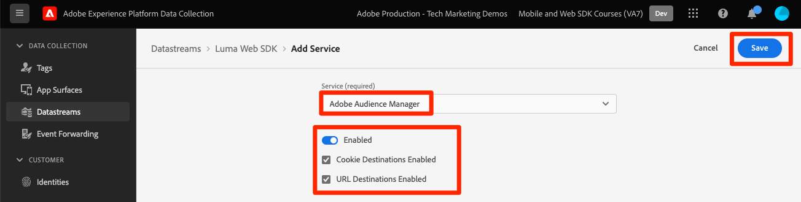

# Platform Web SDK를 사용하여 Audience Manager 설정

Platform Web SDK를 사용하여 Adobe Audience Manager을 설정하고 쿠키 대상을 사용하여 구현의 유효성을 검사하는 방법에 대해 알아봅니다.

[Adobe Audience Manager](https://experienceleague.adobe.com/en/docs/audience-manager) 는 사이트 방문자에 대한 상업적인 연관성 있는 정보를 수집하고, 마케팅 가능한 세그먼트를 생성하고, 타기팅된 광고 및 콘텐츠를 적절한 고객에게 제공하는 데 필요한 모든 것을 제공하는 Adobe Experience Cloud 솔루션입니다.

## 학습 목표

이 단원을 마치면 다음을 수행할 수 있습니다.

* Audience Manager을 활성화하기 위한 데이터 스트림 구성
* Audience Manager에서 쿠키 대상 활성화
* Adobe Experience Platform Debugger으로 대상 자격을 확인하여 Audience Manager 구현의 유효성 검사

## 전제 조건

이 단원을 완료하려면 먼저 다음 작업을 수행해야 합니다.

* 이 자습서의 초기 구성 및 태그 구성 섹션에서 이전 단원을 완료합니다.
* Adobe Audience Manager에 대한 액세스 권한과 트레이트, 세그먼트 및 대상을 만들고, 읽고, 쓸 수 있는 적절한 권한이 있습니다. 자세한 내용은 을(를) 검토하십시오. [Audience Manager의 역할 기반 액세스 제어](https://experienceleague.adobe.com/en/docs/audience-manager-learn/tutorials/setup-and-admin/user-management/setting-permissions-with-role-based-access-control).

## 데이터 스트림 구성

Platform Web SDK를 사용하는 Audience Manager 구현은 를 사용하는 구현과 다릅니다 [SSF(서버 측 전달)](https://experienceleague.adobe.com/en/docs/analytics/admin/admin-tools/server-side-forwarding/ssf). 서버측 전달은 Adobe Analytics 요청 데이터를 Audience Manager에 전달합니다. Platform 웹 SDK 구현은 Platform Edge Network으로 전송된 XDM 데이터를 Audience Manager에 전달합니다. Audience Manager은 데이터 스트림에서 활성화됩니다.

1. 다음으로 이동 [데이터 수집](https://experience.adobe.com/#/data-collection){target="blank"} 인터페이스
1. 왼쪽 탐색에서 을 선택합니다. **[!UICONTROL 데이터스트림]**
1. 이전에 만든 항목 선택 `Luma Web SDK: Development Environment` 데이터스트림

   

1. 선택 **[!UICONTROL 서비스 추가]**
   
1. 선택 **[!UICONTROL Adobe Audience Manager]** (으)로 **[!UICONTROL 서비스]**
1. 다음을 확인합니다 **[!UICONTROL 쿠키 대상 활성화됨]** 및 **[!UICONTROL URL 대상 활성화됨]** 선택됨
1. 선택 **[!UICONTROL 저장]**
   

## 데이터 소스 만들기

다음으로, 다음을 생성합니다. [데이터 소스](https://experienceleague.adobe.com/en/docs/audience-manager/user-guide/features/data-sources/datasources-list-and-settings): Audience Manager 내에서 데이터를 구성하는 기본 도구입니다.

1. 로 이동 [Audience Manager](https://experience.adobe.com/#/audience-manager/) 인터페이스
1. 선택 **[!UICONTROL 대상 데이터]** 위쪽 탐색에서
1. 다음 항목 선택 **[!UICONTROL 데이터 소스]** 드롭다운 메뉴에서
1. 다음 항목 선택 **[!UICONTROL 새로 추가]** 데이터 소스 페이지 상단의 버튼

   

1. 데이터 원본에 친숙한 이름과 설명을 지정합니다. 초기 설정의 경우 이름을 다음과 같이 지정할 수 있습니다 `Platform Web SDK tutorial`.
1. 설정 **[!UICONTROL ID 유형]** 끝 **[!UICONTROL 쿠키]**
1. 다음에서 **[!UICONTROL 데이터 내보내기 제어]** 섹션, 선택 **[!UICONTROL 제한 없음]**

   

1. **[!UICONTROL 저장]** 데이터 소스

## 트레이트 만들기

데이터 소스가 저장되면 [트레이트](https://experienceleague.adobe.com/en/docs/audience-manager/user-guide/features/traits/traits-overview). 트레이트는 Audience Manager에 있는 하나 이상의 신호가 결합된 것입니다. 홈 페이지 방문자에 대한 트레이트를 만듭니다.

>[!NOTE]
>
>모든 XDM 데이터는 데이터 스트림에서 활성화된 경우 Audience Manager으로 전송되지만 데이터는 사용되지 않은 신호 보고서에서 사용할 수 있을 때까지 24시간이 걸릴 수 있습니다. 이 연습에 설명된 대로 Audience Manager에서 즉시 사용할 XDM 데이터에 대한 명시적 트레이트를 만듭니다.

1. 선택 **[!UICONTROL 대상 데이터]** >  **[!UICONTROL 트레이트]**
1. 선택 **[!UICONTROL 새로 추가]** >  **[!UICONTROL 규칙 기반]** 트레이트

   

1. 트레이트에 친숙한 이름과 설명을 지정하고, `Luma homepage view`
1. 다음 항목 선택 **[!UICONTROL 데이터 소스]** 이전 섹션에서 을(를) 만들었습니다.
1. **[!UICONTROL 폴더 선택]** 오른쪽 창에서 트레이트를 저장할 때 사용합니다. 다음 방법으로 폴더를 만들 수 있습니다. **+ 아이콘 선택** 기존 상위 폴더 옆에 있습니다. 이 새 폴더의 이름을 지정할 수 있습니다. `Platform Web SDK tutorial`.
1. 확장 **[!UICONTROL 트레이트 표현식]** 삽입 및 선택 **[!UICONTROL 표현식 빌더]** 홈 페이지 방문을 나타내는 키 값 쌍을 제공해야 합니다.
1. 를 엽니다. [Luma 홈페이지](https://luma.enablementadobe.com/content/luma/us/en.html) (태그 속성에 매핑됨) 및 **Adobe Experience Platform Debugger** 페이지를 새로 고칩니다.
1. Platform Web SDK에 대한 네트워크 요청 및 이벤트 세부 정보를 확인하여 홈페이지의 키 및 이름 값을 찾습니다.
   
1. Audience Manager UI에서 표현식 빌더로 돌아가 키를 입력합니다. **`web.webPageDetails.name`** 및 값 **`content:luma:us:en`**. 이 단계에서는 홈 페이지를 로드할 때마다 트레이트를 실행합니다.
1. **[!UICONTROL 저장]** 트레이트.

## 세그먼트 만들기

다음 단계는 를 만드는 것입니다. **세그먼트**&#x200B;을 누르고 새로 정의된 트레이트를 이 세그먼트에 지정합니다.

1. 선택 **[!UICONTROL 대상 데이터]** 위쪽 탐색에서 를 선택하고 **[!UICONTROL 세그먼트]**
1. 선택 **[!UICONTROL 새로 추가]** 을 클릭하여 세그먼트 빌더를 엽니다.
1. 세그먼트에 다음과 같은 친숙한 이름과 설명을 지정합니다. `Platform Web SDK - Homepage visitors`
1. **[!UICONTROL 폴더 선택]** 오른쪽 창에 세그먼트가 저장됩니다. 다음 방법으로 폴더를 만들 수 있습니다. **+ 아이콘 선택** 기존 상위 폴더 옆에 있습니다. 이 새 폴더의 이름을 지정할 수 있습니다. `Platform Web SDK tutorial`.
1. 통합 코드를 추가합니다. 이 경우 임의의 숫자 집합입니다.
1. 다음에서 **[!UICONTROL 데이터 소스]** 섹션, 선택 **[!UICONTROL Audience Manager]** 이전에 만든 데이터 소스
1. 확장 **[!UICONTROL 트레이트]** 생성한 트레이트를 섹션으로 검색하고
1. 선택 **[!UICONTROL 트레이트 추가]**.
1. 선택 **[!UICONTROL 저장]** 페이지 하단

   

   

## 대상 만들기

다음으로, 다음을 생성합니다. **쿠키 기반 대상** 사용 **대상 빌더**. Destination Builder를 사용하여 쿠키, URL 및 서버 간 대상을 만들고 관리할 수 있습니다.

1. 을 선택하여 대상 빌더를 엽니다. **[!UICONTROL 대상]** 다음 범위 내 **대상 데이터** 위쪽 탐색의 메뉴
1. 선택 **[!UICONTROL 대상 만들기]**
1. 이름 및 설명 입력, `Platform Web SDK tutorial`
1. 다음으로: **[!UICONTROL 범주]**, 선택 **[!UICONTROL 사용자 정의]**
1. 다음으로: **[!UICONTROL 유형]**, 선택 **[!UICONTROL 쿠키]**

   

1. 를 엽니다. **[!UICONTROL 구성]** 섹션에 쿠키 대상에 대한 세부 정보를 입력합니다.
1. 쿠키에 친숙한 이름을 지정하고 `platform_web_sdk_tutorial`
1. 다음으로: **[!UICONTROL 쿠키 도메인]**, 통합을 계획하고 있는 사이트의 도메인을 추가합니다. 자습서에서 Luma 도메인을 입력합니다. `luma.enablementadobe.com`
1. 다음으로: **[!UICONTROL 데이터 게시 위치]** 옵션, 선택 **[!UICONTROL 선택한 도메인만]**
1. 아직 추가되지 않은 경우 도메인 선택
1. 다음으로: **[!UICONTROL 데이터 형식]**, 선택 **[!UICONTROL 단일 키]** 쿠키에 키를 지정합니다. 이 자습서의 경우 `segment` 를 키 값으로 사용하십시오.
1. 마지막으로 다음을 선택합니다. **[!UICONTROL 저장]** 대상 구성 세부 정보를 저장합니다.

   

<!--
   

   
-->

1. 다음에서 **[!UICONTROL 세그먼트 매핑]** 섹션, **[!UICONTROL 세그먼트 검색 및 추가]** 이전에 만든 을 검색하는 기능 `Platform Web SDK - Homepage visitors` 및 선택 **[!UICONTROL 추가]**.

1. 세그먼트를 추가하면 쿠키에 대한 예상 값을 제공해야 하는 팝업이 열립니다. 이 연습에서는 &quot;hpvisitor&quot; 값을 입력합니다.

1. 선택 **[!UICONTROL 저장]**

1. 선택 **[!UICONTROL 완료]**
   

세그먼트 매핑 기간을 활성화하려면 몇 시간이 필요합니다. 완료되면 Audience Manager 인터페이스를 새로 고치고 **매핑된 세그먼트** 목록이 업데이트되었습니다.

## 세그먼트 유효성 검사

세그먼트를 처음 만든 후 몇 시간 후에 세그먼트가 제대로 작동하는지 확인할 수 있습니다.

먼저 세그먼트에 대한 자격이 있는지 확인합니다

1. 를 엽니다. [Luma 데모 사이트 홈페이지](https://luma.enablementadobe.com/content/luma/us/en.html) 를 태그 속성에 매핑하여 새로 만든 세그먼트에 적합합니다.
1. 브라우저 열기 **개발자 도구**  > **네트워크** 탭
1. 다음을 사용하여 Platform Web SDK 요청에 대해 필터링 `interact` 텍스트 필터로
1. 호출을 선택하고 **미리 보기** 응답 세부 정보를 보려면 탭
1. 확장 **페이로드** Audience Manager에서 이전에 구성한 대로 예상되는 쿠키 세부 정보를 보려면 . 이 예에서는 예상 쿠키 이름이 표시됩니다 `platform_web_sdk_tutorial`.

   

1. 를 엽니다. **애플리케이션** 탭 및 열기 **쿠키** 다음에서 **스토리지** 메뉴 아래의 제품에서 사용할 수 있습니다.
1. 다음 항목 선택 **`https://luma.enablementadobe.com`** 도메인 및 쿠키가 목록에 적절히 기록되었는지 확인

   

마지막으로 Audience Manager 인터페이스에서 세그먼트를 열고 **세그먼트 모집단** 이(가) 증가했습니다.

이 단원을 완료했으므로 Platform Web SDK가 데이터를 Audience Manager에 전달하는 방법을 확인하고 쿠키 대상이 있는 세그먼트별 자사 쿠키를 설정할 수 있습니다.

[다음: ](setup-target.md)

>[!NOTE]
>
>Adobe Experience Platform Web SDK에 대해 학습하는 데 시간을 투자해 주셔서 감사합니다. 질문이 있거나, 일반적인 피드백을 공유하거나, 향후 콘텐츠에 대한 제안이 있는 경우 이에 대해 공유하십시오. [Experience League 커뮤니티 토론 게시물](https://experienceleaguecommunities.adobe.com/t5/adobe-experience-platform-launch/tutorial-discussion-implement-adobe-experience-cloud-with-web/td-p/444996)
