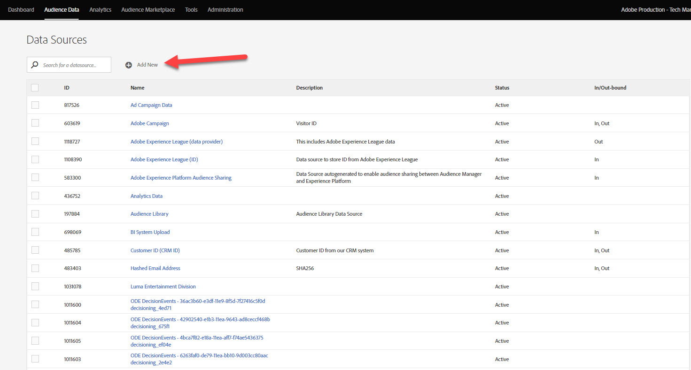

# Platform Web SDK를 사용하여 Audience Manager 설정

Platform Web SDK를 사용하여 Adobe Audience Manager을 설정하고 쿠키 대상을 사용하여 구현의 유효성을 검사하는 방법을 알아봅니다.

[Adobe Audience Manager](https://experienceleague.adobe.com/docs/audience-manager.html) 은 사이트 방문자에 대한 상업적인 연관성 있는 정보를 수집하고, 마케팅 가능한 세그먼트를 만들고, 타깃팅된 광고 및 컨텐츠를 적절한 고객에게 제공하는 데 필요한 모든 것을 제공하는 Adobe Experience Cloud 솔루션입니다.

## 학습 목표

이 단원을 마치면 다음을 수행할 수 있습니다.

* Audience Manager을 사용하도록 데이터 스트림 구성
* Audience Manager에서 쿠키 대상 활성화
* Adobe Experience Platform Debugger를 사용하여 대상 자격을 확인하여 Audience Manager 구현의 유효성 검사

## 전제 조건

이 단원을 완료하려면 먼저 다음을 수행해야 합니다.

* 이 자습서의 초기 구성 및 태그 구성 섹션에서 이전 단원을 완료하십시오.
* 트레이트, 세그먼트 및 대상을 만들고, 읽고, 쓸 수 있는 적절한 권한과 Adobe Audience Manager에 대한 액세스 권한이 있습니다. 자세한 내용은 [Audience Manager의 역할 기반 액세스 제어](https://experienceleague.adobe.com/docs/audience-manager-learn/tutorials/setup-and-admin/user-management/setting-permissions-with-role-based-access-control.html?lang=en).

## 데이터 스트림 구성

Platform Web SDK를 사용하는 Audience Manager 구현은 [SSF(서버 측 전달)](https://experienceleague.adobe.com/docs/analytics/admin/admin-tools/server-side-forwarding/ssf.html?lang=ko-KR). 서버측 전달은 Adobe Analytics 요청 데이터를 Audience Manager에 전달합니다. Platform 웹 SDK 구현에서는 Platform Edge Network에 전송된 XDM 데이터를 Audience Manager에 전달합니다. Audience Manager이 데이터 스트림에서 활성화되어 있습니다.

1. 이동 [데이터 수집](https://experience.adobe.com/#/data-collection){target=&quot;blank&quot;} 인터페이스
1. 왼쪽 탐색에서 를 선택합니다 **[!UICONTROL 데이터 스트림]**
1. 앞에서 만든 을(를) 선택합니다 `Luma Web SDK` 데이터 스트림

   

1. 선택 **[!UICONTROL 서비스 추가]**

   
1. 선택 **[!UICONTROL Adobe Audience Manager]** 로서의 **[!UICONTROL 서비스]**
1. 확인 **[!UICONTROL 쿠키 대상 활성화]** 및 **[!UICONTROL URL 대상 사용]** 선택
1. **[!UICONTROL 저장]**을 선택합니다

   

## 데이터 소스 만들기

다음으로, [데이터 소스](https://experienceleague.adobe.com/docs/audience-manager/user-guide/features/data-sources/datasources-list-and-settings.html?lang=en): Audience Manager 내에서 데이터를 구성하는 기본 도구입니다.

1. 로 이동합니다. [Audience Manager](https://experience.adobe.com/#/audience-manager/) 인터페이스
1. 선택 **[!UICONTROL 대상 데이터]** 위쪽 탐색에서
1. 을(를) 선택합니다 **[!UICONTROL 데이터 소스]** 드롭다운 메뉴에서
1. 을(를) 선택합니다 **[!UICONTROL 새로 추가]** 데이터 소스 페이지 상단의 단추

   

1. 데이터 소스에 친숙한 이름과 설명을 지정합니다. 초기 설정의 경우 이름을 지정할 수 있습니다`Platform Web SDK tutorial`.
1. 설정 **[!UICONTROL ID 유형]** to **[!UICONTROL 쿠키]**
1. 에서 **[!UICONTROL 데이터 내보내기 제어]** 섹션, **[!UICONTROL 제한 없음]**

   

1. **[!UICONTROL 저장]** 데이터 소스

## 트레이트 만들기

데이터 소스가 저장되면 [트레이트](https://experienceleague.adobe.com/docs/audience-manager/user-guide/features/traits/traits-overview.html?lang=en). 트레이트는 Audience Manager에서 하나 이상의 신호가 결합된 것입니다. 홈 페이지 방문자에 대한 트레이트를 만듭니다.

>[!NOTE]
>
>모든 XDM 데이터는 데이터 스트림에서 활성화될 경우 Audience Manager으로 전송되지만 사용되지 않는 신호 보고서에서 사용할 수 있을 때까지 24시간이 걸릴 수 있습니다. 이 연습에서 설명한 대로 Audience Manager에서 즉시 사용할 XDM 데이터에 대한 명시적 트레이트를 만듭니다.

1. 선택 **[!UICONTROL 대상 데이터]** >  **[!UICONTROL 트레이트]**
1. 선택 **[!UICONTROL 새로 추가]** >  **[!UICONTROL 규칙 기반]** 트레이트

   

1. 트레이트에 친숙한 이름과 설명을 제공합니다. `Luma homepage view`
1. 을(를) 선택합니다 **[!UICONTROL 데이터 소스]** 이전 섹션에서 작성했습니다.
1. **[!UICONTROL 폴더 선택]** 을 클릭하여 창에서 오른쪽의 트레이트를 저장합니다. 다음 방법으로 폴더를 만들 수 있습니다 **+ 아이콘 선택** 기존 상위 폴더 옆에 표시됩니다. 이 새 폴더의 이름을 지정할 수 있습니다 `Platform Web SDK tutorial`.
1. 를 확장합니다. **[!UICONTROL 트레이트 표현식]** 삽입 후 **[!UICONTROL 표현식 빌더]** 홈 페이지 방문을 나타내는 키 값 쌍을 제공해야 합니다.
1. 를 엽니다. [Luma 홈 페이지](https://luma.enablementadobe.com/content/luma/us/en.html) (태그 속성에 매핑됨) 및 **Platform Web SDK Debugger** 페이지를 새로 고칩니다.
1. 네트워크 요청 및 Platform Web SDK에 대한 이벤트 세부 사항을 확인하여 홈 페이지의 키 및 이름 값을 찾으십시오.
   
1. Audience Manager UI에서 표현식 빌더 로 돌아가서 키를 다음과 같이 입력합니다. **`web.webPageDetails.name`** 및 값 **`content:luma:us:en`**. 이 단계에서는 홈 페이지를 로드할 때마다 트레이트를 실행합니다.
1. **[!UICONTROL 저장]** 트레이트.

## 세그먼트를 만듭니다

다음 단계는 다음을 만드는 것입니다. **세그먼트**, 그리고 새로 정의된 트레이트를 이 세그먼트에 지정합니다.

1. 선택 **[!UICONTROL 대상 데이터]** 위쪽 탐색에서 를 선택하고 을 선택합니다. **[!UICONTROL 세그먼트]**
1. 선택 **[!UICONTROL 새로 추가]** 페이지 왼쪽 상단에서 세그먼트 빌더를 엽니다.
1. 세그먼트에게 다음과 같이 친근한 이름 및 설명을 제공합니다. `Platform Web SDK - Homepage visitors`
1. **[!UICONTROL 폴더 선택]** 세그먼트가 오른쪽의 창에 저장되는 위치입니다. 다음 방법으로 폴더를 만들 수 있습니다 **+ 아이콘 선택** 기존 상위 폴더 옆에 표시됩니다. 이 새 폴더의 이름을 지정할 수 있습니다 `Platform Web SDK tutorial`.
1. 통합 코드를 추가합니다. 이 경우 임의의 숫자 세트입니다. 1. **[!UICONTROL 데이터 소스]** 섹션, **[!UICONTROL Audience Manager]** 그리고 이전에 만든 데이터 소스도
1. 를 확장합니다. **[!UICONTROL 트레이트]** 섹션을 검색하고 생성한 트레이트를 검색합니다
1. 선택 **[!UICONTROL 트레이트 추가]**.
1. 선택 **[!UICONTROL 저장]** 페이지 하단에

   

   

## 대상 만들기

다음으로, **쿠키 기반 대상** 사용 **대상 빌더**. 대상 빌더를 사용하면 쿠키, URL 및 서버 간 대상을 만들고 관리할 수 있습니다.

1. 을(를) 선택하여 대상 빌더를 엽니다 **[!UICONTROL 대상]** 내 **대상 데이터** 위쪽 탐색의 메뉴
1. 선택 **[!UICONTROL 대상 만들기]**
1. 이름과 설명을 입력합니다. `Platform Web SDK tutorial`
1. 로서의 **[!UICONTROL 카테고리]**, 선택 **[!UICONTROL 사용자 지정]**
1. 로서의 **[!UICONTROL 유형]**, 선택 **[!UICONTROL 쿠키]**

   

1. 를 엽니다. **[!UICONTROL 구성]** 섹션을 클릭하여 쿠키 대상에 대한 세부 사항을 입력합니다.
1. 쿠키에 친숙한 이름을 지정하고, `platform_web_sdk_tutorial`
1. 로서의 **[!UICONTROL 쿠키 도메인]**&#x200B;를 눌러 통합을 계획할 사이트의 도메인을 추가하고 Luma 도메인에 대한 자습서 입력 `luma.enablementadobe.com`
1. 로서의 **[!UICONTROL 에 데이터 게시]** 선택 **[!UICONTROL 선택한 도메인만]**
1. 아직 추가되지 않은 경우 도메인을 선택합니다
1. 로서의 **[!UICONTROL 데이터 형식]**, 선택 **[!UICONTROL 단일 키]** 쿠키에 키를 제공합니다. 이 자습서에서는 `segment` 를 키 값으로 채우는 방법을 설명합니다.
1. 마지막으로 다음을 선택합니다. **[!UICONTROL 저장]** 대상 구성 세부 사항을 저장하려면 다음을 수행하십시오.

   

<!--
   

   
-->

1. 에서 **[!UICONTROL 세그먼트 매핑]** 섹션에서 **[!UICONTROL 세그먼트 검색 및 추가]** 앞에서 만든 기능을 검색하는 기능 `Platform Web SDK - Homepage visitors` 을(를) 선택합니다. **[!UICONTROL 추가]**.

1. 세그먼트를 추가하면 쿠키에 필요한 값을 제공해야 하는 팝업이 열립니다. 이 연습에서는 &quot;hpvisitor&quot; 값을 입력합니다.

1. **[!UICONTROL 저장]**&#x200B;을 선택합니다

1. 선택 **[!UICONTROL 완료]**

   

세그먼트 매핑 기간을 활성화하려면 몇 시간이 필요합니다. 완료되면 Audience Manager 인터페이스를 새로 고침하고 **매핑된 세그먼트** 목록이 업데이트되었습니다.

## 세그먼트 유효성 검사

세그먼트를 처음 만든 후 몇 시간 후에 세그먼트가 제대로 작동하는지 확인할 수 있습니다.

먼저 세그먼트에 대한 자격이 있는지 확인합니다

1. 를 엽니다. [Luma 데모 사이트 홈 페이지](https://luma.enablementadobe.com/content/luma/us/en.html) 를 태그 속성에 매핑하여 새로 만든 세그먼트에 대한 자격을 부여합니다.
1. 브라우저의 **개발자 도구**  > **네트워크** 탭
1. 를 사용하여 Platform Web SDK 요청으로 필터링 `interact` 텍스트 필터로 사용
1. 호출을 선택하고 을(를) 엽니다. **미리 보기** 탭하여 응답 세부 정보 보기
1. 를 확장합니다. **페이로드** Audience Manager에 이전에 구성된 대로 예상되는 쿠키 세부 사항을 보려면 이 예제에서 예상 쿠키 이름이 표시됩니다 `platform_web_sdk_tutorial`.

   

1. 를 엽니다. **애플리케이션** 탭, 열기 **쿠키** 에서 **스토리지** 메뉴 아래의 제품에서 사용할 수 있습니다.
1. 을(를) 선택합니다 **`https://luma.enablementadobe.com`** 도메인 및 쿠키가 목록에 적절하게 작성되었는지 확인합니다

   

마지막으로 Audience Manager 인터페이스에서 세그먼트를 열고 **세그먼트 모집단** 증가함:

이 단원을 완료했으므로 Platform Web SDK에서 데이터를 Audience Manager에 전달하는 방법을 확인하고 쿠키 대상이 있는 세그먼트별 자사 쿠키를 설정할 수 있습니다.

[다음: ](setup-target.md)

>[!NOTE]
>
>Adobe Experience Platform Web SDK에 대한 학습에 시간을 내주셔서 감사합니다. 질문이 있거나 일반 피드백을 공유하거나 향후 컨텐츠에 대한 제안 사항이 있는 경우 해당 정보를 공유하십시오 [Experience League 커뮤니티 토론 게시물](https://experienceleaguecommunities.adobe.com/t5/adobe-experience-platform-launch/tutorial-discussion-implement-adobe-experience-cloud-with-web/td-p/444996)
