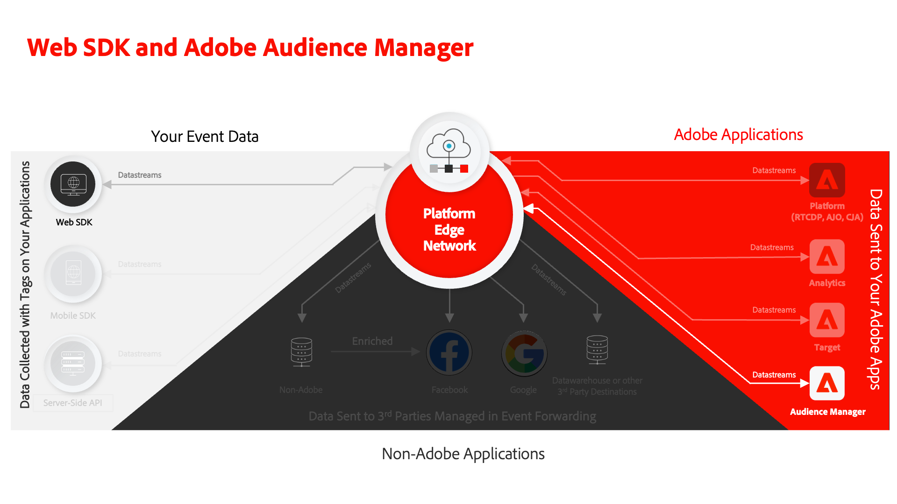
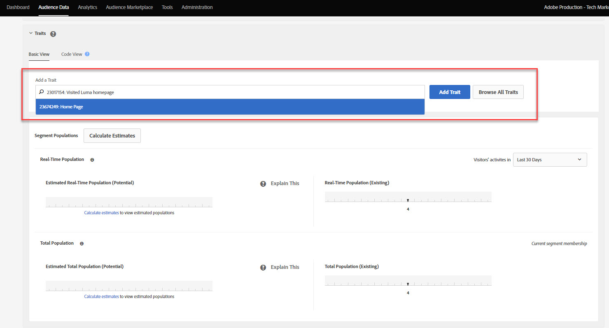
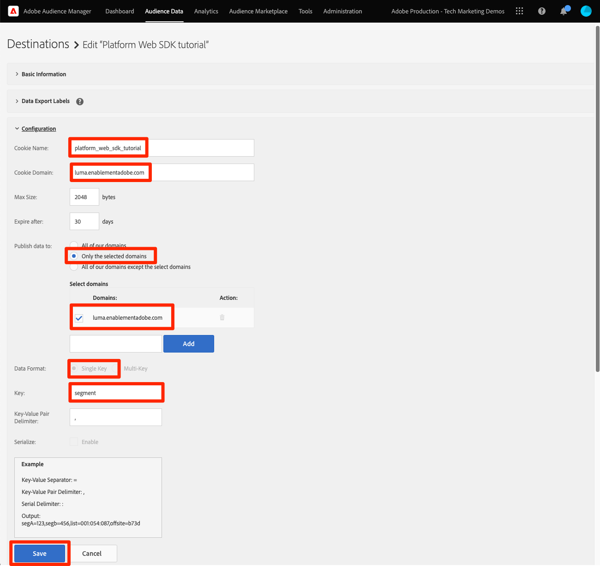
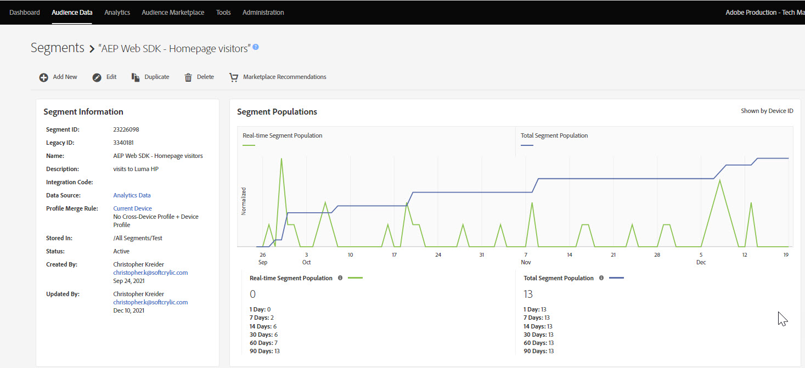

# Platform Web SDK으로 Audience Manager 설정

Adobe Experience Platform Web SDK를 사용하여 Adobe Audience Manager를 설정하고 쿠키 대상을 사용하여 구현의 유효성을 검사하는 방법을 알아봅니다.

[Adobe Audience Manager](https://experienceleague.adobe.com/en/docs/audience-manager)은(는) 사이트 방문자에 대한 상업적인 연관성 있는 정보를 수집하고, 마케팅 가능한 세그먼트를 만들고, 타기팅된 광고 및 콘텐츠를 적절한 고객에게 제공하는 데 필요한 모든 것을 제공하는 Adobe Experience Cloud 솔루션입니다.

## 학습 목표

이 단원을 마치면 다음을 수행할 수 있습니다.

* Audience Manager을 활성화하기 위한 데이터 스트림 구성
* Audience Manager에서 쿠키 대상 활성화
* Adobe Experience Platform Debugger으로 대상 자격을 확인하여 Audience Manager 구현의 유효성을 검사합니다

## 전제 조건

이 단원을 완료하려면 먼저 다음 작업을 수행해야 합니다.

* 이 자습서의 초기 구성 및 태그 구성 섹션에서 이전 단원을 완료합니다.
* Adobe Audience Manager에 대한 액세스 권한과 트레이트, 세그먼트 및 대상을 만들고, 읽고, 쓸 수 있는 적절한 권한이 있습니다. 자세한 내용은 [Audience Manager의 역할 기반 액세스 제어](https://experienceleague.adobe.com/en/docs/audience-manager-learn/tutorials/setup-and-admin/user-management/setting-permissions-with-role-based-access-control)를 검토하십시오.

## 데이터 스트림 구성

Platform Web SDK을 사용하는 Audience Manager 구현은 [SSF(서버측 전달)를 사용하는 구현과 다릅니다](https://experienceleague.adobe.com/en/docs/analytics/admin/admin-tools/manage-report-suites/edit-report-suite/report-suite-general/server-side-forwarding/ssf). 서버측 전달은 Adobe Analytics 요청 데이터를 Audience Manager으로 전달합니다. Platform Web SDK 구현은 Platform Edge Network으로 전송된 XDM 데이터를 Audience Manager에 전달합니다. Audience Manager은 데이터 스트림에서 활성화됩니다.

1. [데이터 수집](https://experience.adobe.com/#/data-collection){target="blank"} 인터페이스로 이동
1. 왼쪽 탐색에서 **[!UICONTROL 데이터스트림]**&#x200B;을 선택합니다.
1. 이전에 만든 `Luma Web SDK: Development Environment` 데이터스트림 선택

   

1. **[!UICONTROL 서비스 추가]** 선택
   
1. **[!UICONTROL Adobe Audience Manager]**&#x200B;을(를) **[!UICONTROL 서비스]**(으)로 선택
1. **[!UICONTROL 활성화된 쿠키 대상]** 및 **[!UICONTROL 활성화된 URL 대상]**&#x200B;이 선택되어 있는지 확인
1. **[!UICONTROL 저장]** 선택
   

## 데이터 소스 만들기

그런 다음 Audience Manager 내에서 데이터를 구성하는 기본 도구인 [Data Source](https://experienceleague.adobe.com/en/docs/audience-manager/user-guide/features/data-sources/datasources-list-and-settings)을(를) 만듭니다.

1. [Audience Manager](https://experience.adobe.com/#/audience-manager/) 인터페이스로 이동
1. 위쪽 탐색에서 **[!UICONTROL 대상 데이터]** 선택
1. 드롭다운 메뉴에서 **[!UICONTROL 데이터 원본]**&#x200B;을(를) 선택합니다
1. 데이터 소스 페이지 상단에서 **[!UICONTROL 새로 추가]** 단추를 선택합니다.

   

1. Data Source에 친숙한 이름과 설명을 지정합니다. 초기 설정의 경우 이 `Platform Web SDK tutorial`의 이름을 지정할 수 있습니다.
1. **[!UICONTROL ID 유형]**&#x200B;을(를) **[!UICONTROL 쿠키]**(으)로 설정
1. **[!UICONTROL 데이터 내보내기 컨트롤]** 섹션에서 **[!UICONTROL 제한 없음]**&#x200B;을 선택합니다.

   

1. 데이터 Source **[!UICONTROL 저장]**

## 트레이트 만들기

Data Source이 저장되면 [트레이트](https://experienceleague.adobe.com/en/docs/audience-manager/user-guide/features/traits/traits-overview)를 설정합니다. 트레이트는 Audience Manager에 있는 하나 이상의 신호가 결합된 것입니다. 홈 페이지 방문자에 대한 트레이트를 만듭니다.

>[!NOTE]
>
>모든 XDM 데이터는 데이터 스트림에서 활성화된 경우 Audience Manager으로 전송되지만 데이터는 사용되지 않은 신호 보고서에서 사용할 수 있을 때까지 24시간이 걸릴 수 있습니다. 이 연습에 설명된 대로 Audience Manager에서 즉시 사용할 XDM 데이터에 대한 명시적 트레이트를 만듭니다.

1. **[!UICONTROL 대상 데이터]** > **[!UICONTROL 트레이트]** 선택
1. **[!UICONTROL 새로 추가]** > **[!UICONTROL 규칙 기반]** 트레이트 선택

   

1. 트레이트에 알기 쉬운 이름 및 설명을 지정하십시오. `Luma homepage view`
1. 이전 섹션에서 만든 **[!UICONTROL 데이터 Source]**&#x200B;을(를) 선택합니다.
1. **[!UICONTROL 오른쪽 창에서 특성을 저장할 폴더를 선택]**&#x200B;합니다. 기존 상위 폴더 옆에 있는 **+ 아이콘**&#x200B;을(를) 선택하여 폴더를 만들 수 있습니다. 이 새 폴더의 이름을 `Platform Web SDK tutorial`로 지정할 수 있습니다.
1. **[!UICONTROL 트레이트 식]** 캐럿을 확장하고 **[!UICONTROL 식 빌더]**&#x200B;를 선택합니다. 홈 페이지 방문을 나타내는 키 값 쌍을 제공해야 합니다.
1. [Luma 홈 페이지](https://luma.enablementadobe.com/content/luma/us/en.html)&#x200B;(태그 속성에 매핑됨)와 **Adobe Experience Platform Debugger**&#x200B;을(를) 열고 페이지를 새로 고칩니다.
1. Platform Web SDK에 대한 네트워크 요청 및 이벤트 세부 정보를 확인하여 홈 페이지의 키 및 이름 값을 찾습니다.
   
1. Audience Manager UI에서 표현식 빌더로 돌아가서 키를 **`web.webPageDetails.name`**(으)로 입력하고 **`content:luma:us:en`** 값을 입력합니다. 이 단계에서는 홈 페이지를 로드할 때마다 트레이트를 실행합니다.
1. 트레이트를 **[!UICONTROL 저장]**&#x200B;합니다.

## 세그먼트 생성

다음 단계는 **세그먼트**&#x200B;를 만들고 새로 정의한 트레이트를 이 세그먼트에 할당하는 것입니다.

1. 위쪽 탐색에서 **[!UICONTROL 대상 데이터]**&#x200B;를 선택하고 **[!UICONTROL 세그먼트]**&#x200B;를 선택합니다.
1. 페이지 왼쪽 상단에서 **[!UICONTROL 새로 추가]**&#x200B;를 선택하여 세그먼트 빌더를 엽니다
1. 세그먼트에 `Platform Web SDK - Homepage visitors`과(와) 같은 친숙한 이름과 설명을 지정하십시오.
1. **[!UICONTROL 세그먼트가 오른쪽 창에 저장된 폴더를 선택하십시오]**. 기존 상위 폴더 옆에 있는 **+ 아이콘**&#x200B;을(를) 선택하여 폴더를 만들 수 있습니다. 이 새 폴더의 이름을 `Platform Web SDK tutorial`로 지정할 수 있습니다.
1. 통합 코드를 추가합니다. 이 경우 임의의 숫자 집합입니다.
1. **[!UICONTROL 데이터 Source]** 섹션에서 **[!UICONTROL Audience Manager]** 및 이전에 만든 데이터 원본을 선택합니다
1. **[!UICONTROL 특성]** 섹션을 확장하고 만든 특성을 검색합니다
1. **[!UICONTROL 특성 추가]**&#x200B;를 선택합니다.
1. 페이지 맨 아래에서 **[!UICONTROL 저장]** 선택

   

   

## 대상 만들기

그런 다음 **대상 빌더**&#x200B;를 사용하여 **쿠키 기반 대상**&#x200B;을 만듭니다. Destination Builder를 사용하여 쿠키, URL 및 서버 간 대상을 만들고 관리할 수 있습니다.

1. 위쪽 탐색의 **[!UICONTROL 대상 데이터]** 메뉴에서 **대상**&#x200B;을 선택하여 대상 빌더를 엽니다.
1. **[!UICONTROL 대상 만들기]** 선택
1. 이름 및 설명 입력, `Platform Web SDK tutorial`
1. **[!UICONTROL Category]**(으)로 **[!UICONTROL Custom]**&#x200B;을(를) 선택하십시오.
1. **[!UICONTROL Type]**(으)로 **[!UICONTROL Cookie]**&#x200B;을(를) 선택합니다.

   

1. **[!UICONTROL 구성]** 섹션을 열어 쿠키 대상에 대한 세부 정보를 입력하십시오.
1. 쿠키에 친숙한 이름 `platform_web_sdk_tutorial`을(를) 지정하십시오.
1. **[!UICONTROL 쿠키 도메인]**(으)로 통합을 계획하고 있는 사이트의 도메인을 추가하십시오. 튜토리얼에 Luma 도메인 `luma.enablementadobe.com`을(를) 입력합니다.
1. **[!UICONTROL 데이터를]**&#x200B;에 게시&#x200B;**[!UICONTROL 선택한 도메인만 선택]**
1. 아직 추가되지 않은 경우 도메인 선택
1. **[!UICONTROL 데이터 형식]**(으)로 **[!UICONTROL 단일 키]**&#x200B;를 선택하고 쿠키에 키를 지정하십시오. 이 자습서에서는 `segment`을(를) 키 값으로 사용합니다.
1. 마지막으로 **[!UICONTROL 저장]**&#x200B;을 선택하여 대상 구성 세부 정보를 저장합니다.

   

<!--
   

   
-->

1. **[!UICONTROL 세그먼트 매핑]** 섹션에서 **[!UICONTROL 세그먼트 검색 및 추가]** 기능을 사용하여 이전에 만든 `Platform Web SDK - Homepage visitors`을(를) 검색하고 **[!UICONTROL 추가]**&#x200B;를 선택합니다.

1. 세그먼트를 추가하면 쿠키에 대한 예상 값을 제공해야 하는 팝업이 열립니다. 이 연습에서는 &quot;hpvisitor&quot; 값을 입력합니다.

1. **[!UICONTROL 저장]** 선택

1. **[!UICONTROL 완료]** 선택
   

세그먼트 매핑 기간을 활성화하려면 몇 시간이 필요합니다. 완료되면 Audience Manager 인터페이스를 새로 고치고 **매핑된 세그먼트** 목록이 업데이트되었는지 확인할 수 있습니다.

## 세그먼트 유효성 검사

세그먼트를 처음 만든 후 몇 시간 후에 세그먼트가 제대로 작동하는지 확인할 수 있습니다.

먼저 세그먼트에 대한 자격이 있는지 확인합니다

1. 태그 속성에 매핑된 상태로 [Luma 데모 사이트 홈 페이지](https://luma.enablementadobe.com/content/luma/us/en.html)를 열어 새로 만든 세그먼트를 확인합니다.
1. 브라우저의 **개발자 도구** > **네트워크** 탭을 엽니다.
1. `interact`을(를) 텍스트 필터로 사용하여 Platform 웹 SDK 요청을 필터링합니다.
1. 통화를 선택하고 **미리 보기** 탭을 열어 응답 세부 정보를 봅니다.
1. 이전에 Audience Manager에서 구성한 대로 필요한 쿠키 세부 정보를 보려면 **페이로드**&#x200B;를 확장하십시오. 이 예제에서는 예상 쿠키 이름 `platform_web_sdk_tutorial`이(가) 표시됩니다.

   

1. **응용 프로그램** 탭을 열고 **저장소** 메뉴에서 **쿠키**&#x200B;를 엽니다.
1. **`https://luma.enablementadobe.com`** 도메인을 선택하고 쿠키가 목록에 적절히 작성되었는지 확인하십시오

   

마지막으로 Audience Manager 인터페이스에서 세그먼트를 열고 **세그먼트 모집단**&#x200B;이 증가했는지 확인해야 합니다.

이 단원을 완료했으므로 Platform Web SDK이 데이터를 Audience Manager에 전달하는 방법을 확인하고 쿠키 대상이 있는 세그먼트별 자사 쿠키를 설정할 수 있습니다.

>[!NOTE]
>
>Adobe Experience Platform 웹 SDK에 대해 학습하는 데 시간을 투자해 주셔서 감사합니다. 질문이 있거나 일반적인 피드백을 공유하고 싶거나 향후 콘텐츠에 대한 제안이 있는 경우 이 [Experience League 커뮤니티 토론 게시물](https://experienceleaguecommunities.adobe.com/t5/adobe-experience-platform-data/tutorial-discussion-implement-adobe-experience-cloud-with-web/td-p/444996)에서 공유하십시오.
