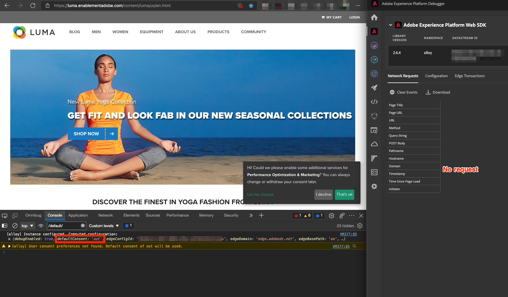
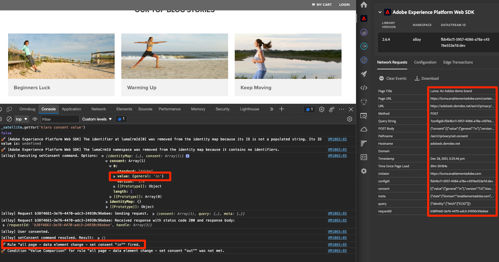

# Platform Web SDK를 사용하여 동의 설정

Experience Platform 웹 SDK 태그 확장의 개인 정보 설정을 구성하는 방법을 알아봅니다. CMP(동의 관리 플랫폼)의 배너와 방문자의 상호 작용에 따라 동의를 설정합니다.

>[!NOTE]
> 
>이 자습서에서는 데모용으로 [클라로](https://heyklaro.com/) CMP로서 Klaro 또는 웹 사이트에 사용하는 CMP를 따르십시오.


## 학습 목표

이 단원을 마치면 다음을 수행할 수 있습니다.

* 태그를 사용하여 CMP 로드
* Web SDK 태그 확장 Experience Platform에서 개인 정보 설정 구성
* 방문자의 작업을 기반으로 Experience Platform 웹 SDK에 대한 동의 설정

## 전제 조건

Experience Platform 디버거를 사용하여 규칙, 데이터 요소를 만들고, 라이브러리를 환경에 빌드하고, 태그 라이브러리를 전환하는 태그와 단계에 익숙해야 합니다.

개인 정보 설정을 구성하고 동의를 설정하는 규칙을 만들기 전에 웹 사이트에 동의 관리 플랫폼 스크립트를 삽입했고 제대로 작동하는지 확인하십시오. CMP는 사이트 개발자의 도움을 받아 소스 코드에 직접 로드하거나 태그를 통해 로드할 수 있습니다. 이 단원은 후자의 방식을 보여줍니다.
>[!NOTE]
> 
>1. 조직은 웹 사이트 및 앱과 같은 온라인 소스에서 방문자 데이터를 수집, 공유 또는 판매하기 전에 방문자의 동의 선택 사항을 합법적으로 문서화하고 관리하는 데 CMP(동의 관리 플랫폼)를 사용합니다.
>
>2. CMP를 삽입하는 데 권장되는 방법은 태그 관리자 스크립트 앞에 소스 코드를 직접 통과하는 것입니다.

### Klaro 구성

태그 구성으로 이동하기 전에 이 자습서 Klaro에서 사용되는 동의 관리 플랫폼에 대해 자세히 알아보십시오.

1. 방문 [클라로](https://heyklaro.com/) 계정을 설정합니다.
1. 다음으로 이동 **개인 정보 관리자** 지침에 따라 인스턴스를 생성합니다.
1. 사용 **통합 코드** 를 사용하여 Klaro를 태그 속성에 삽입합니다(지침은 다음 연습에 나와 있습니다).
1. 건너뛰기 **스캔 중** 섹션으로, Luma 데모 웹 사이트에서 하드코딩된 태그 속성을 감지하므로 이 자습서를 위해 빌드한 속성이 아닙니다.
1. 다음 서비스 추가: `aep web sdk` 및 켜기/끄기 **서비스 기본 상태**. 이 옵션을 켜면 기본 동의 값은 입니다. `true`, 그렇지 않은 경우 `false`. 이 구성은 웹 애플리케이션에 대한 기본 동의 상태(방문자의 동의 전)를 결정하려는 경우 유용합니다. 예:
   * CCPA의 경우 기본 동의는 일반적으로 로 설정됩니다. `true`. 이 시나리오를 다음으로 참조하려 합니다. **암시적 옵트인** 이 자습서 전체에서
   * GDPR의 경우 기본 동의가 일반적으로 로 설정됩니다. `false`. 이 시나리오를 다음으로 참조하려 합니다. **암시적 옵트아웃** 이 튜토리얼 전체에서

<!--
    This consent value can be verified by returning the JavaScript object ```klaro.getManager().consents``` in the browser's developer console.
-->
    >[!NOTE]
    >
    >일반적으로 위의 단계는 OneTrust 또는 TrustArc와 같은 CMP를 처리하는 팀 또는 개인이 수행하고 처리합니다.

## CMP 삽입

>[!WARNING]
>
>동의 관리 플랫폼을 구현하는 가장 좋은 방법은 일반적으로 CMP를 로드하는 것입니다 _다음 이전_ 태그 관리자를 로드하는 중입니다. 이 자습서를 용이하게 하기 위해 CMP를 로드합니다 _포함_ 태그 관리자 이 단원은 Platform Web SDK에서 동의 기능을 사용하는 방법을 보여주기 위해 마련되었으며 Klaro 또는 기타 CMP를 올바르게 구성하는 지침으로 사용되어서는 안 됩니다.


이제 Klaro의 구성이 완료되면 다음 구성으로 태그 규칙을 만듭니다.

* [!UICONTROL 이름]: `all pages - library load - Klaro`
* [!UICONTROL 이벤트]: [!UICONTROL 라이브러리가 로드됨 (페이지 상단)] 포함 [!UICONTROL 고급 옵션] > [!UICONTROL 주문] 1로 설정
* [!UICONTROL 작업]: [!UICONTROL 사용자 지정 코드], [!UICONTROL 언어]: CMP 스크립트를 로드하는 HTML.


사용자 지정 코드 블록은 다음과 유사해야 합니다.


이제 이 규칙을 저장하고 개발 라이브러리에 빌드합니다. Luma 사이트에서 자신의 사이트로 태그 라이브러리를 전환하여 동의 배너가 표시되는지 확인하십시오. 다음과 같이 웹 사이트에 CMP 배너가 표시됩니다. 또한 현재 방문자의 동의 권한을 확인하려면 브라우저의 콘솔에서 다음 코드 조각을 사용할 수 있습니다.

```javascript
    klaro.getManager().consents 
```


디버그 모드로 전환하려면 Adobe Experience Platform 디버거의 다음 확인란을 사용하십시오.


또한 방문자의 동의 값이 쿠키에 저장되므로 이 자습서를 진행하는 동안 여러 번 쿠키와 로컬 저장소를 지워야 할 수 있습니다. 다음과 같이 간단히 수행할 수 있습니다.


## 동의 시나리오

GDPR, CCPA 및 기타 개인 정보 보호 작업은 동의 구현을 설계하는 방법에 중요한 역할을 합니다. 이 단원에서는 방문자가 가장 중요한 두 가지 개인 정보 보호 법률에 따라 동의 배너와 상호 작용하는 방법을 살펴봅니다.


### 시나리오 1: 암시적 옵트인

암시적 옵트인은 비즈니스가 데이터를 수집하기 전에 방문자의 동의(또는 &quot;옵트인&quot;)를 받을 필요가 없음을 의미하며, 따라서 웹 사이트의 모든 방문자는 기본적으로 옵트인으로 처리됩니다. 그러나 방문자는 동의 배너를 통해 쿠키를 거부하여 옵트아웃할 수 있습니다. 이 사용 사례는 CCPA와 유사합니다.

이제 이 시나리오에 대한 동의를 구성하고 구현합니다.

1. 다음에서 **[!UICONTROL 개인 정보 보호]** Experience Platform 웹 SDK 태그 확장의 섹션에서  **[!UICONTROL 기본 동의]** 이(가) (으)로 설정됨 **[!UICONTROL 위치]** :


   

   >[!NOTE]
   > 
   >동적 솔루션의 경우 &quot;데이터 요소 제공&quot; 옵션을 선택하고 값 을 반환하는 데이터 요소를 전달합니다. ```klaro.getManager().consents```
   >
   >이 옵션은 CMP가 소스 코드에 주입된 경우에 사용됩니다 *다음 이전* Experience Platform Web SDK 확장이 로드되기 전에 기본 동의를 사용할 수 있도록 태그 포함 코드입니다. 이 예제에서는 CMP가 태그 앞에 로드되지 않고 태그와 함께 로드되므로 이 옵션을 사용할 수 없습니다.


2. 이 변경 사항을 저장하고 태그 라이브러리에 빌드
3. Luma 데모 사이트에서 태그 라이브러리를 로드합니다
4. Luma 사이트에서 태그 디버깅을 활성화하고 페이지를 다시 로드합니다. 브라우저의 개발자 콘솔에 defaultConsent 가 다음과 같다는 것이 표시되어야 합니다. **[!UICONTROL 위치]**
5. 이 구성을 사용하면 방문자가 쿠키 및 옵트아웃을 거부하기로 결정하지 않는 한 Experience Platform 웹 SDK 확장은 네트워크 요청을 계속 수행합니다.

   


방문자가 옵트아웃(추적 쿠키 거부)을 결정하는 경우 이에 대한 동의를 변경해야 합니다. **[!UICONTROL 출력]**. 다음 단계에 따라 동의 설정을 변경합니다.

<!--
1. Create a data element to store the consent value of the visitor. Let's call it `klaro consent value`. Use the code snippet to create a custom code type data element:
    
    ```javascript
    return klaro.getManager().consents["aep web sdk"]
    ```

    


1. Create another custom code data element, `consent confirmed`, with the following snippet which returns ```true``` only after a visitor confirms consent:

    
    ```javascript
    return klaro.getManager().confirmed
    ```

    
-->

1. 방문자가 클릭할 때 트리거되는 규칙 만들기 **거절**.  이 규칙의 이름을 다음과 같이 지정합니다. `all pages - click consent banner - set consent "out"`

1. 다음으로: **[!UICONTROL 이벤트]**, 사용 **[!UICONTROL 클릭]** 날짜 **[!UICONTROL CSS 선택기와 일치하는 요소]** `#klaro .cn-decline`

   

1. 이제 Experience Platform 웹 SDK를 사용하고 [!UICONTROL 동의 설정] [!UICONTROL 작업 유형] 동의를 &quot;out&quot;으로 설정하려면:

   

1. 선택 **[!UICONTROL 라이브러리 및 빌드에 저장]**:

   

이제 방문자가 옵트아웃하면 위의 방식으로 구성된 규칙이 실행되고 웹 SDK 동의를 로 설정합니다. **[!UICONTROL 출력]**.

Luma 데모 사이트로 이동하여 유효성을 확인하고, 쿠키를 거부하고, 옵트아웃 후 웹 SDK 요청이 실행되지 않는지 확인합니다.

### 시나리오 2: 암시적 옵트아웃


암시적 옵트아웃은 방문자가 기본적으로 옵트아웃으로 처리되어야 하며 쿠키를 설정하지 말아야 함을 의미합니다. 방문자가 동의 배너를 통해 쿠키를 수락하여 수동으로 옵트인하기로 결정하지 않는 한 웹 SDK 요청을 실행하지 않아야 합니다. GDPR이 적용되는 유럽 연합 지역에서 이러한 사용 사례를 처리해야 할 수 있습니다.

다음은 암시적 옵트아웃 시나리오에 대한 구성을 설정하는 방법입니다.

1. Klaro에서 **서비스 기본 상태** (으)로 `aep web sdk` 를 서비스하고 업데이트된 구성을 저장합니다.

1. 위치 **[!UICONTROL 개인 정보 보호]** 웹 SDK 확장 Experience Platform의 섹션에서 기본 동의를 다음으로 설정 **[!UICONTROL 출력]** 또는 **[!UICONTROL 보류 중]** 필요에 따라.

   

1. **저장** 태그 라이브러리에 대한 구성을 업데이트하고 다시 빌드했습니다.

   이 구성을 사용하면 동의 권한이 다음으로 변경되지 않는 한 Experience Platform 웹 SDK에서 요청이 실행되지 않습니다. **[!UICONTROL 위치]**. 방문자가 옵트인하여 쿠키를 수동으로 수락하면 이러한 문제가 발생할 수 있습니다.

1. 디버거에서 Luma 사이트가 태그 속성에 매핑되고 태그 콘솔 로깅이 설정되어 있는지 확인합니다.
1. 브라우저의 개발자 콘솔을 사용하여 **사이트 데이터 지우기** 위치: **애플리케이션** > **스토리지**

1. Luma 사이트를 다시 로드하면 다음과 같이 표시됩니다. `defaultConsent` 이(가) (으)로 설정됨 **[!UICONTROL 출력]** 및 웹 SDK 요청이 수행되지 않았습니다.

   

방문자가 옵트인(추적 쿠키 수락)을 결정하는 경우 동의를 변경하고 (으)로 설정해야 합니다 **[!UICONTROL 위치]**. 다음은 규칙을 사용하여 이 작업을 수행하는 방법입니다.

1. 방문자가 클릭할 때 트리거되는 규칙 만들기 **괜찮습니다.**.  이 규칙의 이름을 다음과 같이 지정합니다. `all pages - click consent banner - set consent "in"`

1. 다음으로: **[!UICONTROL 이벤트]**, 사용 **[!UICONTROL 클릭]** 날짜 **[!UICONTROL CSS 선택기와 일치하는 요소]** `#klaro .cm-btn-success`

   

1. Experience Platform Web SDK를 사용하여 작업 추가 [!UICONTROL 확장], **[!UICONTROL 작업 유형]** / **[!UICONTROL 동의 설정]**, **[!UICONTROL 일반 동의]** 다음으로: **[!UICONTROL 위치]**.

   

   여기서 한 가지 주의할 점은 이것이 [!UICONTROL 동의 설정] 작업은 나가서 id를 설정하는 첫 번째 요청이 됩니다. 이러한 이유로 첫 번째 요청 자체에 대한 ID를 동기화하는 것이 중요할 수 있습니다. ID 맵은에 추가할 수 있습니다. [!UICONTROL 동의 설정] id 유형 데이터 요소를 전달하여 작업을 수행합니다.

1. 선택 **[!UICONTROL 라이브러리 및 빌드에 저장]**:

   

1. **[!UICONTROL 저장]** 규칙을 라이브러리에 추가하고 다시 빌드합니다.

이 규칙이 적용되면 방문자가 옵트인하면 이벤트 수집이 시작됩니다.




Web SDK의 동의에 대한 자세한 내용은 [고객 동의 환경 설정 지원](https://experienceleague.adobe.com/docs/experience-platform/edge/consent/supporting-consent.html?lang=en).


에 대한 자세한 내용은 [!UICONTROL 동의 설정] 작업, 참조 [동의 설정](https://experienceleague.adobe.com/docs/experience-platform/edge/extension/action-types.html?lang=en#set-consent).

[다음: ](setup-event-forwarding.md)

>[!NOTE]
>
>Adobe Experience Platform Web SDK에 대해 학습하는 데 시간을 투자해 주셔서 감사합니다. 질문이 있거나, 일반적인 피드백을 공유하거나, 향후 콘텐츠에 대한 제안이 있는 경우 이에 대해 공유하십시오. [Experience League 커뮤니티 토론 게시물](https://experienceleaguecommunities.adobe.com/t5/adobe-experience-platform-launch/tutorial-discussion-implement-adobe-experience-cloud-with-web/td-p/444996)
