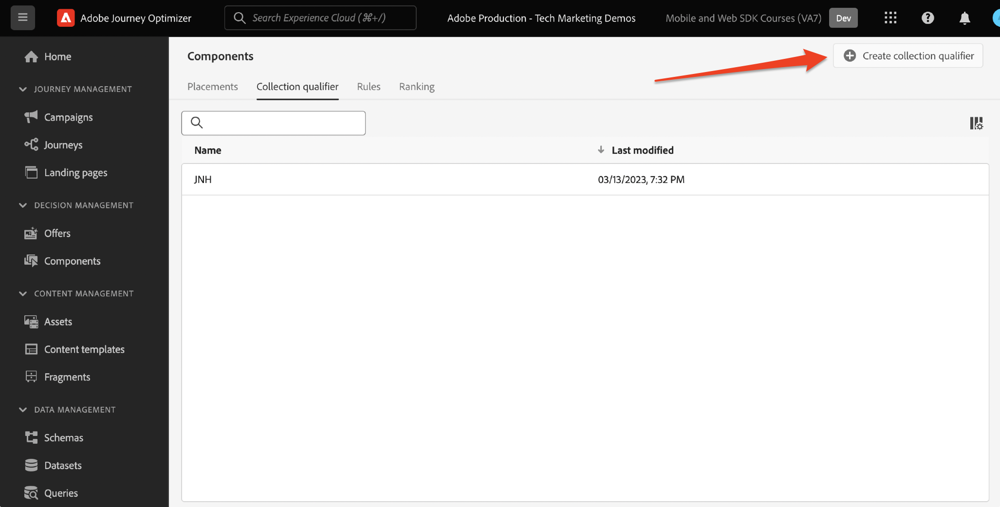

# Platform Web SDK을 사용하여 의사 결정 관리 설정

Platform Web SDK을 사용하여 Adobe Journey Optimizer의 의사 결정 관리 기능을 구현하는 방법을 알아봅니다. 이 안내서에서는 기본 의사 결정 관리 사전 요구 사항, 구성을 위한 자세한 단계 및 충성도 상태를 중심으로 하는 사용 사례에 대해 자세히 설명합니다.

이 자습서를 통해 Journey Optimizer 사용자는 의사 결정 관리 기능을 사용할 수 있으므로 고객 상호 작용의 개인화와 관련성을 높일 수 있습니다.


## 학습 목표

이 단원을 마치면 다음을 수행할 수 있습니다.

* Adobe Journey Optimizer 내 의사 결정 관리의 핵심 개념과 Adobe Experience Platform Web SDK과의 통합을 파악합니다.

* Journey Optimizer과의 원활한 통합을 위해 Offer Decisioning용 웹 SDK을 구성하는 단계별 프로세스를 알아봅니다.

* 충성도 상태 오퍼를 중심으로 하는 세부 사용 사례를 탐색하여 오퍼, 의사 결정 및 배치를 효과적으로 만들고 관리하는 데 대한 통찰력을 얻으십시오.

* 의사 결정 관리 프레임워크 내에서 중요한 용어와 이에 따른 영향에 대해 숙지하십시오.

* 올바른 사용자에게 올바른 오퍼를 전달할 때 의사 결정 규칙, 컬렉션 한정자 및 대체 오퍼의 중요성을 이해합니다.

* 시뮬레이션 및 사용자 지정 이벤트 데이터 수집과 같은 고급 주제를 탐색하여 오퍼 게재 메커니즘을 테스트, 유효성 검사 및 개선할 수 있습니다.

## 전제 조건

이 섹션의 학습 내용을 완료하려면 먼저 다음을 수행해야 합니다.

* 조직에서 Adobe Journey Optimizer Ultimate(Journey Optimizer 및 Offer Decisioning) 또는 Adobe Experience Platform과 Offer Decisioning 추가 기능에 액세스할 수 있는지 확인합니다.

* Platform Web SDK의 초기 구성에 대한 모든 단원을 완료합니다.

* Edge Decisioning에 대한 조직을 활성화합니다.

* 배치를 구성하고 의사 결정 범위 JSON 내에서 배치 및 활동 ID를 인스턴스화하는 방법을 이해합니다.

## 제한 사항

이벤트 기반 오퍼는 현재 Adobe Journey Optimizer에서 지원되지 않습니다. 이벤트를 기반으로 의사 결정 규칙을 만드는 경우 오퍼에 적용할 수 없습니다.

## 의사 결정 관리 액세스 권한 부여

[의사 결정 관리] 기능에 대한 액세스 권한을 부여하려면 **제품 프로필**&#x200B;을 만들고 사용자에게 해당 권한을 할당해야 합니다. [이 섹션에서 Journey Optimizer 사용자 및 권한 관리에 대해 자세히 알아보세요](https://experienceleague.adobe.com/ko/docs/journey-optimizer/using/access-control/privacy/high-low-permissions#decisions-permissions).

## 데이터 스트림 구성

Platform Web SDK에서 의사 결정 관리 활동을 전달하려면 먼저 **데이터스트림** 구성에서 Offer Decisioning을 활성화해야 합니다.

데이터 스트림에서 Offer Decisioning을 구성하려면 다음 작업을 수행하십시오.

1. [데이터 수집](https://experience.adobe.com/#/data-collection) 인터페이스로 이동합니다.

1. 왼쪽 탐색에서 **데이터스트림**&#x200B;을 선택합니다.

1. 이전에 만든 Luma 웹 SDK 데이터스트림을 선택합니다.

   

1. **Adobe Experience Platform 서비스**&#x200B;에서 **편집**&#x200B;을(를) 선택합니다.

   

1. **Offer Decisioning** 상자를 선택합니다.

   

1. **저장**&#x200B;을 선택합니다.

이렇게 하면 Journey Optimizer에 대한 인바운드 이벤트가 **Adobe Experience Platform Edge**&#x200B;에서 올바르게 처리됩니다.

## 의사 결정 관리를 위한 SDK 구성

의사 결정 관리에는 웹 SDK 구현 유형에 따라 추가 SDK 단계가 필요합니다. 의사 결정 관리에 사용할 SDK을 구성하는 데 두 가지 옵션이 있습니다.

* SDK 독립 실행형 설치
   1. `sendEvent`(으)로 `decisionScopes` 작업을 구성하십시오.

      ```javascript
      alloy("sendEvent", {
         ...
         "decisionScopes": [
            "[DECISION SCOPE 1]",
            "[DECISION SCOPE 2]"
         ]
      })
      ```

* SDK 태그 설치
   1. 데이터 수집 인터페이스로 이동합니다.

   1. 왼쪽 탐색에서 **태그**&#x200B;를 선택합니다.

      

   1. **태그 속성**&#x200B;을 선택합니다.

   1. **규칙**&#x200B;을 만듭니다.
      * Platform Web SDK **이벤트 보내기 작업**&#x200B;을(를) 추가하고 해당 작업의 구성에 관련 `decisionScopes`을(를) 추가합니다.

   1. 구성한 모든 관련 **규칙**, **데이터 요소** 및 **확장**&#x200B;을 포함하는 **라이브러리**&#x200B;를 만들어 게시합니다.

## 용어

먼저 의사 결정 관리 인터페이스에 사용되는 용어를 이해해야 합니다.

* **한도**: 오퍼 표시 빈도를 나타내는 제약 조건입니다. 두 가지 유형:
   * 총 상한: 타겟 대상 전체에 오퍼를 표시할 수 있는 최대 횟수입니다.
   * 프로필 상한: 오퍼를 특정 사용자에게 표시할 수 있는 시간.
* **컬렉션**: 마케터가 설정한 특정 조건(예: 오퍼 범주)별로 그룹화된 오퍼의 하위 집합입니다.
* **결정**: 오퍼를 선택해야 하는 논리입니다.
* **의사 결정 규칙**: 사용자의 자격 조건을 확인할 수 있는 오퍼에 대한 제약 조건입니다.
* **적격 오퍼**: 사전 설정된 제한과 일치하며 사용자에게 표시될 수 있는 오퍼입니다.
* **의사 결정 관리**: 비즈니스 논리 및 의사 결정 규칙을 사용하여 개인화된 오퍼를 만들고 배포하는 시스템입니다.
* **대체 오퍼**: 사용자가 컬렉션에 있는 오퍼에 대한 자격이 없을 때 표시되는 기본 오퍼입니다.
* **오퍼**: 뷰어를 결정하는 잠재적 자격 규칙이 있는 마케팅 메시지입니다.
* **오퍼 라이브러리**: 오퍼, 의사 결정 및 관련 규칙을 관리하는 중앙 저장소입니다.
* **개인화된 오퍼**: 자격 조건을 기반으로 맞춤화된 사용자 지정 마케팅 메시지입니다.
* **배치**: 오퍼가 사용자에게 표시되는 설정 또는 시나리오입니다.
* **우선 순위**: 자격 조건 및 한도 등과 같은 다양한 제약 조건을 고려하는 오퍼에 대한 순위 메트릭입니다.
* **표시**: 위치 또는 언어와 같은 채널별 정보로, 오퍼의 표시를 안내합니다.

## 사용 사례 개요 - 충성도 보상

이 단원에서는 샘플 충성도 보상 사용 사례를 구현하여 웹 SDK을 사용하는 의사 결정 관리를 이해합니다.

이 사용 사례를 통해 Journey Optimizer이 중앙 집중식 오퍼 라이브러리 및 의사 결정 관리 의사 결정 엔진을 활용하여 고객에게 최상의 오퍼를 제공하는 데 어떻게 도움이 되는지 더 잘 이해할 수 있습니다.

>[!NOTE]
>
> 이 자습서는 구현자를 대상으로 하므로 이 단원에는 Journey Optimizer의 실질적인 인터페이스 작업이 포함되어 있습니다. 이러한 인터페이스 작업은 일반적으로 마케터가 처리하지만, 장기적인 관점에서 의사 결정 관리 캠페인 생성에 대한 책임이 없어도 구현자가 insight을 프로세스에 참여시키는 것이 유용할 수 있습니다.

## 구성 요소

오퍼를 만들기 전에 몇 가지 전제 조건 구성 요소를 정의해야 합니다.

### 충성도 오퍼에 대한 배치 만들기

**배치**&#x200B;는 오퍼를 표시하는 데 사용되는 컨테이너입니다. 이 예제에서는 Luma 사이트의 맨 위에 배치를 만듭니다.

배치 목록은 **구성 요소** 메뉴에서 액세스할 수 있습니다. 필터를 사용하여 특정 채널 또는 콘텐츠에 따라 배치를 검색할 수 있습니다.


배치를 생성하려면 다음 단계를 수행합니다.

1. **배치 만들기**&#x200B;를 클릭합니다.

   

1. 배치의 특성을 정의합니다.
   * **이름**: 배치 이름입니다. 예제 배치 *&#39;홈 페이지 배너&#39;*&#x200B;를 호출해 보겠습니다.
   * **채널 형식**: 배치가 사용되는 채널입니다. 오퍼가 Luma 웹 사이트에 표시되므로 *&#39;Web&#39;*&#x200B;을(를) 사용하겠습니다.
   * **콘텐츠 형식**: 배치에서 표시할 수 있는 콘텐츠 형식(텍스트, HTML, 이미지 링크 또는 JSON)입니다. 오퍼에 *&#39;HTML&#39;*&#x200B;을(를) 사용할 수 있습니다.
   * **설명**: 배치에 대한 설명입니다(선택 사항).

   

1. **저장**&#x200B;을 클릭합니다.
1. 배치가 생성되면 배치 목록에 표시됩니다.
1. 새 배치가 포함된 행을 선택하고 배치 ID를 메모하십시오. 결정 범위 내의 구성에 필요할 수 있습니다.

    참조

### 충성도 상태에 대한 의사 결정 규칙

**의사 결정 규칙**&#x200B;은(는) 오퍼를 표시할 조건을 지정합니다. 이 예에서는 사용자의 충성도 상태에 따라 다른 오퍼를 제공하는 의사 결정 규칙을 만듭니다.

결정 규칙 목록은 **구성 요소** 메뉴에서 액세스할 수 있습니다.

의사 결정 규칙을 만들려면 다음 단계를 수행합니다.

1. **규칙** 탭으로 이동한 다음 **규칙 만들기**&#x200B;를 클릭합니다.

   

1. 첫 번째 규칙의 이름을 &#39;*골드 충성도 상태 규칙*&#39;로 지정하겠습니다. XDM 필드를 사용하여 규칙을 정의할 수 있습니다. Adobe Experience Platform **세그먼트 빌더**&#x200B;는 규칙 조건을 작성하는 데 사용할 수 있는 직관적인 인터페이스입니다.

   

1. **저장**&#x200B;을 클릭하여 규칙 조건을 확인합니다.
1. 새로 저장된 &#39;*골드 충성도 상태 규칙*&#39;이(가) **규칙 목록**&#x200B;에 표시됩니다. 속성을 표시하려면 선택합니다.

   

1. 이제 사용 사례에 대한 나머지 충성도 오퍼 규칙 조건을 만듭니다.


### 컬렉션 한정자

**컬렉션 한정자**&#x200B;를 사용하면 오퍼 라이브러리 내에서 오퍼를 쉽게 구성하고 검색할 수 있습니다. 이 예에서는 충성도 보상 오퍼에 컬렉션 한정자를 추가하여 오퍼 조직을 개선합니다.

컬렉션 한정자 목록은 **구성 요소** 메뉴에서 액세스할 수 있습니다.

충성도 보상 수집 구분자를 생성하려면 다음 단계를 수행합니다.

1. **컬렉션 한정자** 탭으로 이동한 다음 **컬렉션 한정자 만들기**&#x200B;를 클릭합니다.

   

1. 컬렉션 한정자의 이름을 &#39;*충성도 보상*&#39;으로 지정하겠습니다.

   

1. 이제 새 컬렉션 한정자가 **컬렉션 한정자** 탭에 표시됩니다.

## 오퍼

이제 충성도 보상 오퍼를 만들 차례입니다.

오퍼 목록은 **오퍼** 메뉴에서 액세스할 수 있습니다.


### 다양한 충성도 계층을 위한 오퍼 만들기

먼저 다양한 Luma 충성도 계층에 대해 개인화된 오퍼를 만듭니다.

첫 번째 **오퍼**&#x200B;를 만들려면 다음 단계를 수행합니다.

1. **오퍼 만들기**&#x200B;를 클릭한 다음 **개인화된 오퍼**&#x200B;를 선택합니다.

1. 첫 번째 오퍼의 이름을 &#39;*Luma 충성도 계층 - 골드*&#39;로 지정해 보겠습니다. 이 오퍼의 시작/종료 날짜 및 시간을 지정해야 합니다. 또한 **컬렉션 한정자** &#39;*충성도 보상*&#39;을 오퍼에 연결해야 **오퍼 라이브러리**&#x200B;에서 보다 효율적으로 구성할 수 있습니다. 나중에 **다음**&#x200B;을 클릭하세요.

   

1. 이제 오퍼가 표시되는 위치를 정의하려면 **표현**&#x200B;을 추가해야 합니다. **웹 채널**&#x200B;을 선택하겠습니다. 이전에 구성한 &#39;*홈 페이지 배너*&#39; **배치**&#x200B;도 선택하십시오. 선택한 **배치**&#x200B;는 HTML 유형이므로 편집기에 HTML, JSON 또는 TEXT 콘텐츠를 직접 추가하여 **사용자 지정** 라디오 단추를 사용하여 오퍼를 빌드할 수 있습니다.

   

1. **표현식 편집기**&#x200B;를 사용하여 오퍼 콘텐츠를 직접 편집합니다. 이 배치에 HTML, JSON 또는 TEXT 콘텐츠를 추가할 수 있습니다. 콘텐츠 유형에 따라 편집기 하단에서 올바른 **모드**&#x200B;을(를) 선택하십시오. **유효성 검사**&#x200B;를 눌러 오류가 없는지 확인할 수도 있습니다.

   

1. 또한 표현식 편집기를 사용하여 Adobe Experience Platform에 저장된 속성을 검색할 수 있습니다. 1:1 수준의 충성도 구성원을 더 잘 개인화하기 위해 프로필 이름을 오퍼 콘텐츠에 추가하겠습니다.

   

1. &#39;*골드 충성도 상태 규칙*&#39;에 적합한 프로필에만 오퍼를 표시하는 제약 조건을 추가하십시오.

   

1. 오퍼 검토를 마쳤으면 **완료**&#x200B;를 클릭하세요. **저장 및 승인**&#x200B;을 선택합니다.

이제 다양한 Luma 충성도 계층에 대한 나머지 오퍼를 만듭니다

### 대체 오퍼

Luma 사이트의 비 Luma 충성도 방문자에게 오퍼를 제공하려고 합니다. 이렇게 하려면 캠페인에 대해 **대체 오퍼**&#x200B;를 구성할 수 있습니다.

대체 오퍼를 만들려면 다음 단계를 수행하십시오.

1. **오퍼 만들기**&#x200B;를 클릭한 다음 **대체 오퍼**&#x200B;를 선택합니다.
   <!--
      
   -->
1. 대체 오퍼의 이름을 &#39;*비 Luma 충성도*&#39;로 지정하겠습니다. 또한 쉽게 오퍼 구성할 수 있도록 이전에 만든 **컬렉션 한정자**, &#39;*충성도 보상*&#39;을 대체 오퍼에 연결할 수 있습니다.
   <!--
      
   -->
1. 대체 오퍼 콘텐츠를 **식 편집기**&#x200B;에 추가합니다. 이 배치에 HTML, JSON 또는 TEXT 콘텐츠를 추가할 수 있습니다. 콘텐츠 유형에 따라 편집기 하단에서 올바른 **모드**&#x200B;을(를) 선택하십시오. **유효성 검사**&#x200B;를 눌러 오류가 없는지 확인할 수도 있습니다.
   <!--
      
   -->
1. 모든 항목이 올바르게 구성된 경우 **마침**&#x200B;을 누른 다음 **저장 및 승인**&#x200B;을 누르십시오.
<!--
   
-->

## 결정

**결정**&#x200B;은(는) 대상에 따라 고객이 사용할 수 있는 최상의 오퍼를 선택하는 오퍼에 대한 컨테이너입니다.

결정 목록은 **오퍼** 메뉴의 **결정** 탭에서 사용할 수 있습니다.
<!--
   
-->

### 충성도 오퍼에 대한 의사 결정 만들기

Luma 충성도 보상 사용 사례에 대한 결정을 만들어 보겠습니다.

결정을 만들려면 다음 단계를 수행합니다.

1. **결정 만들기**&#x200B;를 클릭합니다.
   <!--
      
   -->
1. &#39;*12월 Luma 충성도 오퍼*&#39; 결정을 호출해 보겠습니다. 오퍼는 1개월 동안 실행되어야 하므로 여기에서 지정하겠습니다.
   <!--
      
   -->
1. 이제 **결정 범위**&#x200B;를 정의해야 합니다. 먼저 배치를 선택합니다. 이전에 만든 &#39;*홈 페이지 배너*&#39;을(를) 사용할 수 있습니다.
   <!--
      
   -->
1. 다음으로 결정 범위에 대해 **평가 기준**&#x200B;을 추가해야 합니다. **추가**&#x200B;를 클릭하고 이전에 만든 &#39;*충성도 보상*&#39; **컬렉션을 선택하십시오. 여기에는 고려할 모든 충성도 오퍼가 포함되어 있습니다.
   <!--
      
   -->
1. &#39;*충성도 보상*&#39; 컬렉션 내에서 자격 필드를 사용하여 오퍼 게재를 Luma 방문자의 하위 집합으로 제한할 수 있습니다. 그러나 이 사용 사례에서는 모든 방문자가 오퍼 중 하나를 받기를 원합니다. 모든 비충성도 방문자에 대해 **대체 오퍼**&#x200B;를 구성했습니다. 자격 조건을 &#39;없음&#39;으로 설정합니다.
   <!--
      
   -->
1. 또한, 여러 오퍼가 사용자/배치 조합에 적합한 경우 **등급 방법** 필드를 사용하여 각 Luma 방문자에 대해 최상의 오퍼를 선택할 수 있습니다. 이 사용 사례에서는 오퍼에 정의된 값을 사용하여 최상의 오퍼를 제공하는 **오퍼 우선 순위** 메서드를 사용할 수 있습니다.
   <!--
      
   -->
1. 이제 **대체 오퍼**&#x200B;를 결정에 추가하십시오. Luma 충성도 대상자에 해당하지 않는 경우 대체 오퍼가 Luma 방문자에게 표시되는 기본 오퍼라는 점을 상기하십시오. &#39;*홈페이지 배너*&#39; 배치에 사용할 수 있는 대체 오퍼 목록에서 &#39;*Luma가 아닌 충성도*&#39;을(를) 선택하십시오.
   <!--
      
   -->
1. 결정을 활성화하기 전에 결정 범위, 대체 오퍼, 사용 가능한 오퍼를 미리 보고 적격 프로필을 추정해 보겠습니다. 모든 것이 정상으로 확인되면 **마침** 및 **저장 및 활성화**&#x200B;를 클릭합니다.
<!--
   
-->

## 시뮬레이션

가장 좋은 방법으로서, Luma 충성도 의사 결정 논리의 유효성을 검사하여 올바른 오퍼가 올바른 충성도 대상에게 전달되도록 해야 합니다. 이 유효성 검사는 **테스트 프로필**&#x200B;을 사용하여 수행할 수 있습니다. 새 오퍼 버전을 프로덕션에 푸시하기 전에 테스트 프로필을 통해 오퍼에 대한 변경 사항을 테스트하는 것도 좋습니다.

테스트를 시작하려면 **오퍼** 메뉴에서 **시뮬레이션** 탭을 선택하십시오.

### 충성도 오퍼 테스트

1. 시뮬레이션에 사용할 테스트 프로필을 선택합니다. **프로필 관리**&#x200B;를 클릭합니다. [오퍼 테스트를 위한 새 테스트 프로필을 만들거나 지정하려면 이 안내서를 따르십시오](https://experienceleague.adobe.com/ko/docs/journeys/using/building-journeys/about-journey-building/creating-test-profiles#create-test-profiles-csv).
   <!--
      
   -->
1. 시뮬레이션에 하나 이상의 테스트 프로필을 추가하고 선택 항목을 저장합니다. 사용 사례 테스트의 경우 각 Luma 충성도 보상 대상에 대해 테스트 프로필이 구성되어 있는지 확인해야 합니다.
   <!--
      
   -->
1. 테스트할 결정 범위를 선택합니다. **결정 범위 추가**&#x200B;를 선택합니다.
   <!--
      
   -->
1. 이전에 만든 &#39;*홈 페이지 배너*&#39; 배치를 선택하십시오.
   <!--
      
   -->
1. 사용 가능한 결정이 표시되고 이전에 만든 &#39;*12월 Luma 충성도 오퍼*&#39; 결정을 선택한 다음 **추가**&#x200B;를 클릭합니다.
   <!--
      
   -->
1. 테스트 프로필을 선택하면 **결과 보기**&#x200B;를 클릭합니다. &#39;*12월 Luma 충성도 오퍼*&#39; 결정에 대해 선택한 테스트 프로필에 사용 가능한 최상의 오퍼가 표시됩니다.
   <!--
      
   -->
1. 다른 테스트 프로필을 선택하고 **결과 보기**&#x200B;를 클릭합니다. 이상적으로는 테스트 프로필의 충성도 티어에 해당하는 다른 시뮬레이션된 오퍼가 표시됩니다.

## Adobe Experience Platform Debugger을 사용한 의사 결정 관리 유효성 검사

Chrome과 Firefox 모두에서 사용할 수 있는 **Adobe Experience Platform Debugger** 확장은 웹 페이지를 분석하여 Adobe Experience Cloud 솔루션 구현에서 문제를 식별합니다.

Luma 사이트에서 디버거를 사용하여 프로덕션에서 의사 결정 논리의 유효성을 검사할 수 있습니다. 이러한 유효성 검사는 충성도 보상 사용 사례가 실행되고 나면 모든 것이 올바르게 구성되도록 하는 것이 좋습니다.

[여기 안내서를 사용하여 브라우저에서 디버거를 구성하는 방법을 알아보세요](https://experienceleague.adobe.com/ko/docs/platform-learn/data-collection/debugger/overview).

디버거를 사용하여 유효성 검사를 시작하려면 다음을 수행하십시오.

1. 오퍼 배치를 사용하여 Luma 웹 페이지로 이동합니다.
   <!--
      
   -->
1. 웹 페이지에서 **Adobe Experience Platform 디버거**&#x200B;를 엽니다.
   <!--
      
   -->
1. **요약**(으)로 이동합니다. **데이터 스트림 ID**&#x200B;이(가) Offer Decisioning을 사용하도록 설정한 **Adobe 데이터 수집**&#x200B;의 **데이터 스트림**&#x200B;과(와) 일치하는지 확인하십시오.
   <!--
      
   -->
1. **솔루션**&#x200B;에서 **Experience Platform Web SDK**&#x200B;로 이동합니다.
   <!--
      
   -->
1. **구성** 탭에서 **디버깅 사용**&#x200B;을 설정합니다. 이렇게 하면 **Adobe Experience Platform Assurance** 세션 내의 세션에 대한 로깅을 사용할 수 있습니다.
   <!--
      
   -->
1. 그런 다음 다양한 Luma 충성도 계정으로 사이트에 로그인하고 디버거를 사용하여 **Adobe Experience Platform Edge 네트워크**&#x200B;에 전송된 요청의 유효성을 검사할 수 있습니다. 이러한 모든 요청은 로그 추적을 위해 **Assurance**&#x200B;에서 캡처해야 합니다.
<!--
   
-->

>[!NOTE]
>
>Adobe Experience Platform 웹 SDK에 대해 학습하는 데 시간을 투자해 주셔서 감사합니다. 질문이 있거나 일반적인 피드백을 공유하고 싶거나 향후 콘텐츠에 대한 제안이 있는 경우 이 [Experience League 커뮤니티 토론 게시물](https://experienceleaguecommunities.adobe.com/t5/adobe-experience-platform-data/tutorial-discussion-implement-adobe-experience-cloud-with-web/td-p/444996?profile.language=ko)에서 공유하십시오.
