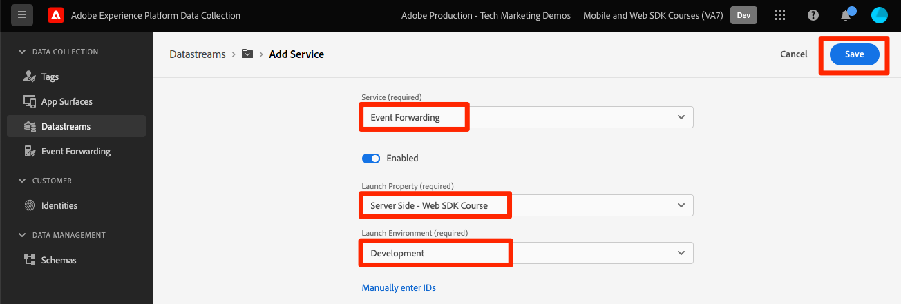
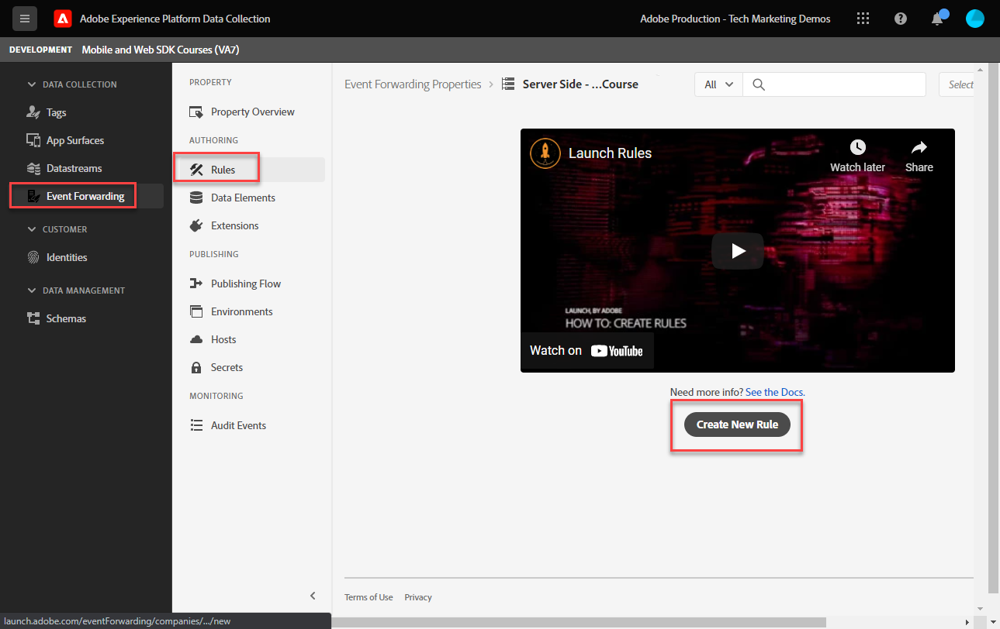

# 이벤트 전달 속성 설정

Experience Platform 웹 SDK 데이터를 사용하여 이벤트 전달 속성을 사용하는 방법을 알아봅니다.

이벤트 전달은 데이터 수집에서 사용할 수 있는 새로운 유형의 속성입니다. 이벤트 전달을 통해 기존 클라이언트측 브라우저 대신 Adobe Experience Platform Edge Network에서 바로 타사, Adobe이 아닌 공급업체에 데이터를 보낼 수 있습니다. 에서 이벤트 전달의 장점에 대해 자세히 알아보십시오 [이벤트 전달 개요](https://experienceleague.adobe.com/docs/experience-platform/tags/event-forwarding/overview.html?lang=en).

Adobe Experience Platform에서 이벤트 전달을 사용하려면 먼저 다음 세 가지 옵션 중 하나 이상을 사용하여 데이터를 Adobe Experience Platform Edge Network에 전송해야 합니다.

* [Adobe Experience Platform 웹 SDK](overview.md)
* [Adobe Experience Platform Mobile SDK](https://aep-sdks.gitbook.io/docs/)
<!--* [Server-to-Server API](https://experienceleague.adobe.com/docs/audience-manager/user-guide/api-and-sdk-code/dcs/dcs-apis/dcs-s2s.html?lang=en)-->

>[!NOTE]
>Platform Web SDK 및 Platform Mobile SDK는 태그를 통해 배포할 필요가 없지만 태그를 사용하여 이러한 SDK를 배포하는 것이 좋습니다.

이 자습서의 이전 단원을 완료한 후에는 웹 SDK를 사용하여 Platform Edge Network에 데이터를 전송해야 합니다. 데이터가 Platform Edge Network에 업로드되면 이벤트 전달을 활성화하고 이벤트 전달 속성을 사용하여 데이터를 Adobe이 아닌 솔루션으로 보낼 수 있습니다.

## 학습 목표

이 단원을 마치면 다음을 수행할 수 있습니다.

* 이벤트 전달 속성 만들기
* Platform Web SDK 데이터 스트림에 이벤트 전달 속성 연결
* 태그 속성 데이터 요소와 규칙 및 이벤트 전달 속성 데이터 요소와 규칙의 차이점을 파악합니다
* 이벤트 전달 데이터 요소 만들기
* 이벤트 전달 규칙 구성
* 이벤트 전달 속성의 유효성 검사가 데이터를 성공적으로 보내고 있습니다

## 전제 조건

* 이벤트 전달을 포함하는 소프트웨어 라이선스. 이벤트 전달은 데이터 수집에 대한 유료 기능입니다. 자세한 내용은 Adobe 계정 팀에 문의하십시오.
* Experience Cloud 조직에서 이벤트 전달을 사용하도록 설정했습니다.
* 이벤트 전달을 위한 사용자 권한. (In) [Admin Console](https://adminconsole.adobe.com/), Adobe Experience Platform Launch 제품 아래에 있는[!UICONTROL 플랫폼] > [!UICONTROL Edge] 모든 [!UICONTROL 속성 권한]). 일단 승인되면 [!UICONTROL 이벤트 전달] 데이터 수집 인터페이스의 왼쪽 탐색 영역에서 다음을 수행합니다.
   

* Edge Network에 데이터를 보내도록 구성된 Adobe Experience Platform Web 또는 Mobile SDK입니다. 이 자습서에서는 다음 단원을 완료해야 합니다.

   * 초기 구성

      * [권한 구성](configure-permissions.md)
      * [XDM 스키마 구성](configure-schemas.md)
      * [ID 네임스페이스 구성](configure-identities.md)
      * [데이터 스트림 구성](configure-datastream.md)
   * 태그 구성

      * [웹 SDK 확장 설치](install-web-sdk.md)
      * [데이터 요소 만들기](create-data-elements.md)
      * [태그 규칙 만들기](create-tag-rule.md)
      * [Adobe Experience Platform 디버거를 사용한 유효성 검사](validate-with-debugger.md)

## 이벤트 전달 속성 만들기

이벤트 전달 속성을 만들어 시작합니다.

1. 를 엽니다. [데이터 수집 인터페이스](https://experience.adobe.com/#/data-collection)
1. 선택 **[!UICONTROL 이벤트 전달]** 왼쪽 탐색에서
1. 선택 **[!UICONTROL 새 속성]**.
   

1. 속성 이름을 지정합니다. 이 경우 `Server-Side - Web SDK Course`

1. **[!UICONTROL 저장]**을 선택합니다.
   

## 데이터 스트림 구성

이벤트 전달에서 Edge 네트워크에 전송하는 데이터를 사용하려면 새로 만든 이벤트 전달 속성을 Adobe 솔루션으로 데이터를 전송하는 데 사용되는 동일한 데이터 스트림에 연결해야 합니다.

데이터 스트림에서 Target을 구성하려면:

1. 이동 [데이터 수집](https://experience.adobe.com/#/data-collection){target=&quot;blank&quot;} 인터페이스
1. 왼쪽 탐색에서 를 선택합니다 **[!UICONTROL 데이터 스트림]**
1. 앞에서 만든 을(를) 선택합니다 `Luma Web SDK` 데이터 스트림

   

1. 선택 **[!UICONTROL 서비스 추가]**

   
1. 선택 **[!UICONTROL 이벤트 전달]** 로서의 **[!UICONTROL 서비스]**

1. 아래에 **[!UICONTROL 속성 ID]** 드롭다운에서 이벤트 전달 속성에 지정한 이름(이 경우 )을 선택합니다 `Server-Side - Web SDK Course`

1. 아래에 **[!UICONTROL 환경 ID]** 드롭다운에서 이벤트 전달 환경을 연결할 태그 환경을 선택합니다(이 경우) `Development`

   >[!TIP]
   >
   >    Adobe 조직 외부의 이벤트 전달 환경에 데이터를 보내려면 을 선택합니다 **[!UICONTROL 수동으로 ID 입력]** 를 ID에 붙여넣습니다. 이벤트 전달 속성을 만들 때 ID가 제공됩니다.

1. **[!UICONTROL 저장]**&#x200B;을 선택합니다.

   

게시 흐름을 통해 변경 사항을 프로모션할 준비가 되면 스테이징 및 프로덕션 데이터 세트에 대해 이러한 단계를 반복합니다.

## Platform Edge 네트워크의 데이터를 Adobe이 아닌 솔루션으로 전달

이 연습에서는 이벤트 전달 데이터 요소를 설정하고, 이벤트 전달 규칙을 구성하고, 라는 타사 도구를 사용하여 유효성을 검사하는 방법을 알아봅니다. [Webhook.site](https://webhook.site/).

>[!NOTE]
>
>웹 후크는 서로 다른 시스템을 반영적으로 통합하는 방법입니다. [Webhook.site](https://webhook.site/) 는 들어오는 HTTP 요청이나 이메일을 손쉽게 검사, 테스트 및 자동화(시각적 사용자 지정 작업 빌더 또는 WebhookScript로)할 수 있는 타사 도구입니다.

>[!IMPORTANT]
>
>XDM 개체에 이미 데이터 요소를 만들고 매핑하고 태그 규칙을 구성하고 라이브러리 내에 해당 변경 사항을 태그 환경에 빌드해야 합니다. 없는 경우 다음을 참조하십시오. **태그 구성** 의 단계 [전제 조건](setup-event-forwarding.md#prerequisites) 섹션을 참조하십시오. 이러한 단계는 데이터가 Platform Edge Network에 전송되도록 하며, 여기에서 데이터를 Adobe이 아닌 솔루션에 전달하도록 이벤트 전달 속성을 구성할 수 있습니다.

### 이벤트 전달 데이터 요소 만들기

Platform Web SDK 태그 확장을 사용하여 이전에 구성한 XDM 개체는 이벤트 전달 속성의 데이터 요소에 대한 데이터 소스가 됩니다. 이벤트 전달을 위한 데이터 소스로 태그 속성에 이미 구성한 것과 동일한 데이터를 사용합니다.

>[!IMPORTANT]
>
>이벤트 전달의 XDM 필드를 다른 컨텍스트와 참조할 때 하나의 주요 구문 차이가 있습니다. 이벤트 전달 속성에서 데이터를 참조하려면 데이터 요소 경로에 `arc.event` 접두사:
>
> * `arc`는 Adobe 응답 컨텍스트를 나타냅니다.
> * 예: `arc.event.xdm.web.webPageDetails.URL`
>
>이 경로를 잘못 지정하면 데이터가 수집되지 않습니다.

이 연습에서는 브라우저 뷰포트 높이 및 Experience Cloud ID를 XDM 개체에서 웹 후크로 전달합니다. XDM 필드 경로는 [XDM 스키마 구성](configure-schemas.md) 단원.

>[!TIP]
>
>웹 브라우저 네트워크 도구를 사용하여 필터링하여 XDM 개체 경로를 찾을 수도 있습니다 `/ee` 요청, 비콘 열기 [!UICONTROL **페이로드**] 원하는 변수로 드릴다운할 수 있습니다. 마우스를 사용하여 마우스 오른쪽 단추를 클릭하고 &quot;속성 경로 복사&quot;를 선택합니다. 다음은 브라우저 뷰포트 높이의 예입니다.
> 

1. 로 이동합니다. **[!UICONTROL 이벤트 전달]** 최근에 만든 속성

1. 왼쪽 탐색에서 를 선택합니다 **[!UICONTROL 데이터 요소]**

1. 선택 **[!UICONTROL 새 데이터 요소 만들기]**

   

1. ****&#x200B;데이터 요소에 이름을 지정합니다 `environment.browserDetails.viewportHeight`

1. 아래 **[!UICONTROL 확장]**, 종료 `CORE`

1. 아래 **[!UICONTROL 데이터 요소 유형]**, 선택 `Path`

1. 브라우저 뷰포트 높이가 포함된 XDM 개체 경로를 입력합니다. `arc.event.xdm.environment.browserDetails.viewportHeight`

1. **[!UICONTROL 저장]**&#x200B;을 선택합니다

   

1. 다른 데이터 요소 만들기

1. **[!UICONTROL 이름]** it `ecid`

1. 아래 **[!UICONTROL 확장]**, 종료 `CORE`

1. 아래 **[!UICONTROL 데이터 요소 유형]**, 선택 `Path`

1. Experience Cloud ID가 포함된 XDM 개체 경로를 입력합니다 `arc.event.xdm.identityMap.ECID.0.id`

1. **[!UICONTROL 저장]**&#x200B;을 선택합니다

   

   >[!CAUTION]
   >
   > 에 를 포함해야 합니다 `arc.event.` 접두사를 추가합니다. 또한 XDM 개체 필드 이름으로 정확한 대/소문자를 따라야 합니다. ECID 네임스페이스는 모두 대문자로 입력해야 합니다.

   >[!TIP]
   자체 웹 사이트를 사용하여 작업하는 경우 웹 브라우저 네트워크 도구를 사용하여 XDM 개체 경로를 찾아 필터링할 수 있습니다. `/ee` 요청, 비콘 열기 [!UICONTROL **페이로드**] 원하는 변수로 드릴다운할 수 있습니다. 마우스를 사용하여 마우스 오른쪽 단추를 클릭하고 &quot;속성 경로 복사&quot;를 선택합니다. 다음은 브라우저 뷰포트 높이의 예입니다.
   

### Adobe 클라우드 커넥터 확장 설치

타사 위치로 데이터를 보내려면 먼저 을 설치합니다 [!UICONTROL Adobe 클라우드 커넥터] 확장.

1. 선택 **[!UICONTROL 확장]** 왼쪽 탐색

1. 을(를) 선택합니다 **[!UICONTROL 카탈로그]** 탭

1. 을 검색합니다. **[!UICONTROL Adobe 클라우드 커넥터]**, 선택 **[!UICONTROL 설치]**

   

확장 구성이 필요하지 않습니다. 이제 이 확장을 사용하여 데이터를 Adobe이 아닌 솔루션으로 전달할 수 있습니다.

### 이벤트 전달 규칙 만들기

태그 속성에서 규칙을 구성하는 것과 이벤트 전달 속성의 규칙 간에는 몇 가지 주요 차이점이 있습니다.

* **[!UICONTROL 이벤트] &amp; [!UICONTROL 조건]**:

   * **태그**: 모든 규칙은 규칙에 지정해야 하는 이벤트(예: `Library Loaded - Page Top`. 조건은 선택 사항입니다.
   * **이벤트 전달**: Platform Edge Network에 전송되는 모든 이벤트는 데이터를 전달하는 트리거로 간주됩니다. 따라서, [!UICONTROL 이벤트] 이벤트 전달 규칙에서 을 선택해야 합니다. 이벤트 전달 규칙을 트리거하는 이벤트를 관리하려면 조건을 구성해야 합니다.

* **데이터 요소 토큰화**:

   * **태그**: 데이터 요소 이름은 `%` 규칙에 사용할 때 데이터 요소 이름의 시작 및 끝 부분에 있는 히트입니다. 예: `%viewportHeight%`.

   * **이벤트 전달**: 데이터 요소 이름은 `{{` 시작 및 `}}` at the end of the data element name when used in a rule. 규칙에 사용할 때 데이터 요소 이름의 끝에 있습니다. 예: `{{viewportHeight}}`.

* **규칙 작업 순서**:

   * 이벤트 전달 규칙의 작업 섹션은 항상 순차적으로 실행됩니다. 규칙을 저장할 때 작업 순서가 올바른지 확인합니다. 이 실행 시퀀스는 태그를 사용할 수 있는 것처럼 비동기식으로 실행할 수 없습니다.

<!--
  * **Tags**: Rule actions can easily be reordered using drag-and-drop functionality.
  * **Event forwarding**: Rule actions are always executed sequentially. Make sure the order of actions is correct when you save a rule.
-->

웹 후크에 데이터를 전달하는 규칙을 구성하려면 먼저 개인 웹 후크를 확보해야 합니다.

1. 이동 [Webhook.site](https://webhook.site)

1. 찾기 **고유한 URL**&#x200B;를 입력하면 이벤트 전달 규칙에서 URL 요청으로 이 매개 변수를 사용할 수 있습니다

1. 선택 **[!UICONTROL 클립보드에 복사]**

1. Webhook로 캡처되는 실시간 이벤트 전달 데이터의 유효성을 확인할 수 있으므로 이 창을 열어 두십시오

   

1. 뒤로 이동 **[!UICONTROL 데이터 수집]** > **[!UICONTROL 이벤트 전달]** > **[!UICONTROL 규칙]** 왼쪽 탐색에서

1. 선택 **[!UICONTROL 새 규칙 만들기]**

   

1. 이름을 지정합니다 `all events - ad cloud connector - webhook`

1. 작업 추가

1. 아래 **[!UICONTROL 확장]**, 선택 **[!UICONTROL Adobe 클라우드 커넥터]**

1. 아래 **[!UICONTROL 작업 유형]**, 선택 **[!UICONTROL 가져오기 호출 만들기]**

1. 웹 후크 URL을 **[!UICONTROL URL]** 필드

   

1. 아래 **[쿼리 매개 변수]**, 이전에 만든 데이터 요소를 모두 추가합니다.

1. 설정 **[!UICONTROL 키]** 열 유형 `viewPortHeight`. 설정 **[!UICONTROL 값]** 열을 입력하고 `{{environment.browserDetails.viewportHeight}}` 데이터 요소에 입력하거나 데이터 요소 선택기 아이콘 에서 선택하여 데이터 요소를 지정합니다

1. 선택 [!UICONTROL **+ 다른 추가**] 다른 쿼리 매개 변수를 추가합니다.

1. 설정 **[!UICONTROL 키]** 열 유형 `ecid`. 값 열에서 `{{ecid}}` 데이터 요소

1. 선택 **[!UICONTROL 변경 내용 유지]**

   

1. 규칙은 아래와 같습니다

1. **[!UICONTROL 저장]**&#x200B;을 선택합니다

   

### 라이브러리 만들기 및 빌드

라이브러리를 만들고 평소대로 태그 속성에 이벤트 전달 개발 환경에 대한 모든 변경 사항을 작성합니다.

>[!NOTE]
스테이징 및 프로덕션 이벤트 전달 속성을 데이터 스트림에 연결하지 않은 경우 라이브러리를 빌드할 유일한 옵션으로 개발 환경이 표시됩니다.

## 이벤트 전달 규칙 유효성 검사

이제 Platform Debugger 및 Webhook.site를 사용하여 이벤트 전달 속성의 유효성을 확인할 수 있습니다.

1. 다음 절차를 따르십시오 [태그 라이브러리 전환](validate-with-debugger.md#use-the-experience-platform-debugger-to-map-to-your-tag-property) on [Luma 데모 사이트](https://luma.enablementadobe.com/content/luma/us/en/men.html) 를 데이터 스트림에 이벤트 전달 속성을 매핑한 웹 SDK 태그 속성에 추가합니다.

1. 페이지를 다시 로드하기 전에 Experience Platform Debugger에서 를 엽니다. **[!UICONTROL 로그]** 왼쪽 탐색에서

1. 을(를) 선택합니다 **[!UICONTROL Edge]** 탭을 선택하고 **[!UICONTROL Connect]** platform Edge Network 요청을 보려면

   

1. 페이지를 다시 로드합니다.

1. Platform Edge Network에서 WebHook로 보내는 서버측 요청을 가시성을 제공하는 추가 요청이 표시됩니다

1. 유효성 검사에 대한 포커스 요청은 Edge 네트워크에 의해 전송되는 전체 구성 URL을 보여주는 것입니다

   

1. viewPortHeight 및 ecid 쿼리 문자열 매개 변수를 확인합니다.

   

1. 이 변수는 XDM 개체에 표시된 데이터와 일치합니다

   

1. 마지막으로 데이터가 일치하는지 확인합니다. [Webhook.site](https://webhook.site) 또한 열려 있는 웹 후크 창을 통해

   

축하합니다! 이벤트 전달을 구성했습니다!

[다음: ](conclusion.md)

>[!NOTE]
Adobe Experience Platform Web SDK에 대한 학습에 시간을 내주셔서 감사합니다. 질문이 있거나 일반 피드백을 공유하거나 향후 컨텐츠에 대한 제안 사항이 있는 경우 해당 정보를 공유하십시오 [Experience League 커뮤니티 토론 게시물](https://experienceleaguecommunities.adobe.com/t5/adobe-experience-platform-launch/tutorial-discussion-implement-adobe-experience-cloud-with-web/td-p/444996)