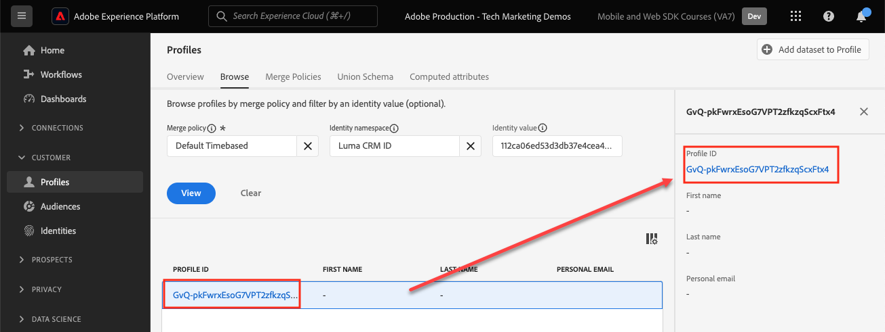

# Web SDK을 사용하여 Experience Platform에 데이터 스트리밍

Platform Web SDK를 사용하여 웹 데이터를 Adobe Experience Platform으로 스트리밍하는 방법을 알아봅니다.

Experience Platform은 Adobe Real-Time Customer Data Platform, Adobe Customer Journey Analytics 및 Adobe Journey Optimizer과 같은 모든 새로운 Experience Cloud 애플리케이션의 백본입니다. 이러한 애플리케이션은 Platform Web SDK을 최적의 웹 데이터 수집 방법으로 사용하도록 설계되었습니다.

Experience Platform은 이전에 만든 것과 동일한 XDM 스키마를 사용하여 Luma 웹 사이트에서 이벤트 데이터를 캡처합니다. 해당 데이터가 Platform Edge Network으로 전송되면 데이터 스트림 구성은 이 데이터를 Experience Platform으로 전달할 수 있습니다.

## 학습 목표

이 단원을 마치면 다음을 수행할 수 있습니다.

* Adobe Experience Platform 내에서 데이터 세트 만들기
* 웹 SDK 데이터를 Adobe Experience Platform으로 전송하도록 데이터 스트림 구성
* 실시간 고객 프로필에 대한 웹 데이터 스트리밍 활성화
* 데이터가 플랫폼 데이터 세트와 실시간 고객 프로필 모두에 도달했는지 확인
* 샘플 충성도 프로그램 데이터를 Platform에 수집
* 간단한 Platform 대상자 작성

## 전제 조건

이 단원을 완료하려면 먼저 다음 작업을 수행해야 합니다.

* Real-Time Customer Data Platform, Journey Optimizer 또는 Customer Journey Analytics과 같은 Adobe Experience Platform 애플리케이션에 액세스할 수 있습니다
* 이 자습서의 초기 구성 및 태그 구성 섹션에서 이전 단원을 완료합니다.

>[!NOTE]
>
>Platform 애플리케이션이 없는 경우 이 단원을 건너뛰거나 함께 읽을 수 있습니다.

## 데이터 세트 만들기

Adobe Experience Platform에 성공적으로 수집된 모든 데이터는 데이터 세트로 데이터 레이크 내에 유지됩니다. [dataset](https://experienceleague.adobe.com/ko/docs/experience-platform/catalog/datasets/overview)은(는) 데이터 수집을 위한 저장소 및 관리 구성이며, 일반적으로 스키마(열) 및 필드(행)를 포함하는 테이블입니다. 데이터 세트에는 저장하는 데이터의 다양한 측면을 설명하는 메타데이터도 포함됩니다.

Luma 웹 이벤트 데이터에 대한 데이터 세트를 설정해 보겠습니다.

1. [Experience Platform](https://experience.adobe.com/platform/) 또는 [Journey Optimizer](https://experience.adobe.com/journey-optimizer/) 인터페이스로 이동
1. 이 자습서에서 사용하는 개발 샌드박스에 있는지 확인합니다
1. 왼쪽 탐색에서 **[!UICONTROL 데이터 관리 > 데이터 세트]** 열기
1. **[!UICONTROL 데이터 집합 만들기]** 선택

   

1. **[!UICONTROL 스키마에서 데이터 집합 만들기]** 옵션 선택

   

1. `Luma Web Event Data`이전 단원[에서 만든 ](configure-schemas.md) 스키마를 선택한 후 **[!UICONTROL 다음]**&#x200B;을 선택합니다.

   

1. 데이터 집합에 대해 **[!UICONTROL 이름]** 및 선택적 **[!UICONTROL 설명]**&#x200B;을 제공하십시오. 이 연습에서는 `Luma Web Event Data`을(를) 사용한 다음 **[!UICONTROL 마침]**&#x200B;을 선택하세요.

   

이제 Platform Web SDK 구현에서 데이터 수집을 시작하도록 데이터 세트가 구성되었습니다.

## 데이터 스트림 구성

이제 [!UICONTROL Adobe Experience Platform]에 데이터를 보내도록 [!UICONTROL 데이터스트림]을 구성할 수 있습니다. 데이터 스트림은 태그 속성, Platform Edge Network 및 Experience Platform 데이터 세트 간의 링크입니다.

1. [데이터 수집](https://experience.adobe.com/#/data-collection){target="blank"} 인터페이스 열기
1. 왼쪽 탐색에서 **[!UICONTROL 데이터스트림]** 선택
1. [데이터 스트림 구성](configure-datastream.md) 단원 `Luma Web SDK`에서 만든 데이터 스트림을 엽니다.

   

1. **[!UICONTROL 서비스 추가]** 선택
   
1. **[!UICONTROL Adobe Experience Platform]**&#x200B;을(를) **[!UICONTROL 서비스]**(으)로 선택
1. `Luma Web Event Data`을(를) **[!UICONTROL 이벤트 데이터 세트]**(으)로 선택

1. **[!UICONTROL 저장]**&#x200B;을 선택합니다.

   

태그 속성에 매핑된 [Luma 데모 사이트](https://luma.enablementadobe.com/content/luma/us/en.html)에서 트래픽을 생성하면 데이터가 Experience Platform의 데이터 세트를 채웁니다!

## 데이터 세트 유효성 검사

이 단계는 데이터가 데이터 세트에 도달했는지 확인하는 데 중요합니다. 데이터 세트로 전송된 데이터의 유효성을 검사하는 데에는 두 가지 측면이 있습니다.

* [!UICONTROL Experience Platform Debugger]를 사용하여 유효성 검사
* [!UICONTROL 데이터 집합 미리 보기]를 사용하여 유효성 검사
* [!UICONTROL 쿼리 서비스]를 사용하여 유효성 검사

### Experience Platform Debugger

이러한 단계는 [Debugger 단원](validate-with-debugger.md)에서 수행한 단계와 거의 동일합니다. 그러나 데이터는 데이터 스트림에서 활성화한 후에만 Platform으로 전송되므로 더 많은 샘플 데이터를 생성해야 합니다.

1. [Luma 데모 사이트](https://luma.enablementadobe.com/content/luma/us/en.html)를 열고 [!UICONTROL Experience Platform 디버거] 확장 아이콘을 선택합니다.

1. *디버거를 사용하여 유효성 검사* 단원에서 설명한 대로 태그 속성을 [사용자](validate-with-debugger.md) 개발 환경에 매핑하도록 디버거를 구성합니다.

   

1. 자격 증명 `test@test.com`/`test`를 사용하여 Luma 사이트에 로그인합니다.

1. [Luma 홈 페이지](https://luma.enablementadobe.com/content/luma/us/en.html)로 돌아갑니다.

1. 디버거에 표시된 Platform Web SDK 네트워크 비콘 내에서 &quot;events&quot; 행을 선택하여 팝업에서 세부 정보를 확장합니다

   디버거의 

1. 팝업 내에서 &quot;identityMap&quot;을 검색합니다. 여기에는 authenticatedState, id 및 primary의 세 가지 키가 있는 lumaCrmId가 표시됩니다
   디버거의 

이제 데이터를 `Luma Web Event Data` 데이터 집합에 채워 &#39;데이터 집합 미리 보기&#39; 유효성 검사를 수행할 준비가 되었습니다.

### 데이터 세트 미리 보기

데이터가 플랫폼의 데이터 레이크에 도착했는지 확인하기 위해 **[!UICONTROL 데이터 집합 미리 보기]** 기능을 사용하는 것이 빠른 옵션입니다. 웹 SDK 데이터는 데이터 레이크에 마이크로 패치되고 정기적으로 플랫폼 인터페이스에서 새로 고쳐집니다. 생성한 데이터를 보려면 10~15분이 걸릴 수 있습니다.

1. [Experience Platform](https://experience.adobe.com/platform/) 인터페이스의 왼쪽 탐색에서 **[!UICONTROL 데이터 관리 > 데이터 세트]**&#x200B;를 선택하여 **[!UICONTROL 데이터 세트]** 대시보드를 엽니다.

   대시보드에는 조직에서 사용 가능한 모든 데이터 세트가 나열됩니다. 목록에 있는 각 데이터 세트에 대해 이름, 데이터 세트가 준수하는 스키마, 최근 수집 실행 상태 등 세부 정보가 표시됩니다.

1. `Luma Web Event Data` 데이터 세트를 선택하여 **[!UICONTROL 데이터 세트 활동]** 화면을 엽니다.

   

   활동 화면에는 사용 중인 메시지 비율을 시각화하는 그래프와 성공 및 실패 배치 목록이 포함되어 있습니다.

1. **[!UICONTROL 데이터 집합 활동]** 화면에서 화면 오른쪽 상단 근처에 있는 **[!UICONTROL 데이터 집합 미리 보기]**&#x200B;를 선택하여 최대 100개의 데이터 행을 미리 봅니다. 데이터 세트가 비어 있으면 미리보기 링크가 비활성화됩니다.

   

   미리보기 창에서 데이터 세트에 대한 스키마의 계층적 보기가 오른쪽에 표시됩니다.

   

### 데이터 쿼리

1. [Experience Platform](https://experience.adobe.com/platform/) 인터페이스의 왼쪽 탐색에서 **[!UICONTROL 데이터 관리 > 쿼리]**&#x200B;를 선택하여 **[!UICONTROL 쿼리]** 화면을 엽니다.
1. **[!UICONTROL 쿼리 만들기]** 선택
1. 먼저 쿼리를 실행하여 데이터 레이크에 있는 테이블의 모든 이름을 확인합니다. 쿼리 편집기에 `SHOW TABLES`을(를) 입력하고 재생 아이콘을 클릭하여 쿼리를 실행합니다.
1. 결과에서 표 이름이 `luma_web_event_data`과(와) 같은 방식인지 확인합니다.
1. 이제 테이블을 참조하는 간단한 쿼리를 사용하여 테이블을 쿼리합니다(기본적으로 쿼리는 100개의 결과로 제한됨). `SELECT * FROM "luma_web_event_data"`
1. 잠시 후에 웹 데이터의 샘플 레코드를 볼 수 있습니다.

>[!ERROR]
>
>&quot;프로비저닝되지 않은 테이블&quot; 오류가 발생하면 테이블 이름을 다시 확인합니다. 또한 데이터의 마이크로 배치가 아직 데이터 레이크에 도달하지 않았을 수 있습니다. 10-15분 후에 다시 시도하십시오.

>[!INFO]
>
>  Adobe Experience Platform의 쿼리 서비스에 대한 자세한 내용은 Platform 튜토리얼 섹션에서 [데이터 탐색](https://experienceleague.adobe.com/ko/docs/platform-learn/tutorials/queries/explore-data)을 참조하세요.

## 실시간 고객 프로필에 대한 데이터 세트 및 스키마 활성화

Real-Time Customer Data Platform 및 Journey Optimizer 고객의 경우 다음 단계는 실시간 고객 프로필에 대한 데이터 세트 및 스키마를 활성화하는 것입니다. 웹 SDK에서 데이터 스트리밍은 플랫폼으로 유입되는 여러 데이터 소스 중 하나이며 웹 데이터를 다른 데이터 소스와 결합하여 360도 고객 프로필을 빌드하려고 합니다. 실시간 고객 프로필에 대해 자세히 알아보려면 다음 짧은 비디오를 시청하십시오.

>[!VIDEO](https://video.tv.adobe.com/v/31709?learn=on&captions=kor)

>[!CAUTION]
>
>자체 웹 사이트 및 데이터를 사용하는 경우 실시간 고객 프로필에 활성화하기 전에 데이터에 대한 보다 강력한 유효성 검사를 사용하는 것이 좋습니다.

**데이터 집합을 사용하려면:**

1. 만든 데이터 집합 `Luma Web Event Data`을(를) 엽니다.

1. **[!UICONTROL 프로필 전환]**&#x200B;을(를) 선택하여 켜세요.

   

1. 데이터 집합을 **[!UICONTROL 사용]**&#x200B;할 것인지 확인하십시오.

   

**스키마를 사용하려면:**

1. 만든 스키마를 엽니다. `Luma Web Event Data`

1. **[!UICONTROL 프로필 전환]**&#x200B;을(를) 선택하여 켜세요.

   

1. **[!UICONTROL 이 스키마의 데이터는 identityMap 필드에 기본 ID를 포함합니다.]**

   >[!IMPORTANT]
   >
   >    실시간 고객 프로필로 전송되는 모든 레코드에는 기본 ID가 필요합니다. 일반적으로 ID 필드는 스키마 내에 레이블이 지정됩니다. 그러나 ID 맵을 사용할 때는 스키마 내에 ID 필드가 표시되지 않습니다. 이 대화 상자는 기본 ID를 염두에 두고 있으며 데이터를 전송할 때 ID 맵에서 이를 지정하도록 하기 위한 것입니다. 아시다시피 웹 SDK은 기본 기본 ID로 ECID(Experience Cloud ID)가 있는 ID 맵을 사용하고 가능한 경우 기본 ID로 인증된 ID를 사용합니다.

1. **[!UICONTROL 사용]** 선택

   

1. 업데이트된 스키마를 저장하려면 **[!UICONTROL 저장]**&#x200B;을 선택하십시오.

이제 스키마도 프로필에 대해 활성화됩니다.

>[!IMPORTANT]
>
>    프로필에 대해 스키마를 활성화하면 전체 샌드박스를 재설정하거나 삭제하지 않고 비활성화하거나 삭제할 수 없습니다. 또한 이 시점 이후에는 스키마에서 필드를 제거할 수 없습니다.
>
>   
> 자체 데이터로 작업할 때는 다음 순서로 수행하는 것이 좋습니다.
> 
> * 먼저 일부 데이터를 데이터 세트에 수집합니다.
> * 데이터 수집 프로세스 중에 발생하는 모든 문제(예: 데이터 유효성 검사 또는 매핑 문제)를 해결합니다.
> * 프로필에 대해 데이터 세트 및 스키마 활성화
> * 필요한 경우 데이터 다시 수집

### 프로필 유효성 검사

플랫폼 인터페이스(또는 Journey Optimizer 인터페이스)에서 고객 프로필을 조회하여 데이터가 실시간 고객 프로필에 도달했는지 확인할 수 있습니다. 이름에서 알 수 있듯이 프로필은 실시간으로 채워지므로 데이터 세트에서 데이터 유효성 검사가 이루어진 것과 같은 지연은 없습니다.

먼저 샘플 데이터를 더 생성해야 합니다. 태그 속성에 매핑될 때 이 단원의 이전 단계부터 반복하여 Luma 웹 사이트에 로그인합니다. Platform Web SDK 요청을 검사하여 `lumaCRMId`(으)로 데이터를 보내는지 확인하십시오.

1. [Experience Platform](https://experience.adobe.com/platform/) 인터페이스의 왼쪽 탐색에서 **[!UICONTROL 고객]** > **[!UICONTROL 프로필]**&#x200B;을 선택합니다

1. **[!UICONTROL ID 네임스페이스]**(으)로 `lumaCRMId` 사용
1. Experience Platform Debugger에서 검사한 호출에서 전달된 `lumaCRMId`의 값을 복사하여 붙여 넣습니다(이 경우 `b642b4217b34b1e8d3bd915fc65c4452`).

   

1. `lumaCRMId`에 대한 프로필에 유효한 값이 있으면 콘솔에 프로필 ID가 채워집니다.

   

1. 각 ID에 대한 전체 **[!UICONTROL 고객 프로필]**&#x200B;을 보려면 기본 창에서 **[!UICONTROL 프로필 ID]**&#x200B;을(를) 선택하십시오.

   >[!NOTE]
   >
   >참고 프로파일 ID의 하이퍼링크를 선택할 수도 있고, 행을 선택하면 프로파일 ID 하이퍼링크를 선택할 수 있는 오른쪽 메뉴가 열립니다
   > 

   여기에서 `lumaCRMId`과(와) 같이 `ECID`에 연결된 모든 ID를 볼 수 있습니다.

   

이제 Experience Platform(및 Real-Time CDP)용 Platform Web SDK을 활성화했습니다! 그리고 Journey Optimizer! 그리고 Customer Journey Analytics!)

## Edge 평가 대상 만들기

이 연습을 완료하는 것은 Real-Time Customer Data Platform 및 Journey Optimizer 고객에게 권장됩니다.

웹 SDK 데이터를 Adobe Experience Platform에 수집하면 Platform에 수집한 다른 데이터 소스에서 보강할 수 있습니다. 예를 들어 사용자가 Luma 사이트에 로그인하면 Experience Platform에서 ID 그래프가 생성되고 다른 모든 프로필 지원 데이터 세트가 잠재적으로 함께 결합되어 실시간 고객 프로필을 구축할 수 있습니다. 이 작업을 보려면 Real-Time Customer Data Platform 및 Journey Optimizer에서 실시간 고객 프로필을 사용할 수 있도록 몇 가지 샘플 충성도 데이터를 사용하여 Adobe Experience Platform에서 다른 데이터 세트를 빠르게 만듭니다. 그런 다음 이 데이터를 기반으로 대상을 작성합니다.

### 충성도 스키마 만들기 및 샘플 데이터 수집

이미 유사한 연습을 했기 때문에, 방법은 간단할 것입니다.

충성도 스키마를 만듭니다.

1. 새 스키마 만들기
1. **[!UICONTROL 개별 프로필]**&#x200B;을(를) [!UICONTROL 기본 클래스]&#x200B;(으)로 선택
1. 스키마 이름을 `Luma Loyalty Schema`로 지정합니다.
1. [!UICONTROL 충성도 세부 정보] 필드 그룹 추가
1. [!UICONTROL 인구 통계 세부 정보] 필드 그룹 추가
1. `Person ID` 필드를 선택하고 ID 네임스페이스[!UICONTROL 를 사용하여 &#x200B;]ID`Luma CRM Id` 및 [!UICONTROL 기본 ID]&#x200B;(으)로 표시합니다.
1. [!UICONTROL 프로필]에 대한 스키마를 사용하도록 설정하십시오. 프로필 토글을 찾을 수 없는 경우 왼쪽 상단의 스키마 이름을 클릭해 보십시오.
1. 스키마 저장

   

데이터 세트를 만들고 샘플 데이터를 수집하려면 다음을 수행하십시오.

1. `Luma Loyalty Schema`에서 새 데이터 세트 만들기
1. 데이터 집합 이름 `Luma Loyalty Dataset`
1. [!UICONTROL 프로필]에 대한 데이터 세트 활성화
1. 샘플 파일 [luma-loyalty-forWeb.json](assets/luma-loyalty-forWeb.json) 다운로드
1. 파일을 데이터 세트로 드래그 앤 드롭
1. 데이터가 성공적으로 수집되었는지 확인

   

### 활성-Edge 병합 정책 설정

모든 대상은 병합 정책으로 만들어집니다. 병합 정책은 프로필의 다양한 &quot;보기&quot;를 만들고, 데이터 세트의 하위 집합을 포함할 수 있으며, 서로 다른 데이터 세트가 동일한 프로필 속성에 기여할 때 우선 순위를 규정합니다. 에지에서 평가하려면 대상자가 **[!UICONTROL Active-On-Edge 병합 정책]** 설정을 갖는 병합 정책을 사용해야 합니다.

>[!IMPORTANT]
>
>샌드박스당 하나의 병합 정책만 **[!UICONTROL Active-On-Edge 병합 정책]** 설정을 가질 수 있습니다.

1. Experience Platform 또는 Journey Optimizer 인터페이스를 열고 자습서에 사용 중인 개발 환경에 있는지 확인합니다.
1. **[!UICONTROL 고객]** > **[!UICONTROL 프로필]** > **[!UICONTROL 병합 정책]** 페이지로 이동합니다.
1. **[!UICONTROL 기본 병합 정책]**(이름이 `Default Timebased`일 수 있음)을 엽니다.
   
1. **[!UICONTROL Active-On-Edge 병합 정책]** 설정 사용
1. **[!UICONTROL 다음]** 선택

   
1. 워크플로우의 다른 단계를 계속하려면 **[!UICONTROL 다음]**&#x200B;을(를) 계속 선택하고 설정을 저장하려면 **[!UICONTROL 마침]**&#x200B;을(를) 선택하십시오
   

이제 Edge에서 평가할 대상을 만들 수 있습니다.

### 대상자 만들기

대상자는 공통 트레이트를 중심으로 프로필을 함께 그룹화합니다. Real-Time CDP 또는 Journey Optimizer에서 사용할 수 있는 간단한 대상을 작성합니다.

1. Experience Platform 또는 Journey Optimizer 인터페이스에서 왼쪽 탐색 메뉴의 **[!UICONTROL 고객]** > **[!UICONTROL 대상]**(으)로 이동합니다.
1. **[!UICONTROL 대상자 만들기]** 선택
1. **[!UICONTROL 규칙 빌드]** 선택
1. **[!UICONTROL 만들기]** 선택

   

1. **[!UICONTROL 특성]** 선택
1. **[!UICONTROL 충성도]** > **[!UICONTROL 계층]** 필드를 찾아 **[!UICONTROL 특성]** 섹션으로 끌어옵니다.
1. 대상을 `tier`이(가) `gold`인 사용자로 정의합니다.
1. 대상 이름 `Luma Loyalty Rewards – Gold Status`
1. **[!UICONTROL Edge]**&#x200B;을(를) **[!UICONTROL 평가 메서드]**(으)로 선택
1. **[!UICONTROL 저장]** 선택

   

>[!NOTE]
>
> 기본 병합 정책을 **[!UICONTROL Active-On-Edge 병합 정책]**(으)로 설정했으므로 사용자가 만든 대상은 이 병합 정책과 자동으로 연결됩니다.

이는 매우 간단한 대상이므로 Edge 평가 방법을 사용할 수 있습니다. Edge 대상자는 에지에서 평가되므로 웹 SDK에서 Platform Edge Network으로 보낸 동일한 요청에서 대상 정의를 평가하고 사용자가 자격이 있는지 즉시 확인할 수 있습니다.

>[!NOTE]
>
>Adobe Experience Platform 웹 SDK에 대해 학습하는 데 시간을 투자해 주셔서 감사합니다. 질문이 있거나 일반적인 피드백을 공유하고 싶거나 향후 콘텐츠에 대한 제안이 있는 경우 이 [Experience League 커뮤니티 토론 게시물](https://experienceleaguecommunities.adobe.com/t5/adobe-experience-platform-data/tutorial-discussion-implement-adobe-experience-cloud-with-web/td-p/444996?profile.language=ko)에서 공유하십시오.
