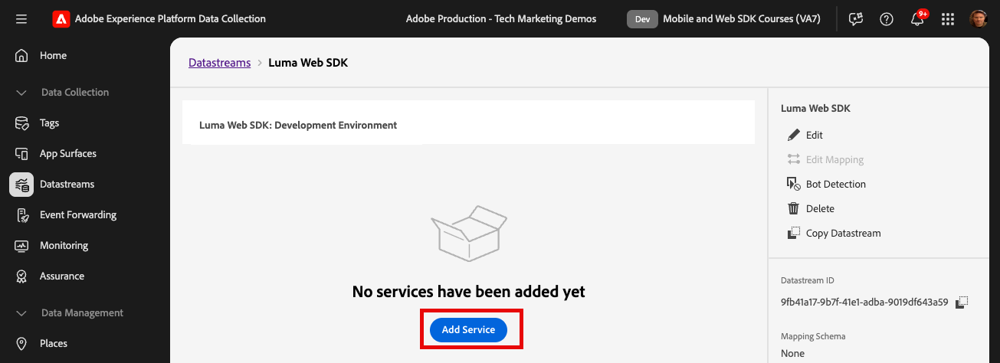

# Web SDK을 사용하여 Experience Platform에 데이터 스트리밍

Platform Web SDK를 사용하여 웹 데이터를 Adobe Experience Platform으로 스트리밍하는 방법을 알아봅니다.

Experience Platform은 Adobe Real-Time Customer Data Platform, Adobe Customer Journey Analytics 및 Adobe Journey Optimizer과 같은 모든 새로운 Experience Cloud 애플리케이션의 백본입니다. 이러한 애플리케이션은 Platform Web SDK을 최적의 웹 데이터 수집 방법으로 사용하도록 설계되었습니다.

Experience Platform은 이전에 만든 것과 동일한 XDM 스키마를 사용하여 Luma 웹 사이트에서 이벤트 데이터를 캡처합니다. 해당 데이터가 Platform Edge Network으로 전송되면 데이터 스트림 구성은 이 데이터를 Experience Platform으로 전달할 수 있습니다.

## 학습 목표

이 단원을 마치면 다음을 수행할 수 있습니다.

* Adobe Experience Platform 내에서 데이터 세트 만들기
* 웹 SDK 데이터를 Adobe Experience Platform으로 전송하도록 데이터 스트림 구성
* 실시간 고객 프로필에 대한 웹 데이터 스트리밍 활성화
* 데이터가 플랫폼 데이터 세트와 실시간 고객 프로필 모두에 도달했는지 확인
* 샘플 충성도 프로그램 데이터를 Platform에 수집
* 간단한 Platform 대상자 작성

## 전제 조건

이 단원을 완료하려면 먼저 다음 작업을 수행해야 합니다.

* Real-Time Customer Data Platform, Journey Optimizer 또는 Customer Journey Analytics과 같은 Adobe Experience Platform 애플리케이션에 액세스할 수 있습니다
* 이 자습서의 초기 구성 및 태그 구성 섹션에서 이전 단원을 완료합니다.

>[!NOTE]
>
>Platform 애플리케이션이 없는 경우 이 단원을 건너뛰거나 함께 읽을 수 있습니다.

## 데이터 세트 만들기

Adobe Experience Platform에 성공적으로 수집된 모든 데이터는 데이터 세트로 데이터 레이크 내에 유지됩니다. [dataset](https://experienceleague.adobe.com/ko/docs/experience-platform/catalog/datasets/overview)은(는) 데이터 수집을 위한 저장소 및 관리 구성이며, 일반적으로 스키마(열) 및 필드(행)를 포함하는 테이블입니다. 데이터 세트에는 저장하는 데이터의 다양한 측면을 설명하는 메타데이터도 포함됩니다.

Luma 웹 이벤트 데이터에 대한 데이터 세트를 설정해 보겠습니다.

1. [Experience Platform](https://experience.adobe.com/platform/) 또는 [Journey Optimizer](https://experience.adobe.com/journey-optimizer/) 인터페이스로 이동
1. 이 자습서에서 사용하는 개발 샌드박스에 있는지 확인합니다
1. 왼쪽 탐색에서 **[!UICONTROL 데이터 관리 > 데이터 세트]** 열기
1. **[!UICONTROL 데이터 집합 만들기]** 선택

   

1. **[!UICONTROL 스키마에서 데이터 집합 만들기]** 옵션 선택

   

1. `Luma Web Event Data`이전 단원[에서 만든 &#x200B;](configure-schemas.md) 스키마를 선택한 후 **[!UICONTROL 다음]**&#x200B;을 선택합니다.

   

1. 데이터 집합에 대해 **[!UICONTROL 이름]** 및 선택적 **[!UICONTROL 설명]**&#x200B;을 제공하십시오. 이 연습에서는 `Luma Web Event Data`을(를) 사용한 다음 **[!UICONTROL 마침]**&#x200B;을 선택하세요.

   

이제 Platform Web SDK 구현에서 데이터 수집을 시작하도록 데이터 세트가 구성되었습니다.

## 데이터 스트림 구성

이제 [!UICONTROL Adobe Experience Platform]에 데이터를 보내도록 [!UICONTROL 데이터스트림]을 구성할 수 있습니다. 데이터 스트림은 태그 속성, Platform Edge Network 및 Experience Platform 데이터 세트 간의 링크입니다.

1. [데이터 수집](https://experience.adobe.com/#/data-collection){target="blank"} 인터페이스 열기
1. 왼쪽 탐색에서 **[!UICONTROL 데이터스트림]** 선택
1. [데이터 스트림 구성](configure-datastream.md) 단원 `Luma Web SDK: Development Environment`에서 만든 데이터 스트림을 엽니다.

   

1. **[!UICONTROL 서비스 추가]** 선택
   
1. **[!UICONTROL Adobe Experience Platform]**&#x200B;을(를) **[!UICONTROL 서비스]**(으)로 선택
1. **[!UICONTROL 사용]** 선택
1. `Luma Web Event Data`을(를) **[!UICONTROL 이벤트 데이터 세트]**(으)로 선택

1. **[!UICONTROL 저장]** 선택

   

태그 속성에 매핑된 [Luma 데모 웹 사이트](https://luma.enablementadobe.com)에서 트래픽을 생성하면 데이터가 Experience Platform의 데이터 세트를 채웁니다!

## 데이터 세트 유효성 검사

이 단계는 데이터가 데이터 세트에 도달했는지 확인하는 데 중요합니다. 데이터 세트로 전송된 데이터의 경로를 확인하는 방법에는 여러 가지가 있습니다.

* [!UICONTROL Experience Platform Debugger]를 사용하여 유효성 검사
* [!UICONTROL Experience Platform Assurance]을(를) 사용하여 유효성 검사
* [!UICONTROL 데이터 집합 미리 보기]를 사용하여 유효성 검사
* [!UICONTROL 쿼리 서비스]를 사용하여 유효성 검사

### Debugger

이러한 단계는 [Debugger 단원](validate-with-debugger.md)에서 수행한 단계와 거의 동일합니다. 그러나 데이터는 데이터 스트림에서 활성화한 후에만 Platform으로 전송되므로 더 많은 샘플 데이터를 생성해야 합니다.

1. [Luma 데모 웹 사이트](https://luma.enablementadobe.com)를 열고 [!UICONTROL Experience Platform 디버거] 확장 아이콘을 선택합니다.

1. *디버거를 사용하여 유효성 검사* 단원에서 설명한 대로 태그 속성을 [사용자](validate-with-debugger.md) 개발 환경에 매핑하도록 디버거를 구성합니다.

   

1. 웹 사이트를 탐색합니다. 일부 제품을 보고 장바구니에 추가

1. 디버거에서 &quot;events&quot; 행을 열어 일부 XDM 변수를 찾습니다

데이터가 브라우저를 떠나 데이터스트림으로 전송되었는지 확인했습니다.

### Assurance

이제 데이터 스트림에서 서비스를 활성화했으므로 Assurance에서 볼 수 있는 것이 더 많습니다.

1. Assurance 세션을 열거나 새 세션을 시작합니다
1. **[!UICONTROL 데이터 스트림]** 이벤트 열기
1. 여기에서 이 단원의 앞부분에서 만든 데이터 스트림의 ID를 포함하여 Platform 서비스의 구성을 볼 수 있습니다.

   Assurance의 플랫폼에 대한 

1. **[!UICONTROL com.adobe.streaming.validation]** 공급업체에 속한 **[!UICONTROL generic]** 이벤트를 엽니다. 이는 요청이 XDM 데이터와 함께 데이터 세트로 전송되었음을 보여 줍니다

   

Platform Edge Network에서 요청을 수신하고 Platform 데이터 세트로 전달했음을 확인했습니다.

### 데이터 세트 미리 보기

이제 데이터 세트를 살펴보겠습니다. 빠른 옵션은 **[!UICONTROL 데이터 집합 미리 보기]** 기능을 사용하는 것입니다. 웹 SDK 데이터는 데이터 레이크에 마이크로 패치되고 정기적으로 플랫폼 인터페이스에서 새로 고쳐집니다. 생성한 데이터를 보려면 10~15분이 걸릴 수 있습니다.

1. [Experience Platform](https://experience.adobe.com/platform/) 인터페이스의 왼쪽 탐색에서 **[!UICONTROL 데이터 관리 > 데이터 세트]**&#x200B;를 선택하여 **[!UICONTROL 데이터 세트]** 대시보드를 엽니다.

   대시보드에는 조직에서 사용 가능한 모든 데이터 세트가 나열됩니다. 목록에 있는 각 데이터 세트에 대해 이름, 데이터 세트가 준수하는 스키마, 최근 수집 실행 상태 등 세부 정보가 표시됩니다.

1. `Luma Web Event Data` 데이터 세트를 선택하여 **[!UICONTROL 데이터 세트 활동]** 화면을 엽니다.

   

   활동 화면에는 사용 중인 메시지 비율을 시각화하는 그래프와 성공 및 실패 배치 목록이 포함되어 있습니다.
1. 이는 새 데이터 세트이므로 수집된 레코드가 있는 일괄 처리가 한 개만 표시되면 양수입니다.

1. **[!UICONTROL 데이터 집합 활동]** 화면에서 화면 오른쪽 상단 근처에 있는 **[!UICONTROL 데이터 집합 미리 보기]**&#x200B;를 선택하여 최대 100개의 데이터 행을 미리 봅니다. 데이터 세트가 비어 있으면 미리보기 링크가 비활성화됩니다.

   

1. 쿼리가 실행되어 데이터 집합에서 최근 100개의 데이터 행을 가져옵니다. web.webPageDetails.name과 같은 개별 XDM 필드로 드릴다운할 수 있습니다.

   

### 데이터 쿼리

데이터에 대해 사용자 정의 쿼리를 실행하여 데이터 수집의 유효성을 검사할 수도 있습니다.

1. [Experience Platform](https://experience.adobe.com/platform/) 인터페이스의 왼쪽 탐색에서 **[!UICONTROL 데이터 관리 > 쿼리]**&#x200B;를 선택하여 **[!UICONTROL 쿼리]** 화면을 엽니다.
1. **[!UICONTROL 쿼리 만들기]** 선택
1. 먼저 쿼리를 실행하여 데이터 레이크에 있는 테이블의 모든 이름을 확인합니다. 쿼리 편집기에 `SHOW TABLES`을(를) 입력하고 재생 아이콘을 클릭하여 쿼리를 실행합니다.
1. 결과에서 테이블 이름이 `luma_web_event_data`인지 확인합니다.
1. 이제 테이블을 참조하는 간단한 쿼리를 사용하여 테이블을 쿼리합니다(기본적으로 쿼리는 100개의 결과로 제한됨). `SELECT * FROM "luma_web_event_data"`
1. 잠시 후에 웹 데이터의 샘플 레코드를 볼 수 있습니다.

   

>[!ERROR]
>
>&quot;프로비저닝되지 않은 테이블&quot; 오류가 발생하면 테이블 이름을 다시 확인합니다. 또한 데이터의 마이크로 배치가 아직 데이터 레이크에 도달하지 않았을 수 있습니다. 10-15분 후에 다시 시도하십시오.

>[!INFO]
>
>  쿼리 서비스는 데이터 엔지니어와 분석가를 위한 매우 강력한 도구입니다. Adobe Experience Platform의 쿼리 서비스에 대한 자세한 내용은 Platform 튜토리얼 섹션에서 [데이터 탐색](https://experienceleague.adobe.com/ko/docs/platform-learn/tutorials/queries/explore-data)을 참조하세요.

>[!NOTE]
>
>Adobe Experience Platform 웹 SDK에 대해 학습하는 데 시간을 투자해 주셔서 감사합니다. 질문이 있거나 일반적인 피드백을 공유하고 싶거나 향후 콘텐츠에 대한 제안이 있는 경우 이 [Experience League 커뮤니티 토론 게시물](https://experienceleaguecommunities.adobe.com/adobe-experience-platform-18/tutorial-discussion-implement-adobe-experience-cloud-with-web-sdk-tutorial-248848?profile.language=ko)에서 공유하십시오.
