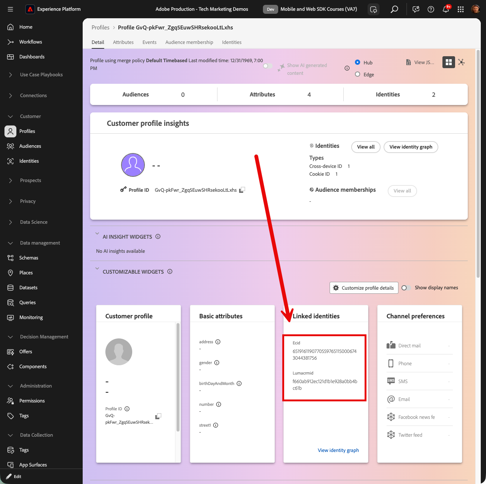
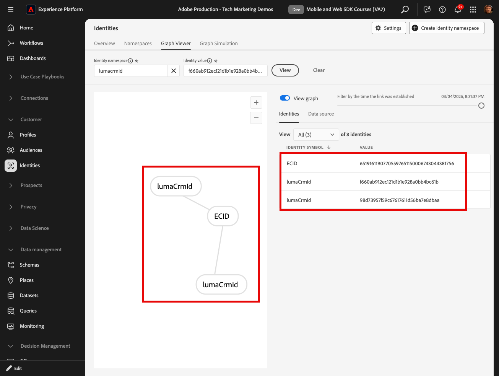
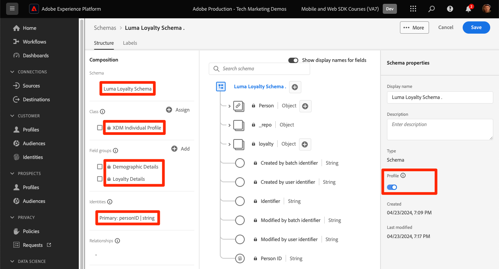

# 실시간 고객 프로필 및 Edge 세그멘테이션

## 실시간 고객 프로필에 대한 데이터 세트 및 스키마 활성화

Real-Time Customer Data Platform 및 Journey Optimizer 고객의 경우 다음 단계는 실시간 고객 프로필에 대한 데이터 세트 및 스키마를 활성화하는 것입니다. 웹 SDK에서 데이터 스트리밍은 플랫폼으로 유입되는 여러 데이터 소스 중 하나이며 웹 데이터를 다른 데이터 소스와 결합하여 360도 고객 프로필을 빌드하려고 합니다. 실시간 고객 프로필에 대해 자세히 알아보려면 다음 짧은 비디오를 시청하십시오.

>[!VIDEO](https://video.tv.adobe.com/v/31709?learn=on&captions=kor)

>[!CAUTION]
>
>자체 웹 사이트 및 데이터를 사용하는 경우 실시간 고객 프로필에 활성화하기 전에 데이터에 대한 보다 강력한 유효성 검사를 사용하는 것이 좋습니다.

### 스키마 활성화

프로필에 대해 스키마를 활성화하려면 다음을 수행하십시오.

1. 만든 스키마를 엽니다. `Luma Web Event Data`

1. **[!UICONTROL 프로필 전환]**&#x200B;을(를) 선택하여 켜세요.

   

1. **[!UICONTROL 이 스키마의 데이터는 identityMap 필드에 기본 ID를 포함합니다.]**

1. **[!UICONTROL 사용]** 선택

   

   >[!IMPORTANT]
   >
   >    실시간 고객 프로필로 전송되는 모든 레코드에는 기본 ID가 필요합니다. 각 레코드는 &quot;프로필 조각&quot;이 되며 기본 ID는 해당 조각을 조회하는 키입니다.
   > 
   > 일부 데이터 유형을 사용하면 스키마 내에 ID 필드에 레이블이 지정됩니다. 그러나 Experience Platform SDK에서 캡처한 이벤트 데이터를 사용하면 ID 맵이 일반적이고, 스키마 내에 ID 필드가 표시되지 않습니다.
   >
   > 이 대화 상자는 기본 ID를 염두에 두고 있으며 데이터를 전송할 때 ID 맵에 이를 지정하고, ID 그래프 연결 규칙을 사용하여 구성하거나 둘 다 수행하는지 확인하기 위한 것입니다. 둘 다 하시는 것이 좋습니다.
   >
   > 아시다시피 Luma 구현은 사용 가능한 경우 인증된 lumaCrmId와 함께 ID 맵을 기본 ID로 사용합니다. 그렇지 않으면 기본적으로 Experience Cloud ID(ECID)로 설정됩니다.

1. 업데이트된 스키마를 저장하려면 **[!UICONTROL 저장]**&#x200B;을 선택하십시오.

이제 스키마가 프로필에 대해 활성화됩니다.

### 데이터 세트 활성화

데이터 세트를 활성화하려면:

1. 만든 데이터 집합 `Luma Web Event Data`을(를) 엽니다.

1. **[!UICONTROL 프로필 전환]**&#x200B;을(를) 선택하여 켜세요.

   

1. 데이터 집합을 **[!UICONTROL 사용]**&#x200B;할 것인지 확인하십시오.

>[!IMPORTANT]
>
>  프로필에 대해 스키마를 활성화하고 데이터를 데이터 세트에 수집하면 전체 샌드박스를 재설정하거나 삭제하지 않고 비활성화하거나 삭제할 수 없습니다. 또한 데이터를 받은 필드는 이 시점 이후에 스키마에서 제거할 수 없습니다.
>
>   
> 자체 데이터로 작업할 때는 다음 순서로 수행하는 것이 좋습니다.
> 
> * 먼저 일부 데이터를 데이터 세트에 수집합니다.
> * 데이터 수집 프로세스 중에 발생하는 모든 문제(예: 데이터 유효성 검사 또는 매핑 문제)를 해결합니다.
> * 프로필에 대해 데이터 세트 및 스키마 활성화
> * 필요한 경우 데이터 다시 수집

### 프로필 유효성 검사

플랫폼 인터페이스(또는 Journey Optimizer 인터페이스)에서 고객 프로필을 조회하여 데이터가 실시간 고객 프로필에 도달했는지 확인할 수 있습니다. 이름에서 알 수 있듯이 프로필은 실시간으로 채워지므로 데이터 세트에서 데이터 유효성 검사가 이루어진 것과 같은 지연은 없습니다.

먼저 프로필 활성화 데이터 세트에 더 많은 샘플 데이터를 생성해야 합니다.

1. [Luma 데모 웹 사이트](https://luma.enablementadobe.com)를 열고 [!UICONTROL Experience Platform 디버거] 확장 아이콘을 선택합니다.

1. *디버거를 사용하여 유효성 검사* 단원에서 설명한 대로 태그 속성을 [사용자](validate-with-debugger.md) 개발 환경에 매핑하도록 디버거를 구성합니다.

   

1. 웹 사이트를 탐색합니다. 일부 제품을 보고 장바구니에 추가하십시오.

1. 자격 증명 `test@test.com`/`test`을(를) 사용하여 Luma 사이트에 로그인합니다. &quot;잘못된 이메일 또는 암호&quot;라는 메시지가 표시되면 해당 자격 증명으로 계정을 만듭니다.

1. 일부 XDM 변수를 찾으려면 &quot;events&quot; 행을 엽니다.
1. 팝업 내에서 &quot;identityMap&quot;을 검색합니다. 여기에서는 authenticatedState, id 및 primary의 세 가지 키가 있는 lumaCrmId가 표시됩니다. 이 로그인에 대한 lumaCrmId 값이 `f660ab912ec121d1b1e928a0bb4bc61b`인 방법을 참고하십시오.

   디버거의 

이제 Experience Platform에서 프로필을 찾아보겠습니다.

1. [Experience Platform](https://experience.adobe.com/platform/) 인터페이스의 왼쪽 탐색에서 **[!UICONTROL 고객]** > **[!UICONTROL 프로필]**&#x200B;을 선택합니다

1. **[!UICONTROL ID 네임스페이스]**(으)로 `Luma CRM ID` 사용
1. Experience Platform Debugger에서 검사한 호출에서 전달된 `lumaCrmId`의 값을 복사하여 붙여 넣습니다(이 경우 `f660ab912ec121d1b1e928a0bb4bc61b`).

1. 프로필에 `lumaCRMId`에 대한 유효한 값이 있는 경우, 프로필 ID가 콘솔에 채워집니다

1. 전체 **[!UICONTROL 고객 프로필]**&#x200B;을 보려면 **[!UICONTROL 보기]**&#x200B;를 선택하십시오.

   

1. 먼저 프로필의 요약을 볼 수 있습니다. 이 프로필에는 아직 많지 않지만, 프로필에 연결된 ID, `lumaCRMId` 및 `ECID`은(는) 다음과 같습니다.

   

1. 이때 사용할 수 있는 프로필 데이터의 대부분은 웹 활동의 이벤트 데이터입니다. 클릭스트림 데이터를 보려면 **[!UICONTROL 이벤트]**&#x200B;를 선택하십시오.

   

## 프로필 축소 방지

이제 그래프 콜라프라는 자체 구현에서 일어나기를 원하지 않는 것을 살펴보겠습니다.

### 문제 이해

먼저 문제를 확인할 수 있도록 몇 가지 샘플 데이터를 추가로 생성합니다.

1. 쿠키 또는 localStorage 개체를 삭제하지 않고 [Luma 데모 웹 사이트](https://luma.enablementadobe.com)를 열고 [!UICONTROL Experience Platform Debugger] 확장 아이콘을 선택합니다

1. *디버거를 사용하여 유효성 검사* 단원에서 설명한 대로 태그 속성을 [사용자](validate-with-debugger.md) 개발 환경에 매핑하도록 디버거를 구성합니다.

   

1. 자격 증명 `test@test.com`/`test`을(를) 사용하여 Luma 사이트에 로그인했기를 바랍니다. 그렇지 않으면 다시 로그인합니다.

1. 웹 사이트를 탐색합니다. 일부 제품을 보고 장바구니에 추가하십시오.

1. 이제 로그아웃하세요.

1. 이제 다시 로그인하여 다른 사용자(`spouse@test.com/test`)로 계정을 만듭니다. 두 사용자가 동일한 웹 브라우저를 공유하고, 동일한 웹 사이트에 인증하고, 동일한 `ECID` 값을 공유하는 &quot;공유 장치&quot; 시나리오를 복제하려고 합니다.
1. 디버거에서 `98d73957f59c67617611d56ba7e8dbaa`에 대해 다른 lumaCrmId `spouse@test.com/test`이(가) 있는지 확인합니다.

   

1. 일부 추가 제품 보기

이제 프로필을 다시 조회합니다.

1. `Luma CRM ID` 검색은 다시 `f660ab912ec121d1b1e928a0bb4bc61b`과(와) 같음
1. 이제 프로필이 두 개의 서로 다른 Luma CRM ID에 연결됩니다.

1. **[!UICONTROL ID 그래프 보기]** 선택

   

1. ID 그래프는 장치 공유로 인해 두 `lumaCrmId` 값이 공통 `ECID` 값으로 연결되는 이 프로필을 시각화하는 데 도움이 됩니다.

   

이는 Experience Platform 구현에 큰 문제가 될 수 있습니다. 두 사용자의 이벤트 데이터가 하나의 프로필에 결합되었을 뿐만 아니라 이러한 `lumaCrmId` 값을 사용하여 플랫폼에 수집된 다른 유형의 데이터도 병합됩니다.

### ID 그래프 연결 규칙으로 수정

그래프 축소 문제를 사전에 해결하려면 웹 SDK 구현을 활성화하기 전에 Adobe Experience Platform에서 ID 그래프 연결 규칙 기능을 사용하십시오.

>[!WARNING]
>
> 이러한 단계는 일반적으로 전체 플랫폼 구현을 관리하는 데이터 설계자에 의해 구성됩니다. 이 기능에는 여기에 표시된 것보다 훨씬 더 많은 것이 있으며 신중하게 시뮬레이션해야 하는 많은 복잡한 시나리오가 있습니다.
>
> 이 자습서를 완료한 후 삭제할 수 있는 전용 개발 샌드박스에서 이 자습서를 완료하는 경우에만 다음 단계를 완료하십시오. 샌드박스에 대한 이러한 변경 사항은 되돌릴 수 없습니다. 자세한 내용은 [ID 그래프 연결 규칙 자습서](https://experienceleague.adobe.com/ko/docs/platform-learn/tutorials/identities/graph-linking-rules/overview)를 참조하십시오.

ID 그래프 연결 규칙을 활성화하려면 다음을 수행합니다.

1. ID 화면에서 **[!UICONTROL 설정]**&#x200B;을 엽니다.

   

1. 모달에서 경고를 검토하고 **[!UICONTROL 진행]**&#x200B;을 선택하세요.
1. 목록에서 우선 순위가 가장 높은 네임스페이스가 되도록 `Luma CRM ID`을(를) 끌어옵니다.
1. **[!UICONTROL 에 대한]**&#x200B;그래프당 고유`Luma CRM ID` 설정을 확인하십시오.
1. **[!UICONTROL 다음]** 선택
   
1. 모달을 검토하고 **[!UICONTROL 확인]**
1. 시뮬레이션 단계를 건너뛰려면 **[!UICONTROL 다음]**&#x200B;을(를) 선택하십시오

   >[!WARNING]
   >
   > 전용 개발 샌드박스에서 작업하지 않는 경우 이러한 ID 설정을 활성화하기 위해 이 워크플로우를 완료하지 마십시오.

1. 샌드박스 이름을 입력하고 **[!UICONTROL 확인]**&#x200B;을 선택합니다.

   

24시간 후에 사이트로 돌아와 `test@test.com` 또는 `spouse@test.com`(으)로 다시 로그인하여 프로필이 분리되었는지 확인하십시오.

## Edge 평가 대상 만들기

이 연습을 완료하는 것은 Real-Time Customer Data Platform 및 Journey Optimizer 고객에게 권장됩니다.

웹 SDK 데이터를 Adobe Experience Platform에 수집하면 Platform에 수집한 다른 데이터 소스에서 보강할 수 있습니다. 예를 들어 사용자가 Luma 사이트에 로그인하면 Experience Platform에서 ID 그래프가 생성되고 다른 모든 프로필 지원 데이터 세트가 잠재적으로 함께 결합되어 실시간 고객 프로필을 구축할 수 있습니다. 이 작업을 보려면 Real-Time Customer Data Platform 및 Journey Optimizer에서 실시간 고객 프로필을 사용할 수 있도록 몇 가지 샘플 충성도 데이터를 사용하여 Adobe Experience Platform에서 다른 데이터 세트를 빠르게 만듭니다. 그런 다음 이 데이터를 기반으로 대상을 작성합니다.

### 충성도 스키마 만들기 및 샘플 데이터 수집

이미 유사한 연습을 했기 때문에, 방법은 간단할 것입니다.

충성도 스키마를 만듭니다.

1. 새 스키마 만들기
1. **[!UICONTROL 개별 프로필]**&#x200B;을(를) [!UICONTROL 기본 클래스]&#x200B;(으)로 선택
1. 스키마 이름을 `Luma Loyalty Schema`로 지정합니다.
1. [!UICONTROL 충성도 세부 정보] 필드 그룹 추가
1. [!UICONTROL 인구 통계 세부 정보] 필드 그룹 추가
1. `Person ID` 필드를 선택하고 ID 네임스페이스[!UICONTROL 를 사용하여 &#x200B;]ID`Luma CRM Id` 및 [!UICONTROL 기본 ID]&#x200B;(으)로 표시합니다.
1. [!UICONTROL 프로필]에 대한 스키마를 사용하도록 설정하십시오. 프로필 토글을 찾을 수 없는 경우 왼쪽 상단의 스키마 이름을 클릭해 보십시오.
1. 스키마 저장

   

데이터 세트를 만들고 샘플 데이터를 수집하려면 다음을 수행하십시오.

1. `Luma Loyalty Schema`에서 새 데이터 세트 만들기
1. 데이터 집합 이름 `Luma Loyalty Dataset`
1. [!UICONTROL 프로필]에 대한 데이터 세트 활성화
1. 샘플 파일 [luma-loyalty-forWeb.json](assets/luma-loyalty-forWeb.json) 다운로드
1. 파일을 데이터 세트로 드래그 앤 드롭
1. 데이터가 성공적으로 수집되었는지 확인

   

### 활성-Edge 병합 정책 설정

모든 대상은 병합 정책으로 만들어집니다. 병합 정책은 프로필의 다양한 &quot;보기&quot;를 만들고, 데이터 세트의 하위 집합을 포함할 수 있으며, 서로 다른 데이터 세트가 동일한 프로필 속성에 기여할 때 우선 순위를 규정합니다. 에지에서 평가하려면 대상자가 **[!UICONTROL Active-On-Edge 병합 정책]** 설정을 갖는 병합 정책을 사용해야 합니다.

>[!IMPORTANT]
>
>샌드박스당 하나의 병합 정책만 **[!UICONTROL Active-On-Edge 병합 정책]** 설정을 가질 수 있습니다.

1. Experience Platform 또는 Journey Optimizer 인터페이스를 열고 자습서에 사용 중인 개발 환경에 있는지 확인합니다.
1. **[!UICONTROL 고객]** > **[!UICONTROL 프로필]** > **[!UICONTROL 병합 정책]** 페이지로 이동합니다.
1. **[!UICONTROL 기본 병합 정책]**(이름이 `Default Timebased`일 수 있음)을 엽니다.
   
1. **[!UICONTROL Active-On-Edge 병합 정책]** 설정 사용
1. **[!UICONTROL 다음]** 선택

   
1. 워크플로우의 다른 단계를 계속하려면 **[!UICONTROL 다음]**&#x200B;을(를) 계속 선택하고 설정을 저장하려면 **[!UICONTROL 마침]**&#x200B;을(를) 선택하십시오
   

이제 Edge에서 평가할 대상을 만들 수 있습니다.

### 대상자 만들기

대상자는 공통 트레이트를 중심으로 프로필을 함께 그룹화합니다. Real-Time CDP 또는 Journey Optimizer에서 사용할 수 있는 간단한 대상을 작성합니다.

1. Experience Platform 또는 Journey Optimizer 인터페이스에서 왼쪽 탐색 메뉴의 **[!UICONTROL 고객]** > **[!UICONTROL 대상]**(으)로 이동합니다.
1. **[!UICONTROL 대상자 만들기]** 선택
1. **[!UICONTROL 규칙 빌드]** 선택
1. **[!UICONTROL 만들기]** 선택

   

1. **[!UICONTROL 특성]** 선택
1. **[!UICONTROL 충성도]** > **[!UICONTROL 계층]** 필드를 찾아 **[!UICONTROL 특성]** 섹션으로 끌어옵니다.
1. 대상을 `tier`이(가) `gold`인 사용자로 정의합니다.
1. 대상 이름 `Luma Loyalty Rewards – Gold Status`
1. **[!UICONTROL Edge]**&#x200B;을(를) **[!UICONTROL 평가 메서드]**(으)로 선택
1. **[!UICONTROL 저장]** 선택

   

>[!NOTE]
>
> 기본 병합 정책을 **[!UICONTROL Active-On-Edge 병합 정책]**(으)로 설정했으므로 사용자가 만든 대상은 이 병합 정책과 자동으로 연결됩니다.

이는 매우 간단한 대상이므로 Edge 평가 방법을 사용할 수 있습니다. Edge 대상자는 에지에서 평가되므로 웹 SDK에서 Platform Edge Network으로 보낸 동일한 요청에서 대상 정의를 평가하고 사용자가 자격이 있는지 즉시 확인할 수 있습니다.

>[!NOTE]
>
>Adobe Experience Platform 웹 SDK에 대해 학습하는 데 시간을 투자해 주셔서 감사합니다. 질문이 있거나 일반적인 피드백을 공유하고 싶거나 향후 콘텐츠에 대한 제안이 있는 경우 이 [Experience League 커뮤니티 토론 게시물](https://experienceleaguecommunities.adobe.com/adobe-experience-platform-18/tutorial-discussion-implement-adobe-experience-cloud-with-web-sdk-tutorial-248848?profile.language=ko)에서 공유하십시오.
