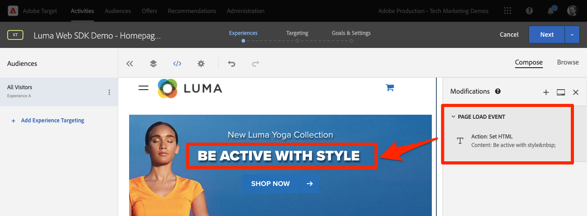

# Platform Web SDK으로 Adobe Target 설정

Adobe Experience Platform Web SDK를 사용하여 Adobe Target을 구현하는 방법을 알아봅니다. 경험을 제공하는 방법과 추가 매개변수를 Target에 전달하는 방법을 알아봅니다.

[Adobe Target](https://experienceleague.adobe.com/en/docs/target/using/target-home)은(는) 사용자의 웹 및 모바일 사이트, 앱 및 기타 디지털 채널의 매출을 극대화하도록 고객의 경험을 조정하고 개인화하는 데 필요한 모든 기능을 제공하는 Adobe Experience Cloud 애플리케이션입니다.


## 학습 목표

이 단원을 마치면 Target의 웹 SDK 구현으로 다음을 수행할 수 있습니다.

* 깜박임을 방지하기 위해 사전 숨김 코드 조각 추가
* Target 기능을 사용하도록 데이터 스트림 구성
* 시각적 경험 작성기 활동 렌더링
* 렌더링 양식 작성기 활동
* Target에 XDM 데이터 전달 및 Target 매개 변수에 대한 매핑 이해
* 프로필 및 엔티티 매개 변수와 같은 사용자 지정 데이터를 Target에 전달
* Target 구현의 유효성 검사
* 분석 요청과 개인화 요청 구분

>[!TIP]
>
>기존 at.js 구현을 마이그레이션하는 단계별 안내서는 [at.js 2.x에서 Platform Web SDK으로 Target 마이그레이션](/help/tutorial-migrate-target-websdk/introduction.md) 자습서를 참조하십시오.


## 전제 조건

이 섹션의 학습 내용을 완료하려면 먼저 다음을 수행해야 합니다.

* 데이터 요소 및 규칙 설정을 포함하여 Platform Web SDK의 초기 구성에 대한 모든 단원을 완료합니다.
* Adobe Target에 [편집자 또는 승인자 역할](https://experienceleague.adobe.com/en/docs/target/using/administer/manage-users/enterprise/properties-overview#section_8C425E43E5DD4111BBFC734A2B7ABC80)이 있는지 확인하십시오.
* Google Chrome 브라우저를 사용하는 경우 [시각적 경험 작성기 Helper 확장 기능](https://experienceleague.adobe.com/en/docs/target/using/experiences/vec/troubleshoot-composer/vec-helper-browser-extension)을 설치하십시오.
* Target에서 활동을 설정하는 방법을 이해할 수 있습니다. 새로 고침이 필요한 경우 다음 튜토리얼 및 안내서가 이 단원에 유용합니다.
   * [VEC(시각적 경험 작성기) Helper 확장 프로그램 사용](https://experienceleague.adobe.com/en/docs/target/using/experiences/vec/troubleshoot-composer/vec-helper-browser-extension)
   * [Visual Experience Composer 사용](https://experienceleague.adobe.com/en/docs/target-learn/tutorials/experiences/use-the-visual-experience-composer)
   * [양식 기반 경험 작성기 사용](https://experienceleague.adobe.com/en/docs/target-learn/tutorials/experiences/use-the-form-based-experience-composer)
   * [경험 타기팅 활동 만들기](https://experienceleague.adobe.com/ko/docs/target-learn/tutorials/activities/create-experience-targeting-activities)

## 깜박임 처리 추가

시작하기 전에 태그 라이브러리를 로드하는 방법에 따라 추가적인 플리커 처리 솔루션이 필요한지 여부를 결정합니다.

>[!NOTE]
>
>이 자습서에서는 태그 및 플리커 완화 기능이 비동기적으로 구현된 [Luma 웹 사이트](https://luma.enablementadobe.com/content/luma/us/en.html){target=_blank}를 사용합니다. 이 섹션은 Platform Web SDK에서 플리커 완화가 작동하는 방식을 이해하는 데 참조됩니다.


### 비동기 구현

태그 라이브러리가 비동기식으로 로드되면 Target이 기본 콘텐츠를 개인화된 콘텐츠로 대체하기 전에 페이지에서 렌더링을 완료할 수 있습니다. 이 동작으로 인해 개인화된 콘텐츠로 대체되기 전에 기본 콘텐츠가 잠깐 나타나는 &quot;깜박임&quot;이라고 하는 것이 나타날 수 있습니다. 이러한 깜박임을 방지하려면 Adobe에서는 비동기 태그 포함 코드 바로 앞에 특수 사전 숨김 코드 조각을 추가하는 것이 좋습니다.

이 코드 조각은 이미 Luma 사이트에 있지만 이 코드의 기능을 이해하기 위해 자세히 살펴보겠습니다.

```html
<script>
  !function(e,a,n,t){var i=e.head;if(i){
  if (a) return;
  var o=e.createElement("style");
  o.id="alloy-prehiding",o.innerText=n,i.appendChild(o),setTimeout(function(){o.parentNode&&o.parentNode.removeChild(o)},t)}}
  (document, document.location.href.indexOf("adobe_authoring_enabled") !== -1, ".personalization-container { opacity: 0 !important }", 3000);
</script>
```

코드 조각 사전 숨김은 선택한 항목의 CSS 정의가 있는 페이지 헤드에 스타일 태그를 만듭니다. 이 스타일 태그는 Target에서 응답을 받거나 시간 초과에 도달하면 제거됩니다.

사전 숨김 동작은 코드 조각의 맨 끝에서 두 가지 구성으로 제어됩니다.

* `body { opacity: 0 !important }`은(는) Target이 로드될 때까지 사전 숨김에 사용할 CSS 정의를 지정합니다. 기본적으로 전체 페이지가 숨겨집니다. 이 정의를 숨기려는 방법과 함께 미리 숨길 선택기로 업데이트할 수 있습니다. 이 값은 단순히 사전 숨김 스타일 태그에 삽입되기 때문에 여러 정의를 포함할 수 있습니다. 탐색 아래의 콘텐츠를 줄바꿈하는 쉽게 식별할 수 있는 컨테이너 요소가 있는 경우 이 설정을 사용하여 해당 컨테이너 요소로 사전 숨김을 제한할 수 있습니다.
* `3000`은(는) 사전 숨김에 대한 시간 제한(밀리초)을 지정합니다. 시간 초과 전에 Target에서 응답을 받지 못하면 사전 숨김 스타일 태그가 제거됩니다. 이 시간 제한에 도달하는 경우는 드뭅니다.

>[!NOTE]
>
>Platform Web SDK에 대한 사전 숨김 코드 조각은 Target at.js 라이브러리와 함께 사용되는 코드 조각과 약간 다릅니다. Platform Web SDK은 다른 스타일 ID `alloy-prehiding`을(를) 사용하므로 올바른 코드 조각을 사용하십시오. at.js에 대한 사전 숨김 코드 조각이 사용되는 경우 제대로 작동하지 않을 수 있습니다.

코드 조각 사전 숨김은 태그 내에서도 사용할 수 있습니다.

1. 태그의 **[!UICONTROL 확장]** 섹션으로 이동
1. Adobe Experience Platform Web SDK 확장 기능에 대해 **[!UICONTROL 구성]**&#x200B;을 선택합니다.
1. **[!UICONTROL 클립보드에 사전 숨김 코드 조각 복사]** 단추를 선택합니다.

   

   >[!NOTE]
   >
   >Platform Web SDK 확장에서 복사한 기본 사전 숨김 코드 조각에 사이트에 없는 CSS 정의(예: `.personalization-container { opacity: 0 !important }`)가 포함되어 있을 수 있습니다. 사전에 숨기는 코드 조각을 사이트에 맞게 확인하고 수정해야 합니다.

### 동기식 구현

Adobe에서는 Luma 사이트에 표시된 대로 태그를 비동기식으로 구현할 것을 권장합니다. 그러나 태그 라이브러리가 동기적으로 로드되는 경우 코드 조각 사전 숨김이 필요하지 않습니다. 대신, 사전 숨김 스타일은 Platform Web SDK 확장 설정에 지정됩니다.

동기 구현을 위한 사전 숨김 스타일은 다음과 같이 구성할 수 있습니다.

1. 태그의 **[!UICONTROL 확장]** 섹션으로 이동
1. Platform Web SDK 확장에 대한 **[!UICONTROL 구성]** 단추를 선택합니다.
1. **[!UICONTROL 사전 숨김 스타일 편집]** 단추 선택

   

1. 사용할 선택기 및 숨기기 메서드를 포함하도록 CSS를 수정합니다. 예를 들어 페이지의 전체 본문을 미리 숨기려면 `body { opacity: 0 !important }`을(를) 사용합니다.
1. 변경 사항을 저장하고 라이브러리에 빌드

>[!NOTE]
>
>사전 숨김 스타일 설정은 동기식 구현에만 사용됩니다. 태그의 비동기 구현을 사용하는 경우 이 스타일은 비워 두거나 주석 처리해야 합니다.

Platform Web SDK에서 플리커를 관리하는 방법에 대한 자세한 내용은 [개인화된 경험에 대한 플리커 관리](https://experienceleague.adobe.com/en/docs/experience-platform/edge/personalization/manage-flicker) 가이드 섹션을 참조하십시오.


## 데이터 스트림 구성

Platform Web SDK에서 Target 활동을 전달하려면 먼저 데이터 스트림 구성에서 Target을 활성화해야 합니다.

데이터 스트림에서 Target을 구성하려면 다음 작업을 수행하십시오.

1. [데이터 수집](https://experience.adobe.com/#/data-collection){target="blank"} 인터페이스로 이동
1. 왼쪽 탐색에서 **[!UICONTROL 데이터스트림]**&#x200B;을 선택합니다.
1. 이전에 만든 `Luma Web SDK: Development Environment` 데이터스트림 선택

   

1. **[!UICONTROL 서비스 추가]** 선택
   
1. **[!UICONTROL Adobe Target]**&#x200B;을(를) **[!UICONTROL 서비스]**(으)로 선택
1. 원하는 경우 아래 지침에 따라 Target 구현에 대한 선택적 세부 정보를 입력합니다.
1. **[!UICONTROL 저장]** 선택

   

### 속성 토큰

Target Premium 고객은 속성을 사용하여 사용자 권한을 관리할 수 있습니다. Target 속성을 사용하면 사용자가 Target 활동을 실행할 수 있는 경계를 설정할 수 있습니다. 자세한 내용은 Target 설명서의 [엔터프라이즈 권한](https://experienceleague.adobe.com/en/docs/target/using/administer/manage-users/enterprise/properties-overview) 섹션을 참조하십시오.

속성 토큰을 설정하거나 찾으려면 **Adobe Target** > **[!UICONTROL 관리]** > **[!UICONTROL 속성]**&#x200B;으로 이동합니다. `</>` 아이콘에 구현 코드가 표시됩니다. `at_property` 값은 데이터 스트림에서 사용할 속성 토큰입니다.


<a id="advanced-pto"></a>

데이터스트림당 하나의 속성 토큰만 지정할 수 있지만, 속성 토큰 재정의를 사용하면 데이터스트림에 정의된 기본 속성 토큰을 대체할 대체 속성 토큰을 지정할 수 있습니다. 데이터 스트림을 재정의하려면 `sendEvent` 작업에 대한 업데이트도 필요합니다.


### 대상 환경 ID

Target의 [환경](https://experienceleague.adobe.com/en/docs/target/using/administer/environments)을 사용하면 모든 개발 단계에서 구현을 관리할 수 있습니다. 이 선택적 설정은 각 데이터 스트림에 사용할 Target 환경을 지정합니다.

Adobe에서는 개발, 스테이징 및 프로덕션 데이터스트림마다 타겟 환경 ID를 다르게 설정하여 작업을 단순화할 것을 권장합니다. 또는 [호스트](https://experienceleague.adobe.com/en/docs/target/using/administer/hosts) 기능을 사용하여 Target 인터페이스에서 환경을 구성할 수 있습니다.

환경 ID를 설정하거나 찾으려면 **Adobe Target** > **[!UICONTROL 관리]** > **[!UICONTROL 환경]**&#x200B;으로 이동합니다.


>[!NOTE]
>
>Target 환경 ID를 지정하지 않으면 프로덕션 Target 환경으로 간주됩니다.

### Target 타사 ID 네임스페이스

이 선택적 설정을 사용하면 Target 타사 ID에 사용할 ID 기호를 지정할 수 있습니다. Target은 단일 ID 기호 또는 네임스페이스에서만 프로필 동기화를 지원합니다. 자세한 내용은 Target 안내서의 [mbox3rdPartyId에 대한 실시간 프로필 동기화](https://experienceleague.adobe.com/en/docs/target/using/audiences/visitor-profiles/3rd-party-id) 섹션을 참조하십시오.

ID 기호는 **데이터 수집** > **[!UICONTROL 고객]** > **[!UICONTROL ID]**&#x200B;의 ID 목록에서 찾을 수 있습니다.


Luma 사이트를 사용하는 이 자습서에서는 [ID](configure-identities.md)에 대한 단원 중에 설정된 ID 기호 `lumaCrmId`을(를) 사용하십시오.


## 시각적 개인화 결정 렌더링

시각적 개인화 결정은 Adobe Target의 시각적 경험 작성기에서 만들어진 경험을 참조합니다. 먼저 Target 및 태그 인터페이스에 사용되는 용어를 이해해야 합니다.

* **활동**: 하나 이상의 대상에 타깃팅된 경험 집합입니다. 예를 들어, 간단한 A/B 테스트는 두 개의 경험이 있는 활동일 수 있습니다.
* **경험**: 하나 이상의 위치 또는 결정 범위에 타깃팅된 작업 집합입니다.
* **결정 범위**: Target 경험이 제공되는 위치입니다. 이전 버전의 Target 사용에 익숙한 경우 결정 범위는 &quot;mbox&quot;와 동일합니다.
* **Personalization 결정**: 서버에서 결정하는 작업을 적용해야 합니다. 이러한 결정은 대상 기준 및 Target 활동 우선 순위를 기반으로 할 수 있습니다.
* **제안**: Platform Web SDK 응답에서 전달되는 서버의 결정 결과입니다. 예를 들어 배너 이미지를 교체하는 것이 좋습니다.

### [!UICONTROL 이벤트 보내기] 동작 업데이트

Target이 데이터 스트림에서 활성화된 경우 Target의 시각적 개인화 결정은 Platform 웹 SDK에 의해 전달됩니다. 그러나 _자동으로 렌더링되지 않습니다_. 자동 렌더링을 사용하려면 [!UICONTROL 이벤트 보내기] 작업을 업데이트해야 합니다.

1. [데이터 수집](https://experience.adobe.com/#/data-collection){target="blank"} 인터페이스에서 이 자습서에 사용하는 태그 속성을 엽니다
1. `all pages - library loaded - send event - 50` 규칙 열기
1. `Adobe Experience Platform Web SDK - Send event` 액션 선택
1. 확인란을 사용하여 **[!UICONTROL 시각적 개인화 결정 렌더링]** 활성화

   

<!--
1. In the **[!UICONTROL Datastream configuration overrides**] the **[!UICONTROL Target Property Token]** can be overridden either as a static value or with a data element. Only property tokens defined in the [**Advanced Property Token Overrides**](#advanced-pto) section in **Datastream Configuration** will return results.
   
   
   -->

1. 변경 사항을 저장한 다음 라이브러리에 빌드

시각적 개인화 결정 렌더링 설정을 사용하면 Platform Web SDK에서 Target 시각적 경험 작성기 또는 &quot;글로벌 mbox&quot;를 사용하여 지정된 수정 사항을 자동으로 적용합니다.

>[!NOTE]
>
>일반적으로 [!UICONTROL 시각적 개인화 결정 렌더링] 설정은 전체 페이지 로드당 단일 이벤트 전송 작업에 대해서만 활성화되어야 합니다. 여러 이벤트 보내기 작업에서 이 설정이 활성화되어 있으면 후속 렌더링 요청이 무시됩니다.

사용자 지정 코드를 사용하여 직접 이러한 결정에 대해 렌더링하거나 작업을 수행하려는 경우 [!UICONTROL 시각적 개인화 결정 렌더링] 설정을 사용하지 않도록 설정할 수 있습니다. Platform Web SDK은 유연하며 완벽한 제어 기능을 제공합니다. [개인화된 콘텐츠를 수동으로 렌더링](https://experienceleague.adobe.com/en/docs/experience-platform/edge/personalization/rendering-personalization-content)하는 방법에 대한 자세한 내용은 안내서를 참조하세요.


### 시각적 경험 작성기로 Target 활동 설정

이제 기본 구현 부분이 완료되었으므로 Target에서 XT(경험 타깃팅) 활동을 만들어 모든 것이 올바르게 작동하는지 확인하십시오. 도움이 필요한 경우 Target 자습서에서 [경험 타깃팅 활동 만들기](https://experienceleague.adobe.com/ko/docs/target-learn/tutorials/activities/create-experience-targeting-activities)를 참조할 수 있습니다.

>[!NOTE]
>
>Google Chrome을 브라우저로 사용하는 경우 VEC에서 편집할 사이트를 제대로 로드하려면 [VEC(시각적 경험 작성기) Helper 확장 프로그램](https://experienceleague.adobe.com/en/docs/target/using/experiences/vec/troubleshoot-composer/vec-helper-browser-extension)이 필요합니다.

1. Adobe Target 인터페이스로 이동합니다
1. 활동 URL에 대한 Luma 홈 페이지를 사용하여 경험 타깃팅 (XT) 활동을 만듭니다

   

1. 예를 들어 홈 페이지 영웅 배너의 텍스트를 변경하는 등 페이지를 수정합니다.  완료되면 **[!UICONTROL 저장]**&#x200B;을 선택한 후 **[!UICONTROL 다음]**&#x200B;을 선택하십시오.

   

1. 이벤트 이름을 업데이트한 다음 **[!UICONTROL 다음]**&#x200B;을 선택합니다.

   

1. 적절한 보고서 세트를 가진 보고 소스로 Adobe Analytics 를 선택하고 목표로 주문 지표를 선택합니다

   

   >[!NOTE]
   >
   >Adobe Analytics을 사용하지 않는 경우 보고 소스로 Target을 선택하고 대신 **참여 > 페이지 보기 수**&#x200B;와 같은 다른 지표를 선택합니다. 활동을 저장하고 미리 보려면 목표 지표가 필요합니다.

1. 활동 저장
1. 변경 사항이 익숙하다면 활동을 활성화할 수 있습니다. 활성화하지 않고 환경을 미리 보려면 [QA 미리 보기 URL](https://experienceleague.adobe.com/en/docs/target/using/activities/activity-qa/activity-qa)을(를) 복사할 수 있습니다.
1. Luma 홈 페이지를 로드하면 변경 사항이 적용된 것을 볼 수 있습니다
1. 몇 시간 후에 Adobe Analytics에서 Target 활동 데이터 및 전환을 볼 수 있습니다. [Analytics for Target(A4T) 보고](https://experienceleague.adobe.com/en/docs/target/using/integrate/a4t/reporting)에 대한 자세한 내용은 Target 안내서를 참조하십시오.


### 디버거를 사용하여 유효성 검사

활동을 설정하면 콘텐츠가 페이지에 렌더링됩니다. 그러나 활성 상태인 활동이 없어도 이벤트 보내기 네트워크 호출을 보고 Target이 제대로 구성되었는지 확인할 수 있습니다.

>[!CAUTION]
>
>Google Chrome을 사용하고 있고 [VEC(시각적 경험 작성기) Helper 확장 프로그램](https://experienceleague.adobe.com/en/docs/target/using/experiences/vec/troubleshoot-composer/vec-helper-browser-extension)이 설치되어 있는 경우 **Target 라이브러리 삽입** 설정이 비활성화되어 있는지 확인하십시오. 이 설정을 활성화하면 추가 Target 요청이 발생합니다.

1. Adobe Experience Platform Debugger 브라우저 확장 열기
1. [Luma 데모 사이트](https://luma.enablementadobe.com/content/luma/us/en.html)&#x200B;(으)로 이동하여 디버거를 사용하여 [사이트의 태그 속성을 자신의 개발 속성으로 전환](validate-with-debugger.md#use-the-experience-platform-debugger-to-map-to-your-tags-property)합니다.
1. 페이지 다시 로드
1. 디버거에서 **[!UICONTROL 네트워크]** 도구 선택
1. **[!UICONTROL Experience Platform Web SDK]**&#x200B;로 필터링
1. 첫 번째 호출에 대한 이벤트 행의 값을 선택합니다.

   

1. `query` > `personalization` 아래에 키가 있고 `decisionScopes`의 값은 `__view__`입니다. 이 범위는 `target-global-mbox`과(와) 같습니다. 이 Platform 웹 SDK 호출은 Target에서 결정을 요청했습니다.

   

1. 오버레이를 닫고 두 번째 네트워크 호출에 대한 이벤트 세부 정보를 선택합니다. 이 호출은 Target이 활동을 반환한 경우에만 표시됩니다.
1. Target에서 반환된 활동 및 경험에 대한 세부 사항이 있습니다. 이 Platform 웹 SDK 호출은 Target 활동이 사용자에게 렌더링되었다는 알림을 보내고 노출이 증가합니다.

   

## 사용자 지정 결정 범위 설정 및 렌더링

사용자 지정 결정 범위(이전의 &quot;mbox&quot;)는 Target 양식 기반 경험 작성기를 사용하여 구조화된 방식으로 HTML 또는 JSON 콘텐츠를 전달하는 데 사용할 수 있습니다. 이러한 사용자 지정 범위 중 하나에 전달된 콘텐츠는 Platform Web SDK에서 자동으로 렌더링되지 않습니다. Tags의 작업을 사용하여 렌더링할 수 있습니다.

### [!UICONTROL 이벤트 보내기 작업]에 범위 추가

페이지 로드 규칙을 수정하여 사용자 지정 결정 범위를 추가합니다.

1. `all pages - library loaded - send event - 50` 규칙 열기
1. `Adobe Experience Platform Web SDK - Send Event` 액션 선택
1. 사용할 범위를 하나 이상 추가합니다. 이 예제에서는 `homepage-hero`을(를) 사용합니다.

   

1. 변경 사항을 저장하고 라이브러리에 빌드

>[!TIP]
>
>이 자습서에서는 데모용으로 수동으로 정의된 단일 범위를 사용합니다. 특정 페이지에 사용할 수 있는 여러 결정 범위를 사용하려는 경우 페이지 경로에 따라 조건 적으로 범위 배열을 반환하는 데이터 요소를 사용하는 것이 좋습니다. 이 접근 방식은 구현을 단순하고 확장 가능하게 유지하는 데 도움이 됩니다.

### Target의 응답을 처리합니다.

`homepage-hero` 범위에 대한 콘텐츠를 요청하도록 Platform Web SDK을 구성했으므로 응답을 사용하여 작업을 수행해야 합니다. Platform Web SDK 태그 확장은 [!UICONTROL 이벤트 보내기] 작업의 응답을 받을 때 새 규칙을 즉시 트리거하는 데 사용할 수 있는 [!UICONTROL 이벤트 보내기 완료] 이벤트를 제공합니다.

1. `homepage - send event complete - render homepage-hero`(이)라는 규칙을 만듭니다.
1. 규칙에 이벤트를 추가합니다. **Adobe Experience Platform Web SDK** 확장 및 **[!UICONTROL 이벤트 보내기 완료]** 이벤트 유형을 사용하십시오.
1. Luma 홈 페이지(쿼리 문자열이 없는 경로는 `/content/luma/us/en.html`과(와) 같음)에 규칙을 제한하는 조건을 추가합니다.
1. 규칙에 작업을 추가합니다. **Adobe Experience Platform Web SDK** 확장 및 **제안 적용** 작업 유형을 사용하십시오.

   

   >[!TIP]
   >
   >기본 이름을 사용하는 대신 규칙 이벤트, 조건 및 작업에 설명 이름을 지정합니다. 강력한 규칙 구성 요소 이름을 사용하면 검색 결과를 더욱 유용하게 사용할 수 있습니다.

1. 이 규칙의 트리거로 &quot;이벤트 완료 보내기&quot; 이벤트를 사용할 때 제안 필드에 `%event.propositions%`을(를) 입력합니다.
1. &quot;제안 메타데이터&quot; 섹션에서 **[!UICONTROL 양식 사용]**&#x200B;을 선택합니다.
1. **[!UICONTROL 범위]** 필드 입력 `homepage-hero`에 대한
1. **[!UICONTROL Selector]** 필드 입력 `div.heroimage`
1. **[!UICONTROL 작업 유형]**&#x200B;에 대해 **[!UICONTROL HTML 설정]**&#x200B;을 선택합니다.
1. **[!UICONTROL 변경 내용 유지]** 선택

   

   활동을 렌더링하는 것 외에도 양식 기반 활동이 렌더링되었음을 나타내기 위해 Target을 추가로 호출해야 합니다.

1. 규칙에 다른 작업을 추가합니다. **Core** 확장 및 **[!UICONTROL 사용자 지정 코드]** 작업 유형 사용:
1. 다음 JavaScript 코드를 붙여넣습니다.

   ```javascript
   var propositions = event.propositions;
   var heroProposition;
   if (propositions) {
      // Find the hero proposition, if it exists.
      for (var i = 0; i < propositions.length; i++) {
         var proposition = propositions[i];
         if (proposition.scope === "homepage-hero") {
            heroProposition = proposition;
            break;
         }
      }
   }
   // Send a "display" event
   if (heroProposition !== undefined){
      alloy("sendEvent", {
         xdm: {
            eventType: "display",
            _experience: {
               decisioning: {
                  propositions: [{
                     id: heroProposition.id,
                     scope: heroProposition.scope,
                     scopeDetails: heroProposition.scopeDetails
                  }]
               }
            }
         }
      });
   }
   ```

   

1. **[!UICONTROL 변경 내용 유지]** 선택

1. 변경 사항을 저장하고 라이브러리에 빌드
1. Luma 홈 페이지를 몇 번 로드하십시오. 이 정도면 Target 인터페이스에 새 `homepage-hero` 결정 범위를 등록할 수 있습니다.


### 양식 기반 경험 작성기로 Target 활동 설정

이제 사용자 지정 결정 범위를 수동으로 렌더링하는 규칙이 있으므로 Target에서 다른 XT(경험 타깃팅) 활동을 만들 수 있습니다. 이번에는 양식 기반 경험 작성기를 사용합니다.

1. [Adobe Target](https://experience.adobe.com/target) 열기
1. 이전 단원에 사용된 활동 비활성화
1. 양식 기반 경험 작성기 선택 사항을 사용하여 경험 타깃팅 (XT) 활동 만들기

   

1. 위치 드롭다운에서 **`homepage-hero`** 위치를 선택하고 컨텐츠 드롭다운에서 **[!UICONTROL HTML 오퍼 만들기]**&#x200B;를 선택합니다. 위치를 사용할 수 없는 경우 입력할 수 있습니다. Target은 해당 위치 또는 범위에 대한 요청을 받은 후 정기적으로 새 위치 이름을 채웁니다.

   

1. 다음 코드를 콘텐츠 상자에 붙여 넣습니다. 이 코드는 다른 배경 이미지가 있는 기본 영웅 배너입니다.

   ```html
   <div class="we-HeroImage jumbotron" style="background-image: url('/content/luma/us/en/women/_jcr_content/root/hero_image.coreimg.jpeg');">
      <div class="container cq-dd-image">
         <div class="we-HeroImage-wrapper">
            <p class="h3">New Luma Yoga Collection</p>
            <strong class="we-HeroImage-title h1">Be active with style&nbsp;</strong>
            <p>
               <a class="btn btn-primary btn-action" href="/content/luma/us/en/products.html" role="button">Shop Now</a>
            </p>
         </div>
      </div>
   </div>
   ```

1. [!UICONTROL 목표 및 설정] 단계에서 보고 소스로 Adobe Target을 선택하고 목표로 [!UICONTROL 참여] > [!UICONTROL 페이지 보기]를 선택합니다
1. 활동 저장
1. 변경 사항이 익숙하다면 활동을 활성화할 수 있습니다. 활성화하지 않고 환경을 미리 보려면 [QA 미리 보기 URL](https://experienceleague.adobe.com/en/docs/target/using/activities/activity-qa/activity-qa)을(를) 복사할 수 있습니다.
1. Luma 홈 페이지를 로드하면 변경 사항이 적용된 것을 볼 수 있습니다

>[!NOTE]
>
>&quot;mbox를 클릭함&quot; 전환 목표가 자동으로 작동하지 않습니다. Platform Web SDK은 사용자 지정 범위를 자동으로 렌더링하지 않으므로 콘텐츠를 적용하기 위해 선택한 위치에 대한 클릭 수를 추적하지 않습니다. `sendEvent` 작업을 사용하여 적용 가능한 `_experience` 세부 정보와 함께 &quot;클릭&quot; `eventType`을(를) 사용하여 각 범위에 대한 고유한 클릭 추적을 만들 수 있습니다.

### 디버거를 사용하여 유효성 검사

활동을 활성화한 경우 페이지에 콘텐츠가 렌더링되는 것을 볼 수 있습니다. 그러나 활성 상태의 활동이 없더라도 [!UICONTROL 이벤트 보내기] 네트워크 호출을 확인하여 Target이 사용자 지정 범위에 대한 콘텐츠를 요청하고 있는지 확인할 수도 있습니다.

1. Adobe Experience Platform Debugger 브라우저 확장 프로그램 열기
1. [Luma 데모 사이트](https://luma.enablementadobe.com/content/luma/us/en.html)&#x200B;(으)로 이동하여 디버거를 사용하여 [사이트의 태그 속성을 자신의 개발 속성으로 전환](validate-with-debugger.md#use-the-experience-platform-debugger-to-map-to-your-tags-property)합니다.
1. 페이지 다시 로드
1. 디버거에서 **[!UICONTROL 네트워크]** 도구 선택
1. **[!UICONTROL Adobe Experience Platform Web SDK]**&#x200B;로 필터링
1. 첫 번째 호출에 대한 이벤트 행의 값을 선택합니다.

   

1. `query` > `personalization` 아래에 키가 있고 `decisionScopes`의 값은 이전과 마찬가지로 `__view__`이지만 지금은 `homepage-hero` 범위도 포함되어 있습니다. 이 Platform 웹 SDK 호출은 VEC 및 특정 `homepage-hero` 위치를 사용하여 변경한 내용에 대한 Target의 결정을 요청했습니다.

   

1. 오버레이를 닫고 두 번째 네트워크 호출에 대한 이벤트 세부 정보를 선택합니다. 이 호출은 Target이 활동을 반환한 경우에만 표시됩니다.
1. Target에서 반환된 활동 및 경험에 대한 세부 사항이 있습니다. 이 Platform 웹 SDK 호출은 Target 활동이 사용자에게 렌더링되었다는 알림을 보내고 노출이 증가합니다. 이전에 추가한 사용자 지정 코드 작업 동작에 의해 시작되었습니다.

   

## Target에 매개 변수 보내기

이 섹션에서는 Target별 데이터를 전달하고 XDM 데이터가 Target 매개 변수에 매핑되는 방식을 자세히 살펴봅니다.

### 페이지(mbox) 매개 변수 및 XDM

모든 XDM 필드는 [페이지 매개 변수](https://experienceleague.adobe.com/en/docs/target-dev/developer/implementation/methods/page-parameters) 또는 mbox 매개 변수로 Target에 자동으로 전달됩니다.

이러한 XDM 필드 중 일부는 Target 백엔드의 특수 오브젝트에 매핑됩니다. 예를 들어 `web.webPageDetails.URL`은(는) URL 기반 타깃팅 조건을 빌드하거나 프로필 스크립트를 만들 때 `page.url` 개체로 자동으로 사용할 수 있습니다.

데이터 개체를 사용하여 페이지 매개 변수를 추가할 수도 있습니다.

### 특수 매개 변수 및 데이터 개체

XDM 오브젝트에서 매핑되지 않은 Target에 유용할 수 있는 일부 데이터 포인트가 있습니다. 이러한 특수 Target 매개 변수는 다음과 같습니다.

* [프로필 속성](https://experienceleague.adobe.com/en/docs/target-dev/developer/implementation/methods/in-page-profile-attributes)
* [권장 사항 엔터티 특성](https://experienceleague.adobe.com/en/docs/target/using/recommendations/entities/entity-attributes)
* [Recommendations 예약된 매개 변수](https://experienceleague.adobe.com/en/docs/target/using/recommendations/plan-implement#pass-behavioral)
* [카테고리 관심도](https://experienceleague.adobe.com/en/docs/target/using/audiences/visitor-profiles/category-affinity)의 카테고리 값

이러한 매개 변수는 `xdm` 개체 대신 `data` 개체에서 전송해야 합니다. 또한 페이지(또는 mbox) 매개 변수도 `data` 개체에 포함될 수 있습니다.

데이터 개체를 채우려면 다음 데이터 요소를 만들고 [데이터 요소 만들기](create-data-elements.md) 단원에서 만든 데이터 요소를 다시 사용합니다.

* 다음 사용자 지정 코드를 사용하는 **`data.content`**:

  ```javascript
  var data = {
     __adobe: {
        target: {
           "entity.id": _satellite.getVar("product.productInfo.sku"),
           "entity.name": _satellite.getVar("product.productInfo.title"),
           "profile.loggedIn": _satellite.getVar("user.profile.attributes.loggedIn"),
           "user.categoryId": _satellite.getVar("product.category")
        }
     }
  }
  return data;
  ```


### 페이지 로드 규칙 업데이트

XDM 개체 외부의 Target에 대한 추가 데이터를 전달하려면 적용 가능한 규칙을 업데이트해야 합니다. 이 예제에서는 일반 페이지 로드 규칙 및 제품 페이지 보기 규칙에 새 **data.content** 데이터 요소를 포함하는 것만을 수정해야 합니다.

1. `all pages - library loaded - send event - 50` 규칙 열기
1. `Adobe Experience Platform Web SDK - Send event` 액션 선택
1. 데이터 필드에 `data.content` 데이터 요소를 추가합니다.

   

1. 변경 사항을 저장하고 라이브러리에 빌드

>[!NOTE]
>
>위의 예제에서는 일부 페이지 유형에서 완전히 채워지지 않은 `data` 개체를 사용합니다. 태그는 이 상황을 적절하게 처리하며 정의되지 않은 값이 있는 키는 생략합니다. 예를 들어 `entity.id` 및 `entity.name`은(는) 제품 세부 사항을 제외한 어떤 페이지에서도 전달되지 않습니다.


## Personalization 및 Analytics 요청 분할

Luma 사이트의 데이터 레이어는 태그 포함 코드 앞에 완전히 정의됩니다. 이를 통해 단일 호출을 사용하여 개인화된 콘텐츠(예: Adobe Target에서)를 가져오고 분석 데이터(예: Adobe Analytics으로)를 전송할 수 있습니다.

그러나 많은 웹 사이트에서 데이터 레이어는 두 애플리케이션에 대한 단일 호출을 사용할 수 있을 만큼 충분히 일찍 또는 빠르게 로드될 수 없습니다. 이러한 경우 단일 페이지 로드에서 두 개의 [!UICONTROL 이벤트 보내기] 작업을 사용하고 첫 번째 작업은 개인화에 사용하고 두 번째 작업은 분석에 사용할 수 있습니다. 이러한 방식으로 이벤트를 분류하면 Analytics 이벤트를 보내기 전에 데이터 레이어가 완전히 로드되기를 기다리는 동안 개인화 이벤트를 가능한 한 빨리 실행할 수 있습니다. 이는 Adobe Target이 페이지 맨 위에서 `target-global-mbox`을(를) 실행하고 Adobe Analytics이 페이지 맨 아래에서 `s.t()` 호출을 실행하는 많은 웹 이전 SDK 구현과 비슷합니다

Personalization-on-top 요청을 만들려면:

1. `all pages - library loaded - send event - 50` 규칙 열기
1. **이벤트 보내기** 작업 열기
1. **[!UICONTROL 안내 이벤트 사용]**&#x200B;을 선택한 다음 **[!UICONTROL 개인화 요청]**&#x200B;을 선택하십시오.
1. **Type**&#x200B;을(를) **[!UICONTROL 의사 결정 제안 가져오기]**(으)로 잠급니다.

   

Analytics-on-bottom 요청을 만들려면:

1. `all pages - page bottom - send event - 50`(이)라는 새 규칙 만들기
1. 규칙에 이벤트를 추가합니다. **Core** 확장 및 **[!UICONTROL Page Bottom]** 이벤트 유형 사용
1. 규칙에 작업을 추가합니다. **Adobe Experience Platform Web SDK** 확장 및 **이벤트 보내기** 작업 유형 사용
1. **[!UICONTROL 안내 이벤트 사용]**&#x200B;을 선택한 다음 **[!UICONTROL 분석 수집]**&#x200B;을 선택합니다.
1. 이렇게 하면 선택한 **[!UICONTROL 보류 중인 표시 알림 포함]** 확인란이 잠기므로 결정 요청에서 대기 중인 표시 알림이 전송됩니다.


>[!TIP]
>
>에 대한 Decisioning 제안을 가져오는 이벤트에 다음에 Adobe Analytics 이벤트가 없는 경우 **안내 이벤트 스타일** **[!UICONTROL 안내 안 됨 - 모든 필드 표시]**&#x200B;를 사용하십시오. 모든 옵션을 수동으로 선택해야 하지만 가져오기 요청과 함께 **[!UICONTROL 자동으로 표시 알림을 전송]**&#x200B;하는 옵션의 잠금이 해제됩니다.


### 디버거를 사용하여 유효성 검사

이제 규칙이 업데이트되었으므로 Adobe Debugger을 사용하여 데이터가 올바르게 전달되는지 확인할 수 있습니다.

1. [Luma 데모 사이트](https://luma.enablementadobe.com/content/luma/us/en.html)&#x200B;(으)로 이동한 다음 이메일 `test@test.com` 및 암호 `test`을(를) 사용하여 로그인합니다.
1. 제품 세부 사항 페이지로 이동
1. Adobe Experience Platform 디버거 브라우저 확장을 열고 [태그 속성을 고유한 개발 속성으로 전환](validate-with-debugger.md#use-the-experience-platform-debugger-to-map-to-your-tags-property)
1. 페이지 다시 로드
1. 디버거에서 **네트워크** 도구를 선택하고 **Adobe Experience Platform Web SDK**&#x200B;을(를) 기준으로 필터링합니다.
1. 첫 번째 호출에 대한 이벤트 행의 값을 선택합니다.
1. `data` > `__adobe` > `target` 아래에 키가 있고 해당 키는 제품, 범주 및 로그인 상태에 대한 정보로 채워집니다.

   

### Target 인터페이스에서 유효성 검사

그런 다음 Target 인터페이스를 살펴보고 데이터가 수신되었고 대상 및 활동에서 사용할 수 있는지 확인합니다. XDM 데이터는 사용자 지정 Target 매개 변수에 자동으로 매핑됩니다. XDM 데이터가 Target에 의해 수신되었고 대상자를 만들어 사용할 수 있는지 확인할 수 있습니다.

1. [Adobe Target](https://experience.adobe.com/target) 열기
1. **[!UICONTROL 대상자]** 섹션으로 이동
1. 대상을 만들고 **[!UICONTROL 사용자 지정]** 특성 유형을 선택하십시오.
1. `web`에 대한 **[!UICONTROL 매개 변수]** 필드를 검색합니다. 드롭다운 메뉴가 웹 페이지 세부 사항과 관련된 모든 XDM 필드로 채워집니다.

   

다음으로 로그인 상태 프로필 속성이 전달되었는지 확인합니다.

1. **[!UICONTROL 방문자 프로필]** 특성 유형 선택
2. `loggedIn` 검색 드롭다운 메뉴에서 속성을 사용할 수 있는 경우 속성이 Target에 올바르게 전달되었습니다. 새 속성을 Target UI에서 사용할 수 있게 되는 데 몇 분이 걸릴 수 있습니다.

   

Target Premium이 있는 경우 엔티티 데이터가 올바르게 전달되었고 제품 데이터가 권장 사항 제품 카탈로그에 기록되었는지 확인할 수도 있습니다.

1. **[!UICONTROL 권장 사항]** 섹션으로 이동
1. 왼쪽 탐색에서 **[!UICONTROL 카탈로그 검색]** 선택
1. Luma 사이트에서 이전에 방문한 제품 SKU 또는 제품 이름을 검색합니다. 제품이 제품 카탈로그에 표시되어야 합니다. 새 제품이 권장 사항 제품 카탈로그에서 검색되는 데 몇 분이 걸릴 수 있습니다.

   

### Assurance를 사용한 유효성 검사

또한 Assurance을 사용하여 적절한 위치에서 Target 의사 결정 요청이 올바른 데이터를 가져오고 서버측 변환이 올바르게 발생하는지 확인할 수 있습니다. Target 의사 결정 및 Adobe Analytics 호출이 별도로 전송된 경우에도 캠페인 및 경험 정보가 Adobe Analytics 호출에 포함되어 있는지 확인할 수 있습니다.

1. [Assurance](https://experience.adobe.com/assurance) 열기
1. 새 보증 세션을 시작하고 **[!UICONTROL 세션 이름]**&#x200B;을(를) 입력하고 사이트 또는 테스트 중인 다른 페이지의 **[!UICONTROL 기본 url]**&#x200B;을(를) 입력하십시오.
1. **[!UICONTROL 다음]** 클릭

   

1. 연결 방법을 선택하세요. 이 경우 **[!UICONTROL 링크 복사]**&#x200B;를 사용합니다.
1. 링크를 복사하여 새 브라우저 탭에 붙여넣기
1. **[!UICONTROL 완료]** 클릭

   

1. Assurance 세션이 실행되면 이벤트 탭에서 이벤트가 채워지는 것을 볼 수 있습니다
1. &quot;tnta&quot;로 필터링
1. 가장 최근 호출을 선택하고 메시지를 확장하여 올바르게 채워졌는지 확인하고 &quot;tnta&quot; 값을 메모하십시오.

   

1. 그런 다음 &quot;tnta&quot; 필터를 유지하고 방금 본 타겟 이벤트 후에 발생하는 analytics.mapping 이벤트를 선택합니다.
1. &quot;context.mappedQueryParams&quot;를 검사합니다.\&lt;yourSchemaName\>&quot; 값을 확인하려면 이전 대상 이벤트에서 찾은 &quot;tnta&quot; 값과 일치하는 연결된 문자열이 있는 &quot;tnta&quot; 특성이 포함되어 있습니다.

   

이를 통해 Target 의사 결정 호출을 만들 때 이후 전송을 위해 큐에 있던 A4T 정보가 나중에 페이지에서 Analytics 추적 호출이 실행될 때 제대로 전송되었는지 확인할 수 있습니다.

이 단원을 완료했으므로 Platform Web SDK을 사용하여 Adobe Target을 구현해야 합니다.

[다음: ](setup-web-channel.md)

>[!NOTE]
>
>Adobe Experience Platform 웹 SDK에 대해 학습하는 데 시간을 투자해 주셔서 감사합니다. 질문이 있거나 일반적인 피드백을 공유하고 싶거나 향후 콘텐츠에 대한 제안이 있는 경우 이 [Experience League 커뮤니티 토론 게시물](https://experienceleaguecommunities.adobe.com/t5/adobe-experience-platform-data/tutorial-discussion-implement-adobe-experience-cloud-with-web/td-p/444996)에서 공유하십시오.
