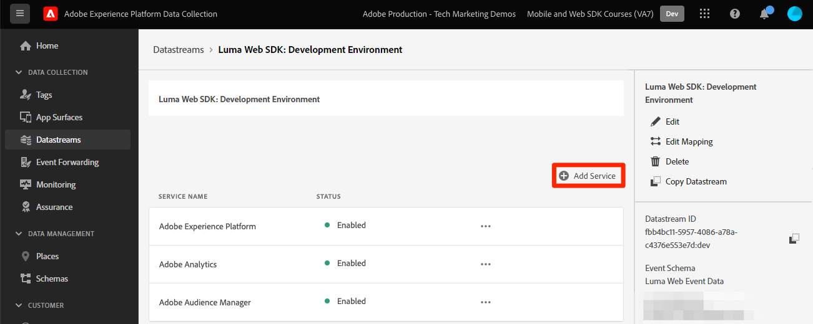

# Platform Web SDK를 사용하여 Adobe Target 설정

Platform Web SDK를 사용하여 Adobe Target을 구현하는 방법을 알아봅니다. 경험을 전달하는 방법과 추가 매개 변수를 Target에 전달하는 방법을 알아봅니다.

[Adobe Target](https://experienceleague.adobe.com/docs/target/using/target-home.html) 은 사용자의 웹 및 모바일 사이트, 앱 및 기타 디지털 채널에서 매출을 극대화하도록 고객의 경험을 조정하고 개인화하는 데 필요한 모든 기능을 제공하는 Adobe Experience Cloud 애플리케이션입니다.

## 학습 목표

이 단원을 마치면 다음을 수행할 수 있습니다.

* 비동기 태그 포함 코드와 함께 Target을 사용할 때 깜박임을 방지하기 위해 Platform Web SDK 사전 숨김 코드 조각을 추가하는 방법을 이해합니다
* Target 기능을 사용하도록 데이터 스트림 구성
* 페이지가 로드될 때(이전에 &quot;글로벌 mbox&quot;라고 함) 시각적 개인화 결정을 렌더링합니다.
* XDM 데이터를 Target에 전달하고 Target 매개 변수에 대한 매핑을 이해합니다
* 프로필 및 엔티티 매개 변수와 같은 Target에 사용자 지정 데이터 전달
* Platform Web SDK를 사용하여 Target 구현 유효성 검사


## 전제 조건

이 섹션의 학습 내용을 완료하려면 먼저 다음을 수행해야 합니다.

* 데이터 요소 및 규칙 설정을 포함하여 Platform Web SDK의 초기 구성에 대한 모든 단원을 완료합니다.
* 다음 권한이 있는지 확인합니다. [편집자 또는 승인자 역할](https://experienceleague.adobe.com/docs/target/using/administer/manage-users/enterprise/properties-overview.html#section_8C425E43E5DD4111BBFC734A2B7ABC80).
* 설치 [시각적 경험 작성기 Helper 확장 프로그램](https://experienceleague.adobe.com/docs/target/using/experiences/vec/troubleshoot-composer/vec-helper-browser-extension.html) Google Chrome 브라우저를 사용하는 경우.
* Target에서 활동을 설정하는 방법을 알아봅니다. 리프레셔가 필요한 경우 다음 자습서와 안내서가 이 단원에 도움이 됩니다.
   * [VEC(시각적 경험 작성기) Helper 확장 프로그램 사용](https://experienceleague.adobe.com/docs/target/using/experiences/vec/troubleshoot-composer/vec-helper-browser-extension.html)
   * [Visual Experience Composer 사용](https://experienceleague.adobe.com/docs/target-learn/tutorials/experiences/use-the-visual-experience-composer.html)
   * [양식 기반 경험 작성기 사용](https://experienceleague.adobe.com/docs/target-learn/tutorials/experiences/use-the-form-based-experience-composer.html)
   * [경험 타깃팅 활동 만들기](https://experienceleague.adobe.com/docs/target-learn/tutorials/activities/create-experience-targeting-activities.html)

## 플리커 완화 추가

시작하기 전에 태그 라이브러리가 로드되는 방식에 따라 추가 깜박임 처리 솔루션이 필요한지 결정해야 합니다.

>[!NOTE]
>
>이 자습서에서는 [Luma 사이트](https://luma.enablementadobe.com/content/luma/us/en.html) 태그와 플리커(깜박임)를 비동기식 구현으로 사용할 수 있습니다. 이 섹션에서는 Platform Web SDK에서 플리커(깜박임) 완화가 작동하는 방식을 이해하는 데 도움이 됩니다.


### 비동기 구현

Target 라이브러리가 비동기적으로 로드되면가 콘텐츠 교환을 수행하기 전에 페이지에서 렌더링을 완료할 수 있습니다. 이 동작은 Target에서 지정한 개인화된 콘텐츠로 대체되기 전에 기본 콘텐츠가 잠깐 나타나는 &quot;깜박임&quot;이라고 하는 것이 나타날 수 있습니다. 이러한 깜박임이 발생하지 않도록 하려면 비동기 태그 포함 코드 바로 앞에 특수 사전 숨김 코드 조각을 추가하는 것이 좋습니다.

이 코드 조각은 이미 Luma 사이트에 있지만 이 코드가 수행하는 작업을 자세히 살펴보겠습니다.

```html
<script>
  !function(e,a,n,t){var i=e.head;if(i){
  if (a) return;
  var o=e.createElement("style");
  o.id="alloy-prehiding",o.innerText=n,i.appendChild(o),setTimeout(function(){o.parentNode&&o.parentNode.removeChild(o)},t)}}
  (document, document.location.href.indexOf("mboxEdit") !== -1, ".body { opacity: 0 !important }", 3000);
</script>
```

코드 조각 사전 숨김은 선택한 CSS 정의가 있는 페이지 헤드에 스타일 태그를 만듭니다. 이 스타일 태그는 Target의 응답을 받거나 시간 초과에 도달하면 제거됩니다.

사전 숨김 동작은 코드 조각의 맨 끝에서 두 가지 구성으로 제어됩니다.

* `body { opacity: 0 !important }` Target이 로드되기 전까지 사전 숨김에 사용할 CSS 정의를 지정합니다. 기본적으로 전체 페이지는 숨겨집니다. 이 정의를 숨기려는 방법과 함께 미리 숨길 선택기로 업데이트할 수 있습니다. 이 값은 사전 숨김 스타일 태그에 삽입되는 값이므로 여러 정의를 포함할 수 있습니다. 탐색 아래의 컨텐츠를 줄바꿈하는 쉽게 식별할 수 있는 컨테이너 요소가 있는 경우 이 설정을 사용하여 사전 숨김을 해당 컨테이너 요소로 제한할 수 있습니다.
* `3000` 사전 숨김에 대한 시간 제한(밀리초)을 지정합니다. 시간 초과 전에 Target의 응답을 받지 못하면 사전 숨김 스타일 태그가 제거됩니다. 이 시간 초과는 거의 발생하지 않습니다.

>[!NOTE]
>
>Platform Web SDK용 사전 숨김 코드 조각은 at.js Target 라이브러리에 사용되는 코드 조각과 약간 다릅니다. Platform Web SDK는 다른 스타일 ID를 사용하므로 올바른 코드 조각을 사용해야 합니다 `alloy-prehiding`. at.js에 대한 사전 숨김 코드 조각을 사용하는 경우 제대로 작동하지 않을 수 있습니다.

코드 조각 사전 숨김은 태그 내에서도 사용할 수 있습니다.

1. 로 이동합니다. **[!UICONTROL 확장]** 태그 섹션
1. 선택 **[!UICONTROL 구성]** Adobe Experience Platform 웹 SDK 확장 프로그램용
1. 을(를) 선택합니다 **[!UICONTROL 사전에 숨기는 코드 조각을 클립보드에 복사]** 버튼

   

   >[!NOTE]
   >
   >Platform Web SDK 확장에서 복사된 기본 사전 숨김 코드 조각은 다음과 같이 사이트에 존재하지 않는 CSS 정의를 포함할 수 있습니다 `.personalization-container { opacity: 0 !important }`. 사이트에 맞게 사전 숨김 코드 조각을 적절히 확인하고 수정해야 합니다.

### 동기식 구현

Adobe은 Luma 사이트에 설명된 대로 태그를 비동기식으로 구현하는 것을 권장합니다. 그러나 태그 라이브러리가 동기식으로 로드되면 사전에 숨기는 코드 조각이 필요하지 않습니다. 대신 사전 숨김 스타일이 Platform Web SDK 확장 설정에 지정됩니다.

동기 구현을 위한 사전 숨김 스타일은 다음과 같이 구성할 수 있습니다.

1. 로 이동합니다. **[!UICONTROL 확장]** 태그 섹션
1. 을(를) 선택합니다 **[!UICONTROL 구성]** 플랫폼 웹 SDK 확장 프로그램 단추
1. 을(를) 선택합니다 **[!UICONTROL 사전 숨김 스타일 편집]** 버튼

   

1. 다음과 같이 사용할 선택기와 숨기기 메서드를 포함하도록 CSS를 수정합니다. `body { opacity: 0 !important }` 페이지의 전체 본문을 미리 숨기려면
1. 변경 사항을 저장하고 라이브러리에 빌드

>[!NOTE]
>
>사전 숨김 스타일 설정은 동기 구현에만 사용됩니다. 태그의 비동기 구현을 사용하는 경우 이 스타일을 비워 두거나 주석 처리해야 합니다.

Platform Web SDK에서 플리커를 관리하는 방법에 대한 자세한 내용은 안내서 섹션을 참조하십시오. [개인화된 경험에 대한 플리커 관리](https://experienceleague.adobe.com/docs/experience-platform/edge/personalization/manage-flicker.html).


## 데이터 스트림 구성

Platform Web SDK에서 Target 활동을 제공하려면 먼저 데이터 스트림 구성에서 Target을 활성화해야 합니다.

데이터 스트림에서 Target을 구성하려면:

1. 이동 [데이터 수집](https://experience.adobe.com/#/data-collection){target=&quot;blank&quot;} 인터페이스
1. 왼쪽 탐색에서 를 선택합니다 **[!UICONTROL 데이터 스트림]**
1. 앞에서 만든 을(를) 선택합니다 `Luma Web SDK` 데이터 스트림

   

1. 선택 **[!UICONTROL 서비스 추가]**

   
1. 선택 **[!UICONTROL Adobe Target]** 로서의 **[!UICONTROL 서비스]**
1. 아래 지침에 따라 Target 구현에 대한 선택적 세부 사항을 입력합니다.
1. **[!UICONTROL 저장]**&#x200B;을 선택합니다

   

### 속성 토큰

Target Premium 고객은 속성을 사용하여 사용자 권한을 관리할 수 있습니다. Target 속성을 사용하면 사용자가 Target 활동을 실행할 수 있는 주위에 경계를 설정할 수 있습니다. 자세한 내용은 [Enterprise 권한](https://experienceleague.adobe.com/docs/target/using/administer/manage-users/enterprise/properties-overview.html) 자세한 내용은 Target 설명서의 섹션을 참조하십시오.

속성 토큰을 설정하거나 찾으려면 로 이동합니다. **Adobe Target** > **[!UICONTROL 관리]** > **[!UICONTROL 속성]**. 다음 `</>` 아이콘은 구현 코드를 표시합니다. 다음 `at_property` 값은 데이터 스트림에 사용할 속성 토큰입니다.


>[!NOTE]
>
>데이터 스트림당 하나의 속성 토큰만 지정할 수 있습니다.


### Target 환경 ID

[환경](https://experienceleague.adobe.com/docs/target/using/administer/environments.html) Target은 모든 개발 단계를 통해 구현을 관리하는 데 도움이 됩니다. 이 선택적 설정은 각 데이터 스트림에 사용할 Target 환경을 지정합니다.

Adobe은 이러한 작업을 간소화하기 위해 개발, 스테이징 및 프로덕션 데이터 세트에 대해 Target 환경 ID를 다르게 설정할 것을 권장합니다.

환경 ID를 설정하거나 찾으려면 로 이동합니다. **Adobe Target** > **[!UICONTROL 관리]** > **[!UICONTROL 환경]**.


>[!NOTE]
>
>Target 환경 ID가 지정되지 않은 경우 프로덕션 Target 환경이 가정됩니다.

### 타사 ID 네임스페이스 Target

이 선택적 설정을 사용하면 Target 타사 ID에 사용할 ID 기호를 지정할 수 있습니다. Target은 단일 ID 기호 또는 네임스페이스에서만 프로필 동기화를 지원합니다. 자세한 내용은 [mbox3rdPartyId에 대한 실시간 프로필 동기화](https://experienceleague.adobe.com/docs/target/using/audiences/visitor-profiles/3rd-party-id.html) Target 안내서의 섹션.

ID 기호는 다음 ID 목록에 있습니다 **데이터 수집** > **[!UICONTROL 고객]** > **[!UICONTROL ID]**.


Luma 사이트를 사용하여 이 자습서를 사용하려면 ID 기호를 사용하십시오 `lumaCrmId` 다음 단원 동안 설정 [ID](configure-identities.md).


## 시각적 개인화 결정 렌더링

먼저 Target 및 태그 인터페이스에 사용된 용어를 이해해야 합니다.

* **활동**: 하나 이상의 대상에 타깃팅된 경험 집합입니다. 예를 들어 간단한 A/B 테스트는 두 개의 경험이 있는 활동일 수 있습니다.
* **경험**: 하나 이상의 위치 또는 결정 범위에 타깃팅된 작업 집합입니다.
* **결정 범위**: Target 경험이 전달되는 위치입니다. 결정 범위는 이전 버전의 Target 사용에 익숙한 경우 &quot;mbox&quot;와 같습니다.
* **개인화 결정**: 서버가 결정하는 작업을 적용해야 합니다. 이러한 결정은 대상 기준 및 Target 활동 우선 순위 지정을 기반으로 할 수 있습니다.
* **제안**: Platform Web SDK 응답에서 전달되는 서버에서 수행한 의사 결정 결과입니다. 예를 들어 배너 이미지를 교체한 것은 제안입니다.

### 페이지 로드 규칙 업데이트

Target에서 시각적 개인화 결정은 데이터 스트림에 Target이 활성화되어 있는 경우 Platform Web SDK에 의해 전달됩니다. 하지만, _자동으로 렌더링되지 않습니다_. 자동 렌더링을 활성화하려면 글로벌 페이지 로드 규칙을 수정해야 합니다.

1. 에서 [데이터 수집](https://experience.adobe.com/#/data-collection){target=&quot;blank&quot;} 인터페이스에서 이 자습서에 사용할 태그 속성을 엽니다.
1. 를 엽니다. `all pages - library load - AA & AT` 규칙
1. 을(를) 선택합니다 `Adobe Experience Platform Web SDK - Send event` 작업
1. 활성화 **[!UICONTROL 시각적 개인화 결정 렌더링]** 확인란을 선택하면

   

1. 변경 사항을 저장한 다음 라이브러리에 빌드

시각적 개인화 결정 렌더링 설정을 사용하면 Platform Web SDK에서 시각적 경험 작성기 또는 &quot;글로벌 mbox&quot; Target을 사용하여 지정된 수정 사항을 자동으로 적용합니다.

>[!NOTE]
>
>일반적으로 [!UICONTROL 시각적 개인화 결정 렌더링] 이 설정은 전체 페이지 로드당 단일 이벤트 보내기 작업에만 활성화해야 합니다. 여러 이벤트 보내기 작업에 이 설정이 활성화되면 후속 렌더링 요청이 무시됩니다.

사용자 지정 코드를 사용하여 이러한 의사 결정에 직접 렌더링하거나 작업을 수행하려는 경우 [!UICONTROL 시각적 개인화 결정 렌더링] 설정을 사용하지 않도록 설정했습니다. Platform Web SDK는 유연하며 이 기능을 통해 완벽한 제어를 제공합니다. 에 대한 자세한 내용은 안내서를 참조하십시오 [개인화된 콘텐츠 수동 렌더링](https://experienceleague.adobe.com/docs/experience-platform/edge/personalization/rendering-personalization-content.html).

### 시각적 경험 작성기로 Target 활동 설정

기본 구현 부분이 완료되면 Target에서 XT(경험 타깃팅) 활동을 만들어 모든 것이 제대로 작동하는지 확인합니다. 에 대한 Target 자습서를 참조할 수 있습니다 [경험 타깃팅 활동 만들기](https://experienceleague.adobe.com/docs/target-learn/tutorials/activities/create-experience-targeting-activities.html) 도움이 필요하면

>[!NOTE]
>
>Google Chrome을 브라우저로 사용하는 경우에는 [VEC(시각적 경험 작성기) Helper 확장 프로그램](https://experienceleague.adobe.com/docs/target/using/experiences/vec/troubleshoot-composer/vec-helper-browser-extension.html?lang=en) 은 VEC에서 편집을 위해 사이트를 제대로 로드해야 합니다.

1. Target으로 이동
1. 활동 URL에 대한 Luma 홈 페이지를 사용하여 XT(경험 타깃팅) 활동을 만듭니다

   

1. 페이지를 수정합니다. 예를 들어 홈 페이지 배너의 텍스트를 변경하는 경우가 있습니다

   

1. 적절한 보고서 세트와 함께 Adobe Analytics을 보고 소스로 선택하고 주문 지표를 목표로 선택합니다

   >[!NOTE]
   >
   >Adobe Analytics을 사용하지 않는 경우 Target을 보고 소스로 선택하고 다음과 같은 다른 지표를 선택합니다 **참여 > 페이지 보기 수** 을 가리키도록 업데이트하는 것이 좋습니다. 활동을 저장하고 미리 보려면 목표 지표가 필요합니다.

1. 활동을 저장합니다
1. 변경 사항이 마음에 들면 활동을 활성화할 수 있습니다. 그렇지 않으면 활성화하지 않고 경험을 미리 보려는 경우 를 복사할 수 있습니다 [QA 미리 보기 URL](https://experienceleague.adobe.com/docs/target/using/activities/activity-qa/activity-qa.html).
1. Luma 홈 페이지를 로드하면 변경 사항이 적용된 것이 표시됩니다
1. 몇 시간 후에 Adobe Analytics에서 Target 활동 데이터 및 전환을 볼 수 있습니다. 에 대한 자세한 내용은 Target 안내서 을 참조하십시오 [A4T(Target 분석) 보고](https://experienceleague.adobe.com/docs/target/using/integrate/a4t/reporting.html?lang=en).


### 디버거를 사용하여 유효성 검사

활동을 설정하면 페이지에 콘텐츠가 렌더링됩니다. 하지만 라이브 상태인 활동이 없어도 이벤트 보내기 네트워크 호출을 보고 Target이 제대로 구성되어 있는지 확인할 수 있습니다.

>[!CAUTION]
>
>Google Chrome을 사용하고 있으며 [VEC(시각적 경험 작성기) Helper 확장 프로그램](https://experienceleague.adobe.com/docs/target/using/experiences/vec/troubleshoot-composer/vec-helper-browser-extension.html?lang=en) 설치되어 있는지 확인합니다. **Target 라이브러리 삽입** 설정이 비활성화되어 있습니다. 이 설정을 활성화하면 추가 Target 요청이 발생합니다.

1. Adobe Experience Platform 디버거 브라우저 확장 열기
1. 로 이동합니다. [Luma 데모 사이트](https://luma.enablementadobe.com/content/luma/us/en.html) 디버거를 사용하여 다음을 수행합니다. [사이트의 태그 속성을 자신의 개발 속성으로 전환합니다.](validate-with-debugger.md#use-the-experience-platform-debugger-to-map-to-your-tags-property)
1. 페이지를 다시 로드합니다.
1. 을(를) 선택합니다 **[!UICONTROL 네트워크]** 디버거의 도구
1. 필터 기준 **[!UICONTROL Adobe Experience Platform Web SDK]**
1. 첫 번째 호출에 대한 이벤트 행에서 값을 선택합니다

   

1. 아래에 키가 있습니다 `query` > `personalization` 및  `decisionScopes` 에는 값 가 있습니다. `__view__`. 이 범위는 Target의 &quot;글로벌 mbox&quot;와 같습니다. 이 Platform Web SDK 호출에서 Target의 결정을 요청했습니다.

   

1. 오버레이를 닫고 두 번째 네트워크 호출에 대한 이벤트 세부 사항을 선택합니다. 이 호출은 Target이 활동을 반환한 경우에만 나타납니다.
1. Target에서 반환된 활동 및 경험에 대한 세부 사항이 있습니다. 이 Platform Web SDK 호출은 Target 활동이 사용자에게 렌더링되고 노출이 증가한다는 알림을 보냅니다.

   

## 사용자 지정 결정 범위 설정 및 렌더링

사용자 지정 결정 범위(이전의 &quot;mbox&quot;라고 함)는 Target 양식 기반 경험 작성기를 사용하여 구조화된 방식으로 HTML 또는 JSON 콘텐츠를 전달하는 데 사용할 수 있습니다. 이러한 사용자 지정 범위 중 하나에 전달된 컨텐츠는 Platform Web SDK에 의해 자동으로 렌더링되지 않습니다.

### 페이지 로드 규칙에 범위 추가

페이지 로드 규칙을 수정하여 사용자 지정 결정 범위를 추가합니다.

1. 를 엽니다. `all pages - library load - AA & AT` 규칙
1. 을(를) 선택합니다 `Adobe Experience Platform Web SDK - Send Event` 작업
1. 사용할 범위를 하나 이상 추가합니다. 이 예제에서는 `homepage-hero`.

   

1. 변경 사항을 저장하고 라이브러리에 빌드

>[!TIP]
>
>이 자습서에서는 데모용으로 수동으로 정의된 단일 범위를 사용합니다. 특정 페이지에 사용할 몇 개의 결정 범위를 사용하려는 경우, 페이지 경로에 따라 조건부로 범위 배열을 반환하는 데이터 요소를 사용하는 것을 고려해야 합니다. 이 접근 방식은 구현을 간단하고 확장 가능한 상태로 유지하는 데 도움이 됩니다.

### Target에서 응답 처리

이제 컨텐츠를 요청하도록 Platform Web SDK를 구성했습니다 `homepage-hero` 범위, 응답을 사용하여 작업을 수행해야 합니다. Platform Web SDK 태그 확장은 [!UICONTROL 이벤트 보내기 완료] 이벤트에서 [!UICONTROL 이벤트 보내기] 작업이 수신됩니다.

1. 라는 규칙 만들기 `homepage - send event complete - render homepage-hero`.
1. 규칙에 이벤트를 추가합니다. 를 사용하십시오 **Adobe Experience Platform Web SDK** 확장 및 **[!UICONTROL 이벤트 보내기 완료]** 이벤트 유형.
1. 규칙을 Luma 홈 페이지(쿼리 문자열이 없는 경로는 다음과 같음)로 제한하는 조건을 추가합니다 `/content/luma/us/en.html`).
1. 규칙에 작업을 추가합니다. 를 사용하십시오 **코어** 확장 및 **사용자 지정 코드** 작업 유형.

   

   >[!TIP]
   >
   >기본 이름을 사용하는 대신 규칙 이벤트, 조건 및 작업을 설명하는 이름을 지정합니다. 강력한 규칙 구성 요소 이름을 사용하면 검색 결과가 훨씬 유용해집니다.

1. Platform Web SDK 응답에서 반환된 proposition에 대해 읽고 조치를 취할 사용자 지정 코드를 입력합니다. 이 예제의 사용자 지정 코드는에 대한 안내서에 요약된 접근 방식을 사용합니다 [개인화된 콘텐츠 수동 렌더링](https://experienceleague.adobe.com/docs/experience-platform/edge/personalization/rendering-personalization-content.html?lang=en#manually-rendering-content). 코드가 `homepage-hero` 태그 규칙 작업을 사용한 범위 예

   ```javascript
   var propositions = event.propositions;
   
   var heroProposition;
   if (propositions) {
      // Find the hero proposition, if it exists.
      for (var i = 0; i < propositions.length; i++) {
         var proposition = propositions[i];
         if (proposition.scope === "homepage-hero") {
            heroProposition = proposition;
            break;
         }
      }
   }
   
   var heroHtml;
   if (heroProposition) {
      // Find the item from proposition that should be rendered.
      // Rather than assuming there a single item that has HTML
      // content, find the first item whose schema indicates
      // it contains HTML content.
      for (var j = 0; j < heroProposition.items.length; j++) {
         var heroPropositionItem = heroProposition.items[j];
         if (heroPropositionItem.schema === "https://ns.adobe.com/personalization/html-content-item") {
            heroHtml = heroPropositionItem.data.content;
            break;
         }
      }
   }
   
   if (heroHtml) {
      // Hero HTML exists. Time to render it.
      var heroElement = document.querySelector(".heroimage");
      heroElement.innerHTML = heroHtml;
      // For this example, we assume there is only a signle place to update in the HTML.
   }
   
   // Send a "display" event 
   alloy("sendEvent", {
      xdm: {
         eventType: "display",
         _experience: {
            decisioning: {
               propositions: [
                  {
                     id: heroProposition.id,
                     scope: heroProposition.scope,
                     scopeDetails: heroProposition.scopeDetails
                  }
               ]
            }
         }
      }
   });
   ```

1. 변경 사항을 저장하고 라이브러리에 빌드
1. Luma 홈 페이지를 몇 번 로드하십시오. 그러면 새 페이지를 만들 수 있습니다 `homepage-hero` Target 인터페이스의 결정 범위 등록입니다.

### 양식 기반 경험 작성기로 Target 활동 설정

이제 사용자 지정 결정 범위를 수동으로 렌더링하는 규칙이 있으므로 Target에서 다른 경험 타깃팅(XT) 활동을 만들 수 있습니다. 이번에는 양식 기반 경험 작성기를 사용합니다.

1. 열기 [Adobe Target](https://experience.adobe.com/target)
1. 이전 단원에 사용된 활동을 비활성화합니다
1. 양식 기반 경험 작성기 선택 사항을 사용하여 XT(경험 타깃팅) 활동 만들기

   

1. 을(를) 선택합니다 **`homepage-hero`** 위치 드롭다운 및 **[!UICONTROL HTML 오퍼 만들기]** 컨텐츠 드롭다운에서 을 클릭합니다. 해당 위치를 사용할 수 없는 경우 해당 위치를 입력할 수 있습니다. Target은 해당 위치 또는 범위에 대한 요청을 받은 후 정기적으로 새 위치 이름을 채웁니다.

   

1. 콘텐츠 상자에 다음 코드를 붙여넣습니다. 이 코드는 다른 배경 이미지를 사용하는 기본 영웅 배너입니다.

   ```html
   <div class="we-HeroImage jumbotron" style="background-image: url('/content/luma/us/en/women/_jcr_content/root/hero_image.coreimg.jpeg');">
      <div class="container cq-dd-image">
         <div class="we-HeroImage-wrapper">
            <p class="h3">New Luma Yoga Collection</p>
            <strong class="we-HeroImage-title h1">Be active with style&nbsp;</strong>
            <p>
               <a class="btn btn-primary btn-action" href="/content/luma/us/en/products.html" role="button">Shop Now</a>
            </p>
         </div>
      </div>
   </div>
   ```

1. 설정 [!UICONTROL 목표 및 설정] 단계를 수행하고, Adobe Target을 보고 소스로 선택하고, [!UICONTROL 참여] > [!UICONTROL 페이지 보기 수] 목표로서
1. 활동을 저장합니다
1. 변경 사항이 마음에 들면 활동을 활성화할 수 있습니다. 그렇지 않으면 활성화하지 않고 경험을 미리 보려는 경우 를 복사할 수 있습니다 [QA 미리 보기 URL](https://experienceleague.adobe.com/docs/target/using/activities/activity-qa/activity-qa.html).
1. Luma 홈 페이지를 로드하면 변경 사항이 적용된 것이 표시됩니다

>[!NOTE]
>
>&quot;mbox에서 클릭됨&quot; 전환 목표는 자동으로 작동하지 않습니다. Platform Web SDK는 사용자 지정 범위를 자동으로 렌더링하지 않으므로 컨텐츠를 적용하도록 선택한 위치에 대한 클릭을 추적하지 않습니다. &quot;클릭&quot;을 사용하여 각 범위에 대한 고유한 클릭 추적을 만들 수 있습니다 `eventType` 적용 가능한 `_experience` 을 사용하여 세부 정보 `sendEvent` 작업.

### 디버거를 사용하여 유효성 검사

활동을 활성화한 경우 페이지에 콘텐츠가 렌더링됩니다. 그러나 라이브 상태인 활동이 없어도 [!UICONTROL 이벤트 보내기] Target이 사용자 지정 범위에 대한 콘텐츠를 요청하고 있음을 확인하는 네트워크 호출입니다.

1. Adobe Experience Platform 디버거 브라우저 확장 열기
1. 로 이동합니다. [Luma 데모 사이트](https://luma.enablementadobe.com/content/luma/us/en.html) 디버거를 사용하여 다음을 수행합니다. [사이트의 태그 속성을 자신의 개발 속성으로 전환합니다.](validate-with-debugger.md#use-the-experience-platform-debugger-to-map-to-your-tags-property)
1. 페이지를 다시 로드합니다.
1. 을(를) 선택합니다 **[!UICONTROL 네트워크]** 디버거의 도구
1. 필터 기준 **[!UICONTROL Adobe Experience Platform Web SDK]**
1. 첫 번째 호출에 대한 이벤트 행에서 값을 선택합니다

   

1. 아래에 키가 있습니다 `query` > `personalization` 및  `decisionScopes` 에는 값 가 있습니다. `__view__` 이전처럼, 하지만 지금 또한 `homepage-hero` 범위가 포함되었습니다. 이 Platform Web SDK 호출은 VEC 및 특정 `homepage-hero` 위치.

   

1. 오버레이를 닫고 두 번째 네트워크 호출에 대한 이벤트 세부 사항을 선택합니다. 이 호출은 Target이 활동을 반환한 경우에만 나타납니다.
1. Target에서 반환된 활동 및 경험에 대한 세부 사항이 있습니다. 이 Platform Web SDK 호출은 Target 활동이 사용자에게 렌더링되고 노출이 증가한다는 알림을 보냅니다.

   

## Target에 추가 데이터 전달

이 섹션에서는 Target 관련 데이터를 전달하고 XDM 데이터가 Target 매개 변수에 매핑되는 방식을 자세히 살펴봅니다.

XDM 개체에서 매핑되지 않은 Target에 유용할 수 있는 데이터 포인트가 몇 가지 있습니다. 이러한 특수 Target 매개 변수는 다음과 같습니다.

* [프로필 속성](https://experienceleague.adobe.com/docs/target/using/implement-target/before-implement/methods/in-page-profile-attributes.html?lang=en)
* [Recommendations 엔티티 속성](https://experienceleague.adobe.com/docs/target/using/recommendations/entities/entity-attributes.html?lang=en)
* [Recommendations 예약 매개 변수](https://experienceleague.adobe.com/docs/target/using/recommendations/plan-implement.html?lang=en#pass-behavioral)
* 에 대한 카테고리 값 [카테고리 친화성](https://experienceleague.adobe.com/docs/target/using/audiences/visitor-profiles/category-affinity.html?lang=en)

### Target 매개 변수에 대한 데이터 요소 만들기

먼저 프로필 속성, 엔티티 속성, 카테고리 값에 대해 몇 가지 추가 데이터 요소를 설정한 다음, `data` 비XDM 데이터를 전달하는 데 사용되는 개체:

* **`target.entity.id`** 매핑된 대상 `digitalData.product.0.productInfo.sku`
* **`target.entity.name`** 매핑된 대상 `digitalData.product.0.productInfo.title`
* **`target.user.categoryId`** 다음 사용자 지정 코드를 사용하여 최상위 카테고리에 대한 사이트 URL을 구문 분석합니다.

   ```javascript
   var cat = location.pathname.split(/[/.]+/);
   if (cat[5] == 'products') {
      return (cat[6]);
   } else if (cat[5] != 'html') { 
      return (cat[5]);
   }
   ```

* **`data.content`** 다음 사용자 지정 코드 사용:

   ```javascript
   var data = {
      __adobe: {
         target: {
            "entity.id": _satellite.getVar("target.entity.id"),
            "entity.name": _satellite.getVar("target.entity.name"),
            "profile.loggedIn": _satellite.getVar("user.profile.attributes.loggedIn"),
            "user.categoryId": _satellite.getVar("target.user.categoryId")
         }
      }
   }
   return data;
   ```

### 페이지 로드 규칙 업데이트

XDM 개체 외부의 Target에 대한 추가 데이터를 전달하려면 적용 가능한 규칙을 업데이트해야 합니다. 이 예에서는 새 **data.content** 데이터 요소를 일반 페이지 로드 규칙 및 제품 페이지 보기 규칙에 추가합니다.

1. 를 엽니다. `all pages - library load - AA & AT` 규칙
1. 을(를) 선택합니다 `Adobe Experience Platform Web SDK - Send event` 작업
1. 추가 `data.content` 데이터 요소를 데이터 필드에 추가합니다

   

1. 변경 사항을 저장하고 라이브러리에 빌드
1. 에 대해 1~4단계를 반복합니다 **제품 보기 - 라이브러리 로드 - AA** 규칙

>[!NOTE]
>
>위의 예에서는 를 사용합니다 `data` 모든 페이지 유형에서 완전히 채워지지 않은 개체. 태그는 이러한 상황을 적절히 처리하고 정의되지 않은 값이 있는 키를 생략합니다. 예, `entity.id` 및 `entity.name` 은 제품 세부 사항 외에 어떤 페이지에서도 전달되지 않습니다.

### 디버거를 사용하여 유효성 검사

규칙이 업데이트되었으므로 Adobe 디버거를 사용하여 데이터가 올바르게 전달되는지 확인할 수 있습니다.

1. 로 이동합니다 [Luma 데모 사이트](https://luma.enablementadobe.com/content/luma/us/en.html) 전자 메일로 로그인 `test@adobe.com` 및 암호 `test`
1. 제품 세부 사항 페이지로 이동합니다
1. Adobe Experience Platform 디버거 브라우저 확장을 열고 [태그 속성을 고유한 개발 속성으로 전환합니다.](validate-with-debugger.md#use-the-experience-platform-debugger-to-map-to-your-tags-property)
1. 페이지를 다시 로드합니다.
1. 을(를) 선택합니다 **네트워크** 디버거에서 도구를 실행하고 **Adobe Experience Platform Web SDK**
1. 첫 번째 호출에 대한 이벤트 행에서 값을 선택합니다
1. 아래에 키가 있습니다 `data` > `__adobe` > `target` 이 정보에는 제품, 카테고리 및 로그인 상태에 대한 정보가 채워집니다.

   

### Target 인터페이스에서 유효성 검사

다음으로, Target 인터페이스를 검색하여 데이터가 수신되었고 대상 및 활동에서 사용할 수 있는지 확인합니다. XDM 데이터는 사용자 지정 Target 매개 변수에 자동으로 매핑됩니다. XDM 데이터가 Target에서 수신되었으며 대상을 만들어 사용할 수 있는지 확인할 수 있습니다.

1. 열기 [Adobe Target](https://experience.adobe.com/target)
1. 로 이동합니다 **[!UICONTROL 대상]** 섹션
1. 대상자를 만들고 을(를) 선택합니다. **[!UICONTROL 사용자 지정]** 속성 유형
1. 검색 **[!UICONTROL 매개 변수]** 필드 `web`. 드롭다운 메뉴는 웹 페이지 세부 사항과 관련된 모든 XDM 필드로 채워집니다.

다음으로, 로그인 상태 프로필 속성이 성공적으로 전달되었는지 확인합니다.

1. 을(를) 선택합니다 **[!UICONTROL 방문자 프로필]** 속성 유형
1. `loggedIn`을 검색합니다. 드롭다운 메뉴에서 속성을 사용할 수 있으면 속성이 Target에 올바르게 전달되었습니다. 새 속성을 Target UI에서 사용할 수 있게 되는 데에는 몇 분이 걸릴 수 있습니다.

Premium이 있는 경우 엔티티 데이터가 올바르게 전달되고 제품 데이터가 Recommendations 제품 카탈로그에 기록되었는지 확인할 수도 있습니다.

1. 로 이동합니다 **[!UICONTROL Recommendations]** 섹션
1. 선택 **[!UICONTROL 카탈로그 검색]** 왼쪽 탐색
1. Luma 사이트에서 이전에 방문한 제품 SKU 또는 제품 이름을 검색합니다. 제품이 제품 카탈로그에 표시되어야 합니다. 새 제품은 Recommendations 제품 카탈로그에서 검색되는 데 몇 분이 걸릴 수 있습니다.

이 단원을 완료했으므로 Platform Web SDK를 사용하여 Adobe Target을 실제로 구현해야 합니다.

[다음: ](setup-consent.md)

>[!NOTE]
>
>Adobe Experience Platform Web SDK에 대한 학습에 시간을 내주셔서 감사합니다. 질문이 있거나 일반 피드백을 공유하거나 향후 컨텐츠에 대한 제안 사항이 있는 경우 해당 정보를 공유하십시오 [Experience League 커뮤니티 토론 게시물](https://experienceleaguecommunities.adobe.com/t5/adobe-experience-platform-launch/tutorial-discussion-implement-adobe-experience-cloud-with-web/td-p/444996)
