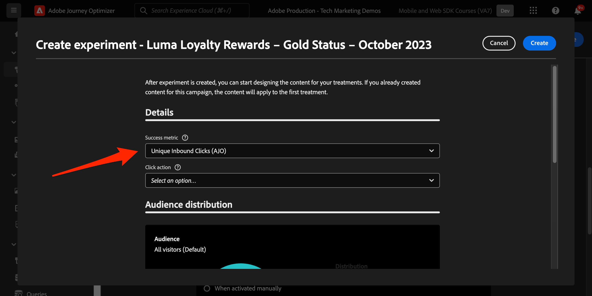
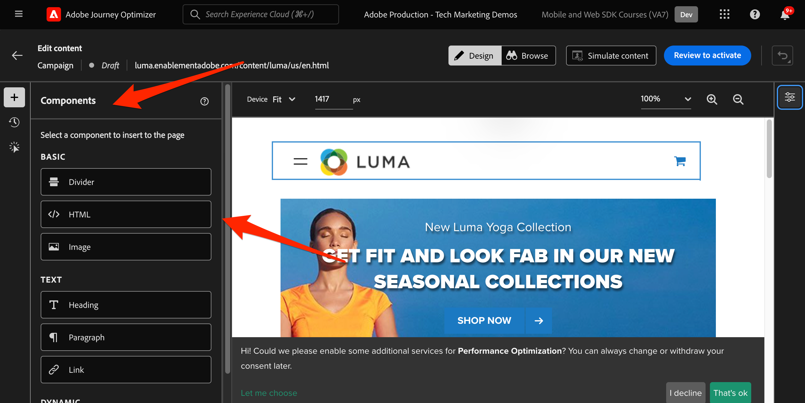

# Web SDK를 사용하여 Journey Optimizer 웹 채널 설정

Adobe Experience Platform Web SDK를 사용하여 Adobe Journey Optimizer [웹 채널](https://experienceleague.adobe.com/en/docs/journey-optimizer/using/web/get-started-web)을 구현하는 방법에 대해 알아봅니다. 이 단원에서는 기본 웹 채널 사전 요구 사항, 구성을 위한 자세한 단계 및 충성도 상태를 중심으로 하는 사용 사례에 대해 설명합니다.

이 단원을 따르면 Journey Optimizer 사용자는 Journey Optimizer 웹 디자이너를 사용하여 고급 온라인 개인화에 웹 채널을 사용할 수 있습니다.

## 학습 목표

이 단원을 마치면 다음을 수행할 수 있습니다.

* 웹 채널 경험을 게재할 때 웹 SDK의 기능과 중요성을 이해합니다.
* 샘플 Luma 충성도 보상 사용 사례를 활용하여 처음부터 끝까지 웹 채널 캠페인을 만드는 프로세스를 이해합니다.
* 인터페이스 내에서 캠페인 속성, 작업 및 일정을 구성합니다.
* Adobe Experience Cloud Visual Editing Helper 확장 기능의 기능과 이점을 이해합니다.
* 웹 디자이너를 사용하여 이미지, 헤더 및 기타 요소를 포함한 웹 페이지 콘텐츠를 편집하는 방법에 대해 알아봅니다.
* 오퍼 결정 구성 요소를 사용하여 웹 페이지에 오퍼를 삽입하는 방법을 알아봅니다.
* 웹 채널 캠페인의 품질과 성공을 보장하기 위한 모범 사례를 숙지하십시오.

## 전제 조건

이 섹션의 학습 내용을 완료하려면 먼저 다음을 수행해야 합니다.

* 데이터 요소 및 규칙 설정을 포함하여 Platform Web SDK의 초기 구성에 대한 모든 단원을 완료합니다.
* Adobe Experience Platform Web SDK 태그 확장 버전이 2.16 이상인지 확인하십시오.
* Journey Optimizer 웹 디자이너를 사용하여 웹 채널 경험을 작성하는 경우 Google Chrome 또는 Microsoft® Edge 브라우저를 사용하고 있는지 확인하십시오.
* 또한 [Adobe Experience Cloud Visual Editing Helper 브라우저 확장 기능](https://chromewebstore.google.com/detail/adobe-experience-cloud-vi/kgmjjkfjacffaebgpkpcllakjifppnca)을 다운로드하여 활성화했는지 확인하십시오.
* 브라우저에서 서드파티 쿠키가 허용되는지 확인하십시오. 브라우저에서 광고 차단기를 비활성화해야 할 수도 있습니다.

  >[!CAUTION]
  >
  > Journey Optimizer 웹 디자이너에서 특정 웹 사이트는 다음 이유 중 하나로 인해 안정적으로 열리지 않을 수 있습니다.
  > 
  > 1. 웹 사이트에는 엄격한 보안 정책이 있습니다.
  > 1. 웹 사이트는 iframe 내에 포함됩니다.
  > 1. 고객의 QA 또는 스테이지 사이트는 외부에서 액세스할 수 없습니다(내부 사이트임).

* 웹 경험을 만들고 Adobe Experience Manager Assets Essentials 라이브러리의 콘텐츠를 포함할 때 [이 콘텐츠를 게시하기 위해 하위 도메인을 구성](https://experienceleague.adobe.com/en/docs/journey-optimizer/using/web/configure-web-channel/web-delegated-subdomains)해야 합니다.
* 콘텐츠 실험 기능을 사용하는 경우 웹 데이터 세트도 보고 구성에 포함되어야 합니다.
* 현재, 웹 속성에서 웹 채널 캠페인을 작성하고 게재하기 위해 두 가지 유형의 구현이 지원됩니다.
   * 클라이언트측 전용: 웹 사이트를 수정하려면 Adobe Experience Platform Web SDK를 구현해야 합니다.
   * 하이브리드 모드: Platform Personalization Server API를 활용하여 Edge Network 서버측을 요청할 수 있습니다. 그런 다음 API의 응답이 클라이언트측에서 수정 사항을 렌더링하기 위해 Adobe Experience Platform Web SDK에 제공됩니다. 자세한 내용은 Adobe Experience Platform Edge Network 서버 API 설명서를 참조하십시오. 하이브리드 모드에 대한 추가 세부 정보 및 구현 샘플은 이 블로그 게시물에서 찾을 수 있습니다.

  >[!NOTE]
  >
  >서버측 전용 구현은 현재 지원되지 않습니다.

## 용어

먼저 웹 채널 캠페인 내에서 사용되는 용어를 이해해야 합니다.

* **웹 채널**: 웹을 통해 콘텐츠를 전달하거나 통신하는 매체입니다. 이 안내서의 컨텍스트에서 개인화된 콘텐츠가 Adobe Journey Optimizer 내에서 Platform Web SDK를 사용하여 웹 사이트 방문자에게 전달되는 메커니즘을 나타냅니다.
* **웹 표면**: 콘텐츠가 전달되는 URL로 식별되는 웹 속성을 나타냅니다. 단일 또는 여러 웹 페이지를 포함할 수 있습니다.
* **Journey Optimizer 웹 디자이너**: 사용자가 웹 채널 경험을 디자인할 수 있는 Journey Optimizer 내의 특정 도구 또는 인터페이스입니다.
* **Adobe Experience Cloud Visual Editing Helper**: 웹 채널 환경을 시각적으로 편집하고 디자인하는 데 도움이 되는 브라우저 확장 기능입니다.
* **데이터 스트림**: 웹 채널 경험을 제공하는 Adobe Experience Platform 서비스 내의 구성입니다.
* **병합 정책**: 인바운드 캠페인의 정확한 활성화 및 게시를 보장하는 구성입니다.
* **대상**: 특정 기준을 충족하는 사용자 또는 사이트 방문자의 특정 세그먼트입니다.
* **웹 디자이너**: 코드를 깊이 삽입하지 않고 웹 환경을 시각적으로 편집하고 디자인하는 데 도움이 되는 인터페이스 또는 도구입니다.
* **식 편집기**: 사용자가 데이터 특성이나 기타 조건을 기반으로 웹 콘텐츠에 개인화를 추가할 수 있는 웹 디자이너 내의 도구입니다.
* **오퍼 결정 구성 요소**: 의사 결정 관리에 따라 특정 방문자에게 표시할 오퍼를 결정하는 데 도움이 되는 웹 디자이너의 구성 요소입니다.
* **콘텐츠 실험**: 인바운드 클릭수와 같은 원하는 지표 측면에서 가장 뛰어난 성과를 보이는 콘텐츠 변형을 확인하기 위해 다양한 콘텐츠 변형을 테스트하는 방법입니다.
* **처리**: 콘텐츠 실험의 컨텍스트에서 처리는 다른 콘텐츠에 대해 테스트되는 콘텐츠의 특정 변형을 참조합니다.
* **시뮬레이션**: 실시간 대상에 대해 활성화하기 전에 웹 채널 경험을 시각화하는 미리 보기 메커니즘입니다.

## 데이터 스트림 구성

이미 데이터 스트림에 Adobe Experience Platform 서비스를 추가했습니다. 이제 웹 채널 경험을 제공할 수 있도록 Adobe Journey Optimizer 옵션을 활성화해야 합니다.

데이터 스트림에서 Adobe Journey Optimizer을 구성하려면 다음 작업을 수행하십시오.

1. [데이터 수집](https://experience.adobe.com/#/data-collection){target="blank"} 인터페이스로 이동합니다.
1. 왼쪽 탐색에서 **[!UICONTROL 데이터스트림]**&#x200B;을 선택합니다.
1. 이전에 만든 Luma 웹 SDK 데이터스트림을 선택합니다.

   

1. Adobe Experience Platform 서비스에서 **[!UICONTROL 편집]**&#x200B;을(를) 선택합니다.

   

1. **[!UICONTROL Adobe Journey Optimizer]** 상자를 선택합니다.

   

1. **[!UICONTROL 저장]**&#x200B;을 선택합니다.

이렇게 하면 Journey Optimizer에 대한 인바운드 이벤트가 Adobe Experience Platform Edge Network에서 올바르게 처리됩니다.

## 병합 정책 구성

**[!UICONTROL Active-On-Edge 병합 정책]** 옵션이 활성화된 병합 정책이 정의되었는지 확인하십시오. 이 병합 정책 옵션은 에지에서 인바운드 캠페인의 정확한 활성화 및 게시를 보장하기 위해 Journey Optimizer 인바운드 채널에 사용됩니다.

병합 정책에서 옵션을 구성하려면 다음을 수행합니다.

1. Experience Platform 또는 Journey Optimizer 인터페이스의 **[!UICONTROL 고객]** > **[!UICONTROL 프로필]** 페이지로 이동합니다.
1. **[!UICONTROL 병합 정책]** 탭을 선택합니다.
1. 정책을 선택하고([!UICONTROL 기본 시간 기반] 정책을 사용하는 것이 좋음) **[!UICONTROL 구성]** 단계에서 **[!UICONTROL Active-On-Edge 병합 정책]** 옵션을 전환합니다.

   

## 콘텐츠 실험을 위한 웹 데이터 세트 구성

웹 채널 캠페인 내에서 콘텐츠 실험을 사용하려면 사용된 웹 데이터 세트도 보고 구성에 포함되어야 합니다. Journey Optimizer 보고 시스템은 읽기 전용 방식으로 데이터 세트를 사용하여 기본 제공 콘텐츠 실험 보고서를 채웁니다.

[콘텐츠 실험 보고를 위한 데이터 세트 추가는 이 섹션에 자세히 설명되어 있습니다](https://experienceleague.adobe.com/en/docs/journey-optimizer/using/content-management/content-experiment/reporting-configuration#add-datasets).

## 사용 사례 개요 - 충성도 보상

이 단원에서는 샘플 충성도 보상 사용 사례를 사용하여 Web SDK를 사용한 웹 채널 경험의 구현을 자세히 설명합니다.

이 사용 사례를 통해 Journey Optimizer 캠페인 및 웹 디자이너를 활용하여 Journey Optimizer이 고객에게 최상의 인바운드 경험을 제공하는 데 어떻게 도움이 되는지 더 잘 이해할 수 있습니다.

이 자습서는 구현자를 대상으로 하므로 이 단원에는 Journey Optimizer의 실질적인 인터페이스 작업이 포함되어 있습니다. 이러한 인터페이스 작업은 일반적으로 마케터가 처리하지만, 구현자가 일반적으로 웹 채널 캠페인 생성을 담당하지 않더라도 프로세스에 대한 통찰력을 얻는 것이 유용할 수 있습니다.

### 충성도 보상 캠페인 만들기

샘플 충성도 데이터를 수집하고 세그먼트를 만들었으므로 이제 Adobe Journey Optimizer에서 충성도 보상 웹 채널 캠페인을 만드십시오.

샘플 캠페인을 만들려면:

1. [Journey Optimizer](https://experience.adobe.com/journey-optimizer/home){target="_blank"} 인터페이스 열기

   >[!NOTE]
   >
   > 스키마, 데이터 세트 및 대상은 모두 일반적인 Experience Platform 구성이므로 Journey Optimizer 인터페이스에서도 빌드할 수 있습니다.

1. 왼쪽 탐색에서 **[!UICONTROL 여정 관리]** > **[!UICONTROL 캠페인]**(으)로 이동
1. 오른쪽 상단의 **[!UICONTROL 캠페인 만들기]**&#x200B;를 클릭합니다.
1. **[!UICONTROL 속성]** 섹션에서 캠페인을 실행할 방법을 지정하십시오. 충성도 보상 사용 사례는 **예약됨**&#x200B;을(를) 선택하십시오.

   

1. **[!UICONTROL 작업]** 섹션에서 **[!UICONTROL 웹 채널]**&#x200B;을 선택하세요. **[!UICONTROL 웹 표면]**(으)로 **[!UICONTROL 페이지 URL]**&#x200B;을(를) 선택하십시오.

   >[!NOTE]
   >
   >웹 표면은 콘텐츠가 전달되는 URL로 식별되는 웹 속성을 나타냅니다. 단일 페이지 URL에 해당하거나 여러 페이지를 포함할 수 있으므로 하나 또는 여러 웹 페이지에 수정 사항을 적용할 수 있습니다.

1. **[!UICONTROL 페이지 URL]** 웹 표면 옵션을 선택하여 이 캠페인의 한 페이지에 경험을 배포합니다. Luma 페이지의 URL `https://luma.enablementadobe.com/content/luma/us/en.html`을(를) 입력하십시오.

1. 웹 표면이 정의되면 **[!UICONTROL 만들기]**&#x200B;를 선택합니다.

   

1. 이제 새 웹 채널 캠페인에 몇 가지 추가 세부 정보를 추가합니다. 먼저 캠페인 이름을 지정합니다. `Luma Loyalty Rewards – Gold Status`(으)로 전화 걸기. 원할 경우 캠페인에 설명을 추가할 수 있습니다. 또한 **[!UICONTROL 태그]**&#x200B;를 추가하여 전체 캠페인 분류법을 개선합니다.

   

1. 기본적으로 캠페인은 모든 사이트 방문자에 대해 활성화됩니다. 이 사용 사례에서는 gold status 보상 멤버만 경험을 볼 수 있습니다. 이 기능을 사용하려면 **[!UICONTROL 대상 선택]**&#x200B;을 클릭하고 `Luma Loyalty Rewards – Gold Status` 대상을 선택하십시오.

1. **[!UICONTROL ID 네임스페이스]** 필드에서 선택한 세그먼트 내에서 개인을 식별할 네임스페이스를 선택합니다. Luma 사이트에 캠페인을 배포하므로 ECID 네임스페이스를 선택할 수 있습니다. 다양한 ID 중 ECID 네임스페이스가 없는 `Luma Loyalty Rewards – Gold Status` 대상자 내의 프로필은 웹 채널 캠페인에 의해 타깃팅되지 않습니다.

   

1. **[!UICONTROL 캠페인 시작]** 옵션을 사용하여 오늘 날짜에 캠페인을 시작하고 **[!UICONTROL 캠페인 종료]** 옵션을 사용하여 1주일 후에 끝나도록 캠페인을 예약하십시오.

   

>[!NOTE]
>
>웹 채널 캠페인의 경우 방문자가 페이지를 열면 웹 경험이 표시됩니다. 따라서 Adobe Journey Optimizer의 다른 캠페인 유형과 달리 **[!UICONTROL 작업 트리거]** 섹션은 구성할 수 없습니다.

### 충성도 보상 콘텐츠 실험

**[!UICONTROL 작업]** 섹션에서 위로 스크롤하는 경우 선택적으로 실험을 만들어 `Luma Loyalty Rewards – Gold Status` 대상자에게 더 잘 작동하는 콘텐츠를 테스트할 수 있습니다. 캠페인 구성의 구성 요소로 두 가지 처리를 만들고 테스트해 보겠습니다.

콘텐츠 실험을 만들려면 다음 작업을 수행하십시오.

1. **[!UICONTROL 실험 만들기]**&#x200B;를 클릭합니다.

   

1. 먼저 **[!UICONTROL 성공 지표]**&#x200B;를 선택하십시오. 콘텐츠 효과를 결정하는 지표입니다. **[!UICONTROL 고유 인바운드 클릭수]**&#x200B;를 선택하여 웹 경험 CTA에서 더 많은 클릭수를 생성하는 콘텐츠 처리를 확인합니다.

   

1. 웹 채널을 사용하여 실험을 설정하고 **[!UICONTROL 인바운드 클릭수]**, **[!UICONTROL 고유 인바운드 클릭수]**, **[!UICONTROL 페이지 보기 수]** 또는 **[!UICONTROL 고유 페이지 보기 수]** 지표를 선택할 때 **[!UICONTROL 클릭 동작]** 드롭다운을 사용하면 특정 페이지에서 클릭수와 보기를 정확하게 추적하고 모니터링할 수 있습니다.

1. 선택적으로 두 처리 중 하나를 받지 않는 **[!UICONTROL 홀드아웃]**&#x200B;을 지정할 수 있습니다. 지금은 선택하지 않은 상태로 둡니다.

1. 또한 선택적으로 **[!UICONTROL 균등하게 분배]**&#x200B;하도록 선택하십시오. 처리 분할이 항상 균일하게 분할되도록 하려면 이 옵션을 선택합니다.

[Adobe Journey Optimizer 웹 채널의 콘텐츠 실험에 대해 자세히 알아보세요](https://experienceleague.adobe.com/en/docs/journey-optimizer/using/campaigns/content-experiment/get-started-experiment).

### Visual Helper를 사용하여 콘텐츠 편집

이제 웹 채널 경험을 작성해 보겠습니다. 이렇게 하려면 Adobe Experience Cloud **[!UICONTROL Visual Helper]**&#x200B;를 사용하십시오. 이 도구는 Google Chrome 및 Microsoft® Edge과 호환되는 브라우저 확장 기능입니다. 경험을 빌드하기 전에 확장을 다운로드했는지 확인하십시오. 또한 웹 페이지에 웹 SDK가 포함되어 있는지 확인합니다.

1. 캠페인의 **[!UICONTROL 작업]** 탭에서 **[!UICONTROL 콘텐츠 편집]**&#x200B;을 클릭합니다. 단일 페이지 URL을 표면으로 입력했으므로 작성기에서 작업을 시작할 준비가 되어 있어야 합니다.

   

1. 이제 작성을 시작하려면 **[!UICONTROL 웹 페이지 편집]**&#x200B;을 클릭하세요.

   

1. 웹 작성기를 사용하여 일부 요소를 편집하여 시작하십시오. 상황별 메뉴를 사용하여 Luma 영웅 이미지 헤더를 편집합니다. 오른쪽에 있는 상황별 창의 스타일을 조정합니다.

   

1. **[!UICONTROL 식 편집기]**&#x200B;를 사용하여 컨테이너에 개인화도 추가하십시오.

   

1. 클릭 수에 대해 경험이 제대로 추적되는지 확인합니다. 상황별 메뉴에서 **[!UICONTROL 추적 요소 클릭]**&#x200B;을(를) 선택합니다.

   

1. **[!UICONTROL 오퍼 결정 구성 요소]**&#x200B;를 사용하여 웹 페이지에 오퍼를 삽입합니다. 이 구성 요소는 **[!UICONTROL 의사 결정 관리]**&#x200B;를 사용하여 Luma 방문자에게 제공할 최상의 오퍼를 선택합니다.

### HTML 디자인 변경 사항

충성도 보상 캠페인의 구성 요소로서 사이트를 보다 발전시키거나 사용자 지정 변경하려는 경우 사용할 수 있는 몇 가지 방법이 있습니다.

**[!UICONTROL 구성 요소]** 창을 사용하여 HTML 또는 다른 콘텐츠를 Luma 사이트에 직접 추가하십시오.

페이지 상단에 새 HTML 구성 요소를 추가합니다. 디자인 인터페이스 또는 **[!UICONTROL 상황에 맞는]** 창에서 구성 요소 내의 HTML을 편집합니다.

또는 **[!UICONTROL 수정 사항]** 창에서 HTML 편집 내용을 추가하십시오. 이 창에서는 페이지에서 구성 요소를 선택하고 디자이너 인터페이스에서 편집할 수 있습니다.

편집기 내에서 `Luma Loyalty Rewards – Gold Status` 대상에 대한 HTML을 추가합니다. **[!UICONTROL 유효성 검사]**&#x200B;를 선택합니다.

이제 새로운 맞춤형 HTML 구성 요소를 검토하여 맞춤화 및 촉감을 확인하십시오.

**[!UICONTROL CSS 선택기 유형]** 수정을 사용하여 특정 구성 요소를 편집합니다.

**페이지 `<head>` 형식** 수정을 사용하여 사용자 지정 코드를 추가합니다.

**[!UICONTROL Visual Helper]**&#x200B;를 사용하면 가능성이 무한합니다.

### 충성도 보상 콘텐츠 시뮬레이션

캠페인을 활성화하기 전에 수정된 웹 페이지의 미리보기를 확인하십시오. 웹 채널 경험을 시뮬레이션하도록 테스트 프로필을 구성해야 합니다.

경험을 시뮬레이션하려면 다음 작업을 수행하십시오.

1. 캠페인 내에서 **[!UICONTROL 콘텐츠 시뮬레이션]**&#x200B;을 선택합니다.

   

1. 시뮬레이션을 수신할 테스트 프로필을 선택하십시오. 올바른 치료를 받으려면 테스트 프로필이 `Luma Loyalty Rewards – Gold Status` 대상에 있어야 합니다.

1. 테스트 프로필에 대한 미리보기가 표시됩니다.

### 충성도 보상 캠페인 활성화

마지막으로 웹 채널 캠페인을 활성화합니다.

1. **활성화하려면 검토**&#x200B;를 선택하십시오.

1. 마지막으로 캠페인 세부 정보를 확인하라는 메시지가 표시됩니다. **[!UICONTROL 활성화]**&#x200B;를 선택합니다. 캠페인이 사이트에서 라이브 상태가 되는 데 최대 15분 정도 소요될 수 있습니다.

### 충성도 보상 QA

다음과 같은 몇 가지 로그인을 사용하여 &quot;gold status&quot; 사용자를 시뮬레이션하고 캠페인을 사용할 수 있습니다.

1. `cleavlandeuler@emailsim.io`/`test`
1. `leftybeagen@emailsim.io`/`test`
1. `jenimartinho@emailsim.io`/`test`

캠페인 라이브 및 글로벌 보고서의 **[!UICONTROL 웹]** 탭에서 캠페인별 KPI를 모니터링하는 것이 좋습니다. 이 캠페인의 경우 경험 노출 횟수를 모니터링하고 클릭 비율을 표시합니다.

### Adobe Experience Platform Debugger을 사용한 웹 채널 유효성 검사

Chrome 및 Firefox 모두에서 사용할 수 있는 Adobe Experience Platform Debugger 확장은 웹 페이지를 분석하여 Adobe Experience Cloud 솔루션 구현에서 문제를 식별합니다.

Luma 사이트에서 디버거를 사용하여 프로덕션의 웹 채널 경험을 확인할 수 있습니다. 이는 충성도 보상 사용 사례가 작동하고 실행 중인 경우 모든 것이 올바르게 구성되도록 하는 모범 사례입니다.

[여기 안내서를 사용하여 브라우저에서 디버거를 구성하는 방법을 알아보세요](https://experienceleague.adobe.com/en/docs/platform-learn/data-collection/debugger/overview).

디버거를 사용하여 유효성 검사를 시작하려면 다음을 수행하십시오.

1. 웹 채널 경험이 있는 Luma 웹 페이지로 이동합니다.
   <!--
    
    -->
1. 웹 페이지에서 **[!UICONTROL Adobe Experience Platform Debugger]**&#x200B;을 엽니다.
   <!--
    
    -->
1. **요약**(으)로 이동합니다. **[!UICONTROL 데이터 스트림 ID]**&#x200B;이(가) Adobe Journey Optimizer을 사용하도록 설정한 **[!UICONTROL Adobe 데이터 수집]**&#x200B;의 **[!UICONTROL 데이터 스트림]**&#x200B;과(와) 일치하는지 확인하십시오.
   <!--
    
    -->
1. 그런 다음 다양한 Luma 충성도 계정으로 사이트에 로그인하고 디버거를 사용하여 Adobe Experience Platform Edge Network에 전송된 요청의 유효성을 검사할 수 있습니다.
   <!--
    
    -->
1. **[!UICONTROL 솔루션]**&#x200B;에서 **[!UICONTROL Experience Platform Web SDK]**&#x200B;로 이동합니다.
   <!--
    
    -->
1. **구성** 탭에서 **[!UICONTROL 디버깅 사용]**&#x200B;을 설정합니다. 이렇게 하면 **[!UICONTROL Adobe Experience Platform Assurance]** 세션 내의 세션에 대한 로깅을 사용할 수 있습니다.
   <!--
    
    -->
1. 다양한 Luma 충성도 계정으로 사이트에 로그인하고 디버거를 사용하여 **[!UICONTROL Adobe Experience Platform Edge 네트워크]**&#x200B;에 전송된 요청의 유효성을 검사합니다. 이러한 모든 요청은 로그 추적을 위해 **[!UICONTROL Assurance]**&#x200B;에 캡처해야 합니다.
<!--
   
-->

[다음: ](setup-decision-management.md)

>[!NOTE]
>
>Adobe Experience Platform Web SDK에 대해 학습하는 데 시간을 투자해 주셔서 감사합니다. 질문이 있거나 일반적인 피드백을 공유하고 싶거나 향후 콘텐츠에 대한 제안이 있는 경우 이 [Experience League 커뮤니티 토론 게시물](https://experienceleaguecommunities.adobe.com/t5/adobe-experience-platform-data/tutorial-discussion-implement-adobe-experience-cloud-with-web/td-p/444996)에서 공유하십시오.
