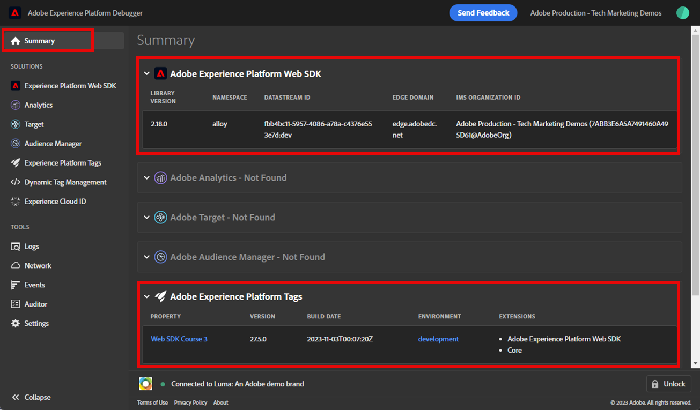
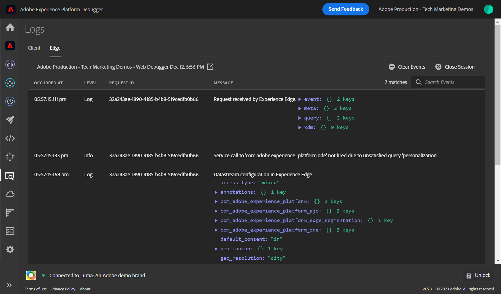

# Experience Platform 디버거를 사용하여 Web SDK 구현 확인

Adobe Experience Platform Debugger을 사용하여 Platform Web SDK 구현의 유효성을 검사하는 방법을 알아봅니다.

Experience Platform 디버거는 Chrome 및 Firefox 브라우저에서 사용할 수 있는 확장 프로그램으로, 웹 페이지에서 구현된 Adobe 기술을 볼 수 있도록 도와줍니다. 원하는 브라우저용 버전을 다운로드합니다.

* [Firefox 확장](https://addons.mozilla.org/ko-KR/firefox/addon/adobe-experience-platform-dbg/)
* [Chrome 확장 프로그램](https://chrome.google.com/webstore/detail/adobe-experience-platform/bfnnokhpnncpkdmbokanobigaccjkpob)

이전에 디버거를 사용한 적이 없고 이 디버거가 이전 Adobe Experience Cloud 디버거와 다른 경우에는 5분 분량의 개요 비디오를 시청하십시오.

>[!VIDEO](https://video.tv.adobe.com/v/32156?learn=on)

이 단원에서는 [Adobe Experience Cloud 디버거 확장](https://chrome.google.com/webstore/detail/adobe-experience-cloud-de/ocdmogmohccmeicdhlhhgepeaijenapj) 에서 하드코딩된 태그 속성을 바꾸려면 [Luma 데모 사이트](https://luma.enablementadobe.com/content/luma/us/en.html) 자신의 재산과 함께

이 기법은 환경 전환이라고 하며 나중에 웹 사이트에서 태그를 사용하여 작업할 때 유용합니다. 브라우저에서 프로덕션 웹 사이트를 로드할 수 있지만 *개발* 태그 환경입니다. 이 기능을 사용하면 일반 코드 릴리스와 독립적으로 태그 변경 사항을 만들고 확인할 수 있습니다. 결국, 일반 코드 릴리스에서 마케팅 태그 릴리스가 이렇게 분리되는 것은 고객이 태그를 우선 사용하는 주요 이유 중 하나입니다!

## 학습 목표

이 단원이 끝나면 디버거를 사용하여 다음을 수행할 수 있습니다.

* 대체 태그 라이브러리 로드
* 클라이언트측 XDM 이벤트가 데이터를 캡처하여 플랫폼 Edge Network에 예상대로 전송하고 있는지 확인합니다.
* 플랫폼 Edge Network에서 보낸 서버측 요청을 보려면 에지 추적 활성화

## 전제 조건

데이터 수집 태그 및 [Luma 데모 사이트](https://luma.enablementadobe.com/content/luma/us/en.html){target="_blank"} 을(를) 통해 다음 자습서의 이전 단원을 완료했습니다.

* [XDM 스키마 구성](configure-schemas.md)
* [ID 네임스페이스 구성](configure-identities.md)
* [데이터스트림 구성](configure-datastream.md)
* [태그 속성에 설치된 Web SDK 확장](install-web-sdk.md)
* [데이터 요소 만들기](create-data-elements.md)
* [ID 만들기](create-identities.md)
* [태그 규칙 만들기](create-tag-rule.md)

## 디버거를 사용하여 대체 태그 라이브러리 로드

Experience Platform 디버거에는 기존 태그 라이브러리를 다른 태그 라이브러리로 바꿀 수 있는 멋진 기능이 있습니다. 이 기법은 유효성 검사에 유용하며, 이를 통해 이 자습서의 많은 구현 단계를 건너뛸 수 있습니다.

1. 다음 항목이 있는지 확인하십시오. [Luma 데모 웹 사이트](https://luma.enablementadobe.com/content/luma/us/en.html){target="_blank"} Experience Platform 디버거 확장 아이콘을 열고 선택합니다.
1. 디버거가 열리고, 하드코딩된 구현에 대한 몇 가지 세부 사항이 표시됩니다(디버거를 연 후 Luma 사이트를 다시 로드해야 할 수 있음)
1. 디버거가 &quot;&quot;인지 확인합니다.**[!UICONTROL Luma에 연결됨]**&#x200B;아래 그림과 같이 &quot;을(를) 선택한 다음 &quot;**[!UICONTROL 잠금]**&quot; 아이콘을 클릭하여 Luma 사이트에 디버거를 잠급니다.
1. 다음 항목 선택 **[!UICONTROL 로그인]** 버튼을 클릭하고 Adobe ID를 사용하여 Adobe Experience Cloud에 로그인합니다.
1. 이제 다음으로 이동 **[!UICONTROL Experience Platform 태그]** 왼쪽 탐색

   

1. 다음 항목 선택 **[!UICONTROL 구성]** 탭
1. 오른쪽에 표시되는 **[!UICONTROL 페이지 포함 코드]**&#x200B;를 열고 **[!UICONTROL 작업]** 드롭다운, 선택 **[!UICONTROL 바꾸기]**

   

1. 사용자가 인증되었으므로 디버거는 사용 가능한 태그 속성 및 환경을 가져옵니다. 속성을 선택합니다. 이 경우 `Web SDK Course 3`
1. 다음 항목 선택 `Development` 환경
1. 다음 항목 선택 **[!UICONTROL 적용]** 단추

   

1. 이제 Luma 웹 사이트가 다시 로드됩니다. _고유한 태그 속성 사용_.

   

자습서를 계속 진행하면 이 기술을 사용하여 Luma 사이트를 고유한 태그 속성에 매핑하여 Platform Web SDK 구현의 유효성을 검사합니다. 프로덕션 웹 사이트에서 태그 사용을 시작할 때 이와 동일한 기술을 사용하여 태그의 개발 환경에서 변경 사항을 확인하면서 변경 사항의 유효성을 검사할 수 있습니다.

## Experience Platform 디버거를 사용하여 클라이언트측 네트워크 요청 확인

디버거를 사용하여 Platform Web SDK 구현에서 트리거된 클라이언트측 비콘의 유효성을 검사하여 Platform Edge Network으로 전송된 데이터를 볼 수 있습니다.

1. 다음으로 이동 **[!UICONTROL 요약]** 왼쪽 탐색에서 태그 속성의 세부 정보를 보려면

   

1. 이제 다음으로 이동 **[!UICONTROL Experience Platform Web SDK]** 을(를) 클릭하여 왼쪽 탐색 창에서 **[!UICONTROL 네트워크 요청]**
1. 를 엽니다. **[!UICONTROL events]** 행

   

1. 을(를) 확인하는 방법에 주목하십시오. `web.webpagedetails.pageView` 에 지정한 이벤트 유형 [!UICONTROL 변수 업데이트] 작업 및 기타 기본 제공 변수 `AEP Web SDK ExperienceEvent` 필드 그룹

   

1. 아래로 스크롤하여 `web` 개체를 선택하여 열고 `webPageDetails.name`, `webPageDetails.server`, 및 `webPageDetails.siteSection`. 해당 항목과 일치해야 합니다. `digitalData` 홈 페이지의 데이터 레이어 변수

>[!TIP]
>
> 를 보고 비교하려면 `digitalData` 홈 페이지의 데이터 레이어:
>
> 1. Luma 홈 페이지에서 브라우저 개발자 도구를 엽니다. Chrome의 경우 버튼 선택 `F12` 키보드에서
> 1. 다음 항목 선택 **[!UICONTROL 콘솔]** 탭
> 1. 입력 `digitalData` 및 선택 `Enter` 키보드에서 데이터 레이어 값을 표시합니다.

ID 맵 세부 정보의 유효성을 검사할 수도 있습니다.

1. 자격 증명을 사용하여 Luma 사이트에 로그인합니다 `test@adobe.com`/`test`

1. [Luma 홈 페이지](https://luma.enablementadobe.com/content/luma/us/en.html)로 돌아갑니다.

1. 를 엽니다. **[!UICONTROL Experience Platform Web SDK]** 왼쪽 탐색 메뉴의 섹션

   

1. 다음 항목 선택 **[!UICONTROL events]** 팝업에서 세부 정보를 여는 행

   

1. 검색 **identityMap** 팝업 내에서 여기 있습니다. `lumaCrmId` authenticatedState, id 및 primary의 세 가지 키 사용:
   

### 브라우저 개발 도구를 사용하여 클라이언트측 요청 유효성 검사

이러한 유형의 요청 세부 사항은 브라우저의 웹 개발자 도구에도 표시됩니다 **네트워크** 탭(웹 사이트에서 태그 라이브러리를 로드하고 있다고 가정).

1. 브라우저의 웹 개발자 도구를 엽니다 **네트워크** 페이지를 탭하고 다시 로드합니다. 다음을 포함한 호출 필터링 `/ee` 호출을 찾으려면 해당 호출을 선택한 다음 **헤더** 탭, 및 **페이로드** 탭

   

1. 로 이동 **응답** 를 탭하고 ECID 값이 응답에 어떻게 포함되는지 확인합니다. 다음 연습에서 프로필 정보의 유효성을 검사하는 데 사용할 이 값을 복사하십시오

   

   >[!NOTE]
   >
   > ECID 값은 네트워크 응답에 표시됩니다. 에는 포함되어 있지 않습니다. `identityMap` 네트워크 요청의 일부이며, 쿠키에 이 형식으로 저장되지 않습니다.

## Experience Platform 디버거를 사용하여 서버측 네트워크 요청 확인

에서 배웠듯이 [데이터 스트림 구성](configure-datastream.md) 단원: Platform Web SDK 는 먼저 디지털 속성의 데이터를 Platform Edge Network으로 전송합니다. 그런 다음 Platform Edge Network이 데이터 스트림에서 활성화된 해당 서비스에 대해 추가 서버측 요청을 수행합니다. 디버거에서 Edge Trace 를 사용하여 Platform Edge Network에서 수행한 서버측 요청의 유효성을 검사할 수 있습니다.

<!--Furthermore, you can also validate the fully processed payload after it reaches an Adobe application by using [Adobe Experience Platform Assurance](https://experienceleague.adobe.com/en/docs/experience-platform/assurance/home). -->

### Edge 추적 활성화

Edge Trace를 활성화하려면

1. 의 왼쪽 탐색 **[!UICONTROL Experience Platform 디버거]** 선택 **[!UICONTROL 로그]**
1. 다음 항목 선택 **[!UICONTROL Edge]** 탭을 클릭하고 다음을 선택합니다 **[!UICONTROL 연결]**

   

1. 지금은 비어 있습니다

   

1. 새로 고침 [Luma 홈 페이지](https://luma.enablementadobe.com/) 및 확인 **[!UICONTROL Experience Platform 디버거]** 다시 한 번, 데이터가 전송되는 것을 보기 위해.

   

이 시점에서는 데이터 스트림에서 를 활성화하지 않았기 때문에 Adobe 애플리케이션으로 이동하는 플랫폼 Edge Network 요청을 볼 수 없습니다. 향후 단원에서는 Edge Trace 를 사용하여 Adobe 애플리케이션 및 이벤트 전달에 대한 보내는 서버측 요청을 확인합니다. 하지만 먼저, Platform Edge Network에서 수행한 서버측 요청의 유효성을 검사하는 다른 도구인 Adobe Experience Platform Assurance에 대해 알아봅니다.

[다음: ](validate-with-assurance.md)

>[!NOTE]
>
>Adobe Experience Platform Web SDK에 대해 학습하는 데 시간을 투자해 주셔서 감사합니다. 질문이 있거나, 일반적인 피드백을 공유하거나, 향후 콘텐츠에 대한 제안이 있는 경우 이에 대해 공유하십시오. [Experience League 커뮤니티 토론 게시물](https://experienceleaguecommunities.adobe.com/t5/adobe-experience-platform-launch/tutorial-discussion-implement-adobe-experience-cloud-with-web/td-p/444996)
