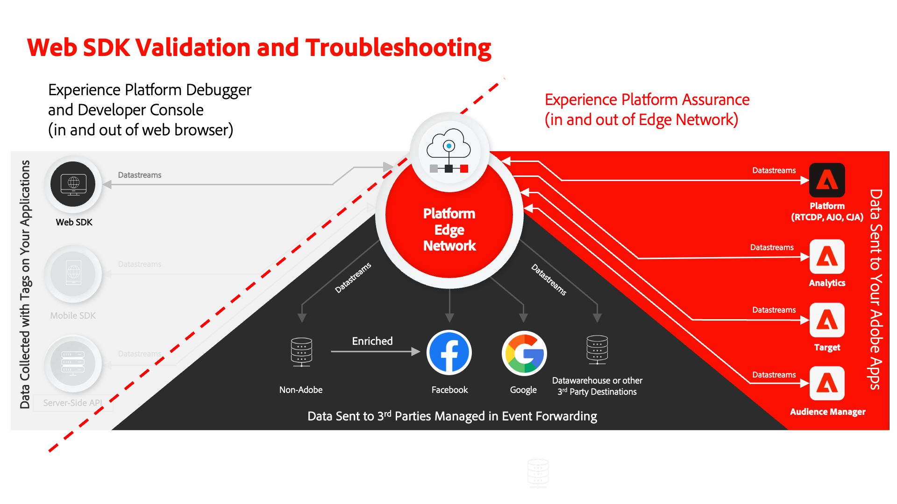
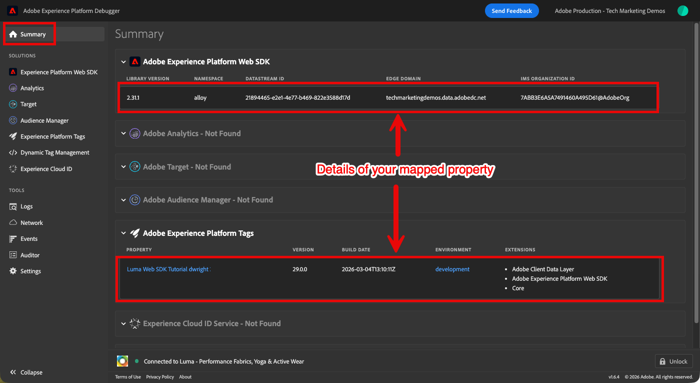
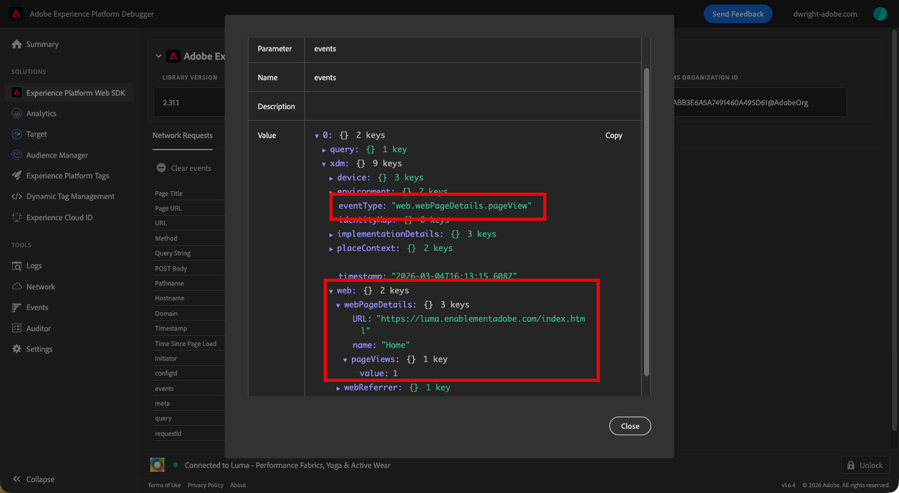
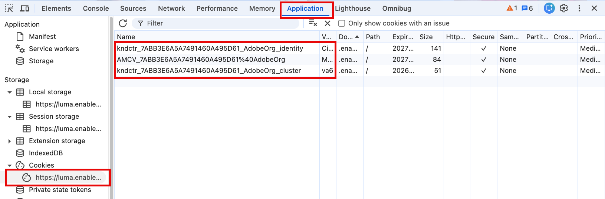

# Experience Platform Debugger를 사용하여 웹 SDK 구현 확인

Adobe Experience Platform Debugger를 사용하여 Adobe Experience Platform Web SDK 구현의 유효성을 검사하는 방법을 알아봅니다.

Experience Platform Debugger는 웹 페이지에 구현된 Adobe 기술을 확인하는 데 도움이 되는 [Chrome 확장 프로그램](https://chromewebstore.google.com/detail/adobe-experience-platform/bfnnokhpnncpkdmbokanobigaccjkpob)입니다. Experience Platform Debugger 및 브라우저의 개발자 콘솔은 웹 SDK 구현의 브라우저측 측면을 확인하고 디버깅하는 가장 좋은 방법입니다. 다음 단원에서 다룬 Adobe Experience Platform Assurance은 플랫폼 Edge Network으로 들어오고 나가는 데이터를 가장 잘 볼 수 있는 보기를 제공합니다.

이전에 디버거를 사용한 적이 없는 경우 5분 분량의 개요 비디오를 시청해 보십시오.

>[!VIDEO](https://video.tv.adobe.com/v/32156?learn=on&enablevpops)

이 단원에서는 [Adobe Experience Platform Debugger 확장](https://chromewebstore.google.com/detail/adobe-experience-platform/bfnnokhpnncpkdmbokanobigaccjkpob)을 사용하여 [Luma 데모 웹 사이트](https://luma.enablementadobe.com)에서 하드코드된 태그 속성을 자신의 속성으로 바꿉니다.

이 기법은 환경 전환이라고 하며 나중에 웹 사이트에서 태그를 사용하여 작업할 때 유용합니다. 이를 통해 브라우저에서 프로덕션 웹 사이트를 로드할 수 있지만 *개발* 태그 라이브러리를 사용할 수 있습니다. 이 기능을 사용하면 일반 코드 릴리스와 독립적으로 태그 변경 사항을 만들고 확인할 수 있습니다. 결국, 일반 코드 릴리스에서 마케팅 태그 릴리스가 이렇게 분리되는 것은 고객이 태그를 우선 사용하는 주요 이유 중 하나입니다!

## 학습 목표

이 단원이 끝나면 디버거를 사용하여 다음을 수행할 수 있습니다.

* 대체 태그 라이브러리 로드
* 클라이언트측 XDM 이벤트가 예상대로 데이터를 캡처하여 Platform Edge Network에 전송하는지 확인합니다.
* Edge 추적을 활성화하여 Platform Edge Network에서 보낸 서버측 요청 보기

## 전제 조건

데이터 수집 태그 및 [Luma 데모 웹 사이트](https://luma.enablementadobe.com/){target="_blank"}에 익숙하고 자습서의 이전 단원을 완료했습니다.

* [XDM 스키마 구성](configure-schemas.md)
* [ID 네임스페이스 구성](configure-identities.md)
* [데이터스트림 구성](configure-datastream.md)
* [태그 속성에 설치된 웹 SDK 확장](install-web-sdk.md)
* [데이터 요소 만들기](create-data-elements.md)
* [ID 캡처](create-identities.md)
* [태그 규칙 만들기](create-tag-rule.md)

## 디버거를 사용하여 대체 태그 라이브러리 로드

Experience Platform Debugger에는 기존 태그 라이브러리를 다른 태그 라이브러리로 바꿀 수 있는 멋진 기능이 있습니다. 이 기법은 유효성 검사에 유용하며, 이를 통해 이 자습서의 많은 구현 단계를 건너뛸 수 있습니다.

1. [Luma 데모 웹 사이트](https://luma.enablementadobe.com){target="_blank"}가 열려 있는지 확인하고 Experience Platform Debugger 확장 프로그램 아이콘을 선택합니다
1. 디버거가 열리고, 하드코딩된 구현에 대한 몇 가지 세부 사항이 표시됩니다(디버거를 연 후 Luma 사이트를 다시 로드해야 할 수 있음)
1. 디버거가 아래 그림과 같이 &quot;**[!UICONTROL Luma]**&quot;에 연결되어 있는지 확인한 다음 &quot;**[!UICONTROL 잠금]**&quot; 아이콘을 선택하여 디버거를 Luma 사이트에 잠급니다.
1. **[!UICONTROL 로그인]** 단추를 선택하고 Adobe ID를 사용하여 Adobe Experience Cloud에 로그인한 다음 조직을 선택합니다.

   >[!TIP]
   >
   > 로그인 후 디버거가 조직 이름 대신 사용자 이름을 표시하면 로그아웃한 후 다시 시도하십시오.

   

1. 이제 왼쪽 탐색에서 **[!UICONTROL Experience Platform 태그]**(으)로 이동합니다.
1. **[!UICONTROL 구성]** 탭 선택
1. **[!UICONTROL 페이지 포함 코드]**&#x200B;를 표시하는 오른쪽의 **[!UICONTROL 작업]** 드롭다운을 열고 **[!UICONTROL 바꾸기]**&#x200B;를 선택합니다

    선택

1. 사용자가 인증되었으므로 디버거는 사용 가능한 태그 속성 및 환경을 가져옵니다. 속성 선택
1. `Development` 환경 선택
   

   >[!TIP]
   >
   > 드롭다운을 사용하여 속성 및 환경을 선택할 수 없는 경우 대신 [!UICONTROL 태그] > [!UICONTROL 환경] > [!UICONTROL 개발] > [!UICONTROL 설치]로 이동하고 아이콘을 선택하여 포함 코드를 복사하여 디버거에 붙여넣습니다.
   > 

1. **[!UICONTROL 적용]** 단추 선택

1. 이제 Luma 웹 사이트가 _을(를) 고유한 태그 속성으로 다시 로드합니다_.

   

자습서를 계속 진행할 때, Luma 사이트를 자신의 태그 속성에 매핑하여 Platform Web SDK 구현의 유효성을 검사하는 이 기술을 사용합니다. 자체 웹 사이트에서 태그를 사용할 때 이와 동일한 기술을 사용하여 프로덕션 웹 사이트에서 개발 태그 라이브러리의 유효성을 검사할 수 있습니다.

## 디버거를 사용하여 유효성 검사

### 네트워크 요청 및 XDM 유효성 검사

디버거를 사용하여 Platform Web SDK 구현에서 트리거된 클라이언트측 비콘의 유효성을 검사하여 Platform Edge Network으로 전송된 데이터를 볼 수 있습니다.

1. 태그 속성의 세부 정보를 보려면 왼쪽 탐색에서 **[!UICONTROL 요약]**(으)로 이동하십시오

   

1. 이제 왼쪽 탐색 영역에서 **[!UICONTROL Experience Platform Web SDK]**(으)로 이동하여 **[!UICONTROL 네트워크 요청]**&#x200B;을 확인합니다.
1. **[!UICONTROL 이벤트]** 행 열기

   

1. `web.webPageDetails.pageView`변수 업데이트[!UICONTROL &#x200B; 작업에 지정한 &#x200B;] 이벤트 형식과 `AEP Web SDK ExperienceEvent` 필드 그룹을 준수하는 기타 기본 제공 변수를 확인하는 방법에 대해 알아보십시오

   

1. `web` 개체로 스크롤한 다음 선택하여 열고 `webPageDetails.name`을(를) 검사합니다. 홈 페이지의 해당 `adobeDataLayer` 데이터 계층 변수와 일치해야 합니다.

>[!TIP]
>
> 홈 페이지의 `adobeDataLayer` 데이터 레이어를 보고 비교하려면 다음 작업을 수행하십시오.
>
> 1. Luma 홈 페이지에서 브라우저 개발자 도구를 엽니다. Chrome의 경우 키보드에서 `F12` 단추를 선택합니다.
> 1. **[!UICONTROL 콘솔]** 탭 선택
> 1. `adobeDataLayer`을(를) 입력하고 키보드에서 `Enter`을(를) 선택하여 데이터 레이어 값을 표시합니다.

제품 페이지, 장바구니 페이지 및 주문 확인 페이지에 설정된 이벤트와 변수의 유효성을 검사합니다.

### ID 맵 유효성 검사

ID 맵 세부 정보의 유효성을 검사할 수도 있습니다.

1. **[!DNL Sign In]** Luma 웹 사이트[에서 &#x200B;](https://luma.enablementadobe.com/){target=_blank}을(를) 선택합니다. **[!DNL Create Account]**&#x200B;을(를) 선택하고 자격 증명 `test@test.com`/`test`을(를) 사용하여 계정을 만드십시오.

1. 디버거의 **[!UICONTROL 가장 최근 이동]** 바로 가기를 사용하여 가장 최근 웹 SDK 이벤트(마지막 열)로 빠르게 이동합니다. **[!UICONTROL events]** 행을 선택하여 세부 정보 모달을 엽니다.

1. 모달 내에서 **identityMap**&#x200B;을 검색합니다. 여기에는 authenticatedState, ID 및 기본 지정의 세 키가 포함된 `lumaCrmId`이(가) 표시됩니다.
   디버거의 

## 브라우저 개발자 도구를 사용하여 유효성 검사

많은 웹 개발자는 브라우저의 개발자 도구에서 구현을 보는 것을 선호할 수 있습니다. 모든 브라우저가 디버거 확장을 지원하는 것은 아니므로 이 작업이 특히 중요합니다. 또한 유연한 프레임워크 때문에 쿠키 및 응답 세부 사항과 같은 검사할 수 있는 추가 구현 세부 사항이 있습니다.

### 네트워크 요청 확인

웹 SDK 요청 세부 정보는 브라우저의 웹 개발자 도구 **네트워크** 탭에도 표시됩니다(웹 사이트에서 태그 라이브러리를 로드하고 있다고 가정).

1. 브라우저의 웹 개발자 도구 **네트워크** 탭을 열고 페이지를 다시 로드합니다. `/ee`(으)로 호출을 필터링하여 호출을 찾아 선택한 다음 **헤더** 탭과 **페이로드** 탭을 찾습니다

   

1. **미리 보기** 탭으로 이동하여 ECID 값이 네트워크 응답에 어떻게 포함되는지 확인합니다.

   

   >[!NOTE]
   >
   > ECID 값은 네트워크 응답에 표시됩니다. 네트워크 요청의 `identityMap` 부분에 포함되지 않았거나 쿠키에 이 형식으로 저장되지 않습니다.

### Web SDK 쿠키

개발자 도구를 사용하는 동안 브라우저에서 웹 SDK이 설정하는 몇 가지 쿠키를 살펴보겠습니다. Application > Cookies > https://luma.enablementadobe.com 를 엽니다.

웹 SDK에서 설정한 몇 가지 쿠키가 표시됩니다.

* kndctr_[IMS_ORGID]_AdobeOrg_identity: ECID와 관련된 데이터를 저장합니다.
* kndctr_[IMS_ORGID]_AdobeOrg_cluster: 후속 네트워크 호출이 동일한 Edge 서버로 라우팅되도록 사용되는 데이터 센터 위치를 저장합니다.
* AMCV_[IMS_ORGID]%40AdobeOrg: 이전 웹 SDK Experience Cloud SDK 라이브러리에서 사용하는 기존 AMCV 쿠키이며, Adobe Experience Platform 웹 SDK 태그 확장에서 선택한 기본 **[!UICONTROL ECID를 VisitorAPI로 마이그레이션]** 설정을 그대로 두었기 때문에 설정됩니다. 이 설정은 페이지를 이전 라이브러리에서 Web SDK으로 마이그레이션할 때 활성화해야 하지만, 일정 시간 동안 모든 페이지가 마이그레이션된 후에는 비활성화할 수 있습니다.

이러한 쿠키를 지우고 페이지를 다시 로드하면 `.demdex.net` 도메인에 설정된 추가 서드파티 쿠키가 표시될 수 있습니다. Adobe Experience Platform Web SDK 태그 확장에서 기본 **[!UICONTROL 타사 쿠키 사용]**: **[!UICONTROL 활성화됨]** 설정을 남겼기 때문에 설정됩니다. 브라우저에서 서드파티 쿠키를 허용하지 않는 경우 페이지를 다시 로드할 때 제거됩니다.

### Luma 로컬 저장소

Luma 데모 웹 사이트는 HTML, CSS 및 JavaScript과 같은 엄격한 클라이언트측 기술을 사용합니다. 웹 사이트의 기본 상태에서 사용하는 Experience Cloud 구현 외에는 백엔드 스토리지 메커니즘이 없습니다. 사용자 이름 세부 사항과 같은 정보는 localStorage를 사용하여 브라우저에 로컬로 저장됩니다. 따라서 이 정보를 삭제하거나 시크릿 창을 사용하는 경우 이전에 만든 테스트 사용자 계정을 다시 만들어야 할 수도 있습니다.

다음으로, Adobe Experience Platform Assurance을 사용하여 Platform Edge Network에서 이러한 네트워크 요청을 수신하고 전송할 때 이를 확인하는 방법을 알아봅니다!

>[!NOTE]
>
>Adobe Experience Platform 웹 SDK에 대해 학습하는 데 시간을 투자해 주셔서 감사합니다. 질문이 있거나 일반적인 피드백을 공유하고 싶거나 향후 콘텐츠에 대한 제안이 있는 경우 이 [Experience League 커뮤니티 토론 게시물](https://experienceleaguecommunities.adobe.com/adobe-experience-platform-18/tutorial-discussion-implement-adobe-experience-cloud-with-web-sdk-tutorial-248848)에서 공유하십시오.
