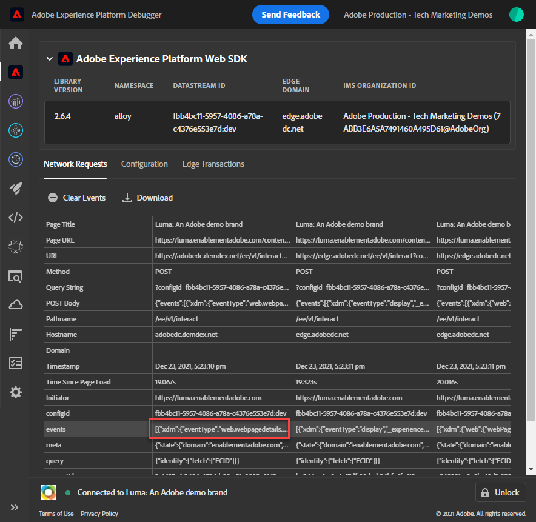

# Experience Platform 디버거를 사용하여 웹 SDK 구현 유효성 검사

Adobe Experience Platform Debugger를 사용하여 Platform Web SDK 구현의 유효성을 검사하는 방법을 알아봅니다.

Experience Platform 디버거는 웹 페이지에서 구현된 Adobe 기술을 보는 데 도움이 되는 Chrome 및 Firefox 브라우저에서 사용할 수 있는 확장입니다. 기본 브라우저의 버전을 다운로드합니다.

* [Firefox 확장](https://addons.mozilla.org/ko-KR/firefox/addon/adobe-experience-platform-dbg/)
* [Chrome 확장 프로그램](https://chrome.google.com/webstore/detail/adobe-experience-platform/bfnnokhpnncpkdmbokanobigaccjkpob)

이전에 디버거를 사용한 적이 없고 기존 Adobe Experience Cloud Debugger와 다른 경우 이 5분 개요 비디오를 볼 수 있습니다.

>[!VIDEO](https://video.tv.adobe.com/v/32156?quality=12&learn=on)

이 단원에서는 [Adobe Experience Cloud Debugger 확장 프로그램](https://chrome.google.com/webstore/detail/adobe-experience-cloud-de/ocdmogmohccmeicdhlhhgepeaijenapj) 에서 하드코딩된 태그 속성을 [Luma 데모 사이트](https://luma.enablementadobe.com/content/luma/us/en.html) 자신의 자산과 함께 사용할 수 있습니다.

이 기법은 환경 전환이라고 하며 나중에 자신의 웹 사이트에서 태그를 사용하여 작업할 때 유용합니다. 브라우저에서 프로덕션 웹 사이트를 로드할 수 있지만 *개발* 태그 환경을 참조하십시오. 이 기능을 사용하면 일반 코드 릴리스와 독립적으로 태그 변경 사항을 만들고 확인할 수 있습니다. 결국, 일반적인 코드 릴리스에서 마케팅 태그 릴리스가 이렇게 분리되는 것은 고객이 태그를 우선 사용하는 주된 이유 중 하나입니다!

## 학습 목표

이 단원을 마치면 디버거를 사용하여 다음을 수행할 수 있습니다.

* 대체 태그 라이브러리 로드
* XDM 개체의 유효성을 검사하여 예상대로 Edge Network에서 데이터를 캡처하고 보내고 있습니다

## 전제 조건

데이터 수집 태그 및 [Luma 데모 사이트](https://luma.enablementadobe.com/content/luma/us/en.html){target=&quot;_blank&quot;} 및 자습서에서 다음 이전 단원을 완료했습니다.

* [권한 구성](configure-permissions.md)
* [XDM 스키마 구성](configure-schemas.md)
* [ID 네임스페이스 구성](configure-identities.md)
* [데이터 스트림 구성](configure-datastream.md)
* [태그 속성에 설치된 웹 SDK 확장](install-web-sdk.md)
* [데이터 요소 만들기](create-data-elements.md)
* [태그 규칙 만들기](create-tag-rule.md)

## 디버거를 사용하여 대체 태그 라이브러리 로드

이 자습서에서는 공개적으로 호스팅된 버전의 를 사용합니다 [Luma 데모 웹 사이트](https://luma.enablementadobe.com/content/luma/us/en.html). 홈페이지를 열고 책갈피를 지정합니다.

Experience Platform 디버거에는 기존 태그 라이브러리를 다른 태그 라이브러리로 바꿀 수 있는 멋진 기능이 있습니다. 이 기법은 유효성 검사에 유용하며 이 자습서에서 여러 구현 단계를 건너뛸 수 있습니다.

1. Luma 사이트가 열려 있는지 확인하고 Debugger 확장 프로그램 아이콘을 선택합니다.
1. 디버거가 열리고 이 자습서와 관련이 없는 하드코딩된 구현의 세부 정보가 표시됩니다(디버거를 연 후 Luma 사이트를 다시 로드해야 할 수 있음)
1. 디버거가 &quot; 인지 확인합니다.**[!UICONTROL Luma에 연결됨]**&quot; 아래 그림과 같이 &quot;**[!UICONTROL 잠금]**&quot; 아이콘을 사용하여 디버거를 Luma 사이트에 잠급니다.
1. 을(를) 선택합니다 **[!UICONTROL 로그인]** Adobe ID를 사용하여 Adobe Experience Cloud에 로그인하고 단추를 클릭합니다.
1. 이제 로 이동합니다. **[!UICONTROL Experience Platform 태그]** 왼쪽 탐색

   

1. 을(를) 선택합니다 **[!UICONTROL 구성]** 탭
1. 오른쪽에 가 표시됩니다. **[!UICONTROL 페이지 포함 코드]**&#x200B;를 열고 **[!UICONTROL 작업]** 드롭다운을 선택하고 **[!UICONTROL 바꾸기]**

   

1. 인증되었으므로 디버거가 사용 가능한 태그 속성 및 환경을 가져옵니다. 을(를) 선택합니다 `Web SDK Course` 속성
1. 을(를) 선택합니다 `Development` 환경
1. 을(를) 선택합니다 **[!UICONTROL 적용]** 버튼

   

1. 이제 Luma 웹 사이트가 다시 로드됩니다. _태그 속성을 사용하여_.

   

자습서를 계속 진행하면 이렇게 Luma 사이트를 자신의 태그 속성에 매핑하여 Platform Web SDK 구현의 유효성을 검사하는 기법을 사용하게 됩니다. 프로덕션 웹 사이트에서 태그 사용을 시작할 때 이와 동일한 기술을 사용하여 변경 내용의 유효성을 검사할 수 있습니다.

## Experience Platform 디버거에서 구현의 유효성 검사

디버거를 사용하여 Platform Web SDK 구현의 유효성을 검사하고 Platform Edge 네트워크로 전송된 데이터를 볼 수 있습니다.

1. 이동 **[!UICONTROL 요약]** 왼쪽 탐색에서 태그 속성의 세부 사항을 확인합니다

   

1. 이제 로 이동합니다. **[!UICONTROL 웹 SDK Experience Platform]** 왼쪽 탐색에서 를 클릭하여 **[!UICONTROL 네트워크 요청]**
1. 를 엽니다. **[!UICONTROL events]** 행(이 스크린샷에 사용자 요청보다 더 많은 요청이 표시되고 향후 단원의 요청이 포함되므로 지금은 무시할 수 있음)

   

1. 표시되는 방법을 확인합니다. `web.webpagedetails.pageView` 지정한 이벤트 유형 [!UICONTROL 이벤트 보내기] 작업 및 기타 기본 변수를 `AEP Web SDK ExperienceEvent Mixin` 포맷

   

1. 아래로 스크롤하여 `web` 객체를 열고 검사하려면 선택합니다. `webPageDetails.name`, `webPageDetails.server`, 및 `webPageDetails.siteSection`. 이러한 변수는 홈 페이지의 해당 digitalData 데이터 계층 변수와 일치해야 합니다

   

ID 맵 세부 사항의 유효성을 확인할 수도 있습니다.

1. 자격 증명 `test@adobe.com`/`test`를 사용하여 Luma 사이트에 로그인합니다.

1. [Luma 홈 페이지](https://luma.enablementadobe.com/content/luma/us/en.html)로 돌아갑니다.

1. 를 엽니다. **[!UICONTROL 웹 SDK Experience Platform]** 왼쪽 탐색 섹션의 섹션

   

1. 을(를) 선택합니다 **[!UICONTROL events]** 팝업에서 세부 정보를 여는 행

   

1. 을 검색합니다. **identityMap** 팝업 내에서 여기에서 `lumaCrmId` authenticatedState, id 및 primary의 세 가지 키 사용:
   

## 브라우저 개발 도구를 사용하여 유효성 검사

이러한 유형의 요청 세부 사항은 브라우저의 웹 개발자 도구에서도 볼 수 있습니다 **네트워크** 탭(웹 사이트가 태그 라이브러리를 로드하고 있다고 가정).

1. 브라우저의 웹 개발자 도구를 엽니다 **네트워크** 페이지를 탭하고 다시 로드합니다. 을 사용하여 호출 필터링 `/ee` 호출을 찾으려면 호출을 선택한 다음 **머리글** 탭, 및 **페이로드** 탭

   

1. 로 이동합니다. **응답** 탭에서 ECID 값이 응답에 포함되는 방법을 확인합니다. 다음 연습에서 프로필 정보의 유효성을 검사하는 데 사용할 대로 이 값을 복사합니다

   

   >[!NOTE]
   >
   >    위의 스크린샷과 동일한 양의 페이로드 요청이 표시되지 않을 수 있습니다. 이 격차는 미래에 대한 학습 때문이기도 하다 [Target 설정](setup-target.md) 스크린샷을 가져올 때 완료되었습니다. 지금은 이 차이를 무시할 수 있습니다.

이제 페이지에서 XDM 개체가 실행되며 데이터 수집을 확인하는 방법에 대한 지식을 사용하여 Platform Web SDK를 사용하여 개별 Adobe 애플리케이션을 설정할 준비가 되었습니다.

[다음: ](setup-experience-platform.md)

>[!NOTE]
>
>Adobe Experience Platform Web SDK에 대한 학습에 시간을 내주셔서 감사합니다. 질문이 있거나 일반 피드백을 공유하거나 향후 컨텐츠에 대한 제안 사항이 있는 경우 해당 정보를 공유하십시오 [Experience League 커뮤니티 토론 게시물](https://experienceleaguecommunities.adobe.com/t5/adobe-experience-platform-launch/tutorial-discussion-implement-adobe-experience-cloud-with-web/td-p/444996)
